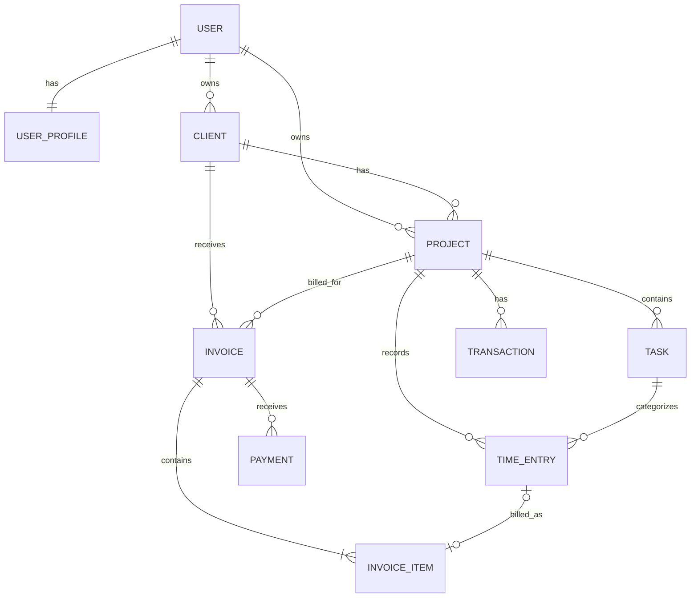
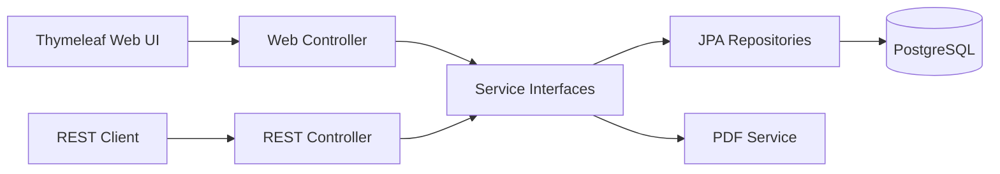

# Software Requirements Specification (SRS)

## Freelance Hub — ระบบจัดการเวลาทำงานและงานฟรีแลนซ์

| รายการ | รายละเอียด |
|---|---|
| ชื่อระบบ | Freelance Hub |
| เวอร์ชันเอกสาร | 2.0 |
| สถานะ | Draft ที่ปรับตามใบงานรายวิชา CP353002 |
| กลุ่มผู้ใช้หลัก | Freelancer / ผู้ประกอบอาชีพอิสระ |
| Backend | Java 17+, Spring Boot 3.x+, Spring MVC, Spring Data JPA |
| ฐานข้อมูล | PostgreSQL |
| Frontend | Thymeleaf |
| เอกสาร API | Swagger UI / OpenAPI |

---

## 1. ภาพรวมระบบ

Freelance Hub เป็นเว็บแอปพลิเคชันสำหรับช่วย Freelancer จัดการลูกค้า โปรเจกต์ งานย่อย และเวลาทำงานในที่เดียว ระบบนำเวลาที่บันทึกไปคำนวณรายได้ สร้างใบแจ้งหนี้ และสรุปข้อมูลเชิงวิเคราะห์เพื่อช่วยให้ผู้ใช้เห็นประสิทธิภาพการทำงานและสถานะทางการเงินของตนเอง

### 1.1 ปัญหาที่ต้องการแก้ไข

- ข้อมูลลูกค้า โปรเจกต์ และเวลาทำงานกระจัดกระจายหลายระบบ
- การคำนวณชั่วโมงและค่าจ้างด้วยตนเองมีโอกาสผิดพลาด
- ติดตามไม่ได้ว่างานใดเรียกเก็บเงินแล้วหรือยัง
- มองภาพรวมรายได้ ภาระงาน และ productivity ได้ยาก

### 1.2 เป้าหมาย

- บันทึกเวลาได้รวดเร็วทั้งแบบจับเวลาและกรอกย้อนหลัง
- จัดการลูกค้าหลายรายและโปรเจกต์หลายโปรเจกต์ได้อย่างเป็นระบบ
- คำนวณรายได้จากชั่วโมง อัตราค่าจ้าง และค่าใช้จ่ายได้ถูกต้อง
- สร้างและติดตามสถานะใบแจ้งหนี้ได้
- แสดง dashboard และ productivity insights ที่นำไปใช้ตัดสินใจได้

### 1.3 ตัวชี้วัดความสำเร็จของ MVP

- ผู้ใช้สร้างลูกค้า โปรเจกต์ และเริ่มจับเวลาได้ภายใน 3 นาทีหลังลงทะเบียน
- ผู้ใช้สร้าง invoice จากรายการเวลาที่ยังไม่ถูกเรียกเก็บได้โดยไม่ต้องคำนวณยอดเอง
- ยอดรวมใน invoice ตรงกับผลรวมรายการ เวลา/ราคา ส่วนลด และภาษีตามกฎธุรกิจ 100%
- dashboard แสดงข้อมูลเวลาทำงานและรายได้ตามช่วงวันที่ได้ถูกต้อง

---

## 2. ขอบเขตระบบ

### 2.1 ขอบเขต MVP

1. ลงทะเบียน เข้าสู่ระบบ และจัดการโปรไฟล์ Freelancer
2. จัดการข้อมูลลูกค้าและข้อมูลสำหรับออก invoice
3. จัดการโปรเจกต์ งานย่อย อัตราค่าจ้าง งบประมาณ และสถานะงาน
4. จับเวลาแบบ real-time และเพิ่ม/แก้ไข time entry ด้วยตนเอง
5. แยกเวลาที่เรียกเก็บเงินได้ (billable) และเรียกเก็บไม่ได้ (non-billable)
6. คำนวณรายได้ตามอัตรารายชั่วโมง หรือเก็บยอด fixed price ของโปรเจกต์
7. สร้าง invoice จาก time entries หรือเพิ่มรายการเอง
8. ส่งออก invoice เป็น PDF และติดตามสถานะการชำระเงิน
9. dashboard สรุปเวลา รายได้ โปรเจกต์ และ productivity
10. ค้นหา กรอง เรียงลำดับ และแบ่งหน้ารายการหลัก

### 2.2 นอกขอบเขต MVP

- Payment gateway และการรับชำระเงินออนไลน์
- ระบบบัญชีเต็มรูปแบบและการยื่นภาษี
- การเชื่อมต่อธนาคารหรือกระทบยอดบัญชีอัตโนมัติ
- แอปมือถือ native และการติดตามกิจกรรมหน้าจอ
- การทำงานร่วมกันหลายคนใน workspace เดียว
- การส่งอีเมล invoice อัตโนมัติและ recurring invoice
- การรองรับหลายสกุลเงินภายใน invoice เดียว

รายการเหล่านี้สามารถพัฒนาในระยะถัดไปได้โดยไม่เปลี่ยนแกนข้อมูลของ MVP

---

## 3. ผู้ใช้งานและสิทธิ์

### 3.1 บทบาท

| บทบาท | ความสามารถ |
|---|---|
| Freelancer | จัดการข้อมูลทั้งหมดที่ตนเองเป็นเจ้าของ เช่น ลูกค้า โปรเจกต์ เวลา invoice และ analytics |
| Admin (ระยะถัดไป) | ดูแลบัญชีผู้ใช้และสถานะระบบ โดยไม่มีสิทธิ์อ่านข้อมูลธุรกิจส่วนตัวโดยค่าเริ่มต้น |

### 3.2 หลักการเข้าถึงข้อมูล

- ผู้ใช้ต้องยืนยันตัวตนก่อนเข้าถึงข้อมูลธุรกิจ
- ผู้ใช้เข้าถึง แก้ไข หรือลบได้เฉพาะข้อมูลของตนเอง
- ทุก query ที่อ่านข้อมูลธุรกิจต้องจำกัดด้วย `owner_id` ของผู้ใช้ที่เข้าสู่ระบบ
- endpoint สำหรับสมัครและเข้าสู่ระบบเท่านั้นที่เปิดเป็นสาธารณะ

---

## 4. Functional Requirements

ระดับความสำคัญ: **Must** = ต้องมีใน MVP, **Should** = ควรมี, **Could** = เพิ่มภายหลังได้

### 4.1 Authentication และ Profile

| ID | Requirement | Priority |
|---|---|---|
| FR-AUTH-01 | ผู้ใช้สมัครด้วยชื่อ อีเมล และรหัสผ่านได้ | Must |
| FR-AUTH-02 | ระบบต้องไม่อนุญาตให้อีเมลซ้ำ และต้องเก็บรหัสผ่านแบบ hash | Must |
| FR-AUTH-03 | ผู้ใช้เข้าสู่ระบบ ออกจากระบบ และเรียกดูข้อมูลตนเองได้ | Must |
| FR-AUTH-04 | ผู้ใช้แก้ไขชื่อ ข้อมูลติดต่อ ที่อยู่ เลขประจำตัวผู้เสียภาษี logo และข้อมูลธนาคารสำหรับ invoice ได้ | Must |
| FR-AUTH-05 | ผู้ใช้กำหนด timezone สกุลเงินหลัก รูปแบบวันที่ และอัตราภาษีเริ่มต้นได้ | Must |
| FR-AUTH-06 | ผู้ใช้ขอ reset password ผ่านอีเมลได้ | Should |

### 4.2 Client Management

| ID | Requirement | Priority |
|---|---|---|
| FR-CLI-01 | ผู้ใช้สร้าง ดู แก้ไข และ archive ลูกค้าได้ | Must |
| FR-CLI-02 | ลูกค้าประกอบด้วยชื่อบุคคล/บริษัท อีเมล โทรศัพท์ ที่อยู่ เลขผู้เสียภาษี และหมายเหตุ | Must |
| FR-CLI-03 | ผู้ใช้ค้นหาและกรองลูกค้าตามชื่อ สถานะ และข้อมูลติดต่อได้ | Must |
| FR-CLI-04 | หน้ารายละเอียดลูกค้าต้องแสดงโปรเจกต์ เวลา รายได้ และ invoice ที่เกี่ยวข้อง | Must |
| FR-CLI-05 | ระบบไม่อนุญาตให้ลบลูกค้าที่มีธุรกรรม แต่ให้ archive เพื่อรักษาประวัติ | Must |

### 4.3 Project และ Task Management

| ID | Requirement | Priority |
|---|---|---|
| FR-PRJ-01 | ผู้ใช้สร้างโปรเจกต์และผูกกับลูกค้าหนึ่งรายได้ | Must |
| FR-PRJ-02 | โปรเจกต์ประกอบด้วยชื่อ รายละเอียด วันที่เริ่ม/สิ้นสุด สี สถานะ และสกุลเงิน | Must |
| FR-PRJ-03 | รองรับรูปแบบคิดค่าจ้าง `HOURLY` และ `FIXED_PRICE` | Must |
| FR-PRJ-04 | โปรเจกต์ hourly กำหนด hourly rate และงบประมาณชั่วโมงหรือจำนวนเงินได้ | Must |
| FR-PRJ-05 | โปรเจกต์ fixed price กำหนดมูลค่างานได้ และยังบันทึกเวลาเพื่อวิเคราะห์ต้นทุนได้ | Must |
| FR-PRJ-06 | สถานะโปรเจกต์ประกอบด้วย `PLANNED`, `ACTIVE`, `ON_HOLD`, `COMPLETED`, `ARCHIVED` | Must |
| FR-PRJ-07 | ผู้ใช้สร้าง แก้ไข ปิดงาน และเรียงลำดับ task ภายในโปรเจกต์ได้ | Must |
| FR-PRJ-08 | ระบบแสดงเวลาที่ใช้ เทียบงบประมาณ และมูลค่าที่เกิดขึ้นของแต่ละโปรเจกต์ | Must |
| FR-PRJ-09 | ระบบแจ้งเตือนเมื่อใช้เวลาหรืองบประมาณถึงเกณฑ์ 80% และ 100% | Should |

### 4.4 Time Tracking

| ID | Requirement | Priority |
|---|---|---|
| FR-TIME-01 | ผู้ใช้เริ่ม หยุด และยกเลิก timer โดยเลือกโปรเจกต์ และเลือก task ได้ | Must |
| FR-TIME-02 | ผู้ใช้มี timer ที่กำลังทำงานได้สูงสุดหนึ่งรายการในเวลาเดียวกัน | Must |
| FR-TIME-03 | ระบบเก็บเวลาเริ่ม เวลาสิ้นสุด ระยะเวลา คำอธิบาย และสถานะ billable | Must |
| FR-TIME-04 | ผู้ใช้เพิ่มเวลาแบบ manual ด้วยวัน เวลาเริ่ม/สิ้นสุด หรือระยะเวลาได้ | Must |
| FR-TIME-05 | ผู้ใช้แก้ไขและลบ time entry ที่ยังไม่ถูกผูกกับ invoice ได้ | Must |
| FR-TIME-06 | ผู้ใช้ดูรายการเวลาแบบรายวัน รายสัปดาห์ และตามช่วงวันที่ได้ | Must |
| FR-TIME-07 | ผู้ใช้กรองรายการตามลูกค้า โปรเจกต์ task สถานะ billable และสถานะ invoice ได้ | Must |
| FR-TIME-08 | ระบบคำนวณมูลค่า time entry จาก duration และ rate snapshot ขณะบันทึก | Must |
| FR-TIME-09 | ผู้ใช้คัดลอกรายการเวลาเดิมเพื่อบันทึกซ้ำได้ | Could |

### 4.5 Income และ Expense

| ID | Requirement | Priority |
|---|---|---|
| FR-FIN-01 | ระบบคำนวณรายได้ที่เกิดขึ้นจากรายการ billable ของโปรเจกต์ hourly ได้ | Must |
| FR-FIN-02 | ระบบแยกยอดเป็น unbilled, invoiced, paid และ overdue ได้ | Must |
| FR-FIN-03 | ผู้ใช้บันทึกรายรับอื่นหรือค่าใช้จ่ายของโปรเจกต์ พร้อมวันที่ หมวดหมู่ จำนวนเงิน และหมายเหตุได้ | Should |
| FR-FIN-04 | ผู้ใช้ดูรายได้สุทธิประมาณการจากรายรับหักค่าใช้จ่ายในช่วงวันที่ได้ | Should |
| FR-FIN-05 | จำนวนเงินทุกค่าต้องเก็บพร้อมรหัสสกุลเงินและไม่คำนวณรวมข้ามสกุลเงิน | Must |

### 4.6 Invoice Management

| ID | Requirement | Priority |
|---|---|---|
| FR-INV-01 | ผู้ใช้สร้าง invoice แบบ draft โดยเลือกลูกค้า โปรเจกต์ และ time entries ที่ยังไม่ถูก invoice ได้ | Must |
| FR-INV-02 | ผู้ใช้เพิ่ม แก้ไข หรือลบ line item ด้วยตนเองได้ขณะ invoice เป็น draft | Must |
| FR-INV-03 | invoice ต้องมีเลขที่ไม่ซ้ำ วันที่ออก วันครบกำหนด ผู้ขาย ลูกค้า สกุลเงิน และหมายเหตุ | Must |
| FR-INV-04 | ระบบคำนวณ subtotal ส่วนลด ภาษี และยอดสุทธิอัตโนมัติ | Must |
| FR-INV-05 | สถานะ invoice ประกอบด้วย `DRAFT`, `ISSUED`, `PAID`, `OVERDUE`, `VOID` | Must |
| FR-INV-06 | ผู้ใช้เปลี่ยน draft เป็น issued และบันทึกวันที่/ยอดชำระได้ | Must |
| FR-INV-07 | ระบบระบุ invoice เป็น overdue เมื่อพ้น due date และยังมียอดค้างชำระ | Must |
| FR-INV-08 | ผู้ใช้ดาวน์โหลด invoice เป็น PDF ที่มีข้อมูลครบถ้วนได้ | Must |
| FR-INV-09 | time entry หนึ่งรายการต้องไม่ถูกเรียกเก็บซ้ำใน invoice ที่ไม่ใช่สถานะ `VOID` | Must |
| FR-INV-10 | invoice ที่ issued แล้วต้องเก็บ snapshot ข้อมูลผู้ขาย ลูกค้า rate ภาษี และรายการ ณ เวลาออกเอกสาร | Must |
| FR-INV-11 | ผู้ใช้ส่ง invoice ทางอีเมลและดูประวัติการส่งได้ | Could |

### 4.7 Dashboard, Analytics และ Productivity Insights

| ID | Requirement | Priority |
|---|---|---|
| FR-ANA-01 | dashboard แสดงชั่วโมงวันนี้ สัปดาห์นี้ เดือนนี้ และแนวโน้มเทียบช่วงก่อนหน้า | Must |
| FR-ANA-02 | dashboard แสดง billable utilization = billable hours / tracked hours | Must |
| FR-ANA-03 | dashboard แสดงรายได้ unbilled, invoiced, paid และ overdue แยกตามสกุลเงิน | Must |
| FR-ANA-04 | ผู้ใช้ดูสัดส่วนเวลาและรายได้แยกตามลูกค้า โปรเจกต์ และช่วงวันที่ได้ | Must |
| FR-ANA-05 | ระบบแสดงค่าเฉลี่ยชั่วโมงต่อวัน วัน/ช่วงเวลาที่ทำงานมากที่สุด และโปรเจกต์ที่ใช้เวลาสูงสุด | Should |
| FR-ANA-06 | ระบบแสดง effective hourly rate ของ fixed-price project = มูลค่าโปรเจกต์ / ชั่วโมงที่บันทึก | Should |
| FR-ANA-07 | ระบบแสดง budget burn และประมาณการว่ามีแนวโน้มเกินงบหรือไม่ | Should |
| FR-ANA-08 | ผู้ใช้ส่งออกรายงาน time entries และรายได้เป็น CSV ได้ | Should |

---

## 5. กฎธุรกิจ (Business Rules)

| ID | กฎ |
|---|---|
| BR-01 | เวลาเริ่มต้องน้อยกว่าเวลาสิ้นสุด และ duration ต้องมากกว่า 0 |
| BR-02 | timer ที่ยังทำงานจะมี `started_at` แต่ไม่มี `ended_at`; ระบบคำนวณ duration เมื่อหยุด |
| BR-03 | time entry ต้องอยู่ภายใต้โปรเจกต์ ส่วน task เป็นข้อมูลที่ไม่บังคับ |
| BR-04 | rate ของ time entry ใช้ลำดับ: rate ที่ระบุใน entry > project rate > default rate ของผู้ใช้ |
| BR-05 | เมื่อสร้าง time entry ต้องเก็บ rate เป็น snapshot เพื่อไม่ให้การแก้ rate ในอนาคตเปลี่ยนรายได้ย้อนหลัง |
| BR-06 | รายได้ hourly = `duration_minutes / 60 × rate_snapshot` โดยปัดเศษจำนวนเงินตามสกุลเงินตอนแสดงผล |
| BR-07 | เวลาของ fixed-price project ไม่เพิ่มมูลค่าโปรเจกต์ แต่ใช้คำนวณ effective hourly rate |
| BR-08 | invoice subtotal = ผลรวม `quantity × unit_price` ของ line items |
| BR-09 | invoice total = subtotal − discount + tax และต้องไม่ติดลบ |
| BR-10 | invoice ที่ issued แล้วแก้ไขยอดไม่ได้ หากต้องแก้ให้ void และสร้างฉบับใหม่ |
| BR-11 | การ void invoice ต้องคืน time entries ให้เป็น unbilled |
| BR-12 | การ archive ลูกค้าหรือโปรเจกต์ไม่ลบประวัติ และไม่อนุญาตให้เริ่ม timer ใหม่ในรายการนั้น |
| BR-13 | วันที่และเวลาบันทึกในฐานข้อมูลเป็น UTC และแสดงผลตาม timezone ของผู้ใช้ |
| BR-14 | analytics ต้องไม่นับ timer ที่ยังไม่หยุดจนกว่าจะระบุเป็นข้อมูลประมาณการอย่างชัดเจน |

---

## 6. User Stories และ Acceptance Criteria หลัก

### US-01: จับเวลาทำงาน

**ในฐานะ** Freelancer **ฉันต้องการ** เริ่มและหยุด timer ของโปรเจกต์ **เพื่อให้** บันทึกเวลาทำงานได้แม่นยำ

Acceptance criteria:

- Given ผู้ใช้มีโปรเจกต์ ACTIVE, when กดเริ่ม timer, then ระบบสร้าง running entry และแสดงเวลาที่ผ่านไป
- Given มี timer ทำงานอยู่, when เริ่ม timer ใหม่, then ระบบต้องปฏิเสธหรือให้หยุด timer เดิมก่อน
- When กดหยุด, then ระบบบันทึก end time, duration และมูลค่าตาม rate snapshot
- When refresh หรือเข้าสู่ระบบอีกครั้ง, then timer ที่กำลังทำงานยังแสดงสถานะและเวลาถูกต้อง

### US-02: สร้าง invoice จากเวลา

**ในฐานะ** Freelancer **ฉันต้องการ** เลือกเวลาที่ยังไม่เรียกเก็บเพื่อสร้าง invoice **เพื่อให้** เรียกเก็บเงินได้รวดเร็วและไม่ซ้ำ

Acceptance criteria:

- ระบบแสดงเฉพาะ time entries แบบ billable ของลูกค้านั้นที่ยังไม่อยู่ใน invoice
- ระบบรวมรายการและคำนวณ subtotal, discount, tax และ total อัตโนมัติ
- เมื่อออก invoice แล้ว time entries เหล่านั้นต้องมีสถานะ invoiced และเลือกซ้ำไม่ได้
- PDF ต้องแสดงเลข invoice ผู้ขาย ลูกค้า รายการ ยอดรวม วันออก และวันครบกำหนดตรงกับข้อมูลในระบบ

### US-03: ดู productivity

**ในฐานะ** Freelancer **ฉันต้องการ** ดูเวลาทำงานและสัดส่วน billable **เพื่อให้** ปรับรูปแบบการทำงานและเลือกงานได้ดีขึ้น

Acceptance criteria:

- ผู้ใช้เลือกช่วงวันที่และ timezone ได้
- ระบบแสดง tracked hours, billable hours และ utilization ของช่วงที่เลือก
- ผลรวมใน dashboard ต้องตรงกับ time entries ภายใต้ตัวกรองเดียวกัน
- กรณีไม่มีข้อมูลต้องแสดงค่า 0 และ empty state โดยไม่เกิดข้อผิดพลาด

### US-04: ติดตามรายได้และ invoice ค้างชำระ

**ในฐานะ** Freelancer **ฉันต้องการ** เห็นยอดที่ยังไม่ออก invoice และยอดค้างชำระ **เพื่อให้** ติดตามกระแสเงินสดได้

Acceptance criteria:

- dashboard แยก unbilled, invoiced, paid และ overdue อย่างชัดเจน
- ยอดแต่ละสถานะต้องแยกตามสกุลเงิน
- invoice ที่พ้นกำหนดและยังไม่ชำระต้องปรากฏใน overdue
- เมื่อบันทึกชำระครบ ยอดต้องย้ายไป paid และไม่อยู่ใน overdue

---

## 7. แบบจำลองข้อมูลระดับสูง



### 7.1 Entity ที่แนะนำ

| Entity | Field สำคัญ |
|---|---|
| `User` | id, email, passwordHash, role, enabled |
| `UserProfile` | id, userId, displayName, phone, address, taxId, timezone, defaultCurrency, defaultTaxRate, invoiceProfile |
| `Client` | id, ownerId, name, companyName, email, phone, address, taxId, status |
| `Project` | id, ownerId, clientId, name, billingType, hourlyRate, fixedPrice, currency, budget, status, startDate, endDate |
| `Task` | id, projectId, name, description, status, sortOrder |
| `TimeEntry` | id, ownerId, projectId, taskId, description, startedAt, endedAt, durationMinutes, billable, rateSnapshot, invoiceItemId |
| `Invoice` | id, ownerId, clientId, projectId, invoiceNumber, issueDate, dueDate, status, currency, subtotal, discount, tax, total, snapshots |
| `InvoiceItem` | id, invoiceId, timeEntryId, description, quantity, unit, unitPrice, amount, sortOrder |
| `Payment` | id, invoiceId, paidAt, amount, method, reference, note |
| `Transaction` | id, ownerId, projectId, type, category, occurredOn, amount, currency, note |

ทุก entity ควรมี `created_at`, `updated_at` และใช้ optimistic locking (`version`) กับข้อมูลที่มีโอกาสแก้ไขพร้อมกัน เช่น timer และ invoice

ระบบมีมากกว่า 6 ตาราง และแสดงความสัมพันธ์ที่ใบงานกำหนดครบ ได้แก่ `User`–`UserProfile` แบบ One-to-One และ `Client`–`Project`, `Project`–`Task`, `Invoice`–`InvoiceItem` แบบ One-to-Many ต้องกำหนด Foreign Key, Index, Cascade และ Fetch Type ด้วยเหตุผลที่บันทึกไว้ใน Data Dictionary

---

## 8. API ระดับสูง

REST API ใช้ prefix `/api/v1` และตอบกลับเป็น JSON ยกเว้น endpoint ดาวน์โหลดไฟล์

| Method | Endpoint | หน้าที่ |
|---|---|---|
| POST | `/auth/register` | สมัครสมาชิก |
| POST | `/auth/login` | เข้าสู่ระบบ |
| GET/PATCH | `/me` | ดู/แก้โปรไฟล์และค่าตั้งต้น |
| GET/POST | `/clients` | รายการ/สร้างลูกค้า |
| GET/PATCH/DELETE | `/clients/{id}` | ดู/แก้/archive ลูกค้า |
| GET/POST | `/projects` | รายการ/สร้างโปรเจกต์ |
| GET/PATCH/DELETE | `/projects/{id}` | ดู/แก้/archive โปรเจกต์ |
| GET/POST | `/projects/{id}/tasks` | รายการ/สร้าง task |
| GET/POST | `/time-entries` | ค้นหา/เพิ่ม time entry |
| PATCH/DELETE | `/time-entries/{id}` | แก้/ลบ time entry |
| POST | `/timer/start` | เริ่ม timer |
| POST | `/timer/stop` | หยุด timer ปัจจุบัน |
| GET | `/timer/current` | ดู timer ปัจจุบัน |
| GET/POST | `/invoices` | รายการ/สร้าง invoice |
| GET/PATCH | `/invoices/{id}` | ดู/แก้ draft invoice |
| POST | `/invoices/{id}/issue` | ออก invoice |
| POST | `/invoices/{id}/void` | ยกเลิก invoice |
| POST | `/invoices/{id}/payments` | บันทึกการชำระเงิน |
| GET | `/invoices/{id}/pdf` | ดาวน์โหลด PDF |
| GET | `/analytics/summary` | KPI ตามช่วงวันที่ |
| GET | `/analytics/time-breakdown` | วิเคราะห์เวลา |
| GET | `/analytics/income-breakdown` | วิเคราะห์รายได้ |
| GET | `/reports/time-entries.csv` | ส่งออกเวลาเป็น CSV |

ข้อกำหนดร่วมของ API:

- list endpoint รองรับ `page`, `size`, `sort` และตัวกรองที่เกี่ยวข้อง
- validation error ใช้ HTTP 400, ไม่ผ่านการยืนยันตัวตนใช้ 401, ไม่มีสิทธิ์ใช้ 403, ไม่พบข้อมูลใช้ 404 และข้อมูลขัดแย้งใช้ 409
- error response มี `timestamp`, `status`, `code`, `message`, `fieldErrors` และ `traceId`
- จำนวนเงินส่งเป็น decimal และ currency ใช้ ISO 4217; วันใช้ ISO 8601
- ต้องมี CRUD ครบอย่างน้อย 2 resource หลัก โดยกำหนดให้ `Client` และ `Project` เป็น resource ขั้นต่ำ
- endpoint ที่สร้างข้อมูลสำเร็จใช้ 201, อ่าน/แก้ไขสำเร็จใช้ 200, ลบหรือ archive ที่ไม่ส่ง body ใช้ 204 และข้อผิดพลาดใช้ 400/404/409/500 ตามกรณี
- ใช้ `@Valid` และ Bean Validation กับ request DTO ทุก endpoint ที่รับข้อมูล
- มี `@RestControllerAdvice` และ error response รูปแบบกลาง
- ต้องเปิด OpenAPI และ Swagger UI ให้เข้าถึงได้ที่ `/swagger-ui.html` หรือ URL ที่ redirect ไปยัง Swagger UI ได้จริง

---

## 9. Non-functional Requirements

### 9.1 Security

- ใช้ Spring Security และ password hashing แบบ BCrypt หรือ Argon2
- session/cookie ต้องเป็น `HttpOnly`, `Secure` ใน production และกำหนด `SameSite` ที่เหมาะสม หรือใช้ access token อายุสั้นร่วมกับ refresh token rotation
- ตรวจสอบ authorization ระดับ service ทุกครั้ง ไม่อาศัย ID จาก client เพียงอย่างเดียว
- validate และ sanitize input; ป้องกัน SQL injection, XSS, CSRF และ brute-force login
- ไม่บันทึกรหัสผ่าน token หรือข้อมูลธนาคารเต็มรูปแบบลง log

### 9.2 Performance และ Reliability

- API ทั่วไปควรตอบกลับภายใน 500 ms ที่ percentile 95 ภายใต้ข้อมูลผู้ใช้ไม่เกิน 100,000 time entries (ไม่รวม PDF/export)
- dashboard ช่วงไม่เกิน 1 ปีควรตอบกลับภายใน 2 วินาที
- transaction สำคัญ เช่น หยุด timer, issue invoice และบันทึก payment ต้องเป็น atomic
- ป้องกันการสร้าง invoice หรือหยุด timer ซ้ำจาก request ซ้ำด้วย transaction/locking หรือ idempotency
- ฐานข้อมูล production ต้องสำรองทุกวันและมีขั้นตอนทดสอบ restore

### 9.3 Usability และ Accessibility

- รองรับ desktop และ mobile web ตั้งแต่ความกว้าง 360 px
- action จับเวลาหลักเข้าถึงได้ไม่เกิน 2 interaction จาก dashboard
- มี loading, empty, success และ error state ที่ชัดเจน
- ฟอร์มมี label, keyboard navigation และ contrast ตาม WCAG 2.1 AA ในส่วนหลัก
- UI รองรับภาษาไทยเป็นหลัก และออกแบบให้เพิ่มภาษาอังกฤษได้

### 9.4 Maintainability และ Observability

- แยก domain ตาม feature และไม่ส่ง JPA entity เป็น API response โดยตรง
- มี unit test สำหรับ business calculation และ integration test สำหรับ flow สำคัญ
- ใช้ database migration เช่น Flyway; ห้ามแก้ schema production ด้วย `ddl-auto=update`
- log แบบ structured พร้อม request/trace ID และมี health check
- เก็บ audit event สำหรับ issue/void invoice และการบันทึก/แก้ payment
- ใช้ JUnit 5, Mockito และ Spring Boot Test ตามชนิดของการทดสอบ
- Service ต้องรับ dependency ด้วย constructor injection เท่านั้น
- Controller ห้ามเรียก Repository โดยตรง และทุกชั้นต้องไม่ข้ามลำดับ Layered Architecture
- ต้องปฏิบัติตาม SOLID ทั้งห้าข้อและมีเอกสารชี้ตำแหน่งการใช้งานในโค้ด

---

## 10. สถาปัตยกรรมและโครงสร้างโปรเจกต์ (บังคับตามใบงาน)

ระบบต้องใช้ **Layered Architecture** และห้ามเรียกข้ามชั้น โดย request ต้องไหลตามลำดับต่อไปนี้:

```text
Presentation (Controller / RestController / Thymeleaf View)
                    ↓
Service (Business Logic / Transaction)
                    ↓
Repository (Spring Data JPA / Data Access)
                    ↓
Domain (Entity / Value Object / Enum)
```

- Controller รับ request, validate DTO และแปลงผลเป็น response/view เท่านั้น
- Service เป็นที่อยู่ของ business logic และ transaction boundary
- Repository ทำหน้าที่เข้าถึงข้อมูลเท่านั้น
- Entity ต้องไม่ถูกใช้เป็น API request/response โดยตรง ให้ใช้ DTO และ Mapper
- Controller ห้ามเรียก Repository และ Repository ห้ามขึ้นกับ Service
- ใช้ Constructor Injection เท่านั้น

โครงสร้าง source code ที่กำหนด:

```text
code/src/main/java/th/ac/kku/freelance_hub/
├─ config/
├─ controller/
│  ├─ api/             # REST controllers
│  └─ web/             # Thymeleaf controllers
├─ service/
│  └─ impl/
├─ repository/
├─ domain/
│  ├─ entity/
│  ├─ enums/
│  └─ valueobject/
├─ dto/
│  ├─ request/
│  └─ response/
├─ mapper/
├─ exception/
├─ security/
├─ common/
└─ FreelanceHubApplication.java
```

โครงสร้าง repository ที่ต้องส่งตามใบงานกำหนดไว้ในหัวข้อ 19 โดย source code, tests, เอกสาร และภาพต้องแยกอยู่ใน `code/`, `test/`, `doc/` และ `img/` ตามลำดับ

### 10.1 Component Flow



---

## 11. แผนการพัฒนา

### Phase 1 — Foundation

- ตั้งค่า environment, PostgreSQL, Flyway และ error response กลาง
- Authentication, authorization และ user settings
- Client และ Project CRUD พร้อม ownership isolation

### Phase 2 — Time Tracking

- Task และ time entry CRUD
- Start/stop timer พร้อม concurrency protection
- การคำนวณ duration, rate snapshot และ billable amount
- หน้ารายวัน/สัปดาห์และตัวกรอง

### Phase 3 — Invoice และ Finance

- Invoice draft, line items และเลขเอกสาร
- Issue, void, overdue และ payment tracking
- สร้าง PDF และ income status summary

### Phase 4 — Analytics และ Hardening

- Dashboard และ breakdown reports
- CSV export และ productivity insights
- Performance, security, accessibility และ end-to-end tests

---

## 12. Testing Requirements

- **Unit tests:** duration, hourly income, invoice totals, tax/discount, status transition, utilization และ effective hourly rate
- **Repository tests:** ownership filtering, date range, unbilled entries และ overdue invoice query
- **Integration tests:** register/login, start-stop timer, create-issue-void invoice และ record payment
- **Security tests:** ผู้ใช้ A ต้องไม่อ่านหรือแก้ข้อมูลของผู้ใช้ B แม้ทราบ resource ID
- **PDF verification:** ข้อมูลและยอดใน PDF ต้องตรงกับ invoice snapshot
- **Timezone tests:** time entry ที่ข้ามวัน UTC ต้องอยู่ในวันที่ถูกต้องตาม timezone ผู้ใช้
- **Concurrency tests:** การ start timer พร้อมกันและ issue invoice ซ้ำต้องไม่สร้างข้อมูลซ้ำ

Definition of Done ของแต่ละ feature:

1. ผ่าน acceptance criteria และ automated tests ที่เกี่ยวข้อง
2. validation, authorization และ error cases ครบ
3. migration ใช้งานได้ทั้งฐานข้อมูลใหม่และฐานข้อมูลเวอร์ชันก่อนหน้า
4. API/documentation อัปเดตตรงกับ implementation
5. ไม่มีข้อมูลลับหรือข้อมูลส่วนบุคคลสำคัญใน log

---

## 13. Assumptions และคำถามที่ต้องยืนยันก่อน Production

### Assumptions สำหรับ MVP

- ระบบเป็น single-user workspace: หนึ่งบัญชีมีเจ้าของคนเดียว
- ผู้ใช้กำหนดสกุลเงินต่อโปรเจกต์และ invoice แต่ dashboard ไม่แปลงอัตราแลกเปลี่ยน
- การชำระเงินถูกบันทึกด้วยตนเอง ไม่มี payment gateway
- PDF invoice ใช้เอกสารภาษาไทยและข้อมูลภาษีที่ผู้ใช้กรอกเอง ระบบไม่รับรองการยื่นภาษี
- MVP รองรับ partial payment ใน data model แม้ UI รุ่นแรกอาจเริ่มจาก paid เต็มจำนวน

### คำถามที่ควรยืนยัน

1. ต้องรองรับทีม/พนักงานหลายคนใน workspace ตั้งแต่รุ่นแรกหรือไม่
2. invoice ต้องเป็นไปตามข้อกำหนดใบกำกับภาษีไทยเต็มรูปแบบหรือเป็นเพียงใบแจ้งหนี้ทั่วไป
3. ต้องรองรับ VAT 7%, withholding tax และเอกสารหัก ณ ที่จ่ายใน MVP หรือไม่
4. ต้องการ frontend framework ใด และจะอยู่ repository เดียวกับ backend หรือแยก repository
5. ต้องส่ง invoice ทางอีเมลและแจ้งเตือนก่อน/หลังวันครบกำหนดในรุ่นแรกหรือไม่
6. การปัดเวลาเพื่อคิดเงินต้องใช้เวลาจริง หรือปัดเป็นช่วง เช่น ทุก 6/15/30 นาที

---

## 14. เงื่อนไขการยอมรับระบบ MVP

MVP ถือว่าพร้อมส่งมอบเมื่อผู้ใช้สามารถทำ flow ต่อไปนี้ได้ครบโดยไม่มีการคำนวณภายนอก:

1. สมัครและตั้งค่าโปรไฟล์สำหรับออก invoice
2. สร้างลูกค้า โปรเจกต์ และ task
3. จับเวลาหรือเพิ่มเวลาย้อนหลัง และเห็นยอด billable
4. เลือกรายการเวลาสร้าง invoice พร้อมภาษี/ส่วนลด
5. ออกและดาวน์โหลด invoice PDF แล้วบันทึกการชำระเงิน
6. ดู dashboard ที่ยอดเวลา รายได้ และสถานะ invoice ตรงกับข้อมูลต้นทาง
7. ข้อมูลของบัญชีหนึ่งไม่สามารถเข้าถึงได้จากบัญชีอื่น

---

## 15. ข้อกำหนดทางเทคนิคจากรายวิชา

ข้อกำหนดในตารางนี้เป็นเงื่อนไขการส่งงานและถือเป็น **Must** ทั้งหมด

| หัวข้อ | Requirement |
|---|---|
| Backend | Spring Boot 3.x ขึ้นไป และ Java 17 ขึ้นไป |
| Build | Maven Wrapper |
| Database | PostgreSQL ซึ่งเป็นฐานข้อมูล SQL |
| ORM | Spring Data JPA / Hibernate |
| API | RESTful API พร้อม OpenAPI และ Swagger UI |
| Frontend | Thymeleaf เชื่อมต่อกับ backend และใช้งาน flow หลักได้จริง |
| Testing | JUnit 5, Mockito และ Spring Boot Test |
| Version Control | Git และ GitHub ตาม workflow ในหัวข้อ 20 |
| Deployment | Deploy สู่ Cloud/Server และเข้าถึงได้ผ่าน public URL |
| Container | มี `Dockerfile` และ `docker-compose.yml` |

หมายเหตุ: `pom.xml` ปัจจุบันใช้ Spring Boot `4.2.0-SNAPSHOT` ซึ่งผ่านเงื่อนไข 3.x+ แต่ก่อนพัฒนาจริงควรเปลี่ยนเป็นรุ่น stable ที่รองรับ Java 17 เพื่อลดความเสี่ยงจาก snapshot dependency

## 16. SOLID Principles และหลักฐานประกอบ

| Principle | Requirement ที่ต้องแสดงในโค้ด |
|---|---|
| Single Responsibility | แต่ละ class มีหน้าที่เดียว แยก validation, business logic และ persistence |
| Open/Closed | รองรับการเพิ่มวิธีคิดค่าจ้างหรือสร้างรายงานด้วย implementation ใหม่โดยไม่เพิ่ม if-else ใน service เดิม |
| Liskov Substitution | implementation ทุกตัวใช้แทน interface/base type ได้โดยไม่เปลี่ยนผลลัพธ์ที่ผู้เรียกคาดหวัง |
| Interface Segregation | แยก interface ตาม use case ไม่สร้าง service interface ขนาดใหญ่ที่ผู้ใช้ต้องพึ่ง method ที่ไม่เกี่ยวข้อง |
| Dependency Inversion | Service ขึ้นกับ interface และรับ dependency ผ่าน constructor เท่านั้น |

ต้องจัดทำ `doc/solid-analysis.md` ระบุ Principle, ไฟล์/คลาส, เลขบรรทัด และเหตุผลสั้น ๆ โดยเลขบรรทัดต้องตรวจและอัปเดตก่อนส่งงาน

## 17. Design Patterns ที่กำหนดใช้

### 17.1 Enterprise / Architectural Patterns

ต้องแสดงการใช้ Layered Architecture, MVC, Repository, Service Layer, DTO + Mapper และ Dependency Injection ครบทุกแบบ

### 17.2 GoF Behavioral Patterns

เลือกกลุ่ม Behavioral และใช้ไม่น้อยกว่า 3 patterns ที่สัมพันธ์กับ domain ดังนี้:

| Pattern | การใช้งานที่วางแผนไว้ | ปัญหาที่แก้ |
|---|---|---|
| Strategy | `BillingCalculationStrategy` แยก hourly และ fixed-price calculation | เพิ่มวิธีคิดค่าจ้างได้โดยไม่แก้เงื่อนไขขนาดใหญ่ |
| State | `InvoiceState` ควบคุม transition ของ DRAFT, ISSUED, PAID, OVERDUE และ VOID | ป้องกัน transition หรือ operation ที่ผิดสถานะ |
| Observer | Spring Application Event สำหรับ invoice issued/paid/overdue | แยก notification และ audit ออกจาก transaction หลัก |

ห้ามเพิ่ม pattern เพียงเพื่อให้ครบจำนวน ทุก pattern ต้องมี use case, test และอธิบายเหตุผลได้ ต้องจัดทำ `doc/design-patterns.md` เป็นตาราง Pattern, ปัญหาที่แก้, ไฟล์/คลาสที่ใช้ พร้อม Class Diagram

## 18. Database และ Migration Deliverables

- มีอย่างน้อย 6 ตาราง โดยแบบจำลองปัจจุบันกำหนด 10 ตาราง: users, user_profiles, clients, projects, tasks, time_entries, invoices, invoice_items, payments และ transactions
- มี One-to-One ระหว่าง users กับ user_profiles และ One-to-Many อย่างน้อยระหว่าง clients กับ projects และ invoices กับ invoice_items
- กำหนด Foreign Key Constraint และ index สำหรับ owner, relation, status และ date fields ที่ใช้ค้นหาบ่อย
- กำหนด Cascade และ Fetch Type อย่างมีเหตุผล หลีกเลี่ยง `CascadeType.ALL` และ `EAGER` โดยไม่มีความจำเป็น
- ใช้ Flyway migration ใน `code/src/main/resources/db/migration/`
- จัดทำ ER Diagram และ Data Dictionary ใน `doc/`

## 19. เอกสารและโครงสร้าง Repository ที่ต้องส่ง

```text
freelance-hub/
├─ code/                         # Spring Boot source และ deployable configuration
│  ├─ src/
│  ├─ Dockerfile
│  ├─ docker-compose.yml
│  ├─ .dockerignore
│  ├─ .env.example
│  ├─ pom.xml
│  └─ mvnw
├─ test/                         # การทดสอบทั้งหมด/รายงานผลทดสอบ
├─ doc/
│  ├─ diagrams/
│  │  ├─ use-case.*
│  │  ├─ domain-model.*
│  │  ├─ class-diagram.*
│  │  ├─ sequence-01.*           # อย่างน้อย 3 scenarios
│  │  ├─ sequence-02.*
│  │  ├─ sequence-03.*
│  │  ├─ activity.*
│  │  ├─ er-diagram.*
│  │  ├─ component.*
│  │  ├─ deployment.*
│  │  └─ invoice-state.*
│  ├─ slide/
│  ├─ solid-analysis.md
│  ├─ design-patterns.md
│  ├─ data-dictionary.md
│  └─ use-case-description.md
├─ img/                          # รูปและไฟล์มัลติมีเดีย
├─ README.md
└─ REQUIREMENTS.md
```

Diagram บังคับ ได้แก่ Use Case พร้อมคำอธิบาย, Domain Model, Class Diagram ที่ระบุ Design Pattern, Sequence อย่างน้อย 3 scenario, Activity, ER/Database Schema, Component, Deployment และ State Diagram ของ Invoice

README ขั้นส่งมอบต้องมีชื่อและคำอธิบายระบบ 3–5 บรรทัด, ตารางสมาชิก, Tech Stack, System Architecture, ER Diagram, Installation, How to Run, API Documentation, How to Run Tests, Deployment URL และ Project Structure

## 20. Git และการทำงานเป็นทีม

- สมาชิกไม่เกิน 5 คน และทุกคนต้องมีงานเขียนโค้ดจริง
- branch หลักประกอบด้วย `main` สำหรับ production และ `develop` สำหรับ integration
- branch ส่วนตัวต้องใช้รูปแบบ `ชื่อ_รหัสนักศึกษา_section` เท่านั้น
- สมาชิกต้องตั้ง `git config user.name` และ `user.email` ให้ตรงบัญชี GitHub และ commit/push ด้วยบัญชีตนเอง
- สมาชิกแต่ละคนต้องมี commit ที่มีความหมายอย่างน้อย 15 commits และกระจายตลอดช่วงพัฒนา
- ทุกการรวมงานต้องผ่าน Pull Request และมี reviewer อย่างน้อย 1 คน
- commit message ใช้รูปแบบ `<type>: <สิ่งที่ทำ>` เช่น `feat: add time entry API`, `fix: prevent duplicate timer`, `test: add invoice tests` และ `docs: update ER diagram`
- repository ต้องเป็น public หรือเชิญอาจารย์เป็น collaborator
- README ต้องระบุชื่อ รหัส Section branch และหน้าที่ของสมาชิกทุกคน
- ห้ามให้สมาชิกคนอื่น commit/push แทน ห้าม outsource และห้ามคัดลอกโค้ดจากกลุ่มอื่น สมาชิกทุกคนต้องอธิบายโค้ดที่ตนรับผิดชอบได้

## 21. Deployment และเกณฑ์พร้อมส่งรายวิชา

- ระบบต้อง deploy และเข้าถึงได้จริงผ่าน public URL ในวันนำเสนอ
- deploy ตัวแอปและ PostgreSQL บน Cloud/Server พร้อม environment variables สำหรับ secrets
- มี `code/Dockerfile` สำหรับ application และ `code/docker-compose.yml` สำหรับ local application + database โดย deploy ด้วย Root Directory `code`
- Swagger UI ต้องเปิดใช้งานได้บน deployment
- test ทั้งหมดต้องผ่านและมี test report
- frontend ต้องเชื่อม backend และสาธิต flow หลักในหัวข้อ 14 ได้จริง
- เอกสารและ diagrams ในหัวข้อ 19 ต้องครบ
- merge version ส่งมอบเข้า `main` ผ่าน Pull Request แล้ว
- README ต้องมี Deployment URL และข้อมูลสมาชิกครบก่อนส่ง
- CI/CD ด้วย GitHub Actions สำหรับ build, test และ deploy เป็นงานเพิ่มคะแนนและควรจัดทำหากเวลาเพียงพอ

### 21.1 Submission Checklist

- [ ] มีโฟลเดอร์ `code/`, `test/`, `doc/` และ `img/` ครบ
- [ ] README มีตารางสมาชิกและชื่อ branch ครบทุกคน
- [ ] branch ส่วนตัวทุกคนตั้งชื่อตามรูปแบบและมี commit อย่างน้อย 15 ครั้ง
- [ ] version ส่งมอบถูก merge เข้า `main` ผ่าน Pull Request และผ่าน review
- [ ] public Deployment URL เปิดใช้งานได้ในวันนำเสนอ
- [ ] Swagger UI บนระบบที่ deploy เข้าถึงได้
- [ ] automated tests ผ่านและมี Test Report
- [ ] diagrams และเอกสาร SOLID/Design Patterns/Data Dictionary ครบ
- [ ] slide นำเสนออยู่ใน `doc/slide/`
