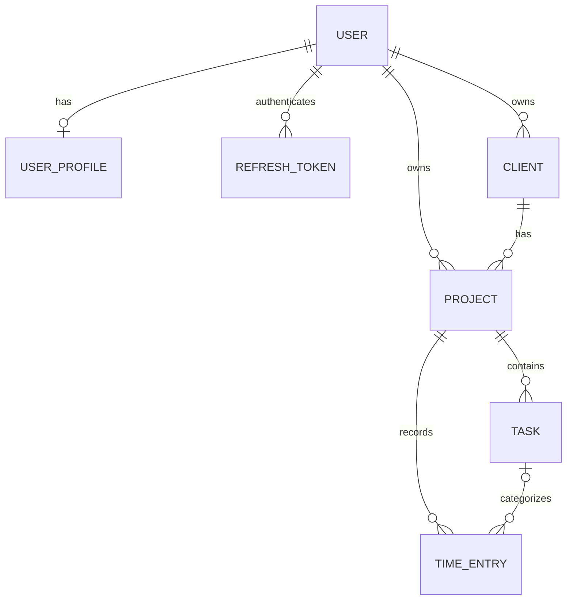
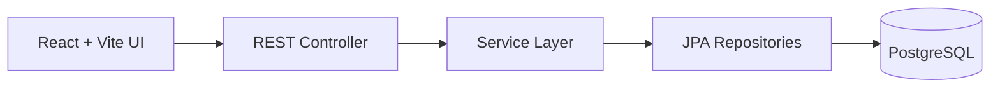

# Software Requirements Specification (SRS)

## Freelance Hub — ระบบจัดการเวลาทำงานและงานฟรีแลนซ์

| รายการ          | รายละเอียด                                              |
| --------------- | ------------------------------------------------------- |
| ชื่อระบบ        | Freelance Hub                                           |
| เวอร์ชันเอกสาร  | 2.1                                                     |
| สถานะ           | ข้อกำหนดและ contract ที่ตรวจเทียบ source `dbcc4b9` วันที่ 10 ตุลาคม 2026                   |
| กลุ่มผู้ใช้หลัก | Freelancer / ผู้ประกอบอาชีพอิสระ                        |
| Backend         | Java 17, Spring Boot 4.0.0, Spring MVC, Spring Data JPA |
| ฐานข้อมูล       | PostgreSQL                                              |
| Frontend        | React                                                   |
| เอกสาร API      | Swagger UI / OpenAPI                                    |

---

## 1. ภาพรวมระบบ

Freelance Hub เป็นเว็บแอปพลิเคชันสำหรับช่วย Freelancer จัดการลูกค้า โปรเจกต์ งานย่อย และเวลาทำงานในที่เดียว ระบบสรุปข้อมูลการทำงานและ productivity เพื่อช่วยให้ผู้ใช้เห็นภาระงาน รูปแบบการใช้เวลา และประสิทธิภาพของตนเอง

### 1.1 ปัญหาที่ต้องการแก้ไข

- ข้อมูลลูกค้า โปรเจกต์ และเวลาทำงานกระจัดกระจายหลายระบบ
- การบันทึกชั่วโมงทำงานด้วยตนเองมีโอกาสผิดพลาด
- ข้อมูลลูกค้า โปรเจกต์ และงานย่อยไม่เป็นระบบ
- มองภาพรวมภาระงานและ productivity ได้ยาก

### 1.2 เป้าหมาย

- บันทึกเวลาได้รวดเร็วทั้งแบบจับเวลาและกรอกย้อนหลัง
- จัดการลูกค้าหลายรายและโปรเจกต์หลายโปรเจกต์ได้อย่างเป็นระบบ
- แสดง dashboard และ productivity insights ที่นำไปใช้ตัดสินใจได้
- ออกแบบข้อมูล MVP ให้รองรับการขยายในอนาคตโดยไม่ทำให้ workflow ปัจจุบันซับซ้อน

### 1.3 ตัวชี้วัดความสำเร็จของ MVP

- ผู้ใช้สร้างลูกค้า โปรเจกต์ และเริ่มจับเวลาได้ภายใน 3 นาทีหลังลงทะเบียน
- ผู้ใช้บันทึกและค้นหา time entry ตามลูกค้า โปรเจกต์ และช่วงวันที่ได้โดยไม่ต้องใช้เครื่องมือภายนอก
- dashboard แสดงข้อมูลเวลาทำงานตามช่วงวันที่ได้ถูกต้อง
- productivity metrics ตรงกับ time entries ภายใต้ตัวกรองเดียวกัน 100%

---

## 2. ขอบเขตระบบ

### 2.1 ขอบเขต MVP

1. Authentication และจัดการโปรไฟล์ Freelancer
2. Client Management สำหรับลูกค้าหลายราย
3. Project และ Task Management พร้อมสถานะและงบประมาณเวลา
4. Time Tracking แบบ real-time และ manual entry
5. Dashboard, Analytics และ Productivity Insights
6. ค้นหา กรอง เรียงลำดับ และแบ่งหน้ารายการหลัก

### 2.2 ขอบเขตที่ไม่รวมใน MVP

Income, Expense, Invoice และ Payment รวมถึง payment gateway ระบบภาษี และฟีเจอร์บัญชีทั้งหมดอยู่นอกขอบเขตเอกสารฉบับนี้

---

## 3. ผู้ใช้งานและสิทธิ์

### 3.1 บทบาท

| บทบาท             | ความสามารถ                                                                                  |
| ----------------- | ------------------------------------------------------------------------------------------- |
| Freelancer        | จัดการข้อมูลทั้งหมดที่ตนเองเป็นเจ้าของ เช่น โปรไฟล์ ลูกค้า โปรเจกต์ task เวลา และ analytics |
| Admin (ระยะถัดไป) | ดูแลบัญชีผู้ใช้และสถานะระบบ โดยไม่มีสิทธิ์อ่านข้อมูลธุรกิจส่วนตัวโดยค่าเริ่มต้น             |

### 3.2 หลักการเข้าถึงข้อมูล

- ผู้ใช้ต้องยืนยันตัวตนก่อนเข้าถึงข้อมูลธุรกิจ
- ผู้ใช้เข้าถึง แก้ไข หรือลบได้เฉพาะข้อมูลของตนเอง
- ทุก query ที่อ่านข้อมูลธุรกิจต้องจำกัดด้วย `owner_id` ของผู้ใช้ที่เข้าสู่ระบบ
- Register/Login/Refresh/Logout เปิดโดยไม่ต้องมี access JWT; Refresh/Logout ตรวจ Origin/Referer และใช้ refresh cookie ตาม flow ส่วน health, OPTIONS และ Swagger/OpenAPI เมื่อเปิด configuration เป็น public routes ตาม SecurityConfig

---

## 4. Functional Requirements

ระดับความสำคัญ: **Must** = ต้องมีใน MVP, **Should** = ควรมี, **Could** = เพิ่มภายหลังได้

### 4.1 Authentication และ Profile

| ID         | Requirement                                                                                                                       | Priority |
| ---------- | --------------------------------------------------------------------------------------------------------------------------------- | -------- |
| FR-AUTH-01 | ผู้ใช้สมัครด้วยชื่อ อีเมล และรหัสผ่านได้                                                                                          | Must     |
| FR-AUTH-02 | ระบบต้องไม่อนุญาตให้อีเมลซ้ำ และต้องเก็บรหัสผ่านแบบ hash                                                                          | Must     |
| FR-AUTH-03 | ผู้ใช้เข้าสู่ระบบ ออกจากระบบ และเรียกดูข้อมูลตนเองได้                                                                             | Must     |
| FR-AUTH-04 | ผู้ใช้แก้ไขชื่อ ข้อมูลติดต่อ และที่อยู่ได้ โดยที่อยู่ประกอบด้วย `address`, `subdistrict`, `district`, `province` และ `postalCode` | Must     |
| FR-AUTH-05 | ผู้ใช้เปลี่ยนรหัสผ่านโดยยืนยัน `oldPassword` และกำหนด `newPassword` ได้                                                           | Must     |

### 4.2 Client Management

| ID        | Requirement                                                                                                                    | Priority |
| --------- | ------------------------------------------------------------------------------------------------------------------------------ | -------- |
| FR-CLI-01 | ผู้ใช้สร้าง ดู แก้ไข และ archive ลูกค้าได้                                                                                     | Must     |
| FR-CLI-02 | ลูกค้าประกอบด้วยชื่อบุคคล/บริษัท อีเมล โทรศัพท์ ที่อยู่ เลขผู้เสียภาษี และหมายเหตุ โดยที่อยู่ใช้โครงสร้างเดียวกับ User Profile | Must     |
| FR-CLI-03 | ผู้ใช้ค้นหาและกรองลูกค้าตามชื่อ สถานะ และข้อมูลติดต่อได้                                                                       | Must     |
| FR-CLI-04 | หน้ารายละเอียดลูกค้าต้องแสดงโปรเจกต์และเวลาในแต่ละโปรเจกต์                                                                     | Must     |
| FR-CLI-05 | ระบบไม่อนุญาตให้ลบลูกค้าที่มีธุรกรรม แต่ให้ archive เพื่อรักษาประวัติ                                                          | Must     |

### 4.3 Project และ Task Management

| ID        | Requirement                                                                     | Priority |
| --------- | ------------------------------------------------------------------------------- | -------- |
| FR-PRJ-01 | ผู้ใช้สร้างโปรเจกต์และผูกกับลูกค้าหนึ่งรายได้                                   | Must     |
| FR-PRJ-02 | โปรเจกต์ประกอบด้วยชื่อ รายละเอียด วันที่เริ่ม/สิ้นสุด สี สถานะ                  | Must     |
| FR-PRJ-03 | โปรเจกต์กำหนดเป้าหมายชั่วโมงและสถานะงานได้ โดยยังไม่คำนวณรายได้ใน MVP           | Must     |
| FR-PRJ-04 | สถานะโปรเจกต์ประกอบด้วย `PLANNED`, `ACTIVE`, `ON_HOLD`, `COMPLETED`, `ARCHIVED` | Must     |
| FR-PRJ-05 | ผู้ใช้สร้าง แก้ไข ปิดงาน และเรียงลำดับ task ภายในโปรเจกต์ได้                    | Must     |
| FR-PRJ-06 | ระบบแสดงเวลาที่ใช้เทียบกับเป้าหมายชั่วโมงของแต่ละโปรเจกต์                       | Must     |
| FR-PRJ-07 | ระบบแจ้งเตือนเมื่อใช้เวลาถึงเกณฑ์ 80% และ 100% ของเป้าหมาย                      | Should   |

### 4.4 Time Tracking

| ID         | Requirement                                                                        | Priority |
| ---------- | ---------------------------------------------------------------------------------- | -------- |
| FR-TIME-01 | ผู้ใช้เริ่ม หยุด และยกเลิก timer โดยเลือกโปรเจกต์ และเลือก task ได้                | Must     |
| FR-TIME-02 | ผู้ใช้มี timer ที่กำลังทำงานได้สูงสุดหนึ่งรายการในเวลาเดียวกัน                     | Must     |
| FR-TIME-03 | ระบบเก็บเวลาเริ่ม เวลาสิ้นสุด ระยะเวลา และคำอธิบาย                                 | Must     |
| FR-TIME-04 | ผู้ใช้เพิ่มเวลาแบบ manual ด้วยวัน เวลาเริ่ม/สิ้นสุด หรือระยะเวลาได้                | Must     |
| FR-TIME-05 | ผู้ใช้แก้ไขและลบ time entry ที่ยังไม่ถูกล็อกหรือสรุปผลแล้วได้                      | Must     |
| FR-TIME-06 | ผู้ใช้ดูรายการเวลาแบบรายวัน รายสัปดาห์ และตามช่วงวันที่ได้                         | Must     |
| FR-TIME-07 | ผู้ใช้กรองรายการตามลูกค้า โปรเจกต์ task และช่วงวันที่ได้                           | Must     |
| FR-TIME-08 | ระบบคำนวณ duration ของรายการและรวมชั่วโมงตามช่วงวันที่ได้ โดยยังไม่คำนวณมูลค่าเงิน | Must     |
| FR-TIME-09 | ผู้ใช้คัดลอกรายการเวลาเดิมเพื่อบันทึกซ้ำได้                                        | Could    |

### 4.5 Dashboard, Analytics และ Productivity Insights (MVP)

| ID        | Requirement                                                                              | Priority |
| --------- | ---------------------------------------------------------------------------------------- | -------- |
| FR-ANA-01 | dashboard แสดงชั่วโมงวันนี้ สัปดาห์นี้ เดือนนี้ และแนวโน้มเทียบช่วงก่อนหน้า              | Must     |
| FR-ANA-02 | dashboard แสดง tracked hours และ utilization ของเวลาที่กำหนดให้วิเคราะห์ได้              | Must     |
| FR-ANA-03 | ผู้ใช้ดูสัดส่วนเวลาแยกตามลูกค้า โปรเจกต์ และช่วงวันที่ได้                                | Must     |
| FR-ANA-04 | dashboard แสดงจำนวนโปรเจกต์ active, completed และงานที่ใกล้เกินเป้าหมายชั่วโมง           | Must     |
| FR-ANA-05 | ระบบแสดงค่าเฉลี่ยชั่วโมงต่อวัน วัน/ช่วงเวลาที่ทำงานมากที่สุด และโปรเจกต์ที่ใช้เวลาสูงสุด | Should   |
| FR-ANA-06 | ระบบแสดง project progress เทียบกับเป้าหมายชั่วโมงและแจ้งเตือนเมื่อถึง 80%/100%           | Should   |
| FR-ANA-07 | ระบบแสดง productivity trend เทียบระหว่างช่วงวันที่เลือกกับช่วงก่อนหน้า                   | Should   |
| FR-ANA-08 | ผู้ใช้ส่งออกรายงาน time entries เป็น CSV ได้                                             | Should   |

---

## 5. กฎธุรกิจ (Business Rules)

กฎใน MVP เน้นข้อมูลเวลา สถานะงาน และการวิเคราะห์ productivity

| ID    | กฎ                                                                                     |
| ----- | -------------------------------------------------------------------------------------- |
| BR-01 | เวลาเริ่มต้องน้อยกว่าเวลาสิ้นสุด และ duration ต้องมากกว่า 0                            |
| BR-02 | timer ที่ยังทำงานจะมี `started_at` แต่ไม่มี `ended_at`; ระบบคำนวณ duration เมื่อหยุด   |
| BR-03 | time entry ต้องอยู่ภายใต้โปรเจกต์ ส่วน task เป็นข้อมูลที่ไม่บังคับ                     |
| BR-04 | time entry ใน MVP ไม่คำนวณรายได้และไม่ต้องมี rate                                      |
| BR-06 | การ archive ลูกค้าหรือโปรเจกต์ไม่ลบประวัติ และไม่อนุญาตให้เริ่ม timer ใหม่ในรายการนั้น |
| BR-07 | วันที่และเวลาบันทึกในฐานข้อมูลเป็น UTC เพื่อให้ timestamp ไม่กำกวม                    |
| BR-08 | analytics ต้องไม่นับ timer ที่ยังไม่หยุดจนกว่าจะระบุเป็นข้อมูลประมาณการอย่างชัดเจน     |

---

## 6. User Stories และ Acceptance Criteria หลัก

### US-01: จับเวลาทำงาน

**ในฐานะ** Freelancer **ฉันต้องการ** เริ่มและหยุด timer ของโปรเจกต์ **เพื่อให้** บันทึกเวลาทำงานได้แม่นยำ

Acceptance criteria:

- Given ผู้ใช้มีโปรเจกต์ ACTIVE, when กดเริ่ม timer, then ระบบสร้าง running entry และแสดงเวลาที่ผ่านไป
- Given มี timer ทำงานอยู่, when เริ่ม timer ใหม่, then ระบบต้องปฏิเสธหรือให้หยุด timer เดิมก่อน
- When กดหยุด, then ระบบบันทึก end time และ duration
- When refresh หรือเข้าสู่ระบบอีกครั้ง, then timer ที่กำลังทำงานยังแสดงสถานะและเวลาถูกต้อง

### US-03: ดู productivity

**ในฐานะ** Freelancer **ฉันต้องการ** ดูเวลาทำงานและ productivity **เพื่อให้** ปรับรูปแบบการทำงานและเลือกงานได้ดีขึ้น

Acceptance criteria:

- ผู้ใช้เลือกช่วงวันที่ได้
- ระบบแสดง tracked hours, utilization และ project progress ของช่วงที่เลือก
- ผลรวมใน dashboard ต้องตรงกับ time entries ภายใต้ตัวกรองเดียวกัน
- กรณีไม่มีข้อมูลต้องแสดงค่า 0 และ empty state โดยไม่เกิดข้อผิดพลาด

---

## 7. แบบจำลองข้อมูลระดับสูง


```mermaid
erDiagram
    USER ||--o| USER_PROFILE : has
    USER ||--o{ REFRESH_TOKEN : authenticates
    USER ||--o{ CLIENT : owns
    USER ||--o{ PROJECT : owns
    CLIENT ||--o{ PROJECT : has
    PROJECT ||--o{ TASK : contains
    PROJECT ||--o{ TIME_ENTRY : records
    TASK o|--o{ TIME_ENTRY : categorizes
```

### 7.1 Entity

| Entity        | Field สำคัญ                                                                                                                   |
| ------------- | ----------------------------------------------------------------------------------------------------------------------------- |
| `User`        | id, email, passwordHash, role, isActive, deletedAt                                                                            |
| `UserProfile` | userId, displayName, phone, address, subdistrict, district, province, postalCode, taxId, bio, isActive, deletedAt |
| `Address`     | embedded value object: address, subdistrict, district, province, postalCode                                                                      |
| `Client`      | id, ownerId, name, companyName, email, phone, addressDetails, taxId, isActive, deletedAt; status คำนวณใน response                                                        |
| `Project`     | id, ownerId, clientId, name, description, targetMinutes, status, startDate, endDate                                             |
| `Task`        | id, projectId, name, description, status, sortOrder                                                                           |
| `TimeEntry`   | id, ownerId, projectId, taskId, description, startedAt, endedAt, durationSeconds, entryType, lockedAt                                              |

User, UserProfile, Client, Project, Task และ TimeEntry มี audit timestamps และ optimistic locking (`version`); RefreshToken เก็บ createdAt/expiresAt/usedAt/revokedAt โดยไม่มี version หรือ updatedAt

ระบบมี 7 ตารางธุรกิจหลัง Flyway V1–V20: `users`, `user_profiles`, `refresh_tokens`, `clients`, `projects`, `tasks` และ `time_entries` โดย User–UserProfile เป็น 1:0..1 ใน schema (registration สร้าง profile ให้) Address เป็น `@Embedded` ใน UserProfile/Client ไม่มี identity หรือตารางแยกหลัง V13; Foreign Key, index และ constraints ดู [Data Dictionary](doc/data-dictionary.md) และ [ER Diagram](doc/diagrams/er-diagram.md)

สำหรับ Auth/User Profile ที่อยู่เก็บเป็น field ตรงใน `user_profiles` ตาม Data Dictionary และ API รับ/ส่งเป็น flat fields เพื่อให้ contract อ่านง่าย:

```json
{
    "address": "ที่อยู่",
    "subdistrict": "ตำบล",
    "district": "อำเภอ",
    "province": "จังหวัด",
    "postalCode": "รหัสไปรษณีย์"
}
```

---

## 8. API ระดับสูง

REST API ใช้ prefix `/api` โดยไม่มี version segment ตารางนี้ระบุเส้นหลักที่เปิดจริง CSV สร้างใน browser จาก Project ของหน้ารายงานปัจจุบัน ไม่มี endpoint ดาวน์โหลด Time Entry CSV

| Method | Endpoint | หน้าที่ |
|---|---|---|
| POST | `/api/auth/register`, `/api/auth/login` | สร้าง session; access JWT ใน JSON และ refresh token ใน HttpOnly cookie |
| POST | `/api/auth/refresh`, `/api/auth/logout` | หมุน refresh token / เพิกถอน family และล้าง cookie |
| GET/PATCH | `/api/users/me` | ดู/แก้โปรไฟล์ |
| PATCH | `/api/users/me/password` | เปลี่ยนรหัสผ่านด้วย oldPassword/newPassword |
| GET/POST | `/api/clients` | รายการ/สร้างลูกค้า |
| GET/PUT/PATCH/DELETE | `/api/clients/{id}` | ดู/แทนที่/แก้บางฟิลด์/soft delete ลูกค้า |
| PATCH | `/api/clients/{id}/status` | Archive หรือเปิด Client ด้วย isActive |
| GET/POST | `/api/projects` | รายการ/สร้าง Project |
| GET/PUT/DELETE | `/api/projects/{id}` | ดู/แทนที่รายละเอียด/soft delete Project |
| PATCH | `/api/projects/{id}/status` | เปลี่ยนสถานะ Project รวม archive/restore |
| GET/POST | `/api/projects/{projectId}/tasks` | รายการ/สร้าง Task |
| GET/PUT/DELETE | `/api/tasks/{taskId}` | ดู/แก้/soft delete Task |
| PATCH | `/api/tasks/{taskId}/status` | เปลี่ยนสถานะ Task |
| PATCH | `/api/projects/{projectId}/tasks/reorder` | เรียง Task |
| GET/POST | `/api/time-entries` | ค้นหา/สร้าง manual entry |
| GET/PUT/DELETE | `/api/time-entries/{id}` | ดู/แทนที่ข้อมูล/soft delete completed entry |
| GET | `/api/time-entries/summary` | รวมเวลาโดยใช้ filter เดียวกับ list |
| POST | `/api/timer/start`, `/api/timer/stop` | เริ่ม/หยุด timer |
| GET/DELETE | `/api/timer/current` | อ่าน/ยกเลิก running timer |
| GET | `/api/dashboard`, `/api/dashboard/activity` | Dashboard และกราฟ WEEK/MONTH/YEAR |
| GET | `/api/reports/summary`, `/distribution`, `/projects`, `/work-trend`, `/work-pattern` | Reports ภายใต้ prefix /api/reports; รับ from/to/clientId/projectId/status |

รายละเอียด legacy Task routes, DTO และ guards อยู่ใน [Use Case Description](doc/use-case-description.md) และ [Reports API](doc/reports-summary-api.md)

ข้อกำหนดร่วมของ API:

- Pagination เริ่ม page ที่ 1; Client ใช้ size หรือ limit (limit มีลำดับความสำคัญ), Project/Time Entry/Reports ใช้ limit; sort parameters ต่างกันตาม endpoint ไม่ใช่ size/sort ชุดเดียวทุกเส้น
- Validation = 400, authentication = 401, authorization = 403, not found = 404, state conflict = 409 และ login rate limit = 429
- Error response ใช้ ApiResult โดย success=false, message อยู่ชั้นบน และ error มี code/details/status/timestamp/fieldErrors/traceId; รายช่อง validation อยู่ใน fieldErrors ดู [Error Contract](doc/error-contract.md)
- Success เส้นหลักใช้ ApiResult; legacy nested Task routes บางเส้นคืน raw DTO หรือ 204 ตาม implementation
- วันและเวลาใช้ ISO 8601; timestamp เก็บเป็น UTC ส่วนวันใน Dashboard/Reports แปลงตาม Asia/Bangkok
- Create คืน 201, read/update คืน 200; Client DELETE และ Logout คืน 204 ไม่มี body ส่วน Project/Task/Time Entry DELETE และ cancel timer คืน 200 ApiResult
- ใช้ request DTO, Bean Validation และ RestControllerAdvice ตาม endpoint ที่มีอยู่
- OpenAPI JSON อยู่ที่ `/v3/api-docs` และ Swagger UI ที่ `/swagger-ui.html`; ทั้งสองเปิดเมื่อ OPENAPI_ENABLED=true (ค่าเริ่มต้น false) ไม่ได้สลับตามชื่อ environment อัตโนมัติ ต้องตั้ง production ให้ปิด

### 8.1 Profile, address และการเปลี่ยนรหัสผ่าน

- `GET/PATCH /api/users/me` แสดงและแก้ไขข้อมูลของผู้ใช้ที่ authenticated เท่านั้น โดย PATCH เปลี่ยนเฉพาะฟิลด์ที่ส่งมา และข้อมูลที่อยู่ใช้ flat fields ชุดเดียวกันทั้ง User Profile และ Client: `address`, `subdistrict`, `district`, `province`, `postalCode`
- `PATCH /api/users/me/password` ต้องมี bearer JWT และรับ body รูปแบบต่อไปนี้:

    ```json
    {
        "oldPassword": "รหัสผ่านเดิม",
        "newPassword": "รหัสผ่านใหม่"
    }
    ```

- ระบบต้องตรวจ `oldPassword` ก่อนบันทึก hash ของ `newPassword`; รหัสผ่านเดิมผิดให้ตอบ `401` พร้อม `message: "รหัสผ่านไม่ถูกต้อง"`, ข้อมูลรหัสผ่านใหม่ไม่ผ่าน validation หรือซ้ำกับรหัสผ่านเดิมให้ตอบ `400`
- เมื่อเปลี่ยนรหัสผ่านสำเร็จ ต้องเพิกถอน refresh-token families ทั้งหมดของผู้ใช้
- ห้ามส่งหรือบันทึก plain-text password และห้ามใช้ email reset flow ใน MVP
- MVP ไม่รองรับ forgot/reset password และไม่รองรับการอัปโหลดหรือเปลี่ยนรูปโปรไฟล์; User Profile API ไม่รับหรือส่ง `profileImageUrl`/`avatarUrl`
- การ logout หรือการเปลี่ยนรหัสผ่านต้องไม่ทำให้ข้อมูล address ของผู้ใช้อื่นเข้าถึงได้

---

## 9. Non-functional Requirements

### 9.1 Security

- ใช้ Spring Security และ password hashing แบบ BCrypt หรือ Argon2
- access JWT อายุ 15 นาที; refresh token แบบสุ่มอายุสูงสุด 7 วัน เก็บเฉพาะ hash ในฐานข้อมูล หมุนทุกครั้งที่ใช้ และตรวจการใช้ token เก่าซ้ำ
- refresh cookie ต้องเป็น `HttpOnly`, `SameSite=Lax`, `Secure` ใน production และเรียกผ่าน `/api` proxy แบบ same-origin; logout ไม่เพิกถอน access JWT ก่อนหมดอายุ
- ตรวจสอบ authorization ระดับ service ทุกครั้ง ไม่อาศัย ID จาก client เพียงอย่างเดียว
- validate และ sanitize input; ป้องกัน SQL injection, XSS, CSRF และ brute-force login
- ไม่บันทึกรหัสผ่าน token หรือข้อมูลธนาคารเต็มรูปแบบลง log

### 9.2 Performance และ Reliability

- API ทั่วไปควรตอบกลับภายใน 500 ms ที่ percentile 95 ภายใต้ข้อมูลผู้ใช้ไม่เกิน 100,000 time entries (ไม่รวม PDF/export)
- dashboard ช่วงไม่เกิน 1 ปีควรตอบกลับภายใน 2 วินาที
- transaction สำคัญ เช่น หยุด timer และเปลี่ยนสถานะ project ต้องเป็น atomic
- ป้องกันการหยุด timer ซ้ำหรือสร้างรายการซ้ำจาก request ซ้ำด้วย transaction/locking หรือ idempotency
- ฐานข้อมูล production ต้องสำรองทุกวันและมีขั้นตอนทดสอบ restore

### 9.3 Usability และ Accessibility

- รองรับ desktop และ mobile web ตั้งแต่ความกว้าง 360 px
- action จับเวลาหลักเข้าถึงได้ไม่เกิน 2 interaction จาก dashboard
- มี loading, empty, success และ error state ที่ชัดเจน
- ฟอร์มมี label, keyboard navigation และ contrast ตาม WCAG 2.1 AA ในส่วนหลัก
- UI รองรับภาษาไทยเป็นหลัก และออกแบบให้เพิ่มภาษาอังกฤษได้

### 9.4 Maintainability และ Observability

- แยก domain ตาม feature และไม่ส่ง JPA entity เป็น API response โดยตรง
- มี unit test สำหรับ business calculation และ integration test สำหรับ flow สำคัญ
- ใช้ database migration เช่น Flyway; ห้ามแก้ schema production ด้วย `ddl-auto=update`
- log แบบ structured พร้อม request/trace ID และมี health check
- เก็บ audit event สำหรับ authentication, การเปลี่ยนสถานะ project และการแก้ time entry
- ใช้ JUnit 5, Mockito และ Spring Boot Test ตามชนิดของการทดสอบ
- Service ต้องรับ dependency ด้วย constructor injection เท่านั้น
- Controller ห้ามเรียก Repository โดยตรง และทุกชั้นต้องไม่ข้ามลำดับ Layered Architecture
- ต้องปฏิบัติตาม SOLID ทั้งห้าข้อและมีเอกสารชี้ตำแหน่งการใช้งานในโค้ด

---

## 10. สถาปัตยกรรมและโครงสร้างโปรเจกต์ (บังคับตามใบงาน)

ระบบต้องใช้ **Layered Architecture** และห้ามเรียกข้ามชั้น โดย request ต้องไหลตามลำดับต่อไปนี้:

```text
Presentation (React UI / RestController)
                    ↓
Service (Business Logic / Transaction)
                    ↓
Repository (Spring Data JPA / Data Access)
                    ↓
Domain (Entity / Value Object / Enum)
```

- Controller รับ request, validate DTO และแปลงผลเป็น response/view เท่านั้น
- Service เป็นที่อยู่ของ business logic และ transaction boundary
- Repository ทำหน้าที่เข้าถึงข้อมูลเท่านั้น
- Entity ต้องไม่ถูกใช้เป็น API request/response โดยตรง ให้ใช้ DTO และ Mapper
- Controller ห้ามเรียก Repository และ Repository ห้ามขึ้นกับ Service
- ใช้ Constructor Injection เท่านั้น

โครงสร้าง source code ที่กำหนด:

```text
code/Backend/src/main/java/th/ac/kku/freelance_hub/
├─ config/
├─ controller/         # REST controllers
├─ service/
│  └─ impl/
├─ repository/
├─ domain/
│  ├─ entity/
│  ├─ enums/
│  └─ valueobject/
├─ dto/
│  ├─ request/
│  └─ response/
├─ mapper/
├─ exception/
├─ security/
├─ common/
└─ FreelanceHubApplication.java
```

โครงสร้าง repository ที่ต้องส่งตามใบงานกำหนดไว้ในหัวข้อ 19 โดย source code, tests, เอกสาร และภาพต้องแยกอยู่ใน `code/`, `test/`, `doc/` และ `img/` ตามลำดับ

### 10.1 Component Flow


```mermaid
flowchart LR
    UI[React + Vite UI] --> API[REST Controller]
    API --> APP[Service Layer]
    APP --> REPO[JPA Repositories]
    REPO --> DB[(PostgreSQL)]
```

---

## 11. แผนการพัฒนา

### Phase 1 — Foundation

- ตั้งค่า environment, PostgreSQL, Flyway และ error response กลาง
- Authentication, authorization และ user settings
- Client และ Project CRUD พร้อม ownership isolation

### Phase 2 — Time Tracking

- Task และ time entry CRUD
- Start/stop timer พร้อม concurrency protection
- การคำนวณ duration และชั่วโมงรวม โดยยังไม่คำนวณมูลค่าเงิน
- หน้ารายวัน/สัปดาห์และตัวกรอง

### Phase 3 — Analytics และ Hardening (MVP)

- Dashboard และ breakdown reports
- CSV export และ productivity insights
- Performance, security, accessibility และ end-to-end tests

---

## 12. Testing Requirements

- **Unit tests:** duration, status transition, target-hours progress และ utilization
- **Repository tests:** ownership filtering, date range, project/task และ time-entry queries
- **Integration tests:** register/login, client/project CRUD, start-stop timer และ analytics summary
- **Security tests:** ผู้ใช้ A ต้องไม่อ่านหรือแก้ข้อมูลของผู้ใช้ B แม้ทราบ resource ID
- **Date-range tests:** time entry ที่อยู่ตรงขอบช่วงวันที่ต้องถูกรวมในผลลัพธ์อย่างถูกต้อง
- **Concurrency tests:** การ start timer พร้อมกันต้องไม่สร้างรายการซ้ำ

Definition of Done ของแต่ละ feature:

1. ผ่าน acceptance criteria และ automated tests ที่เกี่ยวข้อง
2. validation, authorization และ error cases ครบ
3. migration ใช้งานได้ทั้งฐานข้อมูลใหม่และฐานข้อมูลเวอร์ชันก่อนหน้า
4. API/documentation อัปเดตตรงกับ implementation
5. ไม่มีข้อมูลลับหรือข้อมูลส่วนบุคคลสำคัญใน log

---

## 13. ข้อสรุปขอบเขตและการดำเนินงานของ MVP

### ขอบเขตที่ยืนยันแล้ว

- ระบบเป็น single-user workspace: หนึ่งบัญชีมีเจ้าของคนเดียว ยังไม่รองรับทีม/พนักงานหลายคนใน workspace เดียวกัน
- MVP ใช้ time tracking เพื่อวิเคราะห์ชั่วโมงและ productivity เท่านั้น ไม่คำนวณรายได้และไม่ออก Invoice
- Frontend deploy บน Vercel, Backend deploy บน Render และใช้ PostgreSQL บน Supabase
- Completed time entries ใช้ soft delete และไม่มี retention purge ในโค้ด; cancel timer ลบ running row จริง ยังไม่มี persistent audit-event storage สำหรับทุก flow ตาม NFR

---

## 14. เงื่อนไขการยอมรับระบบ MVP

MVP ถือว่าพร้อมส่งมอบเมื่อผู้ใช้สามารถทำ flow ต่อไปนี้ได้ครบโดยไม่มีการคำนวณภายนอก:

1. สมัคร เข้าสู่ระบบ และจัดการโปรไฟล์
2. สร้างและจัดการลูกค้า โปรเจกต์ และ task
3. จับเวลาหรือเพิ่มเวลาย้อนหลัง พร้อมแก้ไขและลบรายการที่ยังไม่ถูกล็อก
4. ดูชั่วโมงทำงานตามวัน สัปดาห์ ช่วงวันที่ ลูกค้า และโปรเจกต์
5. ดู dashboard ที่มี tracked hours, utilization และสถานะโปรเจกต์
6. ดู productivity insights เช่น ค่าเฉลี่ยชั่วโมงต่อวันและการใช้เป้าหมายชั่วโมง
7. ข้อมูลของบัญชีหนึ่งไม่สามารถเข้าถึงได้จากบัญชีอื่น

ขอบเขตการเงินและ Invoice ไม่ถูกใช้เป็นเกณฑ์ acceptance ของ MVP

---

## 15. ข้อกำหนดทางเทคนิคจากรายวิชา

ข้อกำหนดในตารางนี้เป็นเงื่อนไขการส่งงานและถือเป็น **Must** ทั้งหมด

| หัวข้อ | Implementation ปัจจุบัน |
|---|---|
| Backend | Java 17, Spring Boot 4.0.0 |
| Build | Maven Wrapper |
| Database / ORM | PostgreSQL, Spring Data JPA / Hibernate, Flyway |
| API | REST, OpenAPI JSON /v3/api-docs และ Swagger UI เมื่อเปิด OPENAPI_ENABLED |
| Frontend | React + TypeScript + Vite เชื่อม Spring Boot REST API |
| Testing | JUnit Jupiter, Mockito, Spring Boot Test และ Node test runner |
| Version Control | Git/GitHub; integration branch ของ repository คือ dev |
| Deployment | Docker Backend บน Render, Frontend บน Vercel; PostgreSQL บน Supabase ตามแผน deployment |
| Container | code/Backend/Dockerfile และ docker-compose.yml |

ตารางนี้ระบุสิ่งที่มีใน repository ไม่ถือเป็นหลักฐานว่า deployment, acceptance criteria หรือเกณฑ์รายวิชาทุกข้อผ่านแล้ว ข้อกำหนดที่ยังไม่ครบแยกไว้ในหัวข้อ 23

## 16. SOLID Principles และหลักฐานประกอบ

| Principle             | Requirement ที่ต้องแสดงในโค้ด                                                                           |
| --------------------- | ------------------------------------------------------------------------------------------------------- |
| Single Responsibility | แต่ละ class มีหน้าที่เดียว แยก validation, business logic และ persistence                               |
| Open/Closed           | รองรับการเพิ่มพฤติกรรมหรือสร้างรายงานด้วย implementation ใหม่โดยไม่เพิ่ม if-else ใน service เดิม  |
| Liskov Substitution   | implementation ทุกตัวใช้แทน interface/base type ได้โดยไม่เปลี่ยนผลลัพธ์ที่ผู้เรียกคาดหวัง               |
| Interface Segregation | แยก interface ตาม use case ไม่สร้าง service interface ขนาดใหญ่ที่ผู้ใช้ต้องพึ่ง method ที่ไม่เกี่ยวข้อง |
| Dependency Inversion  | Service ขึ้นกับ interface และรับ dependency ผ่าน constructor เท่านั้น                                   |

ต้องจัดทำ `doc/solid-analysis.md` ระบุ Principle, ไฟล์/คลาส, เลขบรรทัด และเหตุผลสั้น ๆ โดยเลขบรรทัดต้องตรวจและอัปเดตก่อนส่งงาน

## 17. Design Patterns ที่กำหนดใช้ใน MVP

### 17.1 Enterprise / Architectural Patterns

ต้องแสดงการใช้ Layered Architecture, MVC, Repository, Service Layer, DTO + Mapper และ Dependency Injection ครบทุกแบบ

### 17.2 GoF Behavioral Patterns

เลือกกลุ่ม Behavioral และใช้ไม่น้อยกว่า 3 patterns ที่สัมพันธ์กับ domain ดังนี้:

| Pattern  | การใช้งานในโค้ดปัจจุบัน                                                                     | ปัญหาที่แก้                                                        |
| -------- | ----------------------------------------------------------------------------------------- | ------------------------------------------------------------------ |
| Strategy | `PasswordEncoder` / `BCryptPasswordEncoder` ของ Spring Security | เปลี่ยนวิธี hash รหัสผ่านโดยไม่แก้ auth use case               |
| State    | `ProjectState` ควบคุม transition ของ PLANNED, ACTIVE, ON_HOLD, COMPLETED และ ARCHIVED     | ป้องกันการเริ่มจับเวลาหรือแก้ task ในสถานะที่ไม่อนุญาต             |
| Observer | Spring Application Event เมื่อ timer หยุดหรือโปรเจกต์ถึง 80%/100% ของเป้าหมาย             | แยกการตรวจ threshold และเขียน log ออกจาก TimerService |
| Chain of Responsibility | `ErrorHandlerChain` เลือก ErrorHandler ตัวแรกที่รับ exception ได้ | ใช้กฎแปลง error ร่วมกันใน MVC และ Security |

ห้ามเพิ่ม pattern เพียงเพื่อให้ครบจำนวน ทุก pattern ต้องมี use case, test และอธิบายเหตุผลได้ ต้องจัดทำ `doc/design-patterns.md` เป็นตาราง Pattern, ปัญหาที่แก้, ไฟล์/คลาสที่ใช้ พร้อม Class Diagram

## 18. Database และ Migration Deliverables

- ตารางหลัก: users, user_profiles, refresh_tokens, clients, projects, tasks และ time_entries; V17 สร้าง refresh_tokens และ V18 ลบ revoked_tokens ผล PostgreSQL/cloud verification ต้องมีหลักฐานแยกจากการตรวจ source
- มี One-to-One ระหว่าง users กับ user_profiles โดย schema อนุญาต profile 0..1 แถว และ Address ฝังใน user_profiles/clients รวมถึง One-to-Many ระหว่าง clients กับ projects, projects กับ tasks และ projects กับ time_entries
- กำหนด Foreign Key Constraint และ index สำหรับ owner, relation, status และ date fields ที่ใช้ค้นหาบ่อย
- กำหนด Cascade และ Fetch Type อย่างมีเหตุผล หลีกเลี่ยง `CascadeType.ALL` และ `EAGER` โดยไม่มีความจำเป็น
- ใช้ Flyway migration ใน `code/Backend/src/main/resources/db/migration/`
- จัดทำ ER Diagram และ Data Dictionary ใน `doc/`

## 19. เอกสารและโครงสร้าง Repository ที่ต้องส่ง

```text
freelance-hub/
├─ code/
│  ├─ Backend/                   # Spring Boot REST API และ Docker deployment
│  │  ├─ src/
│  │  ├─ Dockerfile
│  │  ├─ docker-compose.yml
│  │  ├─ .dockerignore
│  │  ├─ .env.example
│  │  ├─ pom.xml
│  │  └─ mvnw
│  └─ Frontend/                  # React + Vite SPA
│     ├─ src/
│     ├─ public/
│     ├─ package.json
│     ├─ package-lock.json
│     └─ vite.config.ts
├─ test/                         # Test plan/report/evidence; test source อยู่ใต้ code/
├─ doc/
│  ├─ diagrams/
│  │  ├─ use-case.*
│  │  ├─ domain-model.*
│  │  ├─ class-diagram.*
│  │  ├─ sequence-01.*           # อย่างน้อย 3 scenarios
│  │  ├─ sequence-02.*
│  │  ├─ sequence-03.*
│  │  ├─ activity.*
│  │  ├─ er-diagram.*
│  │  ├─ component.*
│  │  ├─ deployment.*
│  │  └─ project-state.*
│  ├─ slide/
│  ├─ solid-analysis.md
│  ├─ design-patterns.md
│  ├─ data-dictionary.md
│  └─ use-case-description.md
├─ img/                          # รูปและไฟล์มัลติมีเดีย
├─ README.md
└─ REQUIREMENTS.md
```

Diagram บังคับ ได้แก่ Use Case พร้อมคำอธิบาย, Domain Model, Class Diagram ที่ระบุ Design Pattern, Sequence อย่างน้อย 3 scenario, Activity, ER/Database Schema, Component, Deployment และ State Diagram ของ Project

README ขั้นส่งมอบต้องมีชื่อและคำอธิบายระบบ 3–5 บรรทัด, ตารางสมาชิก, Tech Stack, System Architecture, ER Diagram, Installation, How to Run, API Documentation, How to Run Tests, Deployment URL และ Project Structure

## 20. Git และการทำงานเป็นทีม

- สมาชิกไม่เกิน 5 คน และทุกคนต้องมีงานเขียนโค้ดจริง
- Repository ใช้ `main` สำหรับ production และ `dev` สำหรับ integration; ใบงานเดิมระบุ `develop` จึงต้องเทียบชื่อ branch กับเกณฑ์รายวิชา โดย workflows ปัจจุบันใช้ dev/main
- branch ส่วนตัวต้องใช้รูปแบบ `ชื่อ_รหัสนักศึกษา_section` เท่านั้น
- สมาชิกต้องตั้ง `git config user.name` และ `user.email` ให้ตรงบัญชี GitHub และ commit/push ด้วยบัญชีตนเอง
- สมาชิกแต่ละคนต้องมี commit ที่มีความหมายอย่างน้อย 15 commits และกระจายตลอดช่วงพัฒนา
- ทุกการรวมงานต้องผ่าน Pull Request และมี reviewer อย่างน้อย 1 คน
- commit message ใช้รูปแบบ `<type>: <สิ่งที่ทำ>` เช่น `feat: add time entry API`, `fix: prevent duplicate timer`, `test: add project tests` และ `docs: update ER diagram`
- repository ต้องเป็น public หรือเชิญอาจารย์เป็น collaborator
- README ต้องระบุชื่อ รหัส Section branch และหน้าที่ของสมาชิกทุกคน
- ห้ามให้สมาชิกคนอื่น commit/push แทน ห้าม outsource และห้ามคัดลอกโค้ดจากกลุ่มอื่น สมาชิกทุกคนต้องอธิบายโค้ดที่ตนรับผิดชอบได้

## 21. Deployment และเกณฑ์พร้อมส่งรายวิชา

แนวทาง deployment ที่เลือกใช้สำหรับโปรเจกต์นี้คือ **Vercel + Render + Supabase**:

- React + Vite Frontend: Vercel, Root Directory `code/Frontend`, build command `npm run build`, output directory `dist`
- Spring Boot Backend: Render Web Service, Root Directory `code/Backend`, runtime Docker และ Dockerfile `code/Backend/Dockerfile`
- PostgreSQL: Supabase โดยส่ง `SPRING_DATASOURCE_URL`, `SPRING_DATASOURCE_USERNAME` และ `SPRING_DATASOURCE_PASSWORD` ให้ Render ผ่าน Environment Variables

- ระบบต้อง deploy และเข้าถึงได้จริงผ่าน public URL ในวันนำเสนอ
- deploy Frontend และ Backend บน Cloud พร้อม environment variables สำหรับ secrets; ใช้ Supabase เป็น PostgreSQL production database
- มี `code/Backend/Dockerfile` และ `code/Backend/docker-compose.yml` สำหรับ Backend/local database โดย deploy Backend ด้วย Root Directory `code/Backend`
- มี React Frontend ใน `code/Frontend` และ deploy ด้วย Root Directory `code/Frontend`
- Swagger UI ต้องเปิดใช้งานได้บน staging deployment และต้องปิดบน production
- test ทั้งหมดต้องผ่านและมี test report
- frontend ต้องเชื่อม backend และสาธิต flow หลักในหัวข้อ 14 ได้จริง
- เอกสารและ diagrams ในหัวข้อ 19 ต้องครบ
- merge version ส่งมอบเข้า `main` ผ่าน Pull Request แล้ว
- README ต้องมี Deployment URL และข้อมูลสมาชิกครบก่อนส่ง
- CI/CD ด้วย GitHub Actions สำหรับ build, test และ deploy เป็นงานเพิ่มคะแนนและควรจัดทำหากเวลาเพียงพอ

### 21.1 Submission Checklist

- [ ] มีโฟลเดอร์ `code/`, `test/`, `doc/` และ `img/` ครบ
- [ ] README มีตารางสมาชิกและชื่อ branch ครบทุกคน
- [ ] branch ส่วนตัวทุกคนตั้งชื่อตามรูปแบบและมี commit อย่างน้อย 15 ครั้ง
- [ ] version ส่งมอบถูก merge เข้า `main` ผ่าน Pull Request และผ่าน review
- [ ] public Deployment URL เปิดใช้งานได้ในวันนำเสนอ
- [ ] Swagger UI บน staging เข้าถึงได้ และ production ไม่เปิด `/v3/api-docs` หรือ Swagger UI
- [ ] automated tests ผ่านและมี Test Report
- [ ] diagrams และเอกสาร SOLID/Design Patterns/Data Dictionary ครบ
- [ ] slide นำเสนออยู่ใน `doc/slide/`

---

## 22. แผนงานทีม

รายละเอียดการแบ่งงาน 5 คน, Sprint, Scrum ceremony, Progress ทุกวันเสาร์, Definition of Done และ release checklist อยู่ใน [SCHEDULE.md](SCHEDULE.md)


## 23. สถานะเทียบ implementation วันที่ 10 ตุลาคม 2026

ข้อกำหนด FR/NFR และ acceptance criteria ข้างต้นเป็นเป้าหมาย ไม่ใช่การประกาศว่า implement ครบแล้ว ดูรายละเอียดใน [Use Case Description](doc/use-case-description.md)

- FR-CLI-04: Client detail ยังไม่มีเวลาราย Project; FR-CLI-05: DELETE ใช้ soft delete แต่ไม่ตรวจว่ามีธุรกรรมก่อนลบ
- FR-PRJ-07/FR-ANA-06: threshold 80%/100% มี event และ log แต่ยังไม่มี notification ถึงผู้ใช้
- FR-TIME-04/05: สร้าง manual ต้องเป็น ACTIVE Project/active Client; PUT ต้องมีทั้ง Project เดิมและปลายทางเป็น ACTIVE และ Client ปลายทาง active การลบยังใช้กฎ locked/running แยกต่างหาก
- API รองรับ optional Task แต่ฟอร์ม manual ปัจจุบันบังคับเลือก Task และยังมี PLANNED/ON_HOLD ในตัวเลือก Project ซึ่ง Backend ปฏิเสธด้วย 409
- FR-TIME-09 ยังไม่มี copy operation; FR-ANA-01/04/05/07 ยังมี KPI หรือ Reports UI บางส่วนที่ขาด แม้ work-trend/work-pattern API มีแล้ว
- FR-ANA-08: CSV เป็น Project เฉพาะหน้าปัจจุบันใน browser ไม่ใช่ Time Entry export endpoint
- Performance/load, persistent audit events, backup/restore, accessibility และ cloud acceptance ต้องตรวจหรือ implement เพิ่มตามเกณฑ์ที่เกี่ยวข้อง ไม่ยืนยันจาก unit tests หรือเอกสารเพียงอย่างเดียว
