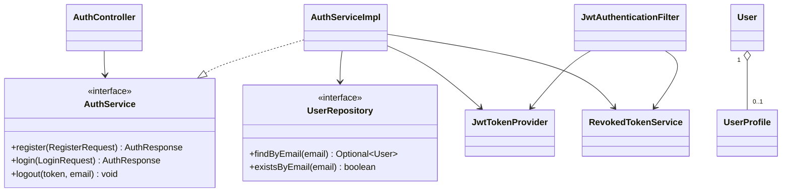

# Design Patterns: Authentication และ User/Profile

ตารางนี้บันทึกเฉพาะ pattern ที่พบ implementation จริงใน feature Auth/User
ไม่ใส่ Strategy, State หรือ Observer เพราะยังไม่พบ class/event ที่ implement pattern
เหล่านั้นในส่วนนี้

## Architectural และ Enterprise Patterns

| Pattern | ปัญหาที่แก้ | Implementation | หลักฐาน |
|---|---|---|---|
| Layered Architecture | แยก HTTP, business logic, persistence และ domain ไม่ให้ผูกกันโดยตรง | `controller/AuthController`, `service/AuthServiceImpl`, `repository/UserRepository`, `domain/entity/User` | `AuthController.java:22-28`, `AuthServiceImpl.java:22-31`, `UserRepository.java:13-25` |
| MVC / REST Controller | แยกการรับคำขอ HTTP และ response status จาก business logic | `AuthController`, `UserController` | `AuthController.java:22-105`, `UserController.java:14-41` |
| Service Layer | รวม use case register/login/logout ไว้ใน service boundary | `AuthService` + `AuthServiceImpl`, `UserService` | `AuthService.java:7-15`, `AuthServiceImpl.java:33-81` |
| Repository | ซ่อนรายละเอียด JPA query และให้ service ใช้ persistence contract | `UserRepository`, `UserProfileRepository`, `RevokedTokenRepository` | `UserRepository.java:13-25`, `UserProfileRepository.java:11-13`, `RevokedTokenRepository.java:9-14` |
| DTO / Mapper | แยก API contract และข้อมูลรับเข้าออกจาก JPA entity | `RegisterRequest`, `LoginRequest`, `AuthResponse`, `UserResponse`, `UserMapper` | `UserMapper.java:18-58`, `AuthResponse.java:15-31` |
| Dependency Injection | ประกอบ dependency จากภายนอกและเปลี่ยน implementation ได้ | Lombok `@RequiredArgsConstructor`, Spring `@Bean` | `AuthServiceImpl.java:22-31`, `SecurityConfig.java:66-80` |

## Security Patterns

| Pattern / แนวทาง | ปัญหาที่แก้ | Implementation | หลักฐาน |
|---|---|---|---|
| JWT Bearer Token | รักษา authentication แบบ stateless ระหว่าง request | `JwtTokenProvider` สร้าง/อ่าน/validate token | `JwtTokenProvider.java:29-72`, `SecurityConfig.java:57-61` |
| Security Filter | ตรวจ bearer token ก่อน request ไปถึง controller | `JwtAuthenticationFilter` อ่าน header, validate, โหลด user และ set SecurityContext | `JwtAuthenticationFilter.java:30-66` |
| Token Revocation / deny-list | รองรับ logout แม้ JWT จะยังไม่หมดอายุ | `RevokedToken`, `RevokedTokenService`, `RevokedTokenRepository` | `AuthServiceImpl.java:68-81`, `RevokedTokenService.java:18-30`, `JwtAuthenticationFilter.java:39-44` |
| Strategy-like Provider delegation | แยก algorithm/password policy ออกจาก auth flow ผ่าน Spring Security provider abstraction | `PasswordEncoder`, `AuthenticationManager`, `DaoAuthenticationProvider` | `AuthServiceImpl.java:26-31`, `SecurityConfig.java:66-80` |

หมายเหตุ: แถวสุดท้ายเป็นการใช้ provider abstraction ของ framework ไม่ควรระบุเป็น GoF
Strategy ในเอกสารกลาง เว้นแต่ทีมมี interface/strategies ของตนเองและมี test รองรับ

## Domain Relationship

