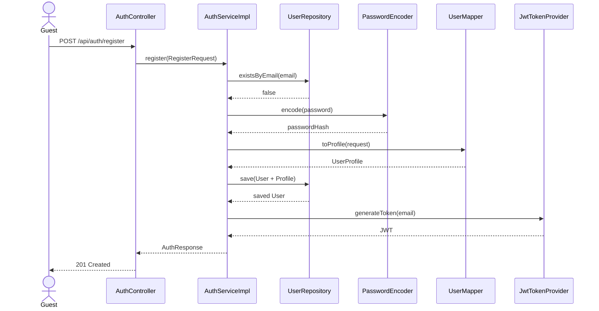
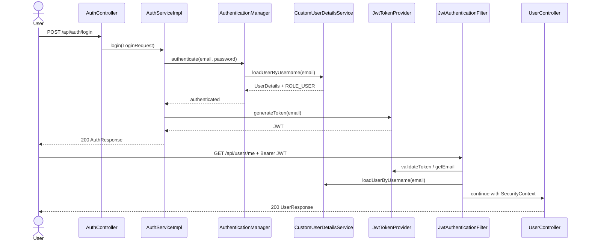

# Use Cases: Authentication และ User/Profile

## Actors

| Actor | บทบาท |
|---|---|
| Guest | สมัครสมาชิกและเข้าสู่ระบบผ่าน endpoint สาธารณะ |
| Authenticated Freelancer | ออกจากระบบและดูข้อมูลตนเอง |
| Admin | ดู user ตาม id ผ่าน endpoint ที่กำหนด role `ADMIN` |
| Spring Security/JWT | ตรวจ token, โหลด user และกำหนด authentication context |

## Use Case Summary

| Use Case | Actor | Endpoint | Preconditions | Postconditions |
|---|---|---|---|---|
| UC-AUTH-01 Register | Guest | `POST /api/auth/register` | ยังไม่มี account ที่ใช้อีเมลเดียวกัน และ request ผ่าน validation | สร้าง `User` + `UserProfile`, hash password และคืน JWT |
| UC-AUTH-02 Login | Guest | `POST /api/auth/login` | มี account และ credentials ถูกต้อง | คืน JWT พร้อม user response |
| UC-AUTH-03 Logout | Authenticated Freelancer | `POST /api/auth/logout` | มี bearer token ที่ valid และ subject ตรงกับผู้ใช้ | บันทึก JTI เป็น revoked และคืน 204 |
| UC-USER-01 View My Profile | Authenticated Freelancer | `GET /api/users/me` | มี authentication ใน SecurityContext | คืนข้อมูล User + Profile ของตนเอง |
| UC-USER-02 View User by ID | Admin | `GET /api/users/{id}` | มี role `ADMIN` | คืนข้อมูล user ที่ร้องขอ หรือ 404 |

## UC-AUTH-01 Register

**Main flow**

1. Guest ส่ง email, password, display name และข้อมูล profile
2. Controller validate `RegisterRequest`
3. Service ตรวจ email ซ้ำผ่าน `UserRepository.existsByEmail`
4. Service hash password ด้วย `PasswordEncoder`
5. Mapper สร้าง `UserProfile` และ link กับ `User`
6. Repository บันทึก user พร้อม profile แบบ cascade
7. Service สร้าง JWT และ map response
8. API คืน `201 Created` พร้อม `AuthResponse`

**Alternative/error flows**

- validation ไม่ผ่าน: `400`
- email ซ้ำ: `409`
- database/ระบบผิดพลาด: `500`

**Acceptance criteria**

- password ที่บันทึกต้องไม่ใช่ plain text
- email ซ้ำต้องถูกปฏิเสธ
- response ต้องไม่เปิดเผย `passwordHash`
- profile ต้องเชื่อมกับ user เดียวกัน

## UC-AUTH-02 Login

**Main flow**

1. Guest ส่ง email/password
2. `AuthenticationManager` ตรวจ credentials ผ่าน `DaoAuthenticationProvider`
3. `CustomUserDetailsService` โหลด user ด้วย email
4. Service โหลด `User` และสร้าง JWT ที่มี subject=email และ JTI
5. API คืน `200 OK` พร้อม token type `Bearer`, expiry และ user response

**Alternative/error flows**

- request ไม่ผ่าน validation: `400`
- email/password ไม่ถูกต้อง: `401`
- token generation/system error: `500`

## UC-AUTH-03 Logout

**Main flow**

1. ผู้ใช้ส่ง `Authorization: Bearer <token>`
2. Filter ตรวจ token และสร้าง authentication context
3. Controller ส่ง token และ authenticated email ให้ service
4. Service ตรวจว่า token subject ตรงกับ authenticated email
5. Service บันทึก JTI, user และ expiration ใน `revoked_tokens`
6. API คืน `204 No Content`

**Alternative/error flows**

- ไม่มี/malformed/expired/revoked token: `401`
- subject ไม่ตรงกับ authenticated user: `400` ตาม handler ปัจจุบัน
- JTI เดิมถูก revoke แล้ว: ไม่บันทึกซ้ำ

## UC-USER-01 View My Profile

1. ผู้ใช้เรียก `GET /api/users/me` พร้อม valid JWT
2. `JwtAuthenticationFilter` ใส่ authenticated principal
3. `UserService` อ่าน email จาก `SecurityContext`
4. Repository โหลด User และ mapper รวมข้อมูล profile
5. API คืน `200 OK` เป็น `UserResponse`

## UC-USER-02 View User by ID

1. Admin เรียก `GET /api/users/{id}` พร้อม valid JWT
2. `@PreAuthorize("hasRole('ADMIN')")` ตรวจ role
3. Service โหลด user ด้วย id และ map response
4. ถ้าไม่พบ user คืน `404`; ถ้าไม่ใช่ admin คืน `403`

## Sequence Diagram: Register

## Sequence Diagram: Login and protected request

## Scope note

การแก้ไข profile (`PATCH /api/users/me`) มีอยู่ใน requirement ระดับ MVP แต่
controller/service ปัจจุบันมีเฉพาะ GET และยังไม่มี request DTO/update use case ใน
ชุดโค้ดที่อ่าน จึงไม่ควรเขียน acceptance ว่าฟีเจอร์นี้เสร็จแล้วจนกว่าจะมี
implementation และ test เพิ่มเติม

