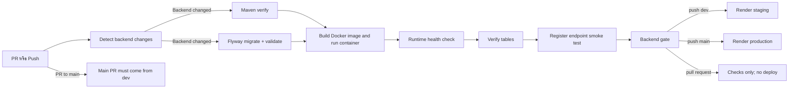
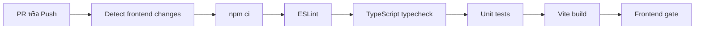

# CI/CD: Auth, User และ Backend Deployment

**ผู้รับผิดชอบ:** เพชรภิญโญ ธนศิรินรากร (`petpinyo_673380073-7_02`)  
**ขอบเขต:** GitHub Actions ของ Backend/Frontend, Docker verification, Flyway validation, Auth smoke test และ Render deployment

## ความสอดคล้องกับเกณฑ์รายวิชา

| เกณฑ์ | Implementation | หลักฐาน |
|---|---|---|
| GitHub Actions | ตรวจ PR และ push ที่เข้า `dev`/`main` | [backend.yml](../../../.github/workflows/backend.yml#L6), [frontend-ci.yml](../../../.github/workflows/frontend-ci.yml#L4) |
| Build และ Test อัตโนมัติ | Backend ใช้ Maven `verify`; Frontend lint, typecheck, unit test และ build | [Backend test job](../../../.github/workflows/backend.yml#L70), [Frontend test job](../../../.github/workflows/frontend-ci.yml#L49) |
| Migration Script | รัน Flyway `migrate` และ `validate` กับ PostgreSQL ว่าง | [backend.yml: migration job](../../../.github/workflows/backend.yml#L96) |
| Dockerfile | build image จริงและเปิด application container | [backend.yml: Docker job](../../../.github/workflows/backend.yml#L146), [Dockerfile](../../../code/Backend/Dockerfile) |
| Database smoke check | ตรวจ 7 ตารางหลักและ migration history | [backend.yml: database check](../../../.github/workflows/backend.yml#L212) |
| Auth smoke test | สมัครผู้ใช้ผ่าน `POST /api/auth/register` และตรวจว่ามี token | [backend.yml: registration smoke test](../../../.github/workflows/backend.yml#L223) |
| Quality gate | รวมผล test, migration และ Docker เป็น status `Backend gate` | [backend.yml: Backend gate](../../../.github/workflows/backend.yml#L241) |
| Staging deployment | push เข้า `dev` และ Backend gate ผ่านจึงเรียก Render staging deploy hook | [backend.yml: staging deploy](../../../.github/workflows/backend.yml#L276) |
| Production deployment | push เข้า `main` และ Backend gate ผ่านจึงเรียก Render production deploy hook | [backend.yml: production deploy](../../../.github/workflows/backend.yml#L291) |
| Branch workflow | มี job แยกตรวจว่า PR เข้า `main` มาจาก `dev`; ไม่ได้เป็น dependency ของ `Backend gate` | [backend.yml: main PR source check](../../../.github/workflows/backend.yml#L54) |
| Secret handling | deploy URL อ่านจาก GitHub Environment secrets ไม่เขียนลง repository | [backend.yml: deploy secrets](../../../.github/workflows/backend.yml#L281) |

## Pipeline

Backend [test](../../../.github/workflows/backend.yml#L70) and [Flyway validation](../../../.github/workflows/backend.yml#L96) are separate jobs and run in parallel after change detection. [Docker](../../../.github/workflows/backend.yml#L146) waits for both. `Main PR must come from dev` is another job; the workflow does not make `Backend gate` depend on it.

Frontend ใช้ pipeline แยกเพื่อลดเวลารันงานที่ไม่เกี่ยวข้อง:

Vercel deployment is handled through its Git integration outside [frontend-ci.yml](../../../.github/workflows/frontend-ci.yml); the workflow has no Vercel deploy job or dependency from `Frontend gate` to a Vercel deployment.

## Environment และความปลอดภัย

- Workflow ใช้ permission แบบ read-only (`contents: read`, `pull-requests: read`)
- `concurrency.cancel-in-progress` ยกเลิก run เก่าของ ref เดียวกัน
- CI ใช้ credential PostgreSQL เฉพาะ runner และ JWT secret สำหรับ smoke test ไม่ใช่ production secret
- Render deploy hooks เก็บใน `staging` และ `production` GitHub Environments
- Pull request ทำเฉพาะ checks; deploy เกิดจาก push เข้า branch ที่กำหนดและ gate ต้องสำเร็จ

## Deployment Configuration

- Render staging และ production รับ deploy hook จาก GitHub Actions หลัง `Backend gate` ผ่าน โดยอ่าน hook URL จาก secrets ใน GitHub Environments ชื่อ `staging` และ `production`
- Backend environment ใช้ datasource credentials, `JWT_SECRET`, `CORS_ALLOWED_ORIGINS` และ `REFRESH_COOKIE_SECURE=true` ตาม environment
- Frontend deploy ผ่าน Vercel Git integration โดยกำหนด `BACKEND_ORIGIN` และ `VITE_API_BASE_URL` ให้ตรงกับ environment
- Workflow เรียก deploy hook สำหรับ Backend; Frontend deployment ถูกจัดการโดย Vercel
