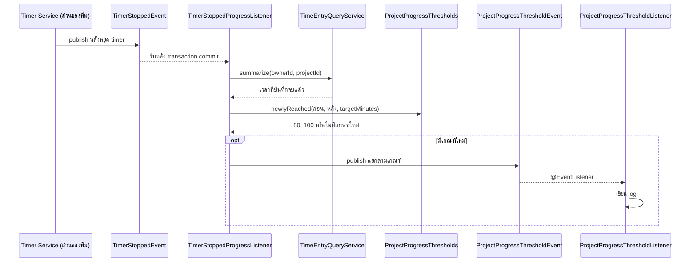

# Design Patterns: Project และ Task Management

**เจ้าของ feature:** `kantavit_673380027-4_01`  
**ขอบเขต:** กฎสถานะ Project และการตอบสนองต่อ event เมื่อเวลา Project ถึงเกณฑ์
**หลักฐานโค้ด:** `code/Backend/src/main/java/th/ac/kku/freelance_hub/`

| Pattern | หน้าที่ | คลาสหลัก |
|---|---|---|
| State (GoF) | ให้สถานะปัจจุบันตัดสินว่า Project เปลี่ยนสถานะ เริ่มจับเวลา หรือแก้ Task ได้หรือไม่ | `domain/state/ProjectState.java`, `PlannedState.java`, `ActiveState.java`, `OnHoldState.java`, `CompletedState.java`, `ArchivedState.java`, `ProjectStates.java`, `domain/entity/Project.java` |
| Observer ผ่าน Spring events (GoF) | หลัง timer หยุด ตรวจเกณฑ์เวลาและกระจายเหตุการณ์ไปยังผู้รับโดยไม่ผูกกับ controller หรือหน้าบ้าน | `event/TimerStoppedProgressListener.java`, `ProjectProgressThresholdEvent.java`, `ProjectProgressThresholdListener.java`, `domain/progress/ProjectProgressThresholds.java` |

## State: กฎสถานะ Project

`Project` ยังเก็บ `ProjectStatus` เป็น enum ในฐานข้อมูล เมื่อเรียก `changeStatus()`, `canTrackTime()` หรือ `canEditTasks()` จะใช้ `ProjectStates.from(status)` เลือก State object ที่มีกฎของสถานะนั้น จึงไม่ต้องรวมเงื่อนไขทุกสถานะไว้ในเมธอดเดียว (`domain/entity/Project.java:185-219`, `domain/state/ProjectStates.java:13-24`)

| สถานะปัจจุบัน | เปลี่ยนไปได้ | เริ่ม timer ได้ | แก้ Task ได้ |
|---|---|---|---|
| `PLANNED` | `ACTIVE`, `ARCHIVED` | ไม่ได้ | ได้ |
| `ACTIVE` | `ON_HOLD`, `COMPLETED`, `ARCHIVED` | ได้ | ได้ |
| `ON_HOLD` | `ACTIVE`, `ARCHIVED` | ไม่ได้ | ได้ |
| `COMPLETED` | `ARCHIVED` | ไม่ได้ | ไม่ได้ |
| `ARCHIVED` | `ACTIVE`, `PLANNED` เมื่อ Client ยังใช้งานและไม่ถูก soft delete | ไม่ได้ | ไม่ได้ |

State ทุกตัวอนุญาตสถานะเดิมซ้ำ แต่ Service จะปฏิเสธ request หาก timer ของ Project กำลังทำงาน การเปลี่ยนเป็น `ARCHIVED` ผ่าน `PATCH /api/projects/{id}/status` ตั้ง `isActive=false` แต่ **ไม่** ตั้ง `deletedAt`; เปลี่ยนกลับเป็น `ACTIVE` หรือ `PLANNED` จะตั้ง `isActive=true` เฉพาะเมื่อ Client มี `isActive=true` และ `deletedAt=null` เท่านั้น `PUT /api/projects/{id}` ปฏิเสธการแก้รายละเอียดของ Project ที่ `ARCHIVED`; ส่วน `DELETE /api/projects/{id}` เรียก `Project.archive()` และตั้ง `deletedAt` จึงเป็น soft delete (`domain/entity/Project.java:185-218`, `service/impl/ProjectServiceImpl.java:328-350`)

`TaskServiceImpl` ตรวจ `project.canEditTasks()` ก่อนสร้าง แก้ เปลี่ยนสถานะ ย้าย และลบ Task; ฝั่ง Time Entry ตรวจ `project.canTrackTime()` ก่อนเริ่ม timer ขณะที่ `TaskStatus` (`OPEN`, `IN_PROGRESS`, `COMPLETED`) เป็น enum และกฎใน `Task.changeStatus()` ไม่ใช่ State pattern อีกชุด Task ที่ `COMPLETED` ย้อนเป็น `IN_PROGRESS` ได้โดยล้าง `completedAt` แต่ย้อนเป็น `OPEN` ไม่ได้ และถ้า Project เป็น `ARCHIVED` จะย้อน Task ไม่ได้ (`service/impl/TaskServiceImpl.java:178-197,297-311`, `domain/entity/Task.java:179-199`)

**ขอบเขตการขยาย:** เปลี่ยนกฎของสถานะเดิมได้ใน State ของสถานะนั้น แต่เพิ่มสถานะใหม่ยังต้องแก้ `ProjectStatus` enum และ `ProjectStates.from()` ไม่มี State object ที่เก็บลงฐานข้อมูล (`domain/state/ProjectStates.java:13-24`)

## Observer: เกณฑ์เวลา 80% และ 100%

การหยุด timer ฝั่ง Time Tracking เผยแพร่ `TimerStoppedEvent` ซึ่งเป็น input จาก feature ของทีม ส่วนที่รับผิดชอบใน Project คือ listener สำหรับคำนวณเกณฑ์, event ความคืบหน้า และ listener ที่รับ event นั้น

`TimerStoppedProgressListener` ใช้ `@TransactionalEventListener(AFTER_COMMIT)` และ query ใหม่แบบ read-only หลัง timer ถูกบันทึกแล้ว ถ้า Project ไม่มี `targetMinutes` จะไม่ส่ง threshold event; `ProjectProgressThresholds.newlyReached()` คืนเฉพาะเกณฑ์ที่ข้ามใหม่ จึงไม่ส่งซ้ำทุกครั้งที่หยุด timer (`event/TimerStoppedProgressListener.java:34-70`, `domain/progress/ProjectProgressThresholds.java:40-53`)

ผลลัพธ์ที่มีจริงตอนนี้คือ `ProjectProgressThresholdListener` เขียน log เมื่อได้ event (`event/ProjectProgressThresholdListener.java:14-22`) **ยังไม่มีระบบแจ้งเตือนผู้ใช้หรือเก็บ notification** ดังนั้นไม่ควรอ้างว่า FR-PRJ-07 ครบด้าน UI การมี `ProjectProgressThresholds` เป็นตัวช่วยคำนวณ ไม่ใช่ GoF Strategy

## หลักฐานทดสอบ

- `domain/entity/ProjectStateTest.java` ทดสอบ transition, การย้อน `ARCHIVED → ACTIVE/PLANNED` เฉพาะเมื่อ Client ยังใช้งาน และสิทธิ์ timer/Task; `service/ProjectServiceImplTest.java` ทดสอบการห้ามแก้ Project ที่จัดเก็บและการห้ามคืนสถานะเมื่อ Client ถูกจัดเก็บ
- `service/TaskServiceImplTest.java` ทดสอบ `COMPLETED → IN_PROGRESS → COMPLETED`, การล้าง `completedAt` และการห้ามย้อน Task เมื่อ Project เป็น `ARCHIVED`
- `domain/progress/ProjectProgressThresholdsTest.java` ทดสอบขอบ 80%/100%, ไม่มีเป้าหมาย และการไม่ส่งเกณฑ์ที่ผ่านไปแล้วซ้ำ
- `event/TimerStoppedProgressListenerTest.java` และ `event/ProjectProgressThresholdListenerTest.java` ทดสอบการเผยแพร่ event และการรับเพื่อเขียน log

ไฟล์ทดสอบข้างต้นอยู่ใต้ `code/Backend/src/test/java/th/ac/kku/freelance_hub/` การมีไฟล์ทดสอบไม่ได้ยืนยันผลการรันรอบล่าสุด
