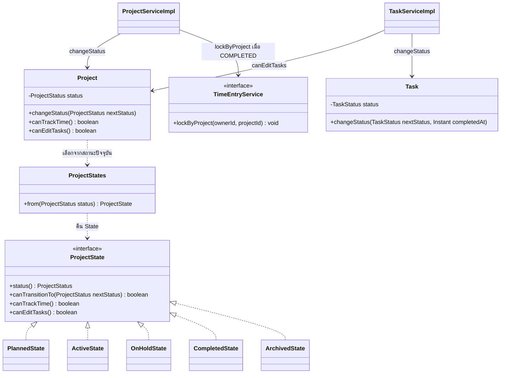
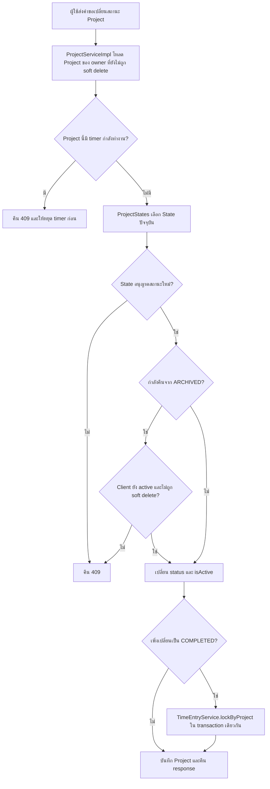
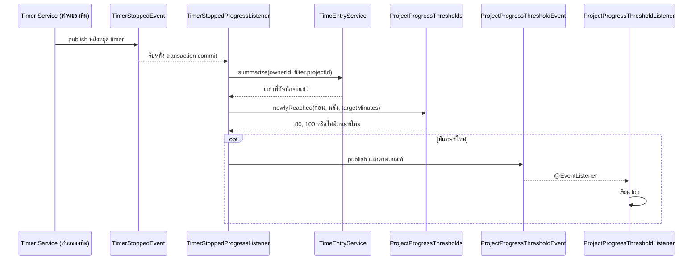

# Design Patterns: Project และ Task Management

**เจ้าของ feature:** `kantavit_673380027-4_01`  
**ขอบเขต:** กฎสถานะ Project การจัดการ Task และการตอบสนองต่อ event เมื่อเวลา Project ถึงเกณฑ์

เอกสารนี้อธิบายรูปแบบที่ใช้จริงในโค้ดปัจจุบันภายใต้ `code/Backend/src/main/java/th/ac/kku/freelance_hub/` โดยแยก GoF pattern ออกจากรูปแบบสถาปัตยกรรมและกลไกของ Spring/JPA

| Pattern / รูปแบบ | ปัญหาที่แก้ | ไฟล์/คลาสที่ใช้ |
|---|---|---|
| State (GoF) | ให้สถานะปัจจุบันกำหนดว่า Project เปลี่ยนสถานะ เริ่มจับเวลา หรือแก้ Task ได้หรือไม่ | `domain/state/ProjectState.java`, `PlannedState.java`, `ActiveState.java`, `OnHoldState.java`, `CompletedState.java`, `ArchivedState.java`, `ProjectStates.java`, `domain/entity/Project.java` |
| Observer (GoF ในรูปแบบ Spring Application Event) | ให้การหยุด timer ส่งเหตุการณ์ไปตรวจเกณฑ์เวลา 80%/100% โดยไม่ผูก Timer Service กับการคำนวณความคืบหน้าของ Project | `event/TimerStoppedEvent.java`, `TimerStoppedProgressListener.java`, `ProjectProgressThresholdEvent.java`, `ProjectProgressThresholdListener.java` |
| Service Layer | รวมการตรวจ owner, timer ที่ยังทำงาน และการล็อก Time Entry เมื่อ Project เสร็จใน use case เดียว | `service/ProjectService.java`, `service/impl/ProjectServiceImpl.java`, `service/TaskService.java`, `service/impl/TaskServiceImpl.java` |
| Repository | แยกการอ่านและบันทึก Project/Task ออกจาก service | `repository/ProjectRepository.java`, `repository/TaskRepository.java` |
| DTO + Mapper | กำหนดข้อมูล request/response โดยไม่ส่ง JPA entity ออก API ตรง ๆ | `dto/request/project/`, `dto/request/task/`, `dto/response/project/`, `dto/response/task/`, `mapper/ProjectMapper.java`, `mapper/TaskMapper.java` |

## Class Diagram: Project และ Task Management

`Project` ยังเก็บ `ProjectStatus` เป็น enum ในฐานข้อมูล เมื่อเรียก `changeStatus()`, `canTrackTime()` หรือ `canEditTasks()` จะใช้ `ProjectStates.from(status)` เลือก State object ที่มีกฎของสถานะนั้น จึงไม่ต้องรวมเงื่อนไขทุกสถานะไว้ในเมธอดเดียว (`domain/entity/Project.java:185-226`, `domain/state/ProjectStates.java:13-24`)

## Activity: เปลี่ยนสถานะ Project

## ขอบเขตของ pattern

| สถานะปัจจุบัน | เปลี่ยนไปได้ | เริ่ม timer ได้ | แก้ Task ได้ |
|---|---|---|---|
| `PLANNED` | `ACTIVE`, `ARCHIVED` | ไม่ได้ | ได้ |
| `ACTIVE` | `ON_HOLD`, `COMPLETED`, `ARCHIVED` | ได้ | ได้ |
| `ON_HOLD` | `ACTIVE`, `ARCHIVED` | ไม่ได้ | ได้ |
| `COMPLETED` | `ARCHIVED` | ไม่ได้ | ไม่ได้ |
| `ARCHIVED` | `ACTIVE`, `PLANNED` เมื่อ Client ยังใช้งาน และ Project/Client ยังไม่ถูก soft delete | ไม่ได้ | ไม่ได้ |

State ทุกตัวอนุญาตสถานะเดิมซ้ำ แต่ `ProjectServiceImpl.changeStatus()` และ `archive()` ปฏิเสธคำขอหาก timer ของ Project นั้นกำลังทำงาน การเปลี่ยนเป็น `ARCHIVED` ผ่าน `PATCH /api/projects/{id}/status` ตั้ง `isActive=false` แต่ **ไม่** ตั้ง `deletedAt`; เปลี่ยนกลับเป็น `ACTIVE` หรือ `PLANNED` จะตั้ง `isActive=true` เฉพาะเมื่อ Client มี `isActive=true` และ `deletedAt=null` เท่านั้น `PUT /api/projects/{id}` ปฏิเสธการแก้รายละเอียดของ Project ที่ `ARCHIVED`; ส่วน `DELETE /api/projects/{id}` เรียก `Project.archive()` และตั้ง `deletedAt` จึงเป็น soft delete ทำให้ค้น Project นี้ผ่าน API เพื่อคืนสถานะไม่ได้ (`domain/entity/Project.java:185-219`, `service/impl/ProjectServiceImpl.java:328-381`, `repository/ProjectRepository.java:30-39`)

เมื่อเปลี่ยน Client เป็น inactive, `ClientServiceImpl.changeStatus()` จะเรียก `Project.changeStatus(ARCHIVED)` กับ Project ของ Client ที่ยังไม่ถูก soft delete ภายใน transaction เดียวกัน เส้นทางนี้ไม่ได้เรียก `ProjectServiceImpl.requireNoRunningTimer()` จึงไม่อยู่ภายใต้เงื่อนไขห้ามเปลี่ยนสถานะขณะ timer วิ่งของ Project API; ส่วน `ClientServiceImpl.softDelete()` ตั้ง `deletedAt` ของ Client โดยไม่เปลี่ยนสถานะ Project (`service/impl/ClientServiceImpl.java:185-202`)

`TaskServiceImpl` ตรวจ `project.canEditTasks()` ก่อนสร้าง แก้ เปลี่ยนสถานะ ย้าย และลบ Task; ฝั่ง Time Entry ตรวจ `project.canTrackTime()` ก่อนเริ่ม timer ขณะที่ `TaskStatus` (`OPEN`, `IN_PROGRESS`, `COMPLETED`) เป็น enum และกฎใน `Task.changeStatus()` ไม่ใช่ State pattern อีกชุด Task ที่ `COMPLETED` ย้อนเป็น `IN_PROGRESS` ได้โดยล้าง `completedAt` แต่ย้อนเป็น `OPEN` ไม่ได้ และถ้า Project เป็น `ARCHIVED` จะย้อน Task ไม่ได้ (`service/impl/TaskServiceImpl.java:178-197,297-311`, `domain/entity/Task.java:179-199`)

เมื่อ Project เพิ่งเปลี่ยนเข้าสู่ `COMPLETED`, `ProjectServiceImpl.changeStatus()` เรียก `TimeEntryService.lockByProject()` หลัง State ตรวจ transition และก่อนบันทึก Project ภายใน transaction เดียวกัน รายการเวลาที่ถูกล็อกจะแก้หรือลบไม่ได้; การส่ง `COMPLETED` ซ้ำไม่ล็อกซ้ำ การประสานงานนี้อยู่ใน Service ไม่ใช่ใน `CompletedState` (`service/impl/ProjectServiceImpl.java:355-375`, `service/TimeEntryService.java:39-52`)

- การเปลี่ยนกฎของสถานะเดิมแก้ได้ใน State ของสถานะนั้น แต่การเพิ่มสถานะใหม่ยังต้องเพิ่มค่าใน `ProjectStatus` enum และเพิ่มการเลือกใน `ProjectStates.from()`; ฐานข้อมูลเก็บ enum ไม่ได้เก็บ State object (`domain/state/ProjectStates.java:13-24`)
- `TaskStatus` และกฎใน `Task.changeStatus()` ไม่ใช่ State pattern อีกชุด ส่วน `ProjectProgressThresholds` เป็นตัวช่วยคำนวณ ไม่ใช่ GoF Strategy
- `@TransactionalEventListener(AFTER_COMMIT)` และ `@EventListener` เป็นกลไก Spring ที่ใช้ทำ Observer; ตัว listener ปลายทางปัจจุบันเขียน log ยังไม่มี notification หรือ UI แจ้งเตือนผู้ใช้

## Activity: ตรวจเกณฑ์เวลา 80% และ 100% หลังหยุด timer

การหยุด timer ฝั่ง Time Tracking เผยแพร่ `TimerStoppedEvent` ซึ่งเป็น input จาก feature ของทีม ส่วนที่รับผิดชอบใน Project คือ listener สำหรับคำนวณเกณฑ์, event ความคืบหน้า และ listener ที่รับ event นั้น

`TimerStoppedProgressListener` ใช้ `@TransactionalEventListener(AFTER_COMMIT)` และ query ใหม่แบบ read-only หลัง timer ถูกบันทึกแล้ว ถ้า Project ไม่มี `targetMinutes` จะไม่ส่ง threshold event; `ProjectProgressThresholds.newlyReached()` คืนเฉพาะเกณฑ์ที่ข้ามใหม่ จึงไม่ส่งซ้ำทุกครั้งที่หยุด timer (`event/TimerStoppedProgressListener.java:34-70`, `domain/progress/ProjectProgressThresholds.java:40-53`)

ผลลัพธ์ที่มีจริงตอนนี้คือ `ProjectProgressThresholdListener` เขียน log เมื่อได้ event (`event/ProjectProgressThresholdListener.java:14-22`) จึงยังไม่ครอบคลุมการแจ้งเตือนบน UI ตาม FR-PRJ-07

**หลักฐานการทดสอบ:** `ProjectStateTest` และ `ProjectServiceImplTest` ตรวจ transition, สิทธิ์ timer/Task, การคืนสถานะจาก `ARCHIVED` และการล็อก Time Entry เมื่อเข้า `COMPLETED`; `TaskServiceImplTest` ตรวจ `COMPLETED → IN_PROGRESS → COMPLETED` และการห้ามย้อน Task ของ Project ที่จัดเก็บ; `ProjectProgressThresholdsTest`, `TimerStoppedProgressListenerTest` และ `ProjectProgressThresholdListenerTest` ตรวจเกณฑ์ 80%/100%, กรณีไม่มีเป้าหมาย การเผยแพร่ event และการรับเพื่อเขียน log ภายใต้ `code/Backend/src/test/java/th/ac/kku/freelance_hub/`
