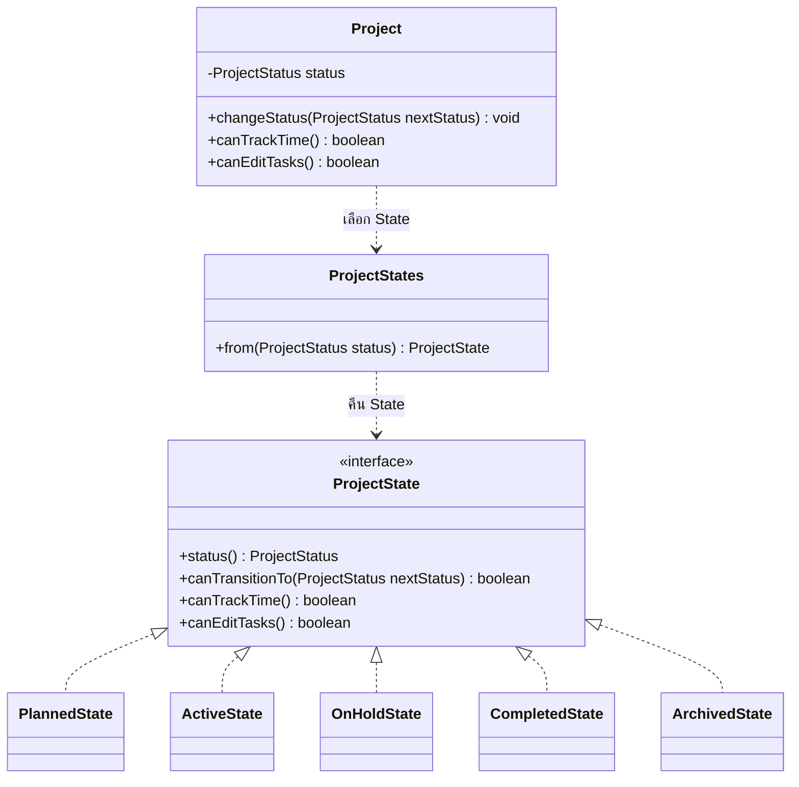

# Design Patterns: Project และ Task Management

**เจ้าของ feature:** `kantavit_673380027-4_01`  
**ขอบเขต:** GoF State สำหรับสถานะ Project และกฎที่เกี่ยวกับการจับเวลาและการแก้ Task

เอกสารนี้บันทึก pattern ที่ใช้จริงในโค้ดปัจจุบัน โดยอ้างอิงไฟล์ภายใต้ `code/Backend/src/main/java/th/ac/kku/freelance_hub/`

| Pattern / รูปแบบ | ปัญหาที่แก้ | ไฟล์/คลาสที่ใช้ |
|---|---|---|
| State (GoF) | แยกกฎการเปลี่ยนสถานะ การเริ่มจับเวลา และการแก้ Task ตามสถานะของ Project ออกจากการตรวจเงื่อนไขใน `Project` | `domain/state/ProjectState.java:5-14`, `domain/state/PlannedState.java`, `domain/state/ActiveState.java`, `domain/state/OnHoldState.java`, `domain/state/CompletedState.java`, `domain/state/ArchivedState.java`, `domain/entity/Project.java:171-196` |
| State factory | แปลง `ProjectStatus` ที่เก็บในฐานข้อมูลเป็น State object ที่มีกฎของสถานะนั้น | `domain/state/ProjectStates.java:8-24`, `domain/entity/Project.java:173,192,196` |

## Class Diagram: Project State

## กฎของแต่ละ State

| สถานะปัจจุบัน | เปลี่ยนไปสถานะอื่นได้ | เริ่มจับเวลาได้ | แก้ Task ได้ |
|---|---|---|---|
| `PLANNED` | `ACTIVE`, `ARCHIVED` | ไม่ได้ | ได้ |
| `ACTIVE` | `ON_HOLD`, `COMPLETED`, `ARCHIVED` | ได้ | ได้ |
| `ON_HOLD` | `ACTIVE`, `ARCHIVED` | ไม่ได้ | ได้ |
| `COMPLETED` | `ARCHIVED` | ไม่ได้ | ไม่ได้ |
| `ARCHIVED` | ไม่มี | ไม่ได้ | ไม่ได้ |

ทุก State ยอมรับการส่งสถานะเดิมซ้ำ เช่น `ACTIVE → ACTIVE` โดยไม่เปลี่ยนกฎอื่น

## การนำไปใช้

1. `Project.changeStatus()` เรียก `ProjectStates.from(status)` เพื่อเลือก State ปัจจุบัน แล้วให้ `canTransitionTo(nextStatus)` ตรวจคำขอ หากไม่ผ่านจะโยน `IllegalStateException`; หากผ่านจึงบันทึกค่า enum ใหม่: `domain/entity/Project.java:171-183`
2. `Project.canTrackTime()` และ `Project.canEditTasks()` ส่งคำถามไปยัง State ปัจจุบัน: `domain/entity/Project.java:191-196`
3. การเริ่ม Time Entry ตรวจ `project.canTrackTime()` และการสร้าง/แก้/ย้าย/ลบ Task ตรวจ `project.canEditTasks()`: `domain/entity/TimeEntry.java:262-269`, `service/impl/TaskServiceImpl.java:226-241`
4. Entity ยังเก็บ `ProjectStatus` enum ในฐานข้อมูลด้วย `@Enumerated(EnumType.STRING)`; State object ใช้ตัดสินกฎระหว่างทำงาน ไม่ได้เป็นข้อมูลที่บันทึกเพิ่ม: `domain/entity/Project.java:95-96`

มี `ProjectStateTest` ทดสอบลำดับสถานะ สิทธิ์เริ่มจับเวลา สิทธิ์แก้ Task การเปลี่ยนสถานะที่ห้าม และการส่งสถานะเดิมซ้ำ: `code/Backend/src/test/java/th/ac/kku/freelance_hub/domain/entity/ProjectStateTest.java:14-64`

## ขอบเขตของ pattern

- การเพิ่มกฎให้สถานะที่มีอยู่แก้ใน State ของสถานะนั้น แต่การเพิ่ม **สถานะใหม่** ยังต้องแก้ `ProjectStatus` enum และ `ProjectStates.from()` ด้วย
- API และโครงสร้างฐานข้อมูลยังใช้สถานะเดิม เอกสารนี้ไม่ได้อ้างว่ามีการเพิ่ม endpoint หรือ migration เพื่อใช้ State pattern
- Observer สำหรับ event ความคืบหน้าเป็นงานอีกส่วนหนึ่ง จึงยังไม่รวมเป็น pattern ที่เสร็จแล้วในเอกสารนี้
