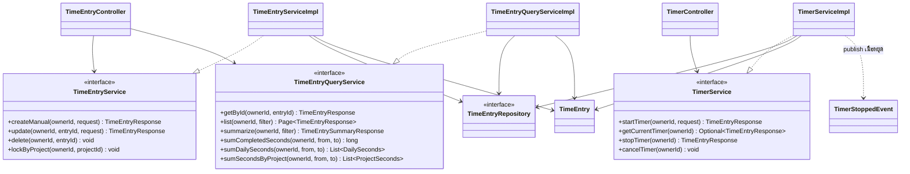
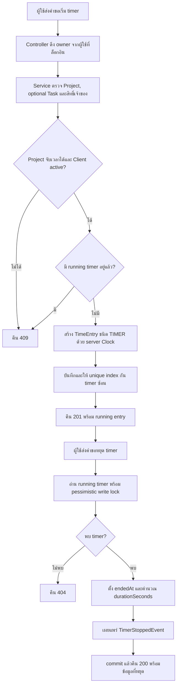

# Design Patterns: Time Tracking

**เจ้าของ feature:** `kompat_673380262-4_02`  
**ขอบเขต:** Timer, Manual Time Entry, การล็อก Time Entry ตาม Project, Time Entry Query และ `TimerStoppedEvent`

เอกสารนี้อธิบายรูปแบบที่ใช้จริงในโค้ดปัจจุบันภายใต้ `code/Backend/src/main/java/th/ac/kku/freelance_hub/` โดยแยก GoF pattern ออกจากรูปแบบสถาปัตยกรรมและกลไกของ Spring/JPA

| Pattern / รูปแบบ | ปัญหาที่แก้ | ไฟล์/คลาสที่ใช้ |
|---|---|---|
| Observer (GoF ในรูปแบบ Spring Application Event) | ให้การหยุด timer แจ้งส่วนอื่นได้โดย `TimerServiceImpl` ไม่ต้องเรียก service คำนวณความคืบหน้าหรือ notification โดยตรง | `service/impl/TimerServiceImpl.java`, `event/TimerStoppedEvent.java` |
| Service Layer และ Interface Segregation | แยกวงจรชีวิต timer, คำสั่งสร้าง/แก้/ลบ/ล็อก Time Entry และงานอ่าน/รวมเวลาออกจากกัน; การล็อกอยู่ใน command service เดิม | `service/TimerService.java`, `service/TimeEntryService.java`, `service/TimeEntryQueryService.java` และ implementation ทั้งสาม |
| Repository และ Specification | แยก data access ออกจาก service และประกอบตัวกรองรายการตาม owner, Project, Task และช่วงเวลา | `repository/TimeEntryRepository.java`, `service/impl/TimeEntryQueryServiceImpl.java` |
| DTO + Mapper | ไม่ส่ง JPA entity ออก API โดยตรง และแยกข้อมูล request/response จาก domain | `dto/request/StartTimerRequest.java`, `dto/request/ManualTimeEntryRequest.java`, `dto/request/UpdateTimeEntryRequest.java`, `dto/response/TimeEntryResponse.java`, `mapper/TimeEntryMapper.java` |
| Dependency Injection ของเวลา | ใช้เวลาจริงใน production และกำหนดเวลาคงที่ใน test ได้โดยไม่เปลี่ยน business logic | `config/TimeConfiguration.java`, `service/impl/TimerServiceImpl.java`, `service/impl/TimeEntryServiceImpl.java` |
| Concurrency control | ป้องกัน timer ซ้อน การหยุด/ยกเลิกพร้อมกัน และล็อกแถว Time Entry ระหว่างตั้ง `lockedAt` ตาม Project | `repository/TimeEntryRepository.java`, `service/impl/TimerServiceImpl.java`, `service/impl/TimeEntryServiceImpl.java`, `db/migration/V6__create_time_entries_table.sql` |

## Class Diagram: Time Tracking

## Activity: เริ่มและหยุด timer

## ขอบเขตของ pattern

- `TimerStoppedEvent` คือ event ที่ Time Tracking เผยแพร่เมื่อหยุด timer สำเร็จ ปัจจุบัน `TimerStoppedProgressListener` ของงาน Project Progress รับ event หลัง transaction commit แล้ว; การคำนวณเกณฑ์ 80%/100% และ `ProjectProgressThresholdEvent` ไม่ใช่หน้าที่ของ `TimerServiceImpl`
- `TimeEntry.startTimer()`, `createManual()` และ `createManualWithDurationSeconds()` เป็น static factory methods เพื่อสร้าง entity ตามกฎของแต่ละชนิด แต่ไม่ใช่ GoF Factory Method ที่ใช้ creator hierarchy และการ override
- `Specification` เป็น API ของ Spring Data JPA สำหรับประกอบ query ไม่ใช่ GoF Strategy ที่ทีมสร้างหลาย implementation
- `@Lock(PESSIMISTIC_WRITE)` และ unique index ของ running timer เป็นกลไก concurrency ไม่ใช่ GoF pattern; การตรวจว่ามี timer อยู่แล้วก่อนบันทึกช่วยคืน error ที่เข้าใจง่าย แต่ unique index ปิดช่องแข่งกันของคำขอพร้อมกัน
- เอกสารนี้ไม่อ้างว่ามี API สำหรับสั่ง lock Time Entry หรือส่ง notification ถึงผู้ใช้; การลบ completed entry เป็น soft delete ส่วนการยกเลิก running timer ลบรายการนั้นจริง
- `TimeEntryService.lockByProject(ownerId, projectId)` เป็นคำสั่งภายใน Backend ที่ต้องเรียกใน transaction ของการเปลี่ยนสถานะ Project (`Propagation.MANDATORY`) ผู้เรียกตรวจ owner และการเปลี่ยนเป็น `COMPLETED`; ปัจจุบัน `ProjectServiceImpl` ยังไม่มีจุดเรียก จึงยังไม่เกิดการล็อกอัตโนมัติจากการเปลี่ยนสถานะ
- คำสั่งล็อกอ่านรายการที่ `lockedAt IS NULL` รวม soft-deleted ด้วย derived query และ `PESSIMISTIC_WRITE` ตรวจว่าไม่มี running timer แล้วตั้ง `lockedAt` ผ่าน `TimeEntry.lock()` ด้วยเวลาเดียวกันจาก `Clock`; รายการที่ล็อกแล้วรักษาเวลาเดิมและไม่มีคำสั่ง unlock
- การล็อกแถวฐานข้อมูลปลดเมื่อ transaction จบ ส่วน `lockedAt` เป็นค่าถาวรสำหรับห้ามแก้ไข/ลบ; row lock ไม่ป้องกันการสร้างหรือย้ายรายการใหม่เข้า Project ผู้รับผิดชอบการเชื่อมต่อจึงต้องจัดการกรณีนี้เพิ่มเติม

**หลักฐานการทดสอบ:** `TimerServiceImplTest`, `TimeEntryServiceImplTest`, `TimeEntryQueryServiceImplTest`, `TimeEntryRepositoryTest` และ `TimeEntryIntegrationTest` ภายใต้ `code/Backend/src/test/java/th/ac/kku/freelance_hub/`
