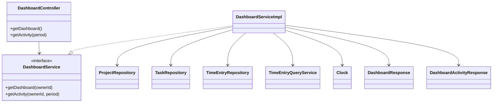
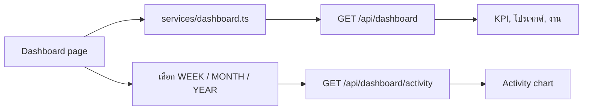

# Design Patterns: Dashboard, Shared UI และ Time Tracking

**ผู้รับผิดชอบ:** Nattadol Sarika  
**Feature branch:** `nattadol_673380511-9_02`

เอกสารนี้อธิบายแนวทางออกแบบของงาน Dashboard, การใช้ shared UI ด้วย shadcn/ui, ตัวจับเวลาแบบทำงานข้ามหน้า และการตรวจสอบข้อมูลในหน้าโปรไฟล์

## ขอบเขตงาน

- API และการรวมข้อมูลสำหรับ Dashboard
- กราฟกิจกรรมรายสัปดาห์ รายเดือน และรายปี
- Shared UI: `Dialog`, `Sonner`, `Input`, `NativeSelect` และ `Table` ที่มี pagination
- สถานะ timer กลางของแอปพลิเคชัน
- การตรวจสอบข้อมูลฟอร์มโปรไฟล์

## 1. Dashboard: MVC, Service Layer และ Aggregation

Dashboard ต้องแสดง KPI, กราฟชั่วโมงทำงาน, โปรเจกต์ที่กำลังทำ และงานที่ยังไม่เสร็จในหน้าเดียว หากหน้าเว็บเรียก API แยกทุกส่วน จะมี request จำนวนมากและทำให้ข้อมูลในหน้าอาจมาจากเวลาคนละช่วงกัน

จึงมี API สำหรับรวมข้อมูล Dashboard โดยให้ controller รับผิดชอบ HTTP, service รับผิดชอบกติกาและการคำนวณ, repository/query service รับผิดชอบอ่านข้อมูลจากฐานข้อมูล และ DTO รับผิดชอบรูปแบบ response

| ส่วน | หน้าที่ | แนวคิดที่ใช้ |
| --- | --- | --- |
| `DashboardController` | รับ request และคืน response ตามมาตรฐาน API | MVC Controller |
| `DashboardService` | กำหนด contract ของการสร้างข้อมูล Dashboard | Service Layer interface |
| `DashboardServiceImpl` | รวมข้อมูลจากหลายแหล่งและคำนวณ KPI | Aggregation / Facade ระดับ service |
| `ProjectRepository`, `TaskRepository`, `TimeEntryRepository` | อ่านข้อมูล domain ตามหน้าที่ | Repository pattern |
| `TimeEntryQueryService` | อ่านผลรวมเวลาที่เหมาะกับการทำรายงาน | Query service |
| Dashboard response DTO | ส่งข้อมูลที่ UI ต้องใช้โดยไม่เปิดเผย entity | DTO pattern |



### API ที่เพิ่ม

| Method | Endpoint | หน้าที่ |
| --- | --- | --- |
| `GET` | `/api/dashboard` | คืน KPI, ชั่วโมงทำงานรายวัน, โปรเจกต์ที่กำลังทำ และงานที่ยังเปิดอยู่ |
| `GET` | `/api/dashboard/activity?period=WEEK|MONTH|YEAR` | คืนข้อมูลกราฟตามช่วงเวลาที่เลือก |

Service ใช้ `Clock` และโซนเวลา `Asia/Bangkok` เพื่อกำหนดวันและช่วงเวลาเดียวกันทั้งระบบ และทำให้ทดสอบวันที่ได้โดยไม่ต้องพึ่งเวลาจริงของเครื่อง

### การคำนวณข้อมูล

- ชั่วโมงที่บันทึก: รวม `durationSeconds` ของ time entry ในช่วงที่เลือก
- เปอร์เซ็นต์เทียบช่วงก่อน: เปรียบเทียบผลรวมของช่วงปัจจุบันกับช่วงก่อนหน้า
- ความคืบหน้าโปรเจกต์: `completedTasks / totalTasks * 100`
- งานที่ยังเปิด: เลือกเฉพาะ task ที่สถานะไม่ใช่ `DONE`
- กราฟรายสัปดาห์: รวมเวลาเป็นรายวัน
- กราฟรายเดือนและรายปี: รวมข้อมูลตามหน่วยเวลาที่เหมาะกับช่วงที่เลือก

ข้อมูลเวลายังคงส่งและเก็บเป็นวินาที (`trackedSeconds`) จนถึงชั้นแสดงผล เพื่อไม่ให้เวลาที่น้อยกว่าหนึ่งชั่วโมงถูกปัดเป็นศูนย์ก่อนนำไปสร้างกราฟ

## 2. Dashboard UI และการแสดงกราฟ

หน้า `Analytics/pages/Dashboard` เรียก service ฝั่ง frontend เพียงชุดข้อมูล Dashboard สำหรับส่วนสรุปหลัก และเรียก activity endpoint ใหม่เมื่อผู้ใช้เปลี่ยนช่วงกราฟเป็นสัปดาห์ เดือน หรือปี



Utility สำหรับกราฟแยกออกจาก component เพื่อให้การจัด label, ค่าแกน และการแสดงเวลาเป็น logic ที่ทดสอบได้โดยไม่ผูกกับ UI library โดยตรง

## 3. Shared UI ด้วย Component Composition

ส่วน UI ที่ใช้ซ้ำถูกย้ายมาอยู่ใน `src/components/ui` เพื่อให้ทุกหน้าใช้รูปแบบเดียวกันและลด CSS/markup ซ้ำกัน โดยใช้ shadcn/ui ที่มีอยู่ในโครงการ

| Component | การนำไปใช้ |
| --- | --- |
| `Dialog` | แทน modal ที่เขียนเอง สำหรับฟอร์มและหน้าต่างยืนยัน |
| `Sonner` | แสดงผลสำเร็จหรือผิดพลาดจาก action/API ในจุดเดียว |
| `Input` | รูปแบบ input, disabled state และ password visibility ที่สม่ำเสมอ |
| `NativeSelect` | adapter เพื่อให้ select เดิมเปลี่ยนมาใช้ shadcn Select ได้โดยไม่ต้องแก้ทุกหน้าพร้อมกัน |
| `Table` และ pagination | ตารางข้อมูลที่ใช้โครงสร้างเดียวกันและรับข้อมูล pagination จาก API |

`NativeSelect` ทำหน้าที่เป็น **Adapter pattern**: รับ props และ `<option>` ในรูปแบบ native select เดิม แล้วแปลงเป็นโครงสร้าง `Select`, `SelectContent` และ `SelectItem` ของ shadcn/ui ช่วยให้ย้ายโค้ดทีละหน้าได้โดยยังรักษา API ของ component เดิมไว้

## 4. Global Timer ด้วย Context Provider

ตัวจับเวลาไม่ควรหายเมื่อผู้ใช้เปลี่ยนหน้า จึงวาง `TimerProvider` ไว้ในระดับ route/app และให้ component ที่ต้องใช้สถานะ timer อ่านผ่าน hook กลาง

```mermaid
flowchart TD
    Routes[App routes] --> Provider[TimerProvider]
    Provider --> Context[TimerContext]
    Context --> Topbar[Topbar timer]
    Context --> TimerPage[Time tracker]
    Context --> Dashboard[Dashboard current timer]
    TimerPage --> TimerAPI[/api/timer/current]
```

`TimerContext` เก็บ current timer และมี `refreshCurrentTimer()` เพื่อให้หน้าเริ่ม หยุด หรือกลับมาทำต่อ รีเฟรชข้อมูลใน Topbar, Time Tracker และ Dashboard พร้อมกันได้

Current timer ยังคงใช้ endpoint เฉพาะ `/api/timer/current` แยกจาก Dashboard เพราะ Topbar ต้องแสดงสถานะนี้ได้ทุกหน้า ไม่ได้ขึ้นกับการเปิด Dashboard

## 5. Form Validation แบบ Pure Function

การตรวจสอบโปรไฟล์อยู่ใน `Profile/profile.validators.ts` แยกจาก React component เพื่อให้ใช้ซ้ำและทดสอบได้ง่าย

ตัวตรวจสอบครอบคลุม:

- ฟิลด์บังคับกรอก
- เบอร์โทรศัพท์เป็นตัวเลข 10 หลัก
- รหัสไปรษณีย์เป็นตัวเลข 5 หลัก
- เลขประจำตัวผู้เสียภาษีเป็นตัวเลข 13 หลัก
- ข้อความ error แสดงใต้ฟิลด์ และปุ่มบันทึกเปิดใช้เมื่อข้อมูลผ่านการตรวจสอบและมีการเปลี่ยนแปลง

การแยก validation ออกจาก page เป็นการแยกความรับผิดชอบ: component ดูแล state และการแสดงผล ขณะที่ validator ดูแลกติกาข้อมูล

## ขอบเขตของ Pattern

- `DashboardActivityPeriod` เป็น enum สำหรับเลือกช่วงเวลา ยังไม่จำเป็นต้องสร้าง Strategy class แยก เพราะกติกาเลือกช่วงมีขนาดเล็กและอยู่ใน service เดียว
- Dashboard ไม่รวม current timer ใน response หลัก เพื่อลดการผูกกันของข้อมูลหน้า Dashboard กับสถานะที่ต้องใช้ทั่วแอป
- การใช้ DTO ป้องกันไม่ให้ entity จากฐานข้อมูลกลายเป็นสัญญา API โดยตรง และช่วยให้ frontend รับเฉพาะข้อมูลที่ต้องแสดง

## การทดสอบและตรวจสอบ

- เพิ่ม unit test สำหรับ utility ที่จัดข้อมูลกราฟ เพื่อยืนยันการจัดช่วงเวลาและการคงค่าหน่วยวินาที
- เพิ่ม integration test ของ Dashboard เพื่อทดสอบการรวมข้อมูลจากฐานข้อมูลและรูปแบบ response
- ทดสอบหน้า Dashboard ด้วยข้อมูลว่าง เพื่อให้ KPI และกราฟแสดงค่า `0` ได้อย่างปลอดภัย
