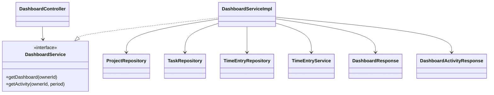
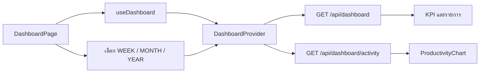
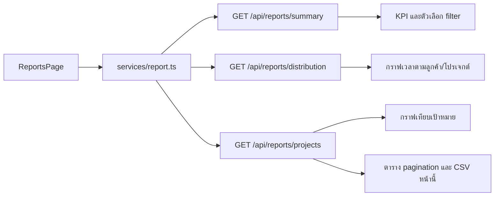
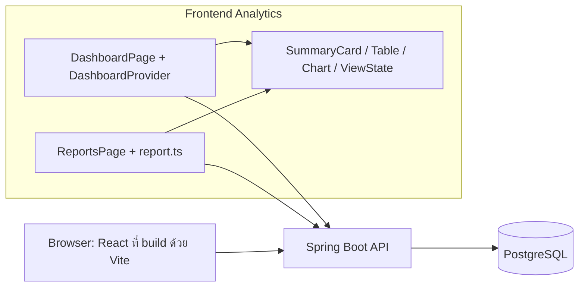

# Design Patterns: Dashboard และ Analytics

**เจ้าของ feature:** `nattadol_673380511-9_02`

**ขอบเขต :** Dashboard/Analytics และ Frontend — summary queries, tracked hours, utilization, project progress, productivity metrics, loading/empty/error state และ React + Vite screens

เอกสารนี้อธิบายเฉพาะงาน Analytics ที่แสดงบนหน้า **ภาพรวม** และ **รายงาน** รวมทั้ง Backend API ที่ป้อนข้อมูลให้สองหน้านี้ การจัดการวงจรชีวิต Timer, Project/Task และ Client เป็นงานของ feature อื่น; Dashboard เพียงอ่านข้อมูลหรือเรียก action ที่ feature เหล่านั้นเปิดให้ใช้

## รูปแบบที่ใช้

| Pattern / รูปแบบ | ปัญหาที่แก้ | หลักฐานใน implementation |
|---|---|---|
| Layered Architecture / MVC | แยก HTTP, กติกาสรุปผล, query และการแสดงผล | `DashboardController`, `ReportController`, service, repository, response DTO และ React pages |
| Service Layer | เก็บสูตร KPI และการประกอบ response ในที่เดียว | `DashboardServiceImpl`, `ReportServiceImpl` |
| Repository / Report Source Data | Reports ใช้ ReportQueryRepository สำหรับอ่านข้อมูลตามเจ้าของและช่วงวันที่ แล้วให้ service กรองและรวมเวลา จัดกลุ่ม เรียงและแบ่งหน้า ส่วน Dashboard รวมข้อมูลรายวันใน service หลังอ่าน projection | `repository/ReportQueryRepository.java`, `ReportServiceImpl`, `DashboardServiceImpl`, `TimeEntryServiceImpl` |
| DTO / Read Model | ส่งข้อมูลที่หน้า Dashboard/Reports ต้องแสดง โดยไม่เผย JPA entity ตรง ๆ | `dto/response/dashboard/*`, `dto/response/report/*`, `types/dashboard.ts`, `types/analytics.ts` |
| Context Provider | ให้หน้า Dashboard อ่านและ refresh ข้อมูลผ่าน hook เดียว | `DashboardContext.tsx`, `dashboard-context.ts`, `useDashboard.ts` |
| Component Composition | ประกอบ SummaryCard, Card, Table, Chart และ ViewState ที่มีอยู่ให้เป็นสองหน้าที่ responsive | `Analytics/pages/Dashboard/page.tsx`, `Analytics/pages/Reports/page.tsx` |

## 1. Backend สำหรับ Dashboard

`GET /api/dashboard` คืน KPI สัปดาห์นี้, จุดเวลารายวันสำหรับกราฟ, โปรเจกต์ active, งานที่ยังเปิด และ `recentTimeEntries` ใน response เดียว `GET /api/dashboard/activity?period=WEEK|MONTH|YEAR` คืนจุดกราฟตามช่วงที่เลือก Controller อ่าน owner ID จากผู้ใช้ที่เข้าสู่ระบบแล้วส่งต่อให้ service

`DashboardServiceImpl` รวมผลลัพธ์จาก repository และ `TimeEntryService` โดยใช้ `Clock` กับเขตเวลา `Asia/Bangkok` เพื่อกำหนดช่วงวันที่และทดสอบเวลาได้ `TimeEntryServiceImpl.sumDailySeconds()` อ่านรายการที่จบแล้วเป็น projection จาก repository แล้วรวมเป็นรายวันใน service พร้อมเติมวันที่ไม่มีรายการเป็นศูนย์ ส่วนเวลาที่ส่งให้กราฟและ KPI ยังคงเป็นวินาทีเต็มจนถึง Frontend เพื่อให้ระยะเวลาที่สั้นกว่าหนึ่งชั่วโมงยังปรากฏ

ความคืบหน้าโปรเจกต์คำนวณจาก `completedTasks / totalTasks * 100`; utilization เปรียบเทียบเวลาที่ใช้กับเป้าหมาย KPI สัปดาห์นี้รวมตั้งแต่วันจันทร์ถึงวันนี้แล้วเทียบกับสัปดาห์ก่อน ส่วน `dailyWork` ของกราฟเริ่มต้นเป็น 7 วันย้อนหลัง งานที่ยังเปิดไม่รวม task สถานะ `COMPLETED` การแสดง recent entries อยู่ใน Dashboard response เพื่อลด request สำหรับรายการเวลาล่าสุด

## 2. Backend สำหรับ Reports

| Endpoint | หน้าที่ | การใช้บนหน้า Reports ปัจจุบัน |
|---|---|---|
| `GET /api/reports/summary` | KPI และตัวเลือก filter ลูกค้า/โปรเจกต์ | ใช้ |
| `GET /api/reports/distribution` | สัดส่วนเวลาตาม `CLIENT` หรือ `PROJECT` | ใช้ |
| `GET /api/reports/projects` | เวลาเป้าหมาย เวลาที่ใช้ ความคืบหน้า และ pagination | ใช้ |
| `GET /api/reports/work-trend` | แนวโน้มเวลาแบบ DAY/WEEK/MONTH | มี API แต่หน้า Reports ยังไม่ใช้ |
| `GET /api/reports/work-pattern` | วันและชั่วโมงที่ทำงานมากที่สุด | มี API แต่หน้า Reports ยังไม่ใช้ |

`ReportController` ตรวจ request และห่อ response ด้วย `ApiResult`; Repository ใน `repository/ReportQueryRepository.java` อ่านข้อมูลสำหรับ Report โดยเฉพาะ จำกัด owner และไม่รวม Time Entry ที่ยังไม่จบหรือถูกลบ; `ReportServiceImpl` กรอง client/project/status รวมยอด จัดกลุ่มวัน/ชั่วโมงใน Asia/Bangkok คำนวณ KPI แล้วเรียงและแบ่งหน้าใน Java `ReportFilterRequest` รับช่วงวันที่แบบ optional: ว่างทั้งคู่หมายถึงทุกช่วงเวลา ส่วนส่งข้างเดียวหรือสลับวันเป็นข้อผิดพลาด

Response แยก DTO ตาม endpoint เพื่อให้หน้าบ้านรับข้อมูลเฉพาะที่ต้องใช้ `/projects` คืน `meta` ของ pagination และเปอร์เซ็นต์ความคืบหน้าจาก task; ไม่เก็บค่า progress ซ้ำใน Project entity สำหรับรายงาน

## 3. Frontend Dashboard

หน้า `Analytics/pages/Dashboard/page.tsx` อยู่ใต้ `DashboardProvider` และเรียก `useDashboard()` ข้อมูลหลักมาจาก `/api/dashboard` กราฟ `WEEK` ใช้ `dailyWork` ใน response นี้ ส่วน `MONTH`/`YEAR` เรียก `/api/dashboard/activity` เมื่อผู้ใช้เลือกช่วงใหม่ `dashboardChart.ts` แปลงจุดกราฟและ label โดยไม่ปัดเวลาทิ้งก่อนส่งให้ Recharts

Page ประกอบ `SummaryCard` 4 ใบ, `ProductivityChart`, `DashboardProjectsTable`, `DashboardTasksTable` และ `DashboardTimerCard` พร้อม `LoadingState`/`ErrorState` และ empty state เมื่อไม่มีข้อมูล ตัวจับเวลาใน card ใช้สถานะ current timer จาก feature Time Tracking ที่มีอยู่; หากไม่มี timer กำลังวิ่งจะแสดง `recentTimeEntries` จาก Dashboard response การหยุด timer จาก card เป็นการเรียก action ของ feature เดิมแล้ว refresh สองข้อมูลที่หน้าใช้

## 4. Frontend Reports

`services/report.ts` สร้าง query string และอ่าน `data/meta` ของ API ส่วน `types/analytics.ts` ระบุรูปข้อมูลที่ UI ใช้ `ReportsPage` ใช้ `useAsyncData` แยกชุด summary, distribution และ projects เพื่อแสดง loading/error/retry และไม่ใช้ response เก่าของ filter คนละชุด

วันที่เริ่มและสิ้นสุดว่างทั้งคู่แสดงทุกช่วงเวลา กรอกไม่ครบหรือเรียงวันผิดจะแสดง error และไม่ส่ง request ค่า `ALL` ใช้ใน UI เท่านั้น ผู้ใช้เลือกกราฟเวลาตามลูกค้าหรือโปรเจกต์ได้เองด้วย `groupBy=CLIENT|PROJECT` โดยตัวกรองลูกค้ายังมีผลกับทั้งสองแบบ การสลับกราฟเรียกเฉพาะ `/distribution`; เมื่อเปลี่ยน filter ตารางกลับไปหน้า 1 ชื่อโปรเจกต์ยาวบนแกนกราฟถูกตัด แต่ tooltip ยังแสดงชื่อเต็ม ค่าแนวโน้มเวลาจะแสดงวันที่ของช่วงก่อนหน้าที่นำมาเทียบเมื่อเลือกช่วงวันที่

กราฟเปรียบเทียบโปรเจกต์และ CSV ใช้เฉพาะรายการในหน้า pagination ปัจจุบัน จึงระบุปุ่มว่า “ส่งออกหน้านี้ CSV” และใช้ `meta` จาก Backend แทนการเดาจำนวนหน้า

## Component และ Deployment Diagram

Diagram แสดงขอบเขตการเชื่อมต่อ ไม่ยืนยันว่า Frontend และ Backend อยู่ใน container หรือ host เดียวกันในทุก environment; `VITE_API_BASE_URL`/proxy เป็นตัวกำหนดปลายทางใน runtime ที่ใช้จริง

## ขอบเขตและการทดสอบ

- การจัดการ timer, Project/Task และ Client เป็น feature อื่น Analytics อ่านผลลัพธ์และใช้ action ที่มีอยู่เท่านั้น
- หน้า Reports ยังไม่แสดง work trend, work pattern และค่าเฉลี่ยรายวัน แม้ Backend มี endpoint แล้ว; CSV ปัจจุบันเป็นรายงานโปรเจกต์เฉพาะหน้าตาราง ไม่ใช่ Time Entry ทุกแถว
- `getProjects` ฝั่ง Backend ยังแบ่งหน้าหลังโหลดโปรเจกต์ที่มองเห็นทั้งหมด หากข้อมูลมากควรย้าย pagination ไปฐานข้อมูล
- Frontend มี `dashboardChart.test.ts`, `dashboard.test.tsx`, `services/report.test.ts` และ `analytics.utils.test.ts`; Backend มี `DashboardIntegrationTest`, `ReportControllerTest`, `ReportServiceImplTest` และ `ReportIntegrationTest`
