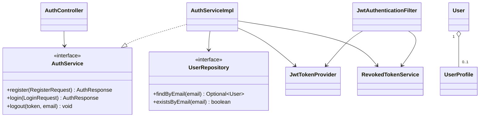

# Design Patterns: Authentication และ User/Profile

**เจ้าของ feature:** `petpinyo_673380073-7_02`

บันทึกเฉพาะ pattern ที่มี implementation จริงในโค้ด Auth/User ณ ปัจจุบัน
ยังไม่ระบุ Strategy, State หรือ Observer แบบ GoF เพราะไม่พบ implementation ใน feature นี้

| Pattern | ปัญหาที่แก้ | ไฟล์/คลาสที่ใช้ |
|---|---|---|
| Layered Architecture | แยก presentation, business logic, persistence และ domain | `controller/AuthController`, `service/AuthServiceImpl`, `repository/UserRepository`, `domain/entity/User` |
| MVC / REST Controller | แยกการรับ HTTP และ response status จาก business logic | `controller/AuthController.java:22-105`, `controller/UserController.java:14-41` |
| Service Layer | รวม use case authentication ไว้ใน boundary เดียว | `service/AuthService.java:7-15`, `service/impl/AuthServiceImpl.java:33-87` |
| Repository | ซ่อนรายละเอียด JPA data access | `repository/UserRepository.java:13-25`, `UserProfileRepository.java:11-13`, `RevokedTokenRepository.java:9-14` |
| DTO + Mapper | แยก API contract จาก JPA entity และ password field | `dto/request/RegisterRequest`, `dto/response/AuthResponse`, `dto/response/UserResponse`, `mapper/UserMapper.java:18-58` |
| Dependency Injection | เปลี่ยน implementation และทดสอบด้วย mock ได้ | `AuthServiceImpl.java:22-31`, `SecurityConfig.java:66-80` |
| JWT Bearer Token | ทำ authentication แบบ stateless | `security/JwtTokenProvider.java:29-72`, `config/SecurityConfig.java:57-61` |
| Security Filter | ตรวจ bearer token ก่อน request ถึง controller | `security/JwtAuthenticationFilter.java:30-66` |
| Token Revocation / Deny-list | ทำให้ logout ยกเลิก token ก่อนหมดอายุได้ | `domain/entity/RevokedToken.java:19-58`, `service/RevokedTokenService.java:18-30`, `JwtAuthenticationFilter.java:39-44` |

## Class Diagram

## Pattern boundary

`PasswordEncoder`, `AuthenticationManager` และ `DaoAuthenticationProvider` เป็น
framework abstractions ที่ถูก inject ผ่าน configuration จึงควรอธิบายเป็น Dependency
Injection/Provider delegation ไม่ควรอ้างว่าเป็น GoF Strategy ของทีม เว้นแต่มีการเพิ่ม
interface และ implementations ของทีมเองพร้อม test
