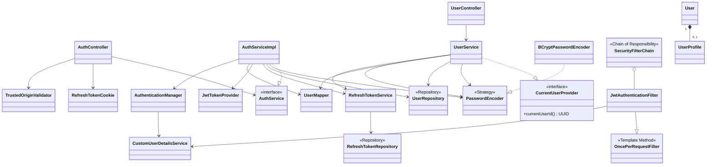

# Design Patterns: Authentication และ User/Profile

**ผู้รับผิดชอบ:** เพชรภิญโญ ธนศิรินรากร (`petpinyo_673380073-7_02`)

| ส่วนประกอบในแบบ | โค้ดจริง |
|---|---|
| HTTP controllers | [AuthController.java](../../../code/Backend/src/main/java/th/ac/kku/freelance_hub/controller/AuthController.java), [UserController.java](../../../code/Backend/src/main/java/th/ac/kku/freelance_hub/controller/UserController.java) |
| Services และ interfaces | [AuthService.java](../../../code/Backend/src/main/java/th/ac/kku/freelance_hub/service/AuthService.java), [AuthServiceImpl.java](../../../code/Backend/src/main/java/th/ac/kku/freelance_hub/service/impl/AuthServiceImpl.java), [UserService.java](../../../code/Backend/src/main/java/th/ac/kku/freelance_hub/service/UserService.java), [CurrentUserProvider.java](../../../code/Backend/src/main/java/th/ac/kku/freelance_hub/service/CurrentUserProvider.java), [RefreshTokenService.java](../../../code/Backend/src/main/java/th/ac/kku/freelance_hub/service/RefreshTokenService.java) |
| Security and cookies | [SecurityConfig.java](../../../code/Backend/src/main/java/th/ac/kku/freelance_hub/config/SecurityConfig.java), [JwtAuthenticationFilter.java](../../../code/Backend/src/main/java/th/ac/kku/freelance_hub/security/JwtAuthenticationFilter.java), [RefreshTokenCookie.java](../../../code/Backend/src/main/java/th/ac/kku/freelance_hub/security/RefreshTokenCookie.java), [TrustedOriginValidator.java](../../../code/Backend/src/main/java/th/ac/kku/freelance_hub/security/TrustedOriginValidator.java) |
| Persistence, mapping and entities | [UserRepository.java](../../../code/Backend/src/main/java/th/ac/kku/freelance_hub/repository/UserRepository.java), [RefreshTokenRepository.java](../../../code/Backend/src/main/java/th/ac/kku/freelance_hub/repository/RefreshTokenRepository.java), [UserMapper.java](../../../code/Backend/src/main/java/th/ac/kku/freelance_hub/mapper/UserMapper.java), [User.java](../../../code/Backend/src/main/java/th/ac/kku/freelance_hub/domain/entity/User.java), [UserProfile.java](../../../code/Backend/src/main/java/th/ac/kku/freelance_hub/domain/entity/UserProfile.java) |

## Enterprise / Architectural Patterns

| Pattern | ปัญหาที่แก้ | ไฟล์/คลาสที่ใช้ |
|---|---|---|
| Layered Architecture | แยก HTTP, use case, data access และ domain | `AuthController` → `AuthServiceImpl` → `UserRepository` → `User` |
| MVC / REST Controller | แยก routing/status/cookie จาก business logic | `AuthController`, `UserController` |
| Service Layer | รวม transaction และกฎของ auth/profile/token | `AuthServiceImpl`, `UserService`, `RefreshTokenService` |
| Repository | ซ่อน JPA queries จาก service | `UserRepository`, `RefreshTokenRepository`; เส้นทาง auth/profile ใช้ `UserRepository` โหลดและบันทึก `User` พร้อม `UserProfile` ผ่านความสัมพันธ์แบบ cascade ส่วน `UserProfileRepository` ไม่ได้ถูกเรียกใน flow นี้ |
| DTO + Mapper | ป้องกัน API ผูกกับ Entity และข้อมูลลับ | request/response DTO ใน `dto/`, `UserMapper` |
| Dependency Injection | ลด coupling และรองรับ mock ใน unit test | constructor injection ใน services/controllers/filter และ beans ใน `SecurityConfig` |

## GoF Behavioral Patterns

เลือก Behavioral group ให้ครบ 3 patterns โดยอ้าง implementation ที่ใช้จริง

| Pattern | ปัญหาที่แก้ | ไฟล์/คลาสที่ใช้ |
|---|---|---|
| Strategy | สลับวิธีเข้ารหัสรหัสผ่านได้โดย auth/user service ไม่รู้ concrete algorithm | `PasswordEncoder`, `BCryptPasswordEncoder`, [SecurityConfig.passwordEncoder()](../../../code/Backend/src/main/java/th/ac/kku/freelance_hub/config/SecurityConfig.java#L75), `AuthServiceImpl`, `UserService` |
| Template Method | ใช้ lifecycle ของ filter มาตรฐานและ override เฉพาะขั้นตรวจ JWT | [JwtAuthenticationFilter.doFilterInternal()](../../../code/Backend/src/main/java/th/ac/kku/freelance_hub/security/JwtAuthenticationFilter.java#L34), `OncePerRequestFilter` |
| Chain of Responsibility | ประมวลผล request ผ่าน security handlers ตามลำดับก่อนถึง controller | [SecurityConfig.securityFilterChain()](../../../code/Backend/src/main/java/th/ac/kku/freelance_hub/config/SecurityConfig.java#L38), `SecurityFilterChain`, `JwtAuthenticationFilter`, `UsernamePasswordAuthenticationFilter`, `JwtAuthenticationEntryPoint` |

## Class Diagram

```mermaid
classDiagram
    class AuthController
    class UserController
    class AuthService {
        <<interface>>
    }
    class AuthServiceImpl
    class CurrentUserProvider {
        <<interface>>
        +currentUserId() UUID
    }
    class UserService
    class PasswordEncoder {
        <<Strategy>>
    }
    class BCryptPasswordEncoder
    class OncePerRequestFilter {
        <<Template Method>>
    }
    class JwtAuthenticationFilter
    class SecurityFilterChain {
        <<Chain of Responsibility>>
    }
    class UserRepository {
        <<Repository>>
    }
    class RefreshTokenRepository {
        <<Repository>>
    }
    class AuthenticationManager
    class CustomUserDetailsService
    class RefreshTokenCookie
    class TrustedOriginValidator
    class RefreshTokenService
    class JwtTokenProvider
    class UserMapper
    class User
    class UserProfile

    AuthController --> AuthService
    AuthController --> RefreshTokenCookie
    AuthController --> TrustedOriginValidator
    AuthServiceImpl ..|> AuthService
    UserController --> UserService
    UserService ..|> CurrentUserProvider
    AuthServiceImpl --> PasswordEncoder
    UserService --> PasswordEncoder
    BCryptPasswordEncoder ..|> PasswordEncoder
    JwtAuthenticationFilter --|> OncePerRequestFilter
    SecurityFilterChain o-- JwtAuthenticationFilter
    AuthServiceImpl --> UserRepository
    AuthServiceImpl --> RefreshTokenService
    AuthServiceImpl --> JwtTokenProvider
    AuthServiceImpl --> UserMapper
    AuthServiceImpl --> AuthenticationManager
    AuthenticationManager --> CustomUserDetailsService
    UserService --> UserRepository
    UserService --> UserMapper
    UserService --> PasswordEncoder
    UserService --> RefreshTokenService
    RefreshTokenService --> RefreshTokenRepository
    JwtAuthenticationFilter --> CustomUserDetailsService
    User "1" *-- "0..1" UserProfile
```

## Pattern boundary

- Refresh token rotation ไม่ถูกนับเป็น State เพราะไม่มี polymorphic state classes
- Rate limiter ไม่ถูกนับเป็น Strategy เพราะมี implementation เดียวและไม่มี strategy interface
- JWT bearer token เป็น authentication mechanism ไม่ใช่ GoF pattern

สรุปรวมของกลุ่มอยู่ที่ [doc/design-patterns.md](../../design-patterns.md)
