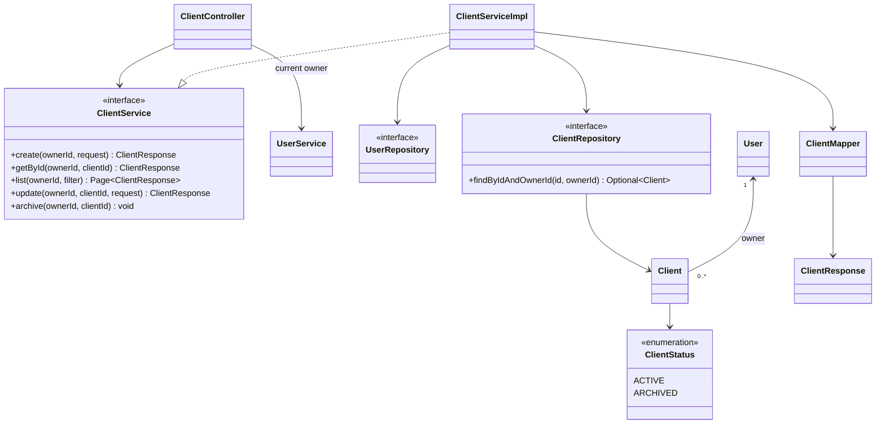

# Design Patterns: Client Management

**เจ้าของ feature:** `thirawat_673380039-7_02`  
**ขอบเขต:** Client API สำหรับสร้าง ดู ค้นหา/กรอง แก้ไข และ archive ลูกค้าของผู้ใช้ที่เข้าสู่ระบบ

เอกสารฉบับนี้บันทึกเฉพาะรูปแบบที่เห็นจาก implementation ปัจจุบัน โดยอ้างอิงไฟล์ภายใต้ `code/Backend/src/main/java/th/ac/kku/freelance_hub/`

| Pattern / รูปแบบ | ปัญหาที่แก้ | ไฟล์/คลาสที่ใช้ |
|---|---|---|
| Layered Architecture / MVC | แยกการรับ HTTP, use case, data access และ domain ออกจากกัน | `controller/ClientController.java:35-105`, `service/impl/ClientServiceImpl.java:29-131`, `repository/ClientRepository.java:19-32`, `domain/entity/Client.java:48-126` |
| Service Layer | รวมกติกาการจัดการลูกค้าและการตรวจ owner ไว้หลัง service contract | `service/ClientService.java:13-25`, `service/impl/ClientServiceImpl.java:51-125` |
| Repository | ใช้ Spring Data JPA จัดการ persistence โดยไม่เขียน SQL ใน controller | `repository/ClientRepository.java:19-32`, `service/impl/ClientServiceImpl.java:55-57,102-118` |
| Specification | ประกอบเงื่อนไข owner, status และ prefix search สำหรับรายการลูกค้าแบบมี filter | `service/impl/ClientServiceImpl.java:77-102`, `repository/ClientRepository.java:19-20` |
| DTO + Mapper | ไม่ส่ง JPA entity ออก API และกำหนดข้อมูลที่สร้าง/แก้ไข/ตอบกลับแยกกัน | `dto/request/CreateClientRequest.java`, `dto/request/UpdateClientRequest.java`, `dto/request/ClientFilterRequest.java`, `dto/response/ClientResponse.java`, `mapper/ClientMapper.java:15-69` |
| Dependency Injection | Controller พึ่ง `ClientService` interface และ service รับ repository/mapper ผ่าน constructor จึงทดสอบด้วย mock ได้ | `controller/ClientController.java:38-42`, `service/impl/ClientServiceImpl.java:34-48` |
| Soft Delete / Archive | เก็บประวัติลูกค้าไว้แทนการลบแถวจริง | `controller/ClientController.java:93-103`, `service/impl/ClientServiceImpl.java:115-119`, `domain/entity/Client.java:83-85,123-126` |

## Class Diagram: Client feature

## Pattern boundary

- `Specification` เป็น abstraction ของ Spring Data JPA สำหรับ query filter ไม่ใช่ GoF Strategy ที่ทีมสร้าง implementation หลายแบบ
- `ClientStatus` เป็น enum และ `archive()` เปลี่ยนค่าเป็น `ARCHIVED`; ยังไม่มี GoF State pattern หรือ state object แยกตามสถานะ
- ไม่อ้างว่า Client feature มี GoF Strategy/State/Observer เพื่อให้ครบจำนวน เพราะยังไม่มี implementation เหล่านั้นในส่วนนี้
