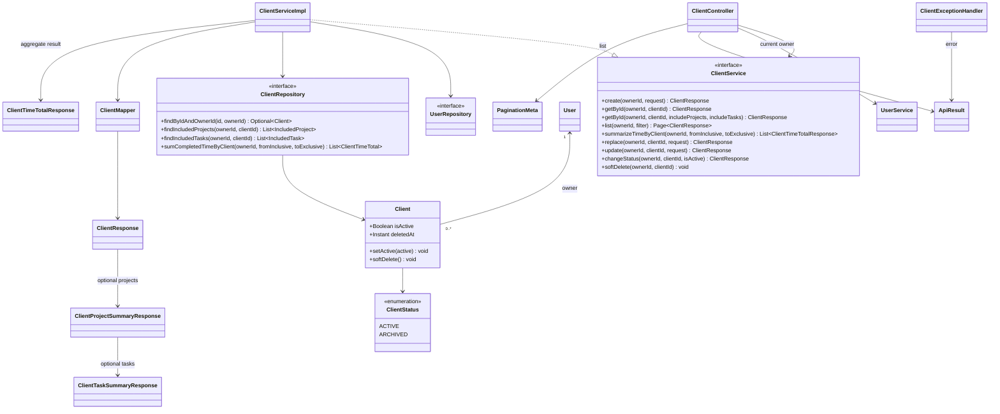

# Design Patterns: Client Management

**เจ้าของ feature:** `thirawat_673380039-7_02`  
**ขอบเขต:** Client API สำหรับสร้าง ดู ค้นหา/กรอง แก้ไข เปลี่ยนสถานะ และ soft delete ลูกค้าของผู้ใช้ที่เข้าสู่ระบบ รวมการเลือกแนบ Project/Task ใน Client detail และ service method รวมเวลาตามลูกค้า

เอกสารฉบับนี้บันทึกเฉพาะรูปแบบที่เห็นจาก implementation ปัจจุบัน โดยอ้างอิงไฟล์ภายใต้ `code/Backend/src/main/java/th/ac/kku/freelance_hub/`

| Pattern / รูปแบบ | ปัญหาที่แก้ | ไฟล์/คลาสที่ใช้ |
|---|---|---|
| Layered Architecture / MVC | แยกการรับ HTTP, use case, data access และ domain ออกจากกัน | `controller/ClientController.java`, `service/impl/ClientServiceImpl.java`, `repository/ClientRepository.java`, `domain/entity/Client.java` |
| Service Layer | รวมกติกาการจัดการลูกค้าและการตรวจ owner ไว้หลัง service contract | `service/ClientService.java`, `service/impl/ClientServiceImpl.java` |
| Repository | ใช้ Spring Data JPA จัดการ persistence โดยไม่เขียน SQL ใน controller | `repository/ClientRepository.java`, `service/impl/ClientServiceImpl.java` |
| Specification | ประกอบเงื่อนไข owner, `deletedAt IS NULL`, `isActive` และ prefix search สำหรับรายการลูกค้า | `service/impl/ClientServiceImpl.java`, `repository/ClientRepository.java` |
| DTO + Mapper | ไม่ส่ง JPA entity ออก API และกำหนดข้อมูลที่สร้าง/แทนที่/แก้ไข/ตอบกลับแยกกัน | `dto/request/CreateClientRequest.java`, `dto/request/UpdateClientRequest.java`, `dto/request/ChangeClientStatusRequest.java`, `dto/request/ClientFilterRequest.java`, `dto/response/ClientResponse.java`, `mapper/ClientMapper.java` |
| Dependency Injection | Controller พึ่ง `ClientService` interface และ service รับ repository/mapper ผ่าน constructor จึงทดสอบด้วย mock ได้ | `controller/ClientController.java`, `service/impl/ClientServiceImpl.java` |
| Response Envelope | Client endpoints ที่มี response body ใช้ `ApiResult`; รายการลูกค้ามี `PaginationMeta`, error ใช้ `ApiResult.error` ผ่าน handler เฉพาะ Client | `controller/ClientController.java`, `exception/ClientExceptionHandler.java`, `common/response/ApiResult.java` |
| Active Status / Soft Delete | `PATCH /status` แก้ `isActive`; `DELETE` ตั้ง `deletedAt` โดยไม่เปลี่ยน `isActive` และไม่ลบแถวจริง | `service/impl/ClientServiceImpl.java`, `domain/entity/Client.java` |
| Projection / Aggregate Query | อ่านเฉพาะฟิลด์ Project/Task ที่ต้องแนบใน Client detail และรวม `durationSeconds` จาก Time Entry ตาม Client โดยไม่โหลด entity graph ทั้งหมด | `repository/ClientRepository.java`, `dto/response/ClientProjectSummaryResponse.java`, `dto/response/ClientTaskSummaryResponse.java`, `dto/response/ClientTimeTotalResponse.java` |

## Class Diagram: Client feature

```mermaid
classDiagram
    class ClientController
    class ClientService {
        <<interface>>
        +create(ownerId, request) ClientResponse
        +getById(ownerId, clientId) ClientResponse
        +getById(ownerId, clientId, includeProjects, includeTasks) ClientResponse
        +list(ownerId, filter) Page~ClientResponse~
        +summarizeTimeByClient(ownerId, fromInclusive, toExclusive) List~ClientTimeTotalResponse~
        +replace(ownerId, clientId, request) ClientResponse
        +update(ownerId, clientId, request) ClientResponse
        +changeStatus(ownerId, clientId, isActive) ClientResponse
        +softDelete(ownerId, clientId) void
    }
    class ClientServiceImpl
    class UserService
    class UserRepository {
        <<interface>>
    }
    class ClientRepository {
        <<interface>>
        +findByIdAndOwnerId(id, ownerId) Optional~Client~
        +findIncludedProjects(ownerId, clientId) List~IncludedProject~
        +findIncludedTasks(ownerId, clientId) List~IncludedTask~
        +sumCompletedTimeByClient(ownerId, fromInclusive, toExclusive) List~ClientTimeTotal~
    }
    class ClientMapper
    class Client {
        +Boolean isActive
        +Instant deletedAt
        +setActive(active) void
        +softDelete() void
    }
    class ClientStatus {
        <<enumeration>>
        ACTIVE
        ARCHIVED
    }
    class User
    class ClientResponse
    class ClientProjectSummaryResponse
    class ClientTaskSummaryResponse
    class ClientTimeTotalResponse
    class ClientExceptionHandler
    class ApiResult
    class PaginationMeta

    ClientController --> ClientService
    ClientController --> UserService : current owner
    ClientServiceImpl ..|> ClientService
    ClientServiceImpl --> UserRepository
    ClientServiceImpl --> ClientRepository
    ClientServiceImpl --> ClientMapper
    ClientMapper --> ClientResponse
    ClientResponse --> ClientProjectSummaryResponse : optional projects
    ClientProjectSummaryResponse --> ClientTaskSummaryResponse : optional tasks
    ClientServiceImpl --> ClientTimeTotalResponse : aggregate result
    ClientRepository --> Client
    User "1" <-- "0..*" Client : owner
    Client --> ClientStatus
    ClientController --> ApiResult
    ClientController --> PaginationMeta : list
    ClientExceptionHandler --> ApiResult : error
```

## Pattern boundary

- `Specification` เป็น abstraction ของ Spring Data JPA สำหรับ query filter ไม่ใช่ GoF Strategy ที่ทีมสร้าง implementation หลายแบบ
- `ClientStatus` เป็น enum ที่คำนวณจาก `isActive` เพื่อแสดงใน response; ไม่มีคอลัมน์ `status` หรือ GoF State pattern ใน Client
- `softDelete()` ตั้ง `deletedAt` อย่างเดียว; Client ที่ถูก soft delete จะไม่ปรากฏใน Client API และไม่สามารถเปลี่ยนสถานะผ่าน endpoint นี้ได้
- `DELETE` ที่สำเร็จคืน `204 No Content` จึงไม่มี `ApiResult` ใน response body
- `include=projects` และ `include=projects.tasks` เป็นเพียงรูปแบบ path ที่ยืมจาก JSON:API; response ยังใช้ `ApiResult` ไม่ใช่ JSON:API เต็มรูปแบบ
- `summarizeTimeByClient` เป็น method ภายใน ไม่ใช่ endpoint; รวมเฉพาะ Time Entry ที่จบแล้วตาม `startedAt` ในช่วง `[fromInclusive, toExclusive)` และไม่รวม Project ที่ไม่มี Client
- ไม่อ้างว่า Client feature มี GoF Strategy/State/Observer เพื่อให้ครบจำนวน เพราะยังไม่มี implementation เหล่านั้นในส่วนนี้
