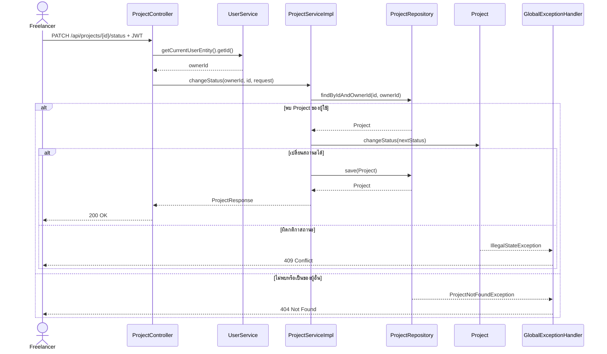

# Use Cases: Project และ Task Management

**เจ้าของ feature:** `kantavit_673380027-4_01`  
**ขอบเขต:** จัดการโปรเจกต์ของผู้ใช้ที่เข้าสู่ระบบ และจัดการ Task ภายในโปรเจกต์นั้น  
**อ้างอิง requirement:** `FR-PRJ-01` ถึง `FR-PRJ-05` ใน `REQUIREMENTS.md`

## Actor และเงื่อนไขร่วม

**Actor หลัก:** Freelancer ที่เข้าสู่ระบบ

ทุก request ต้องมีการยืนยันตัวตน ระบบอ่าน `ownerId` จากผู้ใช้ที่เข้าสู่ระบบ ไม่รับ `ownerId` จาก request การอ่านหรือแก้ Project ต้องตรวจทั้ง `projectId` และ `ownerId` ส่วน Task ต้องตรวจ `taskId`, `projectId` และเจ้าของโปรเจกต์

## Use Case Summary

| ID | Use Case | Endpoint | ผลลัพธ์สำเร็จ |
|---|---|---|---|
| UC-PRJ-01 | สร้าง Project | `POST /api/projects` | `201 Created` พร้อม Project และ `Location` |
| UC-PRJ-02 | ค้นหา/แสดงรายการ Project | `GET /api/projects` | `200 OK` พร้อมรายการแบบแบ่งหน้า |
| UC-PRJ-03 | ดู Project รายตัว | `GET /api/projects/{id}` | `200 OK` |
| UC-PRJ-04 | แก้ไขรายละเอียด Project | `PATCH /api/projects/{id}` | `200 OK` |
| UC-PRJ-05 | เปลี่ยนสถานะ Project | `PATCH /api/projects/{id}/status` | `200 OK` |
| UC-PRJ-06 | Archive Project | `DELETE /api/projects/{id}` | `204 No Content` |
| UC-TSK-01 | สร้าง Task | `POST /api/projects/{projectId}/tasks` | `201 Created` พร้อม Task และ `Location` |
| UC-TSK-02 | แสดงรายการ Task | `GET /api/projects/{projectId}/tasks` | `200 OK` พร้อมรายการแบบแบ่งหน้า |
| UC-TSK-03 | ดู Task รายตัว | `GET /api/projects/{projectId}/tasks/{taskId}` | `200 OK` |
| UC-TSK-04 | แก้ไข Task | `PATCH /api/projects/{projectId}/tasks/{taskId}` | `200 OK` |
| UC-TSK-05 | เริ่ม Task | `PATCH /api/projects/{projectId}/tasks/{taskId}/start` | `200 OK` |
| UC-TSK-06 | ปิด Task | `PATCH /api/projects/{projectId}/tasks/{taskId}/complete` | `200 OK` |
| UC-TSK-07 | เปลี่ยนลำดับ Task | `PATCH /api/projects/{projectId}/tasks/{taskId}/reorder` | `200 OK` |
| UC-TSK-08 | ลบ Task | `DELETE /api/projects/{projectId}/tasks/{taskId}` | `204 No Content` |

## Project use cases

### UC-PRJ-01 สร้าง Project

1. Freelancer ส่ง `clientId`, ชื่อโปรเจกต์ และรายละเอียดอื่นที่ต้องการ
2. Controller ตรวจข้อมูล request และอ่าน `ownerId` จากผู้ใช้ที่เข้าสู่ระบบ
3. Service ตรวจว่า Client ที่เลือกเป็นของผู้ใช้นั้น
4. ระบบสร้าง Project โดยมีสถานะเริ่มต้น `PLANNED` แล้วบันทึก
5. คืน `201 Created`, `ProjectResponse` และ `Location: /api/projects/{id}`

**Alternative flow:** ข้อมูลไม่ถูกต้อง = `400`; ไม่ได้เข้าสู่ระบบ = `401`; ไม่พบ Client หรือ Client ไม่ใช่ของผู้ใช้ = `404`  
**Postcondition:** มี Project ใหม่ที่ผูกกับเจ้าของและ Client ที่เลือก

### UC-PRJ-02 ค้นหา/แสดงรายการ Project

1. Freelancer เรียก `GET /api/projects` พร้อมตัวเลือก `search`, `status`, `clientId`, การแบ่งหน้า และการเรียงลำดับ
2. Service จำกัดผลลัพธ์ให้เป็น Project ของผู้ใช้ก่อน แล้วจึงใช้ตัวกรองที่ระบุ
3. ระบบคืน `200 OK` พร้อม `Page<ProjectResponse>`; หากไม่ระบุการเรียงลำดับ จะเรียงตาม `createdAt` จากใหม่ไปเก่า

**Alternative flow:** ไม่มีผลลัพธ์ = page ว่าง; ตัวเลือกค้นหา/แบ่งหน้า/เรียงลำดับไม่ถูกต้อง = `400`; ไม่ได้เข้าสู่ระบบ = `401`  
**Postcondition:** ไม่มีข้อมูลเปลี่ยนแปลง และไม่แสดง Project ของผู้ใช้อื่น

### UC-PRJ-03 ดู Project รายตัว

1. Freelancer ส่ง UUID ของ Project
2. Service ค้น Project ด้วย `projectId` และ `ownerId`
3. ระบบคืน `200 OK` พร้อม `ProjectResponse`

**Alternative flow:** ไม่พบ Project หรือเป็นของผู้ใช้อื่น = `404`; ไม่ได้เข้าสู่ระบบ = `401`  
**Postcondition:** ไม่มีข้อมูลเปลี่ยนแปลง

### UC-PRJ-04 แก้ไขรายละเอียด Project

1. Freelancer ส่ง UUID ของ Project และข้อมูลใหม่
2. Controller ตรวจ request; ปัจจุบัน request นี้ **ต้องมี `clientId` และ `name`** แม้ใช้ HTTP `PATCH`
3. Service ตรวจว่า Project และ Client เป็นของผู้ใช้ แล้วแก้รายละเอียดและบันทึก
4. ระบบคืน `200 OK` พร้อม Project ล่าสุด

**Alternative flow:** ข้อมูลไม่ถูกต้อง = `400`; ไม่พบ Project/Client หรือไม่ใช่เจ้าของ = `404`; ไม่ได้เข้าสู่ระบบ = `401`  
**Postcondition:** รายละเอียด Project ถูกอัปเดต โดยการเปลี่ยนสถานะเป็น use case แยกต่างหาก

### UC-PRJ-05 เปลี่ยนสถานะ Project

1. Freelancer ส่งสถานะใหม่ไปที่ `/status`
2. Service โหลด Project ของผู้ใช้ แล้วให้ `Project` ตรวจว่าการเปลี่ยนสถานะทำได้หรือไม่
3. เมื่อผ่านกติกา ระบบบันทึกสถานะและคืน `200 OK`

**กติกาปัจจุบัน:** `PLANNED → ACTIVE/ARCHIVED`; `ACTIVE → ON_HOLD/COMPLETED/ARCHIVED`; `ON_HOLD → ACTIVE/ARCHIVED`; `COMPLETED → ARCHIVED` ส่วน `ARCHIVED` ไม่เปลี่ยนไปสถานะอื่น การส่งสถานะเดิมซ้ำทำได้

**Alternative flow:** request ไม่ถูกต้อง = `400`; ไม่พบ Project หรือไม่ใช่เจ้าของ = `404`; เปลี่ยนสถานะผิดกติกา = `409`  
**Postcondition:** Project มีสถานะใหม่เมื่อการเปลี่ยนสถานะได้รับอนุญาต

### UC-PRJ-06 Archive Project

1. Freelancer ส่ง UUID ของ Project
2. Service ตรวจเจ้าของและเรียก `Project.archive()`
3. ระบบเปลี่ยนสถานะเป็น `ARCHIVED` และคืน `204 No Content`

**Alternative flow:** ไม่พบ Project หรือไม่ใช่เจ้าของ = `404`; ไม่ได้เข้าสู่ระบบ = `401`  
**Postcondition:** ข้อมูล Project ยังอยู่ในฐานข้อมูล ไม่ใช่การลบแถวจริง

## Task use cases

### UC-TSK-01 สร้าง Task

1. Freelancer ส่งชื่อ คำอธิบาย และตำแหน่ง `sortOrder` ภายใน Project
2. Service ตรวจว่า Project เป็นของผู้ใช้ และ Project ไม่อยู่ในสถานะ `COMPLETED` หรือ `ARCHIVED`
3. ระบบแทรก Task ในตำแหน่งที่ระบุ โดยตำแหน่งเริ่มนับจาก `0` และจัดลำดับ Task ที่เหลือใหม่
4. คืน `201 Created`, `TaskResponse` และ `Location` ของ Task ใหม่

**Alternative flow:** ชื่อหรือตำแหน่งไม่ถูกต้อง = `400`; ไม่พบ Project หรือไม่ใช่เจ้าของ = `404`; Project แก้ Task ไม่ได้ = `409`  
**Postcondition:** มี Task ใหม่ใน Project โดยลำดับไม่ซ้ำกัน

### UC-TSK-02 แสดงรายการ Task

1. Freelancer ระบุ `projectId` พร้อมตัวเลือกแบ่งหน้า/เรียงลำดับ
2. Service ตรวจเจ้าของ Project แล้วอ่าน Task ภายใน Project นั้น
3. คืน `200 OK` พร้อม `Page<TaskResponse>`; หากไม่ระบุการเรียงลำดับ จะเรียงตาม `sortOrder` จากน้อยไปมาก

**Alternative flow:** ไม่พบ Project หรือไม่ใช่เจ้าของ = `404`; ตัวเลือกแบ่งหน้าหรือเรียงลำดับไม่ถูกต้อง = `400`  
**Postcondition:** ไม่มีข้อมูลเปลี่ยนแปลง

### UC-TSK-03 ดู Task รายตัว

1. Freelancer ระบุ `projectId` และ `taskId`
2. Service ค้น Task โดยตรวจ Project และเจ้าของร่วมกัน
3. คืน `200 OK` พร้อม `TaskResponse`

**Alternative flow:** ไม่พบ Task/Project หรือไม่ใช่เจ้าของ = `404`  
**Postcondition:** ไม่มีข้อมูลเปลี่ยนแปลง

### UC-TSK-04 แก้ไข Task

1. Freelancer ส่งชื่อและคำอธิบายใหม่
2. Service ตรวจเจ้าของ และตรวจว่า Project ไม่เป็น `COMPLETED` หรือ `ARCHIVED`
3. ระบบแก้ไข Task แล้วคืน `200 OK`

**Alternative flow:** ชื่อไม่ถูกต้อง = `400`; ไม่พบ Project/Task หรือไม่ใช่เจ้าของ = `404`; Project แก้ Task ไม่ได้ = `409`  
**Postcondition:** ชื่อและคำอธิบาย Task ถูกอัปเดต

### UC-TSK-05 เริ่ม Task

1. Freelancer ขอเริ่ม Task
2. Service ตรวจเจ้าของและสถานะ Project
3. `Task.start()` ยอมรับเฉพาะ Task สถานะ `OPEN` แล้วเปลี่ยนเป็น `IN_PROGRESS`
4. คืน `200 OK` พร้อม Task ล่าสุด

**Alternative flow:** ไม่พบ Project/Task หรือไม่ใช่เจ้าของ = `404`; Task ไม่ใช่ `OPEN` หรือ Project แก้ Task ไม่ได้ = `409`  
**Postcondition:** Task อยู่ในสถานะ `IN_PROGRESS`

### UC-TSK-06 ปิด Task

1. Freelancer ขอปิด Task
2. Service ตรวจเจ้าของและสถานะ Project
3. ระบบบันทึกเวลา `completedAt` และเปลี่ยน Task เป็น `COMPLETED`
4. คืน `200 OK` พร้อม Task ล่าสุด

**Alternative flow:** ไม่พบ Project/Task หรือไม่ใช่เจ้าของ = `404`; Task ปิดไปแล้วหรือ Project แก้ Task ไม่ได้ = `409`  
**Postcondition:** Task อยู่ในสถานะ `COMPLETED` พร้อมเวลาปิดงาน

**หมายเหตุ:** โค้ดปัจจุบันอนุญาตให้ปิด Task จาก `OPEN` หรือ `IN_PROGRESS`; ไม่ได้บังคับว่าต้องเริ่มก่อน

### UC-TSK-07 เปลี่ยนลำดับ Task

1. Freelancer ส่ง `sortOrder` ใหม่ โดยนับจาก `0`
2. Service ตรวจเจ้าของและสถานะ Project แล้วโหลด Task ตามลำดับปัจจุบัน
3. ระบบย้าย Task ไปตำแหน่งใหม่และบันทึกลำดับของ Task ทั้งชุด
4. คืน `200 OK` พร้อม Task ที่ย้าย

**Alternative flow:** ตำแหน่งเกินช่วงที่มี = `400`; ไม่พบ Project/Task หรือไม่ใช่เจ้าของ = `404`; Project แก้ Task ไม่ได้ = `409`  
**Postcondition:** Task ภายใน Project มีลำดับต่อเนื่องโดยไม่ซ้ำกัน

### UC-TSK-08 ลบ Task

1. Freelancer ขอให้ลบ Task
2. Service ตรวจเจ้าของและสถานะ Project
3. ระบบตรวจว่า Task ไม่มี Time Entry ที่บันทึกไว้
4. เมื่อลบได้ ระบบ **ลบ Task จริง** และจัดลำดับ Task ที่เหลือใหม่
5. คืน `204 No Content`

**Alternative flow:** ไม่พบ Project/Task หรือไม่ใช่เจ้าของ = `404`; Project แก้ Task ไม่ได้หรือ Task มี Time Entry = `409`  
**Postcondition:** Task ถูกลบ ส่วน Task ที่เหลือมีลำดับต่อเนื่อง

## Sequence: เปลี่ยนสถานะ Project

## ขอบเขตที่ยังไม่เสร็จ

- `FR-PRJ-06` เรื่องเวลาที่ใช้เทียบกับเป้าหมายยังไม่ปรากฏใน `ProjectResponse` หรือ Project API ปัจจุบัน แม้ `Project` มีเมธอดคำนวณ progress ภายใน
- `FR-PRJ-07` การแจ้งเตือนที่ 80%/100% ยังไม่มี implementation ในส่วนนี้
- เอกสารนี้บันทึกพฤติกรรมจากโค้ดปัจจุบัน ควรตรวจเทียบกับ Use Case Diagram ฉบับทีมก่อนส่งงาน
- มีไฟล์ทดสอบ Controller และ Service ของ Project/Task แล้ว แต่เอกสารนี้ไม่ได้ยืนยันผลการรันทดสอบรอบล่าสุด