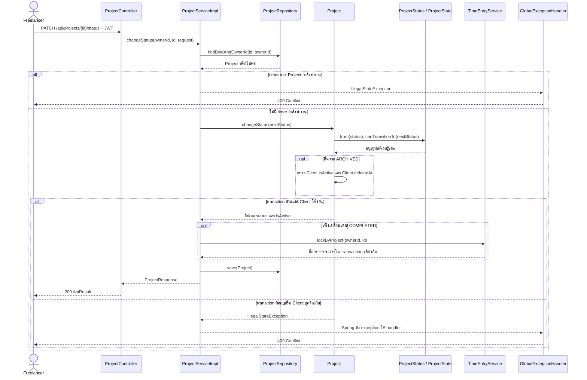

# Use Cases: Project และ Task Management

**เจ้าของ feature:** `kantavit_673380027-4_01`  
**ขอบเขต:** Project และ Task ของผู้ใช้ที่เข้าสู่ระบบ รวมข้อมูลสรุปที่ส่งให้ Dashboard
**อ้างอิง requirement:** `FR-PRJ-01` ถึง `FR-PRJ-07` ใน `REQUIREMENTS.md`

## Actor และกติกาที่ใช้ร่วมกัน

**Actor หลัก:** Freelancer ที่เข้าสู่ระบบ ระบบอ่าน `ownerId` จากผู้ใช้ปัจจุบัน ไม่รับจาก request และตรวจความเป็นเจ้าของก่อนอ่านหรือแก้ Project/Task โดย ID ที่ส่งผ่าน API เป็น UUID

เส้น Project และ Task หลักคืนรูปแบบ `ApiResult` (`success`, `message`, `data`, `meta`, `error`) รายการที่แบ่งหน้าจะใส่ `page`, `limit`, `total`, `totalPages` ใน `meta` ส่วนเส้น Task แบบซ้อนบางเส้นที่ยังเปิดใช้อยู่คืน `TaskResponse` ตรง ๆ ตามโค้ดปัจจุบัน

## Use Case Summary

| ID | Use Case | Endpoint หลัก | ผลลัพธ์ |
|---|---|---|---|
| UC-PRJ-01 | สร้าง Project | `POST /api/projects` | `201`, `ApiResult<ProjectResponse>` และ `Location` |
| UC-PRJ-02 | ค้นหา/แสดงรายการ Project | `GET /api/projects` | `200`, รายการ `ProjectListItemResponse` และ `meta` |
| UC-PRJ-03 | ดู Project รายตัว | `GET /api/projects/{id}` | `200`, `ProjectListItemResponse` |
| UC-PRJ-04 | แก้รายละเอียด Project | `PUT /api/projects/{id}` | `200`, `ProjectResponse` |
| UC-PRJ-05 | เปลี่ยนสถานะ Project | `PATCH /api/projects/{id}/status` | `200`, `ProjectResponse` |
| UC-PRJ-06 | ลบ Project แบบ soft delete | `DELETE /api/projects/{id}` | `200`, `ApiResult` |
| UC-TSK-01 | สร้าง Task ใน Project | `POST /api/projects/{projectId}/tasks` | `201`, `TaskResponse` และ `Location` |
| UC-TSK-02 | แสดงรายการ Task ใน Project | `GET /api/projects/{projectId}/tasks` | `200`, รายการ `TaskResponse` และ `meta` |
| UC-TSK-03 | ดู Task รายตัว | `GET /api/tasks/{taskId}` | `200`, `TaskResponse` |
| UC-TSK-04 | แก้ Task | `PUT /api/tasks/{taskId}` | `200`, `TaskResponse` |
| UC-TSK-05 | เปลี่ยนสถานะ Task | `PATCH /api/tasks/{taskId}/status` | `200`, `TaskResponse` |
| UC-TSK-06 | เรียงลำดับ Task | `PATCH /api/projects/{projectId}/tasks/reorder` | `200`, `TaskResponse` |
| UC-TSK-07 | ลบ Task แบบ soft delete | `DELETE /api/tasks/{taskId}` | `200`, `ApiResult` |

## Project use cases

### UC-PRJ-01 สร้าง Project

1. ส่ง `clientId` และ `name` (บังคับ) พร้อม `description`, `startDate`, `endDate`, `color` รูปแบบ `#RRGGBB` และ `targetMinutes` (ถ้ามี)
2. Service ตรวจว่า Client เป็นของผู้ใช้ สร้าง Project ด้วยสถานะเริ่มต้น `PLANNED` แล้วบันทึก
3. คืน `201 Created` พร้อม `Location: /api/projects/{id}` และ `ApiResult<ProjectResponse>`

**ทางเลือก:** request ไม่ถูกต้อง = `400`; ไม่พบ Client ของผู้ใช้ = `404`

### UC-PRJ-02 ค้นหา/แสดงรายการ Project

1. เรียก `GET /api/projects` พร้อม `search` (ชื่อ Project หรือ Client), `clientId`, `status`, `page`, `limit`, `sortBy`, `direction` หรือ `include=tasks`
2. `page` เริ่มที่ 1 ค่าเริ่มต้นคือหน้า 1 ครั้งละ 20 รายการ เรียง `project_name` แบบ `ASC`; `sortBy` รับ `project_name`, `update_at`, `end_date`
3. ไม่ส่ง `status` จะไม่แสดง `ARCHIVED`; `status=ARCHIVED` แสดงเฉพาะสถานะนั้น; `status=ALL` แสดงทุกสถานะรวม `ARCHIVED` แต่ทุกกรณียังตัด Project ที่ `deletedAt` ไม่เป็น null ออก
4. `include=tasks` จะแนบเฉพาะ Task ที่ยังใช้งานของแต่ละ Project; `taskProgress` สรุปจำนวน Task และเปอร์เซ็นต์ที่เสร็จ ส่วน `timeTracking` ส่ง `trackedSeconds`, `trackedHours`, `usagePercent` จาก Time Entry ที่บันทึกเวลาจบแล้วให้อัตโนมัติ ไม่ต้องส่ง `include` เพื่อขอเวลา
5. คืน `ApiResult<List<ProjectListItemResponse>>` พร้อม `meta` สำหรับการแบ่งหน้า

ตัวอย่าง: `GET /api/projects?page=1&limit=10&sortBy=project_name&direction=ASC&status=ALL&include=tasks`

**ทางเลือก:** ไม่มีผลลัพธ์ = `data` เป็นรายการว่าง; ตัวกรองหรือ pagination ไม่ถูกต้อง = `400`
**Postcondition:** ไม่แก้ข้อมูลและไม่แสดง Project ของผู้ใช้อื่น

### UC-PRJ-03 ดู Project รายตัว

1. ส่ง UUID ของ Project; Service ค้นด้วย `projectId` และ `ownerId` โดยไม่คืนรายการที่ soft delete แล้ว
2. คืน `ProjectListItemResponse` พร้อมข้อมูล Client, `taskProgress` และ `timeTracking` แบบเดียวกับรายการ Project; ไม่มี `recentTimeEntries` ใน response นี้

**ทางเลือก:** ไม่พบ Project หรือไม่ใช่เจ้าของ = `404`

### UC-PRJ-04 แก้รายละเอียด Project

1. ส่ง `PUT /api/projects/{id}` โดย request ต้องมี `clientId` และ `name`; ส่งรายละเอียดอื่นได้เหมือนตอนสร้าง
2. Service ตรวจ Project ของผู้ใช้ก่อน หากเป็น `ARCHIVED` จะปฏิเสธการแก้ไข; กรณีที่แก้ได้จึงตรวจ Client อัปเดตรายละเอียด และคืน `ApiResult<ProjectResponse>`

**ทางเลือก:** request ไม่ถูกต้อง = `400`; ไม่พบ Project/Client ของผู้ใช้ = `404`; Project เป็น `ARCHIVED` = `409`
**Postcondition:** รายละเอียดเปลี่ยน แต่การเปลี่ยนสถานะเป็น use case แยก

### UC-PRJ-05 เปลี่ยนสถานะ Project

1. ส่ง `PATCH /api/projects/{id}/status` พร้อม `status` ใหม่; Service ตรวจว่าไม่มี timer ของ Project นี้กำลังทำงานก่อนเปลี่ยนสถานะ
2. `Project.changeStatus()` ให้ State ของสถานะปัจจุบันตรวจ transition ก่อนบันทึก: `PLANNED → ACTIVE/ARCHIVED`, `ACTIVE → ON_HOLD/COMPLETED/ARCHIVED`, `ON_HOLD → ACTIVE/ARCHIVED`, `COMPLETED → ARCHIVED`, `ARCHIVED → ACTIVE/PLANNED`; การคืนจาก `ARCHIVED` ทำได้ต่อเมื่อ Client ยังใช้งาน (`isActive=true`) และไม่ถูก soft delete (`deletedAt=null`); ส่งสถานะเดิมซ้ำได้
3. ถ้าเพิ่งเปลี่ยนจากสถานะอื่นเป็น `COMPLETED`, Service เรียก `TimeEntryService.lockByProject(ownerId, projectId)` ก่อนบันทึก Project ภายใน transaction เดียวกัน รายการเวลาที่มีอยู่ของ Project จะถูกล็อกและแก้หรือลบไม่ได้; การส่ง `COMPLETED` ซ้ำไม่ล็อกซ้ำ
4. เมื่อเป็น `ARCHIVED` จะตั้ง `isActive=false`; เมื่อเปลี่ยนจาก `ARCHIVED` กลับ `ACTIVE` หรือ `PLANNED` จะตั้ง `isActive=true` การเปลี่ยนสถานะนี้ไม่ตั้ง `deletedAt`

**ทางเลือก:** สถานะไม่ถูกต้อง = `400`; ไม่พบ Project = `404`; transition ผิดกฎ, Client ถูกจัดเก็บ/soft delete หรือ timer ของ Project กำลังทำงาน = `409`

**Postcondition ของการเปลี่ยนเป็น COMPLETED:** รายการเวลาที่ถูกล็อกแล้วจะถูก API ปฏิเสธหากพยายามแก้หรือลบ (`409`)

### UC-PRJ-06 ลบ Project แบบ soft delete

1. ส่ง `DELETE /api/projects/{id}`; Service ตรวจเจ้าของแล้วเรียก `Project.archive()`
2. Entity ตั้งสถานะ `ARCHIVED`, `isActive=false` และ `deletedAt` แล้วคืน `200 ApiResult` โดย `data=null`

**Postcondition:** แถวยังอยู่ในฐานข้อมูล แต่ไม่ปรากฏใน Project list แม้ส่ง `status=ALL`

## Task use cases

### UC-TSK-01 สร้าง Task

ส่ง `name`, `sortOrder` (เริ่มที่ 0) และ `description` ถ้ามี Service ตรวจเจ้าของ Project และ `project.canEditTasks()` จากนั้นแทรก Task ในตำแหน่งที่ระบุ จัดลำดับ Task ที่ยังใช้งาน แล้วคืน `201 ApiResult<TaskResponse>` พร้อม `Location: /api/tasks/{taskId}` หากตำแหน่งไม่ถูกต้องได้ `400`; หากสถานะ Project ห้ามแก้ Task ได้ `409`

### UC-TSK-02 แสดงรายการ Task

`GET /api/projects/{projectId}/tasks` รับ `is_active` (ค่าเริ่มต้น `true`), `page` (เริ่มที่ 1), `limit` และ `sort` คืน `ApiResult<List<TaskResponse>>` พร้อม `meta` หากไม่กำหนด sort จะเรียง `sortOrder` จากน้อยไปมาก

### UC-TSK-03 ดู Task รายตัว

`GET /api/tasks/{taskId}` ตรวจเจ้าของผ่าน Project แล้วคืน `ApiResult<TaskResponse>`; route เก่า `GET /api/projects/{projectId}/tasks/{taskId}` ถูกคอมเมนต์ปิดแล้ว

### UC-TSK-04 แก้ Task

`PUT /api/tasks/{taskId}` รับ `name` และ `description` ตรวจ `project.canEditTasks()` แล้วคืน `ApiResult<TaskResponse>` หาก Project เป็น `COMPLETED` หรือ `ARCHIVED` จะไม่อนุญาตให้แก้ (`409`)

### UC-TSK-05 เปลี่ยนสถานะ Task

`PATCH /api/tasks/{taskId}/status` ใช้ enum ของ Task เอง (`OPEN`, `IN_PROGRESS`, `COMPLETED`) ไม่ใช้ `ProjectStatus`: `OPEN → IN_PROGRESS/COMPLETED`, `IN_PROGRESS → COMPLETED`, `COMPLETED → IN_PROGRESS` เท่านั้นเมื่อย้อนงาน; ย้อนเป็น `OPEN` ไม่ได้ การย้อนจะล้าง `completedAt` เป็น `null` และหากทำเสร็จอีกครั้งจะบันทึกเวลาใหม่ การส่งสถานะเดิมซ้ำจะไม่เปลี่ยนข้อมูล Service ตรวจ `project.canEditTasks()` ก่อนเปลี่ยนสถานะ จึงไม่ให้ย้อน Task ใน Project ที่ `COMPLETED` หรือ `ARCHIVED` (`409`)

### UC-TSK-06 เรียงลำดับ Task

`PATCH /api/projects/{projectId}/tasks/reorder` รับ `taskId` กับ `sortOrder` ซึ่งเริ่มจาก 0 Service ตรวจเจ้าของและสิทธิ์แก้ Task ย้ายตำแหน่งเฉพาะ Task ที่ยังใช้งาน แล้วคืน `ApiResult<TaskResponse>`

### UC-TSK-07 ลบ Task แบบ soft delete

`DELETE /api/tasks/{taskId}` ตรวจเจ้าของและ `project.canEditTasks()` ก่อนตั้ง `isActive=false`, `deletedAt` และจัดลำดับ Task ที่เหลือใหม่ โดยเก็บ Time Entry เดิมไว้ คืน `200 ApiResult` โดย `data=null`

**เส้นเดิมที่ยังเปิดอยู่:** `PATCH /api/projects/{projectId}/tasks/{taskId}` (แก้), `PATCH /api/projects/{projectId}/tasks/{taskId}/complete` (ปิด), `PATCH /api/projects/{projectId}/tasks/{taskId}/reorder` (ย้าย) และ `DELETE /api/projects/{projectId}/tasks/{taskId}` ยังทำงาน แต่บางเส้นคืน `TaskResponse` ตรง ๆ หรือ `204` ต่างจากเส้นหลักด้านบน ส่วน route `/start` ถูกคอมเมนต์ปิดแล้ว

## ข้อมูลสำหรับ Dashboard และความคืบหน้าเวลา

- `ProjectService.countActiveAndCompleted(ownerId)` คืนจำนวน `ACTIVE`, `COMPLETED` และผลรวมผ่าน `totalCount()`; เป็น service method ไม่ใช่ endpoint ใหม่
- `ProjectService.getProgress(ownerId, projectId)` คืน `targetMinutes`, `trackedSeconds`, `progressPercent` และระดับ `NO_TARGET`, `BELOW_80`, `REACHED_80`, `REACHED_100`; ถ้าไม่มีเป้าหมายยังคืนเวลาที่บันทึกได้ แต่เปอร์เซ็นต์เป็น `null`
- `TaskService.getLatestTimeEntryTaskName(ownerId)` อ่านชื่อ Task ของ Time Entry ล่าสุดตาม `startedAt` และคืน `Optional.empty()` หากไม่มีรายการหรือรายการล่าสุดไม่ผูก Task; เป็น service method ไม่ใช่ endpoint ใหม่
- เมื่อหยุด timer ระบบรับ `TimerStoppedEvent` หลัง transaction commit แล้วตรวจว่าข้ามเกณฑ์ 80%/100% หรือไม่ จากนั้นเผยแพร่ `ProjectProgressThresholdEvent`; listener ปัจจุบัน **บันทึก log เท่านั้น** ยังไม่มี notification ที่ส่งถึงผู้ใช้หรือเก็บลงฐานข้อมูล

## Sequence: เปลี่ยนสถานะ Project

```mermaid
sequenceDiagram
    actor F as Freelancer
    participant C as ProjectController
    participant S as ProjectServiceImpl
    participant R as ProjectRepository
    participant P as Project
    participant ST as ProjectStates / ProjectState
    participant TE as TimeEntryService
    participant H as GlobalExceptionHandler
    F->>C: PATCH /api/projects/{id}/status + JWT
    C->>S: changeStatus(ownerId, id, request)
    S->>R: findByIdAndOwnerId(id, ownerId)
    R-->>S: Project หรือไม่พบ
    alt timer ของ Project กำลังทำงาน
        S-->>H: IllegalStateException
        H-->>F: 409 Conflict
    else ไม่มี timer กำลังทำงาน
        S->>P: changeStatus(nextStatus)
        P->>ST: from(status), canTransitionTo(nextStatus)
        ST-->>P: อนุญาตหรือปฏิเสธ
        opt คืนจาก ARCHIVED
            P->>P: ตรวจ Client.isActive และ Client.deletedAt
        end
        alt transition ผ่านและ Client ใช้งาน
            P-->>S: อัปเดต status และ isActive
            opt เพิ่งเปลี่ยนเข้าสู่ COMPLETED
                S->>TE: lockByProject(ownerId, id)
                TE-->>S: ล็อกรายการเวลาใน transaction เดียวกัน
            end
            S->>R: save(Project)
            S-->>C: ProjectResponse
            C-->>F: 200 ApiResult
        else transition ผิดกฎหรือ Client ถูกจัดเก็บ
            P-->>S: IllegalStateException
            S-->>H: Spring ส่ง exception ให้ handler
            H-->>F: 409 Conflict
        end
    end
```

## ขอบเขตปัจจุบัน

- เอกสารนี้อธิบาย Project/Task และ listener ความคืบหน้าที่เกี่ยวกับ Project เท่านั้น ไม่อธิบายการทำงานทั้งหมดของ Timer, Time Entry หรือ Dashboard
- `FR-PRJ-07` มีการตรวจเกณฑ์และเผยแพร่ event แล้ว แต่การแจ้งเตือนถึงผู้ใช้จริงยังไม่ปรากฏในส่วนนี้
- การล็อกรายการเวลาเกิดเมื่อเปลี่ยนเข้าสู่ `COMPLETED` ครั้งใหม่; Project ที่เป็น `COMPLETED` อยู่ก่อนเพิ่ม flow นี้ไม่ได้ถูกล็อกย้อนหลังโดยอัตโนมัติ
