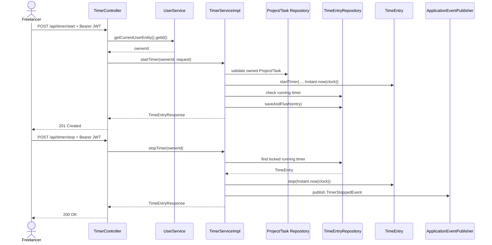

# Use Case: Time Tracking

**เจ้าของ feature:** `kompat_673380262-4_02`  
**อ้างอิง requirement:** `FR-TIME-01` ถึง `FR-TIME-09` และ `BR-01` ถึง `BR-08` ใน `REQUIREMENTS.md`

## Actor และเงื่อนไขร่วม

**Actor หลัก:** Freelancer ที่เข้าสู่ระบบด้วย JWT  
**Precondition ร่วม:** Request มี bearer token ที่ถูกต้อง  
**กติกาการเป็นเจ้าของ:** ระบบดึง owner ID จาก authenticated user ไม่รับ owner ID จาก request และค้นหา Project, Task หรือ Time Entry ภายใต้ owner คนนั้นเสมอ

## Use Case Summary

| ID | Use Case | Endpoint | ผลลัพธ์หลัก | Requirement |
|---|---|---|---|---|
| UC-TIME-01 | Start Timer | `POST /api/timer/start` | สร้าง running timer และคืน `201 TimeEntryResponse` | FR-TIME-01, FR-TIME-02, FR-TIME-03 |
| UC-TIME-02 | View Current Timer | `GET /api/timer/current` | คืน timer ที่กำลังทำงาน (`200`) | FR-TIME-01, FR-TIME-02 |
| UC-TIME-03 | Stop Timer | `POST /api/timer/stop` | บันทึกเวลาสิ้นสุด คำนวณ duration และคืน `200 TimeEntryResponse` | FR-TIME-01, FR-TIME-03, FR-TIME-08 |
| UC-TIME-04 | Cancel Timer | `DELETE /api/timer/current` | ลบ running timer และคืน `204` | FR-TIME-01 |
| UC-TIME-05 | Create Manual Time Entry | `POST /api/time-entries` | สร้าง completed entry และคืน `201 TimeEntryResponse` | FR-TIME-03, FR-TIME-04 |
| UC-TIME-06 | List and Filter Time Entries | `GET /api/time-entries` | คืนรายการแบบ pagination พร้อม filter และ sort (`200`) | FR-TIME-06, FR-TIME-07 |
| UC-TIME-07 | Summarize Time Entries | `GET /api/time-entries/summary` | คืนจำนวนรายการและผลรวม duration ของรายการที่จบแล้ว (`200`) | FR-TIME-08 |
| UC-TIME-08 | Update Time Entry | `PATCH /api/time-entries/{id}` | แก้รายการของ owner ที่ไม่ถูกล็อกและคืนข้อมูลล่าสุด (`200`) | FR-TIME-05 |
| UC-TIME-09 | Delete Time Entry | `DELETE /api/time-entries/{id}` | ลบ completed entry ที่ไม่ถูกล็อกและคืน `204` | FR-TIME-05 |

## UC-TIME-01 Start Timer

1. Freelancer ส่ง `projectId`, optional `taskId` และ optional `description`
2. Controller validate `StartTimerRequest` และอ่าน owner ID จากผู้ใช้ที่เข้าสู่ระบบ
3. Service ตรวจว่า User และ Project มีอยู่จริง โดย Project ต้องเป็นของ owner
4. หากส่ง Task ระบบตรวจว่า Task อยู่ใน Project และเป็นของ owner คนเดียวกัน
5. Entity ตรวจว่า Project และ Client อยู่ในสถานะ `ACTIVE` และใช้เวลาจาก server ผ่าน `Clock`
6. Service ตรวจว่า owner ยังไม่มี running timer แล้วบันทึกรายการชนิด `TIMER`
7. Controller คืน `201 Created`, `TimeEntryResponse` และ `Location: /api/time-entries/{id}`

**Alternative flow:** ไม่มี JWT = `401`; Project/Task ไม่พบหรือไม่ใช่ของ owner = `404`; Project หรือ Client ไม่อยู่ในสถานะ `ACTIVE` = `409`; มี running timer อยู่แล้ว = `409`; request ไม่ถูกต้อง = `400`  
**Postcondition:** มี Time Entry ที่มี `startedAt` แต่ยังไม่มี `endedAt` และ `durationMinutes`; owner มี running timer ได้ไม่เกินหนึ่งรายการ

## UC-TIME-02 View Current Timer

1. Freelancer เรียก `GET /api/timer/current`
2. Service ค้นหารายการชนิด `TIMER` ของ owner ที่ยังไม่มี `endedAt`
3. Mapper สร้าง `TimeEntryResponse` ซึ่งระบุ `running = true`
4. Controller คืน `200 OK`

**Alternative flow:** ไม่มี JWT = `401`; ไม่มี running timer = `404`  
**Postcondition:** ไม่มีการเปลี่ยนข้อมูล

## UC-TIME-03 Stop Timer

1. Freelancer เรียก `POST /api/timer/stop`
2. Service ค้นหา running timer ของ owner ด้วย pessimistic write lock ภายใน transaction
3. Entity กำหนด `endedAt` จาก server clock และคำนวณ `durationMinutes` โดยปัดเศษวินาทีขึ้นเป็นนาที
4. Service เผยแพร่ `TimerStoppedEvent`
5. Controller คืน `200 TimeEntryResponse` โดย `running = false`

**Alternative flow:** ไม่มี JWT = `401`; ไม่มี running timer = `404`  
**Postcondition:** Timer กลายเป็น completed entry และมี `startedAt`, `endedAt` และ `durationMinutes`

## UC-TIME-04 Cancel Timer

1. Freelancer เรียก `DELETE /api/timer/current`
2. Service ค้นหาและล็อก running timer ของ owner ภายใน transaction
3. Repository ลบรายการดังกล่าว
4. Controller คืน `204 No Content`

**Alternative flow:** ไม่มี JWT = `401`; ไม่มี running timer = `404`  
**Postcondition:** Running timer ถูกลบโดยไม่สร้าง completed entry และไม่เผยแพร่ `TimerStoppedEvent`

## UC-TIME-05 Create Manual Time Entry

1. Freelancer ส่ง `projectId`, optional `taskId`, optional `description`, `startedAt` และเลือกส่งอย่างใดอย่างหนึ่งระหว่าง `endedAt` หรือ `durationMinutes`
2. Controller validate ว่ามีวิธีกำหนดเวลาสิ้นสุดเพียงแบบเดียวและเวลาสิ้นสุดอยู่หลังเวลาเริ่ม
3. Service ตรวจ User, Project, Task และ owner relationship
4. Entity สร้างรายการชนิด `MANUAL`; หากส่ง duration ระบบคำนวณ `endedAt` หรือหากส่งช่วงเวลาระบบคำนวณ duration
5. Repository บันทึก แล้ว controller คืน `201 Created` พร้อม `Location`

**Alternative flow:** ไม่มี JWT = `401`; Project/Task ไม่พบหรือไม่ใช่ของ owner = `404`; ไม่ส่งหรือส่งทั้ง `endedAt` และ `durationMinutes` = `400`; duration ไม่เป็นบวกหรือช่วงเวลาไม่ถูกต้อง = `400`  
**Postcondition:** มี completed manual entry ที่ duration มากกว่า 0; การบันทึกย้อนหลังไม่บังคับให้ Project เป็น `ACTIVE`

## UC-TIME-06 List and Filter Time Entries

1. Freelancer เรียก `GET /api/time-entries` พร้อม query parameter ที่ต้องการ ได้แก่ `clientId`, `projectId`, `taskId`, `entryType`, `from`, `to`, `page`, `size`, `sortBy` และ `direction`
2. Query service เริ่มเงื่อนไขด้วย owner ID เสมอ แล้วจึงเพิ่ม filter ที่ส่งมา
3. ช่วงเวลาใช้ `from` แบบ inclusive และ `to` แบบ exclusive กับ `startedAt`
4. Repository คืน `Page<TimeEntry>` และ mapper แปลงเป็น `Page<TimeEntryResponse>`
5. Controller คืน `200 OK` พร้อม pagination metadata

**Alternative flow:** ไม่มีผลลัพธ์ = page ว่าง; `from` ไม่น้อยกว่า `to`, page/size, sort field หรือ direction ไม่ถูกต้อง = `400`; ไม่มี JWT = `401`  
**Postcondition:** ไม่มีการเปลี่ยนข้อมูลและไม่แสดง Time Entry ของผู้ใช้อื่น

## UC-TIME-07 Summarize Time Entries

1. Freelancer เรียก `GET /api/time-entries/summary` พร้อม filter ชุดเดียวกับรายการ
2. Query service จำกัดข้อมูลด้วย owner และ filter ที่ระบุ
3. ระบบนับเฉพาะรายการที่มี `endedAt` และ `durationMinutes` จึงไม่นับ running timer
4. ระบบคืน `entryCount`, `totalMinutes`, `from` และ `to` ใน `TimeEntrySummaryResponse`

**Alternative flow:** ไม่มีรายการที่เข้าเงื่อนไข = `entryCount` และ `totalMinutes` เป็น `0`; ช่วงเวลาไม่ถูกต้อง = `400`; ไม่มี JWT = `401`  
**Postcondition:** ไม่มีการเปลี่ยนข้อมูลและไม่มีการคำนวณมูลค่าเงิน

## UC-TIME-08 Update Time Entry

1. Freelancer ส่ง UUID ของรายการและฟิลด์ที่ต้องการแก้ ได้แก่ Project, Task, description หรือช่วงเวลา
2. Controller validate ว่ามีอย่างน้อยหนึ่งฟิลด์; การแก้ช่วงเวลาต้องส่งทั้ง `startedAt` และ `endedAt`; `taskId` ใช้พร้อม `clearTask = true` ไม่ได้
3. Service ค้นหารายการด้วย `entryId` และ `ownerId` แล้วตรวจว่าไม่ถูกล็อก
4. หากเปลี่ยน Project หรือ Task ระบบตรวจ owner และ task-project relationship อีกครั้ง
5. Entity แก้ข้อมูลและคำนวณ duration ใหม่เมื่อช่วงเวลาเปลี่ยน
6. Controller คืน `200 TimeEntryResponse`

**Alternative flow:** ไม่พบหรือเป็นของผู้ใช้อื่น = `404`; รายการถูกล็อก = `409`; ช่วงเวลาไม่ถูกต้องหรือ request ว่าง = `400`; พยายามแก้ช่วงเวลาของ running timer = `409`; Project/Task ไม่ถูกต้อง = `404`; ไม่มี JWT = `401`  
**Postcondition:** แก้เฉพาะฟิลด์ที่ระบุ; การเปลี่ยน Project โดยไม่ส่ง Task จะล้าง Task เดิม

## UC-TIME-09 Delete Time Entry

1. Freelancer ส่ง UUID ไปที่ `DELETE /api/time-entries/{id}`
2. Service ค้นหารายการด้วย `entryId` และ `ownerId`
3. Service ปฏิเสธรายการที่ถูกล็อกหรือ timer ที่ยังทำงาน
4. Repository ลบ completed entry แล้ว controller คืน `204 No Content`

**Alternative flow:** ไม่พบหรือเป็นของผู้ใช้อื่น = `404`; รายการถูกล็อก = `409`; รายการเป็น running timer = `409` และต้องใช้ cancel timer flow; ไม่มี JWT = `401`  
**Postcondition:** Completed entry ถูกลบออกจากระบบ

## Sequence: Start และ Stop Timer

## ขอบเขตที่ยังไม่เสร็จ

- `FR-TIME-09` การคัดลอกรายการเดิมเพื่อบันทึกซ้ำยังไม่มี endpoint หรือ service operation
- `FR-TIME-06` รองรับรายวันและรายสัปดาห์ผ่านการส่งขอบเขต `from/to` แต่ยังไม่มี endpoint ที่จัดกลุ่มผลลัพธ์เป็นวันหรือสัปดาห์โดยตรง
- `BR-07` ใช้ `Instant` สำหรับเวลา UTC แต่การแสดงผลตาม timezone ของผู้ใช้เป็นหน้าที่ของ client และยังไม่มี user-timezone conversion ใน Time Tracking API
- Entity รองรับ `lockedAt` และ service ป้องกันการแก้หรือลบรายการที่ล็อก แต่ยังไม่มี API ใน Time Tracking สำหรับสั่ง lock รายการ
- Audit event สำหรับการแก้ไข Time Entry ตาม non-functional requirement ยังไม่ได้แสดงใน implementation นี้

**หลักฐานการทดสอบ:** `TimerControllerTest`, `TimeEntryControllerTest`, `TimerServiceImplTest`, `TimeEntryServiceImplTest`, `TimeEntryQueryServiceImplTest`, `TimeEntryRepositoryTest` และ `TimeEntryIntegrationTest` ภายใต้ `code/Backend/src/test/java/th/ac/kku/freelance_hub/`
