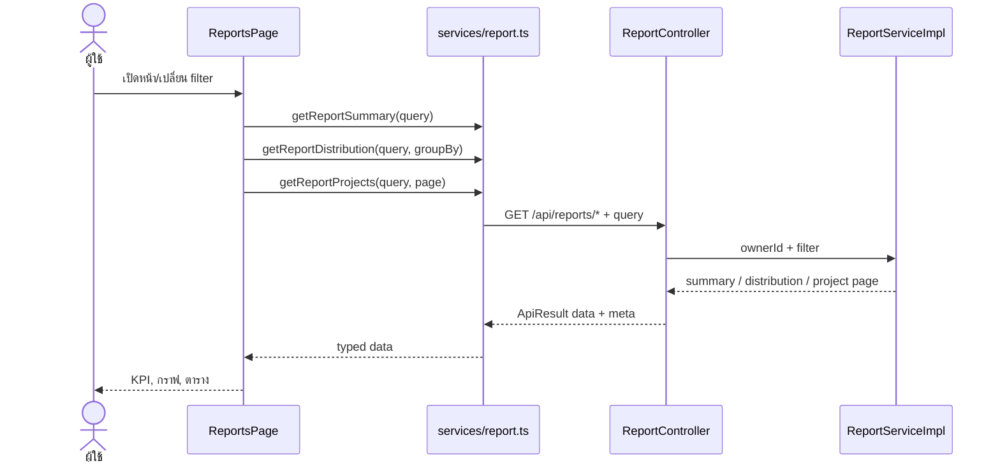

# Use Case: Dashboard/Analytics และ Frontend

**เจ้าของ feature:** `nattadol_673380511-9_02`  
**ขอบเขต:** Dashboard/Reports API และหน้า `/dashboard`, `/reports` ของผู้ใช้ที่เข้าสู่ระบบ รวม KPI, กราฟ, ตัวกรอง, pagination และ CSV เฉพาะหน้าตาราง; current timer เป็นข้อมูลจาก feature อื่นที่ Dashboard นำมาแสดง
**อ้างอิง requirement:** `FR-ANA-01` ถึง `FR-ANA-08` ใน `REQUIREMENTS.md`

## Actor และเงื่อนไขร่วม

**Actor หลัก:** ผู้ใช้ที่เข้าสู่ระบบ (Freelancer)  
**Precondition:** มี access token ที่ใช้งานได้; route อยู่หลัง `ProtectedRoute`  
**ขอบเขตข้อมูล:** Backend อ่าน owner ID จากผู้ใช้ที่ authenticate แล้ว ไม่รับ owner ID จาก query string

## Use Case Summary

| ID | Use Case | Endpoint ที่หน้าเรียก | ผลลัพธ์หลัก |
|---|---|---|---|
| UC-ANA-01 | เปิด Dashboard | `GET /api/dashboard`, `GET /api/timer/current` | KPI, กราฟสัปดาห์, โปรเจกต์ที่กำลังทำ, งานที่ต้องทำ, timer และเวลาล่าสุด |
| UC-ANA-02 | เปลี่ยนช่วงกราฟ Dashboard | `GET /api/dashboard/activity?period=MONTH\|YEAR` | กราฟเดือนหรือปีจากช่วงที่เลือก; `WEEK` ใช้ข้อมูลจาก Dashboard response |
| UC-ANA-03 | หยุด timer จาก Dashboard | `POST /api/timer/stop` แล้ว refresh current timer และ dashboard | เปลี่ยนจาก timer ที่กำลังทำงานเป็นรายการเวลาล่าสุด |
| UC-ANA-04 | เปิด Reports | `GET /api/reports/summary`, `/distribution`, `/projects` | KPI, กราฟเวลาตามลูกค้า, กราฟเทียบเป้าหมาย และตารางโปรเจกต์ |
| UC-ANA-05 | กรอง Reports และเลือกการจัดกลุ่มกราฟเวลา | สามเส้นเดียวกับ UC-ANA-04 พร้อม `from`, `to`, `clientId`, `projectId`; `/distribution` รับ `groupBy=CLIENT|PROJECT` | แสดงข้อมูลตามตัวกรองและสลับกราฟเวลาตามลูกค้าหรือโปรเจกต์ได้ |
| UC-ANA-06 | เปลี่ยนหน้าตาราง Reports | `GET /api/reports/projects?page=N&limit=10` | ใช้ `meta` เพื่อแสดงรายการและกราฟโปรเจกต์ของหน้านั้น |
| UC-ANA-07 | ส่งออก CSV จาก Reports | ไม่มี request เพิ่ม | ดาวน์โหลดรายการโปรเจกต์ของหน้าตารางปัจจุบัน |
| UC-ANA-08 | อ่านแนวโน้มเวลารายงานผ่าน API | `GET /api/reports/work-trend` | คืนจุดเวลาแบบ DAY/WEEK/MONTH; ยังไม่มีส่วนแสดงผลบนหน้า Reports |
| UC-ANA-09 | อ่านรูปแบบการทำงานผ่าน API | `GET /api/reports/work-pattern` | คืนวัน/ชั่วโมงที่ทำงานมากที่สุดและข้อมูลกระจายเวลา; ยังไม่มีส่วนแสดงผลบนหน้า Reports |

ทุก GET API คืน wrapper `{success, message, data, meta, error}`; `/reports/projects` ใช้ `meta` สำหรับ pagination ส่วน current timer เป็น endpoint ที่ Dashboard ใช้ร่วมกับ Topbar โดยไม่ถือว่าการพัฒนา Timer API เป็นขอบเขต Analytics

## UC-ANA-01 เปิด Dashboard

1. ผู้ใช้เปิด `/dashboard`; `DashboardProvider` โหลด `/api/dashboard` และ `TimerProvider` มี current timer ส่วนกลาง
2. หน้าแสดง KPI 4 ใบ: เวลาที่บันทึกสัปดาห์นี้และเทียบสัปดาห์ก่อน, การใช้ชั่วโมงเป้าหมาย, จำนวนโปรเจกต์ active, งานที่เสร็จแล้วต่อทั้งหมด
3. กราฟเริ่มต้นเป็น `WEEK` โดยอ่าน `dailyWork` ย้อนหลัง 7 วันจาก dashboard response และแสดงเวลาเป็นวินาที/นาที/ชั่วโมงตามขนาดค่า; KPI สัปดาห์นี้ใช้ช่วงตั้งแต่วันจันทร์ถึงปัจจุบัน
4. ตารางโปรเจกต์แสดงชื่อ ลูกค้า ความคืบหน้า จำนวนงานที่เสร็จ และสถานะ; ตารางงานแสดงงานที่ยังเปิดพร้อมลิงก์ไปหน้าโปรเจกต์
5. Card ตัวจับเวลาแสดง timer ที่กำลังวิ่งอยู่ หากไม่มีจะแสดงเวลาล่าสุด; ใต้ card แสดง `recentTimeEntries` จาก dashboard response

**Alternative flow:** API หลักผิดพลาด แสดง `ErrorState` พร้อมปุ่มลองใหม่; ยังไม่มีรายการ แสดงข้อความว่าง; task ของ timer หรือรายการล่าสุดเป็น `null` แสดงได้โดยไม่ล้ม  
**Postcondition:** ไม่มีการแก้ข้อมูล ผู้ใช้เห็นข้อมูลของ owner ตนเอง

## UC-ANA-02 เปลี่ยนช่วงกราฟ Dashboard

1. ผู้ใช้เลือก `WEEK`, `MONTH` หรือ `YEAR` จาก select
2. `WEEK` ใช้ `dailyWork` ที่โหลดไว้ ไม่เรียก activity endpoint เพิ่ม
3. `MONTH` หรือ `YEAR` เรียก `/api/dashboard/activity?period=...`
4. `dashboardChart.ts` แปลงจุดกราฟและ label ก่อน `ProductivityChart` แสดงผล โดยคงหน่วยวินาทีไว้จนถึงขั้นจัดรูปแบบ

**Alternative flow:** โหลดกราฟไม่สำเร็จ แสดง error เฉพาะกราฟและปุ่มลองใหม่; ระหว่างรอแสดง loading; ค่า 0 แสดงเป็น 0 ได้  
**Postcondition:** เปลี่ยนเฉพาะ state การแสดงผล ไม่มีข้อมูลถูกบันทึก

## UC-ANA-03 หยุด timer จาก Dashboard

1. ถ้ามี running timer, `DashboardTimerCard` แสดง project, optional task, description, เวลาเริ่มและเวลาที่เดินในรูป `HH:mm:ss`
2. ผู้ใช้กด “หยุดจับเวลา”; ระหว่างรอปุ่ม disabled
3. หน้าเรียก `stopTimer()` ที่ feature Timer มีอยู่แล้ว; งาน Analytics คือเชื่อม action เข้ากับการ์ด Dashboard
4. เมื่อสำเร็จ refresh `/api/timer/current` และ `/api/dashboard` เพื่อให้ card กับรายการเวลาล่าสุดตรงกัน

**Alternative flow:** หยุดไม่สำเร็จ แสดง Sonner toast สี error; card ยังคงสถานะที่อ่านได้ล่าสุด  
**Postcondition:** เมื่อ Backend บันทึกสำเร็จ running timer กลายเป็นรายการเวลาที่จบแล้ว

## UC-ANA-04 เปิด Reports

1. ผู้ใช้เปิด `/reports`; วันที่เริ่มและสิ้นสุดว่างทั้งคู่ หมายถึงข้อมูลทุกช่วงเวลา
2. หน้าโหลด summary, distribution แบบ `CLIENT` และ projects หน้า 1 จำกัด 10 รายการ โดยไม่เรียก API ลูกค้า/โปรเจกต์/เวลาแยกมาเพื่อคำนวณเอง
3. summary เติม dropdown และ KPI: เวลารวม, จำนวน Time Entry, จำนวนโปรเจกต์ที่มีเวลาเทียบทั้งหมด, จำนวนลูกค้าที่มีเวลาเทียบทั้งหมด
4. distribution แสดงกราฟแท่งแนวนอน; projects แสดงกราฟแท่งเปอร์เซ็นต์การใช้ชั่วโมงเทียบเป้าหมายและความคืบหน้างาน พร้อมตารางชื่อโปรเจกต์ ลูกค้า เป้าหมาย เวลาที่ใช้ เปอร์เซ็นต์ และสถานะ

**Alternative flow:** ไม่มีข้อมูล แสดง 0/empty state; API ล้มเหลว แสดง error และปุ่มลองใหม่; เมื่อดูทุกช่วงเวลา ค่าแนวโน้มเทียบช่วงก่อนเป็น `null` จึงแสดง “ทุกช่วงเวลา”  
**Postcondition:** ไม่มีการแก้ข้อมูล

## UC-ANA-05 กรอง Reports

1. ผู้ใช้เลือกวันที่ทั้งคู่ หรือเว้นว่างทั้งคู่; อาจเลือกลูกค้าและโปรเจกต์
2. หน้าไม่ส่งค่า `ALL` ไป Backend; เมื่อเปลี่ยนลูกค้าจะล้างโปรเจกต์ที่เคยเลือกและกลับไปหน้า 1
3. เมื่อเปลี่ยน filter หน้าเรียก summary, distribution และ projects ด้วย filter เดียวกัน; เมื่อกดสลับกราฟตามลูกค้าหรือโปรเจกต์ หน้าเรียกเฉพาะ distribution ด้วย `groupBy=CLIENT` หรือ `PROJECT` ตามที่เลือก
4. การเปลี่ยนวันที่หรือโปรเจกต์กลับไปหน้า 1 ของตาราง

**Alternative flow:** กรอกวันที่ข้างเดียวหรือวันที่เริ่มหลังสิ้นสุด แสดงข้อความ error และไม่เรียก API ด้วยช่วงที่ผิด; filter UUID ไม่ใช่ของผู้ใช้/ไม่ตรงกัน Backend ตอบ 404  
**Postcondition:** ผลรายงานถูกจำกัดตาม filter ที่เลือกโดยไม่เปลี่ยนข้อมูลต้นทาง

## UC-ANA-06 เปลี่ยนหน้าตาราง Reports

1. ผู้ใช้กด pagination ของตาราง
2. หน้าเรียก `/api/reports/projects?page=N&limit=10` พร้อม filter ปัจจุบัน
3. ใช้ `meta.page`, `meta.totalPages`, `meta.total` สำหรับปุ่ม pagination และจำนวนรายการ
4. ตารางและกราฟเทียบเป้าหมายเปลี่ยนเป็นโปรเจกต์ของหน้าปัจจุบัน

**Alternative flow:** ไม่มีโปรเจกต์ตาม filter แสดงแถว empty state; โหลดล้มเหลวแสดง error ให้ลองใหม่  
**Postcondition:** ไม่มีการแก้ข้อมูล

## UC-ANA-07 ส่งออก CSV จาก Reports

1. เมื่อหน้าตารางมีข้อมูล ผู้ใช้กด “ส่งออกหน้านี้ CSV”
2. หน้าแปลงแถวปัจจุบันเป็น CSV ด้วย `downloadCsv()` โดย escape เครื่องหมายคำพูดและใส่ BOM สำหรับภาษาไทย
3. Browser ดาวน์โหลดไฟล์; ถ้าไม่มีวันที่ใน filter ใช้ชื่อ `time-report-all.csv`

**Alternative flow:** ไม่มีข้อมูลในหน้าตาราง หรือช่วงวันที่ไม่ถูกต้อง ปุ่ม disabled  
**Postcondition:** ได้ไฟล์เฉพาะรายการในหน้าปัจจุบัน ไม่ใช่ Time Entry ทุกแถวหรือทุกหน้าของรายงาน

## UC-ANA-08 และ UC-ANA-09 Analytics API ที่ยังไม่มี UI

- `GET /api/reports/work-trend` รับ `from` และ `to` ครบคู่ พร้อม `granularity=DAY|WEEK|MONTH` แล้วคืนจุดกราฟตามหน่วยเวลานั้น; หากไม่ระบุช่วงวันที่ Backend ตอบ 400
- `GET /api/reports/work-pattern` รับ filter แบบเดียวกับ Reports และคืนชั่วโมงตามวันในสัปดาห์/ชั่วโมงในวัน พร้อมวันที่และช่วงเวลาที่มากที่สุด; เมื่อดูทุกช่วงเวลา `trackedTimeTrendPercent` เป็น `null`
- ทั้งสอง endpoint จำกัดข้อมูลด้วย owner ปัจจุบัน แต่ `ReportsPage` ยังไม่เรียก จึงไม่อ้างว่าเป็น UI ที่เสร็จแล้ว

## Sequence: โหลด Reports และเปลี่ยน filter

## ขอบเขตที่ยังไม่ครบตาม requirement

- หน้า Dashboard ปัจจุบันเน้น KPI สัปดาห์นี้ ยังไม่มี KPI แยก “วันนี้” และ “เดือนนี้” ตาม `FR-ANA-01` และไม่มีปุ่มเริ่ม/กลับมาจับเวลาบน Dashboard โดยตรง
- `GET /api/reports/work-trend` และ `/work-pattern` มีใน Backend และ service ฝั่ง Frontend แต่หน้า Reports ปัจจุบันยังไม่แสดงกราฟแนวโน้ม ค่าเฉลี่ยรายวัน วัน/ช่วงเวลาที่ทำงานมากที่สุด หรือ productivity trend ทุกมิติตาม `FR-ANA-05`/`FR-ANA-07`
- CSV ปัจจุบันส่งออกตารางโปรเจกต์เฉพาะหน้าที่เห็น ไม่ใช่รายงาน Time Entry ทุกแถวตาม `FR-ANA-08`
- งานที่ต้องทำใน Dashboard ยังไม่แสดง due date; ข้อมูล `DashboardOpenTask` ปัจจุบันไม่มีฟิลด์นี้

**หลักฐานการทดสอบ:** `code/Frontend/src/Analytics/dashboardChart.test.ts`, `dashboard.test.tsx`, `code/Frontend/src/services/report.test.ts`, `code/Backend/src/test/java/th/ac/kku/freelance_hub/integration/DashboardIntegrationTest.java` และ `ReportIntegrationTest.java`
