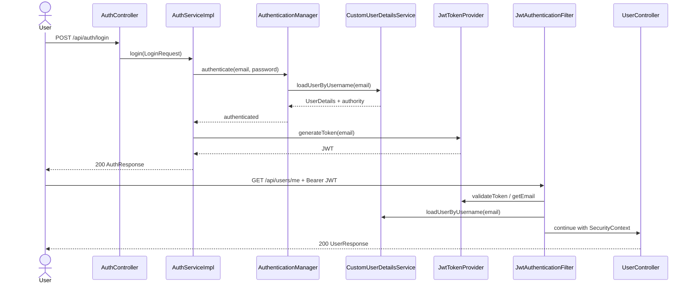

# Use Case: Authentication และ User/Profile

**เจ้าของ feature:** `petpinyo_673380073-7_02`

## Actors

| Actor | หน้าที่ |
|---|---|
| Guest | สมัครสมาชิกและเข้าสู่ระบบ |
| Authenticated User | ออกจากระบบและดู profile ของตนเอง |
| Admin | ดูข้อมูล user ตาม id |
| Spring Security/JWT | ตรวจ token, โหลด user และกำหนด SecurityContext |

## Use Case Summary

| ID | Use Case | Actor | Endpoint | ผลลัพธ์ |
|---|---|---|---|---|
| UC-AUTH-01 | Register | Guest | `POST /api/auth/register` | สร้าง User + UserProfile, hash password และคืน JWT (`201`) |
| UC-AUTH-02 | Login | Guest | `POST /api/auth/login` | ตรวจ credentials และคืน JWT (`200`) |
| UC-AUTH-03 | Logout | Authenticated User | `POST /api/auth/logout` | revoke token JTI และคืน `204` |
| UC-USER-01 | View My Profile | Authenticated User | `GET /api/users/me` | คืนข้อมูล User + Profile ของตนเอง (`200`) |
| UC-USER-02 | View User by ID | Admin | `GET /api/users/{id}` | คืน user ที่ร้องขอ หรือ `404`; role อื่นได้ `403` |

## UC-AUTH-01 Register

**Precondition:** Guest ยังไม่มี account ที่ใช้อีเมลเดียวกัน

**Main flow:**

1. ส่ง email, password, display name และข้อมูล profile
2. Controller ตรวจ `@Valid RegisterRequest`
3. Service ตรวจ `existsByEmail`
4. `PasswordEncoder` hash password
5. `UserMapper` สร้าง `UserProfile` และ `User.setProfile` link แบบ bidirectional
6. `UserRepository.save` บันทึก User + Profile ผ่าน cascade
7. สร้าง JWT และคืน `AuthResponse`

**Alternative flow:** validation ไม่ผ่าน = `400`; email ซ้ำ = `409`; ระบบผิดพลาด = `500`

**Acceptance criteria:** password ห้ามเป็น plain text, email ซ้ำต้องถูกปฏิเสธ,
response ห้ามเผย `passwordHash`, profile ต้องเชื่อมกับ user ถูกคน

## UC-AUTH-02 Login

**Precondition:** มี account และ request ผ่าน validation

**Main flow:** Controller เรียก `AuthService.login`; `AuthenticationManager` ตรวจ
credentials ผ่าน `DaoAuthenticationProvider`; `CustomUserDetailsService` โหลด user
ด้วย email; service สร้าง JWT ที่มี subject=email และ JTI; คืน `200 AuthResponse`

**Alternative flow:** validation ไม่ผ่าน = `400`; email/password ไม่ถูกต้อง = `401`

## UC-AUTH-03 Logout

**Precondition:** มี valid bearer token และ authenticated principal

**Main flow:** Filter ตรวจ token; Controller ส่ง token/email ให้ service; service
ตรวจ subject ตรงกับ authenticated email; บันทึก JTI, user และ expiration ใน
`revoked_tokens`; คืน `204 No Content`

**Alternative flow:** token หาย/malformed/expired/revoked = `401`; subject ไม่ตรง =
`400` ตาม handler ปัจจุบัน; JTI เดิมไม่บันทึกซ้ำ

## UC-USER-01 View My Profile

1. เรียก `GET /api/users/me` พร้อม JWT
2. `JwtAuthenticationFilter` ใส่ principal ใน SecurityContext
3. `UserService` อ่าน email จาก context และโหลด User
4. `UserMapper` รวมข้อมูล UserProfile เป็น `UserResponse`
5. คืน `200 OK`

## UC-USER-02 View User by ID

1. Admin เรียก `GET /api/users/{id}` พร้อม JWT
2. `@PreAuthorize("hasRole('ADMIN')")` ตรวจ role
3. Service โหลด user และ map response
4. ไม่พบ user = `404`; ไม่ใช่ admin = `403`

## Sequence: Login และ protected request

## Scope note

Requirement ระบุการแก้ไข profile (`PATCH /api/users/me`) แต่ implementation ปัจจุบัน
มีเฉพาะ GET ใน `UserController.java:21-40` และยังไม่มี update request/service use case
จึงต้องทำเป็นงานถัดไปก่อนประกาศว่า FR-AUTH-04/05 เสร็จสมบูรณ์
