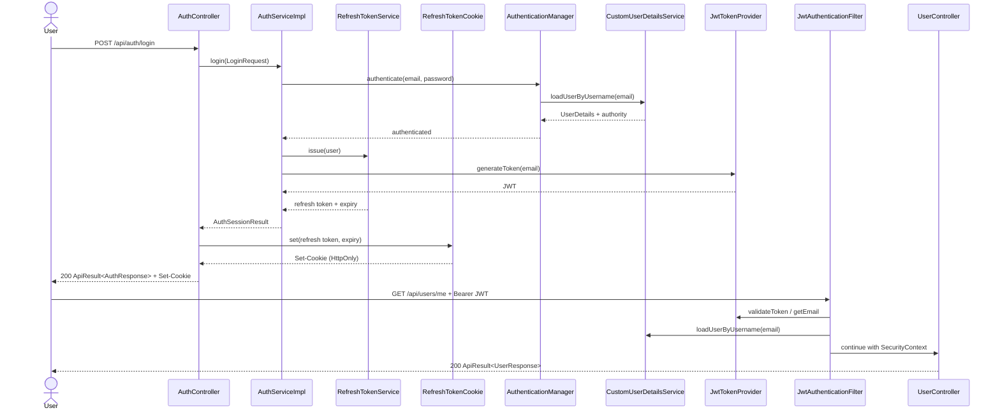

# Use Case: Authentication และ User/Profile

**เจ้าของ feature:** `petpinyo_673380073-7_02`

| ส่วนงาน | โค้ดที่ใช้อ้างอิง |
|---|---|
| Auth endpoints และ HTTP response/cookie | [AuthController.java](../../../code/Backend/src/main/java/th/ac/kku/freelance_hub/controller/AuthController.java#L38) |
| Auth business flow, JWT issuance และ token rotation | [AuthServiceImpl.java](../../../code/Backend/src/main/java/th/ac/kku/freelance_hub/service/impl/AuthServiceImpl.java#L42), [RefreshTokenService.java](../../../code/Backend/src/main/java/th/ac/kku/freelance_hub/service/RefreshTokenService.java#L35) |
| User profile และ password | [UserController.java](../../../code/Backend/src/main/java/th/ac/kku/freelance_hub/controller/UserController.java#L25), [UserService.java](../../../code/Backend/src/main/java/th/ac/kku/freelance_hub/service/UserService.java#L32), [UserMapper.java](../../../code/Backend/src/main/java/th/ac/kku/freelance_hub/mapper/UserMapper.java#L19) |
| Security filter, cookie และ trusted origin | [SecurityConfig.java](../../../code/Backend/src/main/java/th/ac/kku/freelance_hub/config/SecurityConfig.java#L37), [JwtAuthenticationFilter.java](../../../code/Backend/src/main/java/th/ac/kku/freelance_hub/security/JwtAuthenticationFilter.java#L34), [RefreshTokenCookie.java](../../../code/Backend/src/main/java/th/ac/kku/freelance_hub/security/RefreshTokenCookie.java#L17), [TrustedOriginValidator.java](../../../code/Backend/src/main/java/th/ac/kku/freelance_hub/security/TrustedOriginValidator.java#L20) |
| Integration test ของ Auth/User | [UserAuthIntegrationTest.java](../../../code/Backend/src/test/java/th/ac/kku/freelance_hub/integration/UserAuthIntegrationTest.java#L64) |

## Actors

| Actor | หน้าที่ |
|---|---|
| Guest | สมัครสมาชิกและเข้าสู่ระบบ |
| Authenticated User | ออกจากระบบ ดู/แก้ profile และเปลี่ยนรหัสผ่านของตนเอง |
| Application Security | ตรวจ access token, โหลด user และกำหนด SecurityContext สำหรับ endpoint ที่ต้องยืนยันตัวตน |

## Use Case Summary

| ID | Use Case | Actor | Endpoint | ผลลัพธ์ |
|---|---|---|---|---|
| UC-AUTH-01 | Register | Guest | `POST /api/auth/register` | สร้าง User + UserProfile, hash password, ตั้ง refresh cookie และคืน access JWT (`201`) |
| UC-AUTH-02 | Login | Guest | `POST /api/auth/login` | ตรวจ credentials, ตั้ง refresh cookie และคืน access JWT (`200`) |
| UC-AUTH-03 | Logout | User with refresh cookie | `POST /api/auth/logout` | เพิกถอน refresh-token family และคืน `204` |
| UC-AUTH-04 | Refresh | User with refresh cookie | `POST /api/auth/refresh` | หมุน cookie และคืน access JWT ใหม่ (`200`) |
| UC-USER-01 | View My Profile | Authenticated User | `GET /api/users/me` | คืนข้อมูล User + Profile ของตนเอง (`200`) |
| UC-USER-02 | Update My Profile | Authenticated User | `PATCH /api/users/me` | แก้ข้อมูล profile และที่อยู่ (`200`) |
| UC-USER-03 | Change Password | Authenticated User | `PATCH /api/users/me/password` | ตรวจ `oldPassword`, บันทึก `newPassword` เป็น hash (`200`) |

## UC-AUTH-01 Register

**Precondition:** Guest ยังไม่มี account ที่ใช้อีเมลเดียวกัน

**Main flow:**

1. ส่ง email, password, display name และข้อมูล profile ที่รองรับในการสมัคร
2. Controller ตรวจ `@Valid RegisterRequest`
3. Service ตรวจ `existsByEmail`
4. `PasswordEncoder` hash password
5. `UserMapper` สร้าง `UserProfile` และ `User.setProfile` link แบบ bidirectional
6. `UserRepository.save` บันทึก User + Profile ผ่าน cascade
7. สร้าง access JWT และ refresh token; controller ตั้ง refresh token ใน HttpOnly cookie และคืน `ApiResult<AuthResponse>` (`201`)

**Alternative flow:** validation ไม่ผ่าน = `400`; email ซ้ำ = `409`; ระบบผิดพลาด = `500`

**Acceptance criteria:** password ห้ามเป็น plain text, email ถูก trim/lowercase ก่อนบันทึกและ email ซ้ำต่างตัวพิมพ์ต้องถูกปฏิเสธ,
response ห้ามเผย `passwordHash`, profile ต้องเชื่อมกับ user ถูกคน

## UC-AUTH-02 Login

**Precondition:** มี account และ request ผ่าน validation

**Main flow:** Controller เรียก `AuthService.login`; `AuthenticationManager` ตรวจ
credentials ผ่าน `DaoAuthenticationProvider`; service สร้าง access JWT (ค่าเริ่มต้น 15 นาที)
และ refresh token สุ่มอายุสูงสุด 7 วัน Controller ส่ง refresh token ใน HttpOnly cookie
และคืน `200 ApiResult<AuthResponse>` โดยไม่ส่ง refresh token ใน JSON

**Alternative flow:** validation ไม่ผ่าน = `400`; email/password ไม่ถูกต้อง = `401`;
login ผิดครบ 10 ครั้งต่อ email ใน 15 นาที หรือครบ 300 ครั้งต่อนาทีต่อ IP = `429`
พร้อม `Retry-After` และ `LOGIN_RATE_LIMITED`

## UC-AUTH-03 Logout

**Precondition:** ไม่มี; endpoint เปิดให้เรียกโดยไม่ต้องมี access JWT

**Main flow:** Service เพิกถอน refresh-token family จาก cookie, ล้าง cookie และ
คืน `204 No Content`; access JWT ที่มีอยู่ยังใช้ได้จนหมดอายุ (สูงสุด 15 นาที)

**Alternative flow:** ไม่มี cookie หรือ logout ซ้ำยังคืน `204` แบบ idempotent;
`Origin`/`Referer` ไม่อยู่ใน allowlist หรือไม่มีทั้งคู่ = `403`

## UC-AUTH-04 Refresh

`POST /api/auth/refresh` อ่าน HttpOnly cookie, ตรวจ Origin/Referer ก่อนเรียก service,
หมุน token ใน transaction โดยคง
`family_id` และวันหมดอายุเดิม หาก token ถูกใช้แล้วให้เพิกถอนทั้ง family และตอบ `401`
เมื่อสำเร็จ controller ตั้ง refresh cookie ใหม่และคืน `200 ApiResult<AuthResponse>`

## UC-USER-02 Update My Profile

1. ผู้ใช้เรียก `PATCH /api/users/me` พร้อม bearer JWT
2. `JwtAuthenticationFilter` ตรวจ token และใส่ authenticated principal ใน SecurityContext
3. `UserService` อ่าน user จาก principal ไม่รับ `userId` หรือ `ownerId` จาก body
4. Service แก้ข้อมูล profile และที่อยู่ที่ฝังอยู่ใน `user_profiles`; ฟิลด์ที่ไม่ส่งมาคงค่าเดิม
5. Controller คืน `200 ApiResult<UserResponse>` โดยแสดงข้อมูลที่อยู่เป็น flat fields

**Alternative flow:** ไม่มี/malformed JWT = `401`; validation ไม่ผ่าน = `400`

## UC-USER-03 Change Password

**Request body:**

```json
{
  "oldPassword": "รหัสผ่านเดิม",
  "newPassword": "รหัสผ่านใหม่"
}
```

1. ผู้ใช้เรียก `PATCH /api/users/me/password` พร้อม bearer JWT
2. Service โหลด user จาก authenticated principal และตรวจ `oldPassword` ด้วย `PasswordEncoder`
3. เมื่อถูกต้อง ระบบ hash และบันทึก `newPassword`; ห้ามบันทึกรหัสผ่านแบบ plain text
4. คืน `200 ApiResult<Void>`; old password ผิด = `401` และข้อความ `รหัสผ่านไม่ถูกต้อง`, validation หรือ new password ซ้ำค่าเดิม = `400`; เมื่อสำเร็จเพิกถอน refresh-token families ทั้งหมด

MVP นี้ไม่มี forgot/reset-password flow และไม่มีการอัปโหลดหรือเปลี่ยนรูปโปรไฟล์

## UC-USER-01 View My Profile

1. เรียก `GET /api/users/me` พร้อม JWT
2. `JwtAuthenticationFilter` ใส่ principal ใน SecurityContext
3. `UserService` อ่าน email จาก context และโหลด User
4. `UserMapper` รวมข้อมูล UserProfile เป็น `UserResponse`
5. คืน `200 OK`

## Sequence: Login และ protected request


```mermaid
sequenceDiagram
    actor User
    participant C as AuthController
    participant S as AuthServiceImpl
    participant R as RefreshTokenService
    participant Cookie as RefreshTokenCookie
    participant A as AuthenticationManager
    participant D as CustomUserDetailsService
    participant J as JwtTokenProvider
    participant F as JwtAuthenticationFilter
    participant U as UserController

    User->>C: POST /api/auth/login
    C->>S: login(LoginRequest)
    S->>A: authenticate(email, password)
    A->>D: loadUserByUsername(email)
    D-->>A: UserDetails + authority
    A-->>S: authenticated
    S->>R: issue(user)
    S->>J: generateToken(email)
    J-->>S: JWT
    R-->>S: refresh token + expiry
    S-->>C: AuthSessionResult
    C->>Cookie: set(refresh token, expiry)
    Cookie-->>C: Set-Cookie (HttpOnly)
    C-->>User: 200 ApiResult<AuthResponse> + Set-Cookie
    User->>F: GET /api/users/me + Bearer JWT
    F->>J: validateToken / getEmail
    F->>D: loadUserByUsername(email)
    F->>U: continue with SecurityContext
    U-->>User: 200 ApiResult<UserResponse>
```
