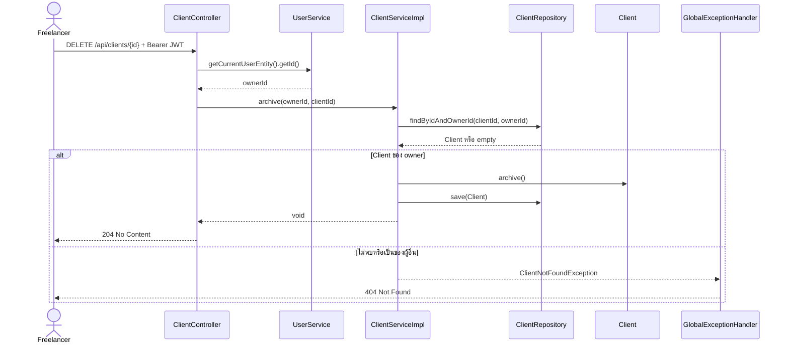

# Use Case: Client Management

**เจ้าของ feature:** `thirawat_673380039-7_02`  
**อ้างอิง requirement:** `FR-CLI-01` ถึง `FR-CLI-05` ใน `REQUIREMENTS.md`

## Actor และเงื่อนไขร่วม

**Actor หลัก:** Freelancer ที่เข้าสู่ระบบด้วย JWT  
**Precondition ร่วม:** Request มี bearer token ที่ถูกต้อง; Client ที่อ่าน/แก้ไข/archive ต้องเป็นของผู้ใช้คนนั้น  
**กติกาการเป็นเจ้าของ:** ระบบดึง owner ID จาก authenticated user ไม่รับ owner ID จาก payload และการหา Client รายตัวใช้ทั้ง `clientId` และ `ownerId`

## Use Case Summary

| ID | Use Case | Endpoint | ผลลัพธ์หลัก | Requirement |
|---|---|---|---|---|
| UC-CLI-01 | Create Client | `POST /api/clients` | สร้าง Client สถานะ `ACTIVE`; คืน `201 ClientResponse` และ `Location` | FR-CLI-01, FR-CLI-02 |
| UC-CLI-02 | List/Search Clients | `GET /api/clients` | คืนหน้ารายการของ owner พร้อม filter, sort และ pagination (`200`) | FR-CLI-03 |
| UC-CLI-03 | View Client | `GET /api/clients/{id}` | คืนข้อมูล Client ของ owner (`200`) | FR-CLI-01 |
| UC-CLI-04 | Update Client | `PATCH /api/clients/{id}` | แก้เฉพาะฟิลด์ที่ส่งมาและคืนข้อมูลล่าสุด (`200`) | FR-CLI-01, FR-CLI-02 |
| UC-CLI-05 | Archive Client | `DELETE /api/clients/{id}` | เปลี่ยนสถานะเป็น `ARCHIVED` โดยไม่ลบ record (`204`) | FR-CLI-01, FR-CLI-05 |

## UC-CLI-01 Create Client

1. Freelancer ส่งชื่อ Client และข้อมูลติดต่อ/บริษัท/ที่อยู่/เลขผู้เสียภาษี/หมายเหตุที่ต้องการ โดยที่อยู่ใช้ flat fields `address`, `subdistrict`, `district`, `province`, `postalCode`
2. Controller ตรวจ `CreateClientRequest` ด้วย `@Valid` และอ่าน owner จากผู้ใช้ที่ล็อกอิน
3. Service โหลด owner, ให้ mapper สร้าง `Client` แล้ว repository บันทึก
4. ระบบคืน `201 Created`, `ClientResponse` และ `Location: /api/clients/{id}`

**Alternative flow:** ไม่มี JWT = `401`; ชื่อว่างหรือข้อมูลผิดรูปแบบ = `400`  
**Postcondition:** มี Client ใหม่ที่ผูกกับ owner ปัจจุบันและสถานะเริ่มต้น `ACTIVE`

## UC-CLI-02 List/Search Clients

1. Freelancer เรียก `GET /api/clients` พร้อม query parameter ที่ต้องการ: `status`, `search`, `page`, `size`, `sortBy`, `direction`
2. Service สร้าง query ที่จำกัด `ownerId` ก่อนเสมอ และเพิ่ม status หรือ prefix search ใน `name`, `companyName`, `email`, `phone` และข้อมูลที่อยู่เมื่อระบุ; ที่อยู่ถูกเก็บผ่าน `addresses` และ `address_id`
3. Repository คืน `Page<Client>`; mapper แปลงเป็น `Page<ClientResponse>` และ controller คืน `200`

**Alternative flow:** ไม่ระบุ status = รวม `ACTIVE` และ `ARCHIVED`; ไม่มีผลลัพธ์ = page ว่าง; filter/page/size/sort ไม่ถูกต้อง = `400`; ไม่มี JWT = `401`  
**Postcondition:** ไม่มีการเปลี่ยนข้อมูล และไม่แสดง Client ของผู้ใช้อื่น

## UC-CLI-03 View Client

1. Freelancer ส่ง UUID ของ Client ไปที่ `GET /api/clients/{id}`
2. Service ค้นด้วย `findByIdAndOwnerId` แล้ว mapper สร้าง `ClientResponse`
3. Controller คืน `200 OK` รวม status ปัจจุบันของ Client

**Alternative flow:** ไม่พบ Client หรือเป็นของผู้ใช้อื่น = `404` แบบเดียวกัน; ไม่มี JWT = `401`  
**Postcondition:** ไม่มีการเปลี่ยนข้อมูล

## UC-CLI-04 Update Client

1. Freelancer ส่ง UUID และฟิลด์ที่ต้องการแก้ด้วย `PATCH /api/clients/{id}`
2. Controller validate `UpdateClientRequest`; service ตรวจ owner ผ่าน `findByIdAndOwnerId`
3. Mapper คงค่าเดิมเมื่อฟิลด์เป็น `null` และส่งค่าที่ระบุไปแก้ entity
4. Repository บันทึก แล้ว controller คืน `200 ClientResponse`

**Alternative flow:** ข้อมูลไม่ถูกต้อง = `400`; ไม่พบ/ไม่ใช่เจ้าของ = `404`; ไม่มี JWT = `401`  
**Postcondition:** เฉพาะข้อมูลที่ส่งมาได้รับการแก้ไข; `status` ไม่ใช่ฟิลด์ของ PATCH

ข้อมูลที่อยู่ของ Client ใช้ contract เดียวกับ User Profile และ response ยังคงแสดงเป็น flat fields
แม้ persistence จะอ้างอิงตาราง `addresses` ผ่าน `address_id`

## UC-CLI-05 Archive Client

1. Freelancer ส่ง UUID ไปที่ `DELETE /api/clients/{id}`
2. Service ตรวจ owner แล้วเรียก `Client.archive()` ให้สถานะเป็น `ARCHIVED`
3. Repository บันทึกโดยไม่ลบแถว; controller คืน `204 No Content`

**Alternative flow:** ไม่พบ/ไม่ใช่เจ้าของ = `404`; ไม่มี JWT = `401`  
**Postcondition:** Client และประวัติที่ผูกอยู่ยังคงอยู่; Client ที่ archive แล้วยังอ่านได้และอยู่ในรายการเมื่อไม่กรอง status

## Sequence: Archive Client

## ขอบเขตที่ยังไม่เสร็จ

- `FR-CLI-04` ต้องแสดงโปรเจกต์และเวลาในหน้ารายละเอียดลูกค้า แต่ `GET /api/clients/{id}` ปัจจุบันคืนเฉพาะ `ClientResponse` ไม่มีข้อมูลโปรเจกต์หรือเวลา
- การค้นหาใน `FR-CLI-03` เป็น prefix search จากชื่อ บริษัท อีเมล เบอร์โทร และที่อยู่ตามรูปแบบที่บันทึกไว้; ยังไม่ใช่การค้นหาแบบตัดช่องว่างหรือเครื่องหมายในเบอร์โทร
- การป้องกันเริ่ม timer ใหม่เมื่อ Client ถูก archive เป็นกติกาข้าม feature ใน `BR-06` ไม่ใช่พฤติกรรมที่ Client API นี้พิสูจน์แล้ว
- ยังไม่พบ Use Case Diagram ใน `doc/diagrams/`; ก่อนรวมเอกสารหลักควรเทียบชื่อ actor/use case กับ diagram ฉบับทีม

**หลักฐานการทดสอบ:** `ClientControllerTest`, `ClientServiceImplTest`, `ClientRepositoryTest` และ `ClientIntegrationTest` ภายใต้ `code/Backend/src/test/java/th/ac/kku/freelance_hub/`
