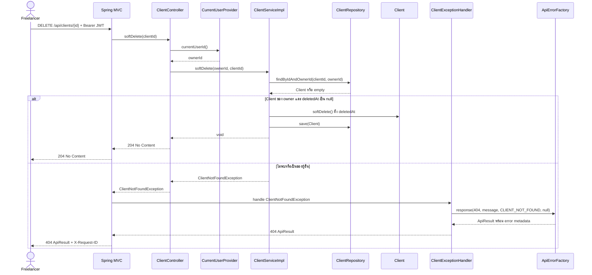

# Use Case: Client Management

**เจ้าของ feature:** `thirawat_673380039-7_02`  
**อ้างอิง requirement:** `FR-CLI-01` ถึง `FR-CLI-05` ใน `REQUIREMENTS.md`

## Actor และเงื่อนไขร่วม

**Actor หลัก:** Freelancer ที่เข้าสู่ระบบด้วย JWT  
**Precondition ร่วม:** Request มี bearer token ที่ถูกต้อง; Client ที่อ่าน/แก้ไข/เปลี่ยนสถานะ/soft delete ต้องเป็นของผู้ใช้คนนั้นและยังไม่ถูก soft delete
**กติกาการเป็นเจ้าของ:** Controller เรียก `CurrentUserProvider.currentUserId()` เพื่ออ่าน UUID ของ authenticated user ไม่รับ owner ID จาก payload และการหา Client รายตัวใช้ทั้ง `clientId` และ `ownerId`; UserService เป็น production implementation ของ provider

**Response ร่วม:** ทุก endpoint ที่มี body คืน `ApiResult` (`success`, `message`, `data`, `meta`, `error`); success มี `error=null`; error มี `success=false`, `data=null`, `meta=null` และ message อยู่ชั้นบน ส่วน `DELETE` สำเร็จเป็น `204 No Content` ไม่มี body

Error contract หลัง PR #107:

| ฟิลด์ | ความหมาย |
|---|---|
| `error.code` | รหัสที่ใช้แยกประเภท เช่น VALIDATION_ERROR, CLIENT_NOT_FOUND, AUTHENTICATION_REQUIRED |
| `error.details` | รายละเอียด error ที่ไม่ใช่ validation เช่น `{ "field": "id" }` เมื่อ UUID ไม่ถูกต้อง; อาจเป็น null |
| `error.status` | HTTP status เช่น 400, 401 หรือ 404 |
| `error.timestamp` | เวลาที่สร้าง error ในรูป ISO 8601 UTC ลงท้าย Z |
| `error.fieldErrors` | รายฟิลด์ของ validation เช่น `{ "name": "Client name is required" }`; ไม่ใส่ซ้ำใน details และเป็น null สำหรับ error ที่ไม่ใช่ validation |
| `error.traceId` | UUID ที่ server สร้าง ตรงกับ response header X-Request-ID |

`ClientExceptionHandler` ใช้ `ApiErrorFactory` สร้าง error ส่วน 401 สร้างผ่าน `JwtAuthenticationEntryPoint` ด้วย factory เดียวกัน; `RequestTraceFilter` สร้าง trace ID ก่อน security/MVC ไม่ใช้ trace ID ที่ผู้เรียกส่งมาเป็นตัวระบุของระบบ

## Use Case Summary

| ID | Use Case | Endpoint | ผลลัพธ์หลัก | Requirement |
|---|---|---|---|---|
| UC-CLI-01 | Create Client | `POST /api/clients` | สร้าง Client โดย `isActive=true`; คืน `201 ApiResult<ClientResponse>` และ `Location` | FR-CLI-01, FR-CLI-02 |
| UC-CLI-02 | List/Search Clients | `GET /api/clients` | คืนรายการของ owner พร้อม `totalTrackedSeconds` รายลูกค้า, filter, sort, pagination และ `meta` (`200`) | FR-CLI-03 |
| UC-CLI-03 | View Client | `GET /api/clients/{id}` | คืน `ApiResult<ClientResponse>` พร้อม `totalTrackedSeconds`; เลือกแนบ Project/Task ด้วย `include` ได้ (`200`) | FR-CLI-01, FR-CLI-04 (บางส่วน) |
| UC-CLI-04 | Replace Client | `PUT /api/clients/{id}` | แทนที่ข้อมูลที่แก้ไขได้; optional fields ที่ไม่ส่งมาถูกล้าง (`200`) | FR-CLI-01, FR-CLI-02 |
| UC-CLI-05 | Update Client | `PATCH /api/clients/{id}` | แก้เฉพาะฟิลด์ที่ส่งมาและคืนข้อมูลล่าสุด (`200`) | FR-CLI-01, FR-CLI-02 |
| UC-CLI-06 | Change Client Status | `PATCH /api/clients/{id}/status` | กำหนด `isActive`; เมื่อเป็น false ให้ Project ที่ยังไม่ถูก soft delete เป็น `ARCHIVED` ด้วย โดยไม่ตั้ง `deletedAt` (`200`) | FR-CLI-01, FR-CLI-05 |
| UC-CLI-07 | Soft-delete Client | `DELETE /api/clients/{id}` | ตั้ง `deletedAt` โดยไม่เปลี่ยน `isActive` และไม่ลบ record (`204`) | งานเสริมของทีม; ข้อจำกัด FR-CLI-05 ดูด้านล่าง |

## UC-CLI-01 Create Client

1. Freelancer ส่งชื่อ Client และข้อมูลติดต่อ/บริษัท/ที่อยู่/เลขผู้เสียภาษี/หมายเหตุที่ต้องการ โดยที่อยู่ใช้ flat fields `address`, `subdistrict`, `district`, `province`, `postalCode`
2. Controller ตรวจ `CreateClientRequest` ด้วย `@Valid` และอ่าน owner จากผู้ใช้ที่ล็อกอิน
3. Service โหลด owner, ให้ mapper สร้าง `Client` แล้ว repository บันทึก
4. ระบบคืน `201 Created`, `ApiResult` ที่มี `data: ClientResponse` และ `Location: /api/clients/{id}`

**Alternative flow:** ไม่มี JWT = `401`; ชื่อว่างหรือข้อมูลผิดรูปแบบ = `400`  
**Postcondition:** มี Client ใหม่ที่ผูกกับ owner ปัจจุบันและสถานะเริ่มต้น `ACTIVE`

## UC-CLI-02 List/Search Clients

1. Freelancer เรียก `GET /api/clients` พร้อม query parameter ที่ต้องการ: `status`, `search`, `page`, `size` หรือ `limit`, `sortBy`, `direction`; ถ้าส่งทั้ง `size` และ `limit` จะใช้ `limit`
2. Service สร้าง query ที่จำกัด `ownerId` และ `deletedAt IS NULL` ก่อนเสมอ แล้วเพิ่ม filter `isActive` ตาม `status` หรือ prefix search ใน `name`, `companyName`, `email`, `phone` และข้อมูลที่อยู่เมื่อระบุ; ที่อยู่เป็น embedded fields ในตาราง `clients`
3. Repository คืน `Page<Client>`; mapper แปลงรายการเป็น `ClientResponse` และ service รวมเวลาของ IDs ในหน้าปัจจุบันด้วย aggregate query เดียวเพื่อเติม `totalTrackedSeconds` ให้แต่ละลูกค้า (ไม่มีเวลา = `0`; หน้าว่างไม่เรียก aggregate query)
4. Controller คืน `200 ApiResult` พร้อม `PaginationMeta`; ทั้ง query `page` และ `meta.page` เริ่มที่ 1 โดย service แปลงเป็น index เริ่มที่ 0 สำหรับ Spring Data ภายใน และยอดรวมเวลาไม่เปลี่ยนจำนวนลูกค้าหรือการแบ่งหน้า

**Alternative flow:** ไม่ระบุ status = รวมทั้ง `isActive=true/false` ที่ยังไม่ถูก soft delete; ไม่มีผลลัพธ์ = `data` เป็นรายการว่าง; filter/page/size/limit/sort ไม่ถูกต้อง = `400`; ไม่มี JWT = `401`
**Postcondition:** ไม่มีการเปลี่ยนข้อมูล และไม่แสดง Client ของผู้ใช้อื่น

## UC-CLI-03 View Client

1. Freelancer ส่ง UUID ของ Client ไปที่ `GET /api/clients/{id}`
2. Service ค้นด้วย `findByIdAndOwnerId` แล้ว mapper สร้าง `ClientResponse`; ถ้าระบุ `include=projects` จะอ่านเฉพาะข้อมูล Project ที่เกี่ยวข้อง หรือใช้ `include=projects.tasks` เพื่อแนบ Task ภายใต้ Project (รองรับการคั่นหลาย path ด้วยจุลภาค)
3. Service เติม `totalTrackedSeconds` ด้วยหลักเดียวกับรายการลูกค้า ทั้งกรณีส่งและไม่ส่ง `include`; controller คืน `200 ApiResult<ClientResponse>` รวม `status` ที่คำนวณจาก `isActive` และข้อมูลที่อยู่แบบ flat fields; หากไม่ส่ง `include` จะไม่แนบ `projects`

**Alternative flow:** ไม่พบ Client หรือเป็นของผู้ใช้อื่น = `404` แบบเดียวกัน; `include` ที่ไม่รองรับ เช่น `tasks` หรือ `Projects` = `400`; ไม่มี JWT = `401`
**Postcondition:** ไม่มีการเปลี่ยนข้อมูล

`include` ใช้รูปแบบ path คล้าย JSON:API แต่ response ยังคงเป็น `ApiResult` ของทีม ไม่ใช่เอกสาร JSON:API เต็มรูปแบบ และยังไม่แนบเวลาที่ใช้ในแต่ละ Project

## ยอดเวลารวมใน Client GET responses

`totalTrackedSeconds` เป็นยอดรวม `durationSeconds` ตลอดช่วงเวลาที่มีข้อมูลของลูกค้านั้น มีใน `GET /api/clients` และ `GET /api/clients/{id}` โดยไม่มีการปัดเป็นนาที หากไม่มีข้อมูลให้คืน `0`; ไม่ได้เพิ่มคอลัมน์ในฐานข้อมูล และไม่เติมฟิลด์นี้ใน response ของ POST/PUT/PATCH

- ยอดต้องตรงกับ `GET /api/time-entries/summary?clientId={id}` ของผู้ใช้เดียวกันเมื่อไม่ส่งตัวกรองวันที่หรือชนิดรายการเพิ่มเติม
- ใช้ Time Entry ของ owner ที่ `isActive=true`, `endedAt IS NOT NULL` และ `durationSeconds IS NOT NULL`; ไม่รวม timer ที่ยังรันหรือ Time Entry ที่ถูก soft delete แต่ยังรวมรายการที่ล็อกแล้วและประวัติบน Project/Task ที่ archive หรือ soft delete เช่นเดียวกับ summary ปัจจุบัน
- ใช้ `ClientRepository.sumTrackedSecondsByClientIds` ดึงยอดแยกตาม Client ด้วย query เดียวสำหรับทั้งหน้า; service เติม `0` ให้ลูกค้าที่ไม่มีผลลัพธ์ โดยไม่เรียก summary ทีละคน

## ข้อมูลเวลาแยกตามลูกค้าสำหรับ Dashboard/Analytics

`ClientService.summarizeTimeByClient(ownerId, fromInclusive, toExclusive)` เป็น method ภายในให้ service อื่นเรียก ไม่ใช่ Client HTTP endpoint โดยคืน `ClientTimeTotalResponse(clientId, clientName, totalSeconds)` เรียงเวลามากไปน้อย

method นี้ยังใช้กติกาเดิมสำหรับ Analytics ซึ่งต่างจาก `totalTrackedSeconds` ใน Client GET responses จึงไม่ได้ใช้คำนวณฟิลด์ใหม่

- Query รวม `durationSeconds` ของ Time Entry ที่จบแล้วและยังไม่ถูกลบ ผ่านความสัมพันธ์ Time Entry → Project → Client โดยจำกัด owner และไม่รวม Time Entry/Project/Task ที่ inactive หรือถูก soft delete
- กรองด้วย `startedAt` ในช่วง `[fromInclusive, toExclusive)`; ผู้เรียกต้องแปลงวันที่ในหน้าจอเป็น `Instant` ตาม timezone ที่ต้องการก่อน
- Project ที่ไม่ได้ผูก Client จะไม่อยู่ในผลลัพธ์นี้; การแสดงกลุ่ม “Self Project/อื่น ๆ” และการแปลงหน่วยเวลาเป็นหน้าที่ของ Dashboard/Analytics

## UC-CLI-04 Replace Client

1. Freelancer ส่ง UUID และรายละเอียดที่จะแทนที่ด้วย `PUT /api/clients/{id}` โดยใช้ `CreateClientRequest`
2. Service ตรวจ owner และให้ mapper แทนที่ข้อมูลที่แก้ไขได้ทั้งหมด; optional fields ที่ไม่ส่งมาถูกล้าง
3. Controller คืน `200 ApiResult<ClientResponse>` โดยไม่เปลี่ยน owner, `isActive` หรือ `deletedAt`

**Alternative flow:** ชื่อหรือข้อมูลไม่ถูกต้อง = `400`; ไม่พบ/ไม่ใช่เจ้าของ/ถูก soft delete แล้ว = `404`; ไม่มี JWT = `401`
**Postcondition:** ข้อมูลที่แก้ไขได้ถูกแทนที่ แต่สถานะและการเป็นเจ้าของคงเดิม

## UC-CLI-05 Update Client

1. Freelancer ส่ง UUID และฟิลด์ที่ต้องการแก้ด้วย `PATCH /api/clients/{id}`
2. Controller validate `UpdateClientRequest`; service ตรวจ owner ผ่าน `findByIdAndOwnerId`
3. Mapper คงค่าเดิมเมื่อฟิลด์เป็น `null` และส่งค่าที่ระบุไปแก้ entity
4. Repository บันทึก แล้ว controller คืน `200 ApiResult<ClientResponse>`

**Alternative flow:** ข้อมูลไม่ถูกต้อง = `400`; ไม่พบ/ไม่ใช่เจ้าของ = `404`; ไม่มี JWT = `401`  
**Postcondition:** เฉพาะข้อมูลที่ส่งมาได้รับการแก้ไข; `isActive`/`status` ไม่ใช่ฟิลด์ของ PATCH รายละเอียดนี้

ข้อมูลที่อยู่ของ Client ใช้ contract เดียวกับ User Profile และ response ยังคงแสดงเป็น flat fields
และ persistence เก็บเป็น embedded columns ในตาราง `clients` ไม่ได้อ้างอิงตาราง `addresses`

## UC-CLI-06 Change Client Status

1. Freelancer ส่ง `{"isActive": true}` หรือ `{"isActive": false}` ไปที่ `PATCH /api/clients/{id}/status`
2. Service ตรวจ owner; ถ้า `isActive=false` ให้ repository โหลด Project ของลูกค้าและ owner นั้นที่ `deletedAt IS NULL` แล้วเรียก `Project.changeStatus(ARCHIVED)` ให้แต่ละรายการมี `status=ARCHIVED` และ `isActive=false` โดยไม่ตั้ง `deletedAt` และไม่เปลี่ยน Task/Time Entry
3. Service เรียก `Client.setActive(isActive)` และบันทึก Client พร้อม Project ใน transaction เดียวกัน; เมื่อ `isActive=true` จะไม่คืนสถานะ Project อัตโนมัติ
4. Controller คืน `200 ApiResult<ClientResponse>`; `status` ใน response คำนวณเป็น `ACTIVE` หรือ `ARCHIVED` จาก `isActive`

**Alternative flow:** ไม่ส่ง `isActive` = `400`; ไม่พบ/ไม่ใช่เจ้าของ/ถูก soft delete แล้ว = `404`; ไม่มี JWT = `401`
**Postcondition:** เมื่อจัดเก็บ Client ให้ Project ที่ผูกอยู่และยังไม่ถูก soft delete เป็น `ARCHIVED` ด้วย รวมรายการที่เคย `COMPLETED`; เรียกจัดเก็บซ้ำได้ โดยไม่ลบประวัติและไม่กระทบลูกค้าหรือผู้ใช้อื่น

ใช้ `Project.changeStatus(ARCHIVED)` สำหรับการเปลี่ยนสถานะนี้ ไม่ใช้ `Project.archive()` ซึ่งตั้ง `deletedAt` ด้วย

## UC-CLI-07 Soft-delete Client

1. Freelancer ส่ง UUID ไปที่ `DELETE /api/clients/{id}`
2. Service ตรวจ owner แล้วเรียก `Client.softDelete()` เพื่อตั้ง `deletedAt` โดยไม่เปลี่ยน `isActive`
3. Repository บันทึกโดยไม่ลบแถว; controller คืน `204 No Content`

**Alternative flow:** ไม่พบ/ไม่ใช่เจ้าของ/ถูก soft delete แล้ว = `404`; ไม่มี JWT = `401`
**Postcondition:** Client และประวัติที่ผูกอยู่ยังคงอยู่; Client ที่ soft delete แล้วไม่ปรากฏใน Client API แม้ไม่กรอง status แต่ค่า `isActive` เดิมไม่เปลี่ยน

**Requirement boundary:** FR-CLI-05 ระบุว่าห้ามลบลูกค้าที่มีธุรกรรม แต่ implementation ของ soft delete ยังไม่ตรวจว่ามีธุรกรรมหรือไม่ จึงยังไม่อ้างว่า DELETE พิสูจน์ requirement นี้ครบ; ถ้าทีมกำหนดว่าห้ามเฉพาะ hard delete และอนุญาต soft delete ต้องบันทึกการตีความนั้นใน requirement หลักก่อน

## Sequence: Soft-delete Client

```mermaid
sequenceDiagram
    actor F as Freelancer
    participant M as Spring MVC
    participant C as ClientController
    participant U as CurrentUserProvider
    participant S as ClientServiceImpl
    participant R as ClientRepository
    participant E as Client
    participant H as ClientExceptionHandler
    participant A as ApiErrorFactory

    F->>M: DELETE /api/clients/{id} + Bearer JWT
    M->>C: softDelete(clientId)
    C->>U: currentUserId()
    U-->>C: ownerId
    C->>S: softDelete(ownerId, clientId)
    S->>R: findByIdAndOwnerId(clientId, ownerId)
    R-->>S: Client หรือ empty
    alt Client ของ owner และ deletedAt เป็น null
        S->>E: softDelete() ตั้ง deletedAt
        S->>R: save(Client)
        S-->>C: void
        C-->>M: 204 No Content
        M-->>F: 204 No Content
    else ไม่พบหรือเป็นของผู้อื่น
        S-->>C: ClientNotFoundException
        C-->>M: ClientNotFoundException
        M->>H: handle ClientNotFoundException
        H->>A: response(404, message, CLIENT_NOT_FOUND, null)
        A-->>H: ApiResult พร้อม error metadata
        H-->>M: 404 ApiResult
        M-->>F: 404 ApiResult + X-Request-ID
    end
```

Sequence นี้แสดง flow หลังผ่าน JWT แล้ว; RequestTraceFilter สร้าง X-Request-ID/MDC ก่อนหน้าและล้าง MDC เมื่อคำขอจบ ส่วน 401 ถูกตอบจาก security ก่อนถึง controller

## หลักฐานข้าม feature: BR-06

การเริ่ม timer ใหม่เมื่อ Client ถูก archive ถูกป้องกันใน `TimeEntry.startTimer()` ผ่าน `requireTrackableProject()` ที่ตรวจ Client isActive; มี test `rejectsTimerForArchivedClient` ใน `domain/entity/TimeEntryTest.java` และ `service/TimerServiceImplTest.java` แล้ว เป็นหลักฐานจาก Time Tracking ไม่ใช่การอ้างว่า Client endpoint ตรวจการเริ่ม timer เอง

## ขอบเขตที่ยังไม่เสร็จ

- `FR-CLI-04` ยังครบไม่หมด: Client detail แนบ Project/Task แบบเลือกได้แล้ว แต่ยังไม่คืนเวลาที่ใช้ในแต่ละ Project; method รวมเวลาปัจจุบันรวมตาม Client สำหรับ Dashboard/Analytics ไม่ใช่เวลาราย Project ในหน้า Client detail
- `FR-CLI-05` ยังต้องยืนยันการตีความ soft delete กับทีม หรือเพิ่มกติกาตรวจธุรกรรมตาม requirement; เอกสารนี้ไม่เปลี่ยนพฤติกรรม DELETE ให้เอง
- การค้นหาใน `FR-CLI-03` เป็น prefix search จากชื่อ บริษัท อีเมล เบอร์โทร และที่อยู่ตามรูปแบบที่บันทึกไว้; ยังไม่ใช่การค้นหาแบบตัดช่องว่างหรือเครื่องหมายในเบอร์โทร
- ยังไม่พบ Use Case Diagram ใน `doc/diagrams/`; ก่อนรวมเอกสารหลักควรเทียบชื่อ actor/use case กับ diagram ฉบับทีม

**หลักฐานการทดสอบ:** `ClientControllerTest`, `ClientServiceImplTest`, `ClientRepositoryTest` และ `ClientIntegrationTest` ภายใต้ `code/Backend/src/test/java/th/ac/kku/freelance_hub/`

- Controller tests mock CurrentUserProvider โดยตรงและติดตั้ง RequestTraceFilter; ตรวจ envelope ของ 400/404/409/500 รวม timestamp/traceId และไม่เปิดเผยข้อความ exception ภายในใน 500
- Integration tests ตรวจ 401 ของทุก Client endpoint ผ่าน Spring Security, validation fieldErrors, 404, UUID/include/page ที่ไม่ถูกต้อง และ trace ID ที่ต่างกันแต่ละ request
- OpenAPI test ตรวจ ApiError fields และ `allOf` ของ Client error response ที่กำหนด success=false; test profile ใช้ H2 และไม่เปิด Flyway จึงไม่ใช่หลักฐาน PostgreSQL migration
