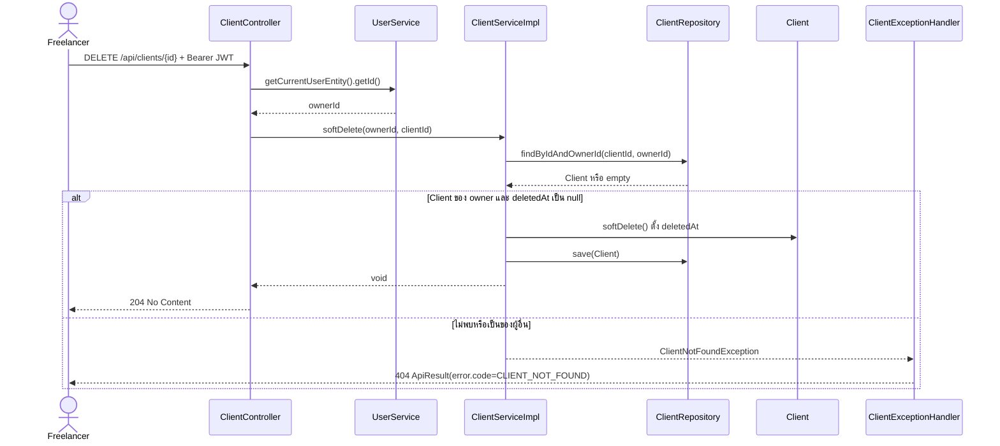

# Use Case: Client Management

**เจ้าของ feature:** `thirawat_673380039-7_02`  
**อ้างอิง requirement:** `FR-CLI-01` ถึง `FR-CLI-05` ใน `REQUIREMENTS.md`

## Actor และเงื่อนไขร่วม

**Actor หลัก:** Freelancer ที่เข้าสู่ระบบด้วย JWT  
**Precondition ร่วม:** Request มี bearer token ที่ถูกต้อง; Client ที่อ่าน/แก้ไข/เปลี่ยนสถานะ/soft delete ต้องเป็นของผู้ใช้คนนั้นและยังไม่ถูก soft delete
**กติกาการเป็นเจ้าของ:** ระบบดึง owner ID จาก authenticated user ไม่รับ owner ID จาก payload และการหา Client รายตัวใช้ทั้ง `clientId` และ `ownerId`

**Response ร่วม:** ทุก endpoint ที่มี body คืน `ApiResult` (`success`, `message`, `data`, `meta`, `error`); กรณี error ของ Client ใช้ `success=false` และ `error.code/details` ส่วน `DELETE` สำเร็จเป็น `204 No Content` ไม่มี body

## Use Case Summary

| ID | Use Case | Endpoint | ผลลัพธ์หลัก | Requirement |
|---|---|---|---|---|
| UC-CLI-01 | Create Client | `POST /api/clients` | สร้าง Client โดย `isActive=true`; คืน `201 ApiResult<ClientResponse>` และ `Location` | FR-CLI-01, FR-CLI-02 |
| UC-CLI-02 | List/Search Clients | `GET /api/clients` | คืนรายการของ owner พร้อม filter, sort, pagination และ `meta` (`200`) | FR-CLI-03 |
| UC-CLI-03 | View Client | `GET /api/clients/{id}` | คืน `ApiResult<ClientResponse>` ของ owner (`200`) | FR-CLI-01 |
| UC-CLI-04 | Replace Client | `PUT /api/clients/{id}` | แทนที่ข้อมูลที่แก้ไขได้; optional fields ที่ไม่ส่งมาถูกล้าง (`200`) | FR-CLI-01, FR-CLI-02 |
| UC-CLI-05 | Update Client | `PATCH /api/clients/{id}` | แก้เฉพาะฟิลด์ที่ส่งมาและคืนข้อมูลล่าสุด (`200`) | FR-CLI-01, FR-CLI-02 |
| UC-CLI-06 | Change Client Status | `PATCH /api/clients/{id}/status` | กำหนด `isActive` โดยไม่แก้ `deletedAt` (`200`) | FR-CLI-01, FR-CLI-05 |
| UC-CLI-07 | Soft-delete Client | `DELETE /api/clients/{id}` | ตั้ง `deletedAt` โดยไม่เปลี่ยน `isActive` และไม่ลบ record (`204`) | FR-CLI-01, FR-CLI-05 |

## UC-CLI-01 Create Client

1. Freelancer ส่งชื่อ Client และข้อมูลติดต่อ/บริษัท/ที่อยู่/เลขผู้เสียภาษี/หมายเหตุที่ต้องการ โดยที่อยู่ใช้ flat fields `address`, `subdistrict`, `district`, `province`, `postalCode`
2. Controller ตรวจ `CreateClientRequest` ด้วย `@Valid` และอ่าน owner จากผู้ใช้ที่ล็อกอิน
3. Service โหลด owner, ให้ mapper สร้าง `Client` แล้ว repository บันทึก
4. ระบบคืน `201 Created`, `ApiResult` ที่มี `data: ClientResponse` และ `Location: /api/clients/{id}`

**Alternative flow:** ไม่มี JWT = `401`; ชื่อว่างหรือข้อมูลผิดรูปแบบ = `400`  
**Postcondition:** มี Client ใหม่ที่ผูกกับ owner ปัจจุบันและสถานะเริ่มต้น `ACTIVE`

## UC-CLI-02 List/Search Clients

1. Freelancer เรียก `GET /api/clients` พร้อม query parameter ที่ต้องการ: `status`, `search`, `page`, `size` หรือ `limit`, `sortBy`, `direction`; ถ้าส่งทั้ง `size` และ `limit` จะใช้ `limit`
2. Service สร้าง query ที่จำกัด `ownerId` และ `deletedAt IS NULL` ก่อนเสมอ แล้วเพิ่ม filter `isActive` ตาม `status` หรือ prefix search ใน `name`, `companyName`, `email`, `phone` และข้อมูลที่อยู่เมื่อระบุ; ที่อยู่เป็น embedded fields ในตาราง `clients`
3. Repository คืน `Page<Client>`; mapper แปลงรายการเป็น `ClientResponse` และ controller คืน `200 ApiResult` พร้อม `PaginationMeta` (`page` ใน meta เริ่มที่ 1 ส่วน query `page` เริ่มที่ 0)

**Alternative flow:** ไม่ระบุ status = รวมทั้ง `isActive=true/false` ที่ยังไม่ถูก soft delete; ไม่มีผลลัพธ์ = `data` เป็นรายการว่าง; filter/page/size/limit/sort ไม่ถูกต้อง = `400`; ไม่มี JWT = `401`
**Postcondition:** ไม่มีการเปลี่ยนข้อมูล และไม่แสดง Client ของผู้ใช้อื่น

## UC-CLI-03 View Client

1. Freelancer ส่ง UUID ของ Client ไปที่ `GET /api/clients/{id}`
2. Service ค้นด้วย `findByIdAndOwnerId` แล้ว mapper สร้าง `ClientResponse`
3. Controller คืน `200 ApiResult<ClientResponse>` รวม `status` ที่คำนวณจาก `isActive` และข้อมูลที่อยู่แบบ flat fields

**Alternative flow:** ไม่พบ Client หรือเป็นของผู้ใช้อื่น = `404` แบบเดียวกัน; ไม่มี JWT = `401`  
**Postcondition:** ไม่มีการเปลี่ยนข้อมูล

## UC-CLI-04 Replace Client

1. Freelancer ส่ง UUID และรายละเอียดที่จะแทนที่ด้วย `PUT /api/clients/{id}` โดยใช้ `CreateClientRequest`
2. Service ตรวจ owner และให้ mapper แทนที่ข้อมูลที่แก้ไขได้ทั้งหมด; optional fields ที่ไม่ส่งมาถูกล้าง
3. Controller คืน `200 ApiResult<ClientResponse>` โดยไม่เปลี่ยน owner, `isActive` หรือ `deletedAt`

**Alternative flow:** ชื่อหรือข้อมูลไม่ถูกต้อง = `400`; ไม่พบ/ไม่ใช่เจ้าของ/ถูก soft delete แล้ว = `404`; ไม่มี JWT = `401`
**Postcondition:** ข้อมูลที่แก้ไขได้ถูกแทนที่ แต่สถานะและการเป็นเจ้าของคงเดิม

## UC-CLI-05 Update Client

1. Freelancer ส่ง UUID และฟิลด์ที่ต้องการแก้ด้วย `PATCH /api/clients/{id}`
2. Controller validate `UpdateClientRequest`; service ตรวจ owner ผ่าน `findByIdAndOwnerId`
3. Mapper คงค่าเดิมเมื่อฟิลด์เป็น `null` และส่งค่าที่ระบุไปแก้ entity
4. Repository บันทึก แล้ว controller คืน `200 ApiResult<ClientResponse>`

**Alternative flow:** ข้อมูลไม่ถูกต้อง = `400`; ไม่พบ/ไม่ใช่เจ้าของ = `404`; ไม่มี JWT = `401`  
**Postcondition:** เฉพาะข้อมูลที่ส่งมาได้รับการแก้ไข; `isActive`/`status` ไม่ใช่ฟิลด์ของ PATCH รายละเอียดนี้

ข้อมูลที่อยู่ของ Client ใช้ contract เดียวกับ User Profile และ response ยังคงแสดงเป็น flat fields
และ persistence เก็บเป็น embedded columns ในตาราง `clients` ไม่ได้อ้างอิงตาราง `addresses`

## UC-CLI-06 Change Client Status

1. Freelancer ส่ง `{"isActive": true}` หรือ `{"isActive": false}` ไปที่ `PATCH /api/clients/{id}/status`
2. Service ตรวจ owner แล้วเรียก `Client.setActive(isActive)` โดยไม่แก้ `deletedAt`
3. Controller คืน `200 ApiResult<ClientResponse>`; `status` ใน response คำนวณเป็น `ACTIVE` หรือ `ARCHIVED` จาก `isActive`

**Alternative flow:** ไม่ส่ง `isActive` = `400`; ไม่พบ/ไม่ใช่เจ้าของ/ถูก soft delete แล้ว = `404`; ไม่มี JWT = `401`
**Postcondition:** เปลี่ยนเฉพาะสถานะ active ของ Client โดยไม่ลบประวัติ

## UC-CLI-07 Soft-delete Client

1. Freelancer ส่ง UUID ไปที่ `DELETE /api/clients/{id}`
2. Service ตรวจ owner แล้วเรียก `Client.softDelete()` เพื่อตั้ง `deletedAt` โดยไม่เปลี่ยน `isActive`
3. Repository บันทึกโดยไม่ลบแถว; controller คืน `204 No Content`

**Alternative flow:** ไม่พบ/ไม่ใช่เจ้าของ/ถูก soft delete แล้ว = `404`; ไม่มี JWT = `401`
**Postcondition:** Client และประวัติที่ผูกอยู่ยังคงอยู่; Client ที่ soft delete แล้วไม่ปรากฏใน Client API แม้ไม่กรอง status แต่ค่า `isActive` เดิมไม่เปลี่ยน

## Sequence: Soft-delete Client

```mermaid
sequenceDiagram
    actor F as Freelancer
    participant C as ClientController
    participant U as UserService
    participant S as ClientServiceImpl
    participant R as ClientRepository
    participant E as Client
    participant H as ClientExceptionHandler

    F->>C: DELETE /api/clients/{id} + Bearer JWT
    C->>U: getCurrentUserEntity().getId()
    U-->>C: ownerId
    C->>S: softDelete(ownerId, clientId)
    S->>R: findByIdAndOwnerId(clientId, ownerId)
    R-->>S: Client หรือ empty
    alt Client ของ owner และ deletedAt เป็น null
        S->>E: softDelete() ตั้ง deletedAt
        S->>R: save(Client)
        S-->>C: void
        C-->>F: 204 No Content
    else ไม่พบหรือเป็นของผู้อื่น
        S-->>H: ClientNotFoundException
        H-->>F: 404 ApiResult(error.code=CLIENT_NOT_FOUND)
    end
```

## ขอบเขตที่ยังไม่เสร็จ

- `FR-CLI-04` ต้องแสดงโปรเจกต์และเวลาในหน้ารายละเอียดลูกค้า แต่ `GET /api/clients/{id}` ปัจจุบันคืนเฉพาะ `ClientResponse` ไม่มีข้อมูลโปรเจกต์หรือเวลา
- การค้นหาใน `FR-CLI-03` เป็น prefix search จากชื่อ บริษัท อีเมล เบอร์โทร และที่อยู่ตามรูปแบบที่บันทึกไว้; ยังไม่ใช่การค้นหาแบบตัดช่องว่างหรือเครื่องหมายในเบอร์โทร
- การป้องกันเริ่ม timer ใหม่เมื่อ Client ถูก archive (`isActive=false`) เป็นกติกาข้าม feature ใน `BR-06` ไม่ใช่พฤติกรรมที่ Client API นี้พิสูจน์แล้ว
- ยังไม่พบ Use Case Diagram ใน `doc/diagrams/`; ก่อนรวมเอกสารหลักควรเทียบชื่อ actor/use case กับ diagram ฉบับทีม

**หลักฐานการทดสอบ:** `ClientControllerTest`, `ClientServiceImplTest`, `ClientRepositoryTest` และ `ClientIntegrationTest` ภายใต้ `code/Backend/src/test/java/th/ac/kku/freelance_hub/`
