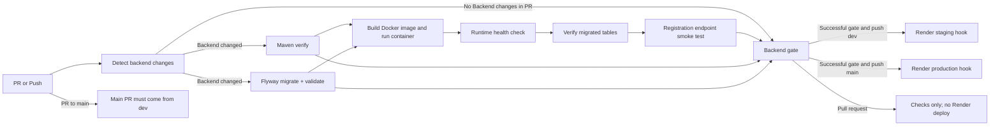
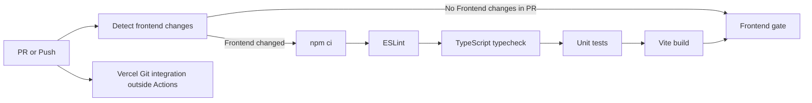

# CI/CD - Freelance Hub

ฉบับรวมจาก Petpinyo CI/CD ตรวจ workflow ณ commit `5f55faf` วันที่ 9 ตุลาคม 2026 นำรายละเอียดที่ Petpinyo ปรับใน PR #127 มาเทียบกับ workflow แล้ว ไม่แก้ workflow หรือ deploy ระบบในรอบรวมเอกสาร

**ผู้รับผิดชอบ:** เพชรภิญโญ ธนศิรินรากร (`petpinyo_673380073-7_02`)  
**ขอบเขต:** GitHub Actions ของ Backend/Frontend, Docker verification, Flyway validation, Auth smoke test และ Render deployment

## ความสอดคล้องกับเกณฑ์รายวิชา

| เกณฑ์ | Implementation | หลักฐาน |
|---|---|---|
| GitHub Actions | ตรวจ PR และ push ที่เข้า `dev`/`main` | [Backend workflow](../.github/workflows/backend.yml#L6), [Frontend workflow](../.github/workflows/frontend-ci.yml#L4) |
| Build และ Test อัตโนมัติ | Backend ใช้ Maven `verify`; Frontend lint, typecheck, unit test และ build | [Backend tests](../.github/workflows/backend.yml#L70), [Frontend checks](../.github/workflows/frontend-ci.yml#L49) |
| Migration Script | รัน Flyway `migrate` และ `validate` กับ PostgreSQL ว่าง | [Flyway migration job](../.github/workflows/backend.yml#L96) |
| Dockerfile | build image จริงและเปิด application container | [Docker runtime job](../.github/workflows/backend.yml#L146), [Dockerfile](../code/Backend/Dockerfile) |
| Database smoke check | ตรวจ 7 ตารางหลักและ migration history | [Database smoke check](../.github/workflows/backend.yml#L212) |
| Auth smoke test | สมัครผู้ใช้ผ่าน `POST /api/auth/register` และตรวจว่ามี token | [Registration smoke check](../.github/workflows/backend.yml#L223) |
| Quality gate | รวมผล test, migration และ Docker เป็น status เดียวสำหรับ branch protection | [Backend gate](../.github/workflows/backend.yml#L241) |
| Staging deployment | push เข้า `dev` และ gate ผ่านจึงเรียก Render staging deploy hook | [Staging deploy](../.github/workflows/backend.yml#L276) |
| Production deployment | push เข้า `main` และ gate ผ่านจึงเรียก Render production deploy hook | [Production deploy](../.github/workflows/backend.yml#L291) |
| Branch workflow | job แยกตรวจ PR เข้า `main` ต้องมาจาก `dev`; ไม่ใช่ dependency ของ Backend gate | [Main PR source check](../.github/workflows/backend.yml#L54) |
| Secret handling | deploy URL อ่านจาก GitHub Environment secrets ไม่เขียนลง repository | [Staging hook secret](../.github/workflows/backend.yml#L281), [Production hook secret](../.github/workflows/backend.yml#L296) |

## Pipeline

Backend test และ Flyway เป็น jobs แยกที่รันขนานกันหลัง detect changes; Docker รอทั้งคู่ Backend gate ตรวจผลทั้งสาม jobs ไม่ได้รอ Main PR source check ซึ่งเป็น job แยก หากต้องบังคับกฎ PR เข้า main ต้องกำหนด required status check ของ job นี้ใน branch protection/ruleset ด้วย ไม่ถือว่า Backend gate สีเขียวพิสูจน์ source branch ถูกต้อง

Frontend ใช้ pipeline แยกเพื่อลดเวลารันงานที่ไม่เกี่ยวข้อง:

Frontend workflow ไม่มี job deploy หรือเรียก Vercel API; Vercel Git integration ทำงานแยกและอาจสร้าง preview ของ PR ได้ จึงไม่อ้างว่า Frontend gate เป็น dependency ที่บังคับก่อน Vercel deploy เว้นแต่ทีมตั้งนโยบายใน Vercel เพิ่มเอง

การตรวจ changed paths ใช้เฉพาะ PR: ถ้าไม่มี Backend/Frontend changes งานตรวจของส่วนนั้นจะ skipped และ gate คืน success แบบไม่ต้องตรวจ แต่ push เข้า dev/main จะตั้ง changed=true แล้วตรวจทุกครั้ง Gate สีเขียวใน PR ที่แก้เฉพาะเอกสารจึงไม่ใช่หลักฐานว่ารัน tests ใหม่แล้ว

## Environment และความปลอดภัย

- Workflow ใช้ permission แบบ read-only (`contents: read`, `pull-requests: read`)
- `concurrency.cancel-in-progress` ยกเลิก run เก่าของ ref เดียวกัน ลดการ deploy code เก่า
- CI ใช้ credential PostgreSQL เฉพาะ runner และ JWT secret สำหรับ smoke test ไม่ใช่ production secret
- Render deploy hooks เก็บใน `staging` และ `production` GitHub Environments
- Backend pull request ทำเฉพาะ checks; Render deploy-hook jobs เกิดจาก push เข้า branch ที่กำหนดและ Backend gate ต้องสำเร็จ เงื่อนไขนี้ไม่ครอบคลุม Vercel Git integration หรือ auto-deploy ที่ cloud ตั้งไว้นอก workflow

## สิ่งที่ต้องตั้งค่าบน GitHub/Cloud

1. ตั้ง required status checks ตามนโยบายทีม เช่น `Backend gate`, `Frontend gate` และ `Main PR must come from dev` สำหรับ PR เข้า main; งานเอกสารนี้ไม่ได้ตรวจหรือเปลี่ยน settings บน GitHub
2. สร้าง GitHub Environments ชื่อ `staging` และ `production`
3. เพิ่ม secrets `RENDER_STAGING_DEPLOY_HOOK_URL` และ `RENDER_PRODUCTION_DEPLOY_HOOK_URL`
4. ตั้ง Render environment variables เช่น datasource, `JWT_SECRET`, `CORS_ALLOWED_ORIGINS` และ `REFRESH_COOKIE_SECURE=true`
5. เชื่อม Frontend กับ Vercel และกำหนด `BACKEND_ORIGIN`/`VITE_API_BASE_URL` ตาม environment

## วิธีตรวจผล

- เปิด GitHub Actions แล้วตรวจว่า test, migration, Docker และ gate เป็นสีเขียว
- เปิด `/actuator/health` ของ Backend deployment
- เปิด Swagger UI ใน local/dev/staging เมื่อ `OPENAPI_ENABLED=true`
- ทดลอง register/login/profile/refresh/logout ด้วย public deployment URL

> CI/CD เป็นคะแนนพิเศษตามใบงาน แต่เอกสารนี้ไม่ถือว่า deployment สำเร็จจนกว่า URL staging/production จะเข้าถึงได้จริงในวันส่งงาน

## ขอบเขตของหลักฐานส่งมอบ

เอกสารนี้อธิบาย configuration และ pipeline ที่มีอยู่ ไม่ยืนยันว่า branch protection/secrets/cloud ถูกตั้งครบหรือ run ล่าสุดผ่าน ต้องแนบผล CI และตรวจ public URL ของ release จริงก่อนส่ง เอกสารนี้ไม่แทน Deployment Diagram หรือ Test Report
