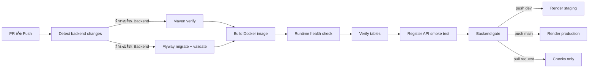
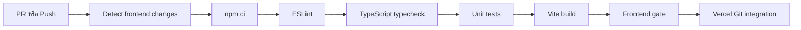

# CI/CD - Freelance Hub

ฉบับรวมจาก [Petpinyo CI/CD](V1/CICD/petpinyo-cicd.md) ตรวจ workflow ณ commit `cb8002d` วันที่ 9 ตุลาคม 2026 ไม่แก้ workflow หรือ deploy ระบบในรอบรวมเอกสาร

**ผู้รับผิดชอบ:** เพชรภิญโญ ธนศิรินรากร (`petpinyo_673380073-7_02`)  
**ขอบเขต:** GitHub Actions ของ Backend/Frontend, Docker verification, Flyway validation, Auth smoke test และ Render deployment

## ความสอดคล้องกับเกณฑ์รายวิชา

| เกณฑ์ | Implementation | หลักฐาน |
|---|---|---|
| GitHub Actions | ตรวจ PR และ push ที่เข้า `dev`/`main` | `.github/workflows/backend.yml:6–14`, `frontend-ci.yml:4–12` |
| Build และ Test อัตโนมัติ | Backend ใช้ Maven `verify`; Frontend lint, typecheck, unit test และ build | `backend.yml:70–94`, `frontend-ci.yml:49–84` |
| Migration Script | รัน Flyway `migrate` และ `validate` กับ PostgreSQL ว่าง | `backend.yml:96–144` |
| Dockerfile | build image จริงและเปิด application container | `backend.yml:146–210`, `code/Backend/Dockerfile` |
| Database smoke check | ตรวจ 7 ตารางหลักและ migration history | `backend.yml:212–221` |
| Auth smoke test | สมัครผู้ใช้ผ่าน `POST /api/auth/register` และตรวจว่ามี token | `backend.yml:223–229` |
| Quality gate | รวมผล test, migration และ Docker เป็น status เดียวสำหรับ branch protection | `backend.yml:241–274` |
| Staging deployment | push เข้า `dev` และ gate ผ่านจึงเรียก Render staging deploy hook | `backend.yml:276–289` |
| Production deployment | push เข้า `main` และ gate ผ่านจึงเรียก Render production deploy hook | `backend.yml:291–304` |
| Branch workflow | PR เข้า `main` ต้องมาจาก `dev` | `backend.yml:54–68` |
| Secret handling | deploy URL อ่านจาก GitHub Environment secrets ไม่เขียนลง repository | `backend.yml:281–289,296–304` |

## Pipeline

Frontend ใช้ pipeline แยกเพื่อลดเวลารันงานที่ไม่เกี่ยวข้อง:

## Environment และความปลอดภัย

- Workflow ใช้ permission แบบ read-only (`contents: read`, `pull-requests: read`)
- `concurrency.cancel-in-progress` ยกเลิก run เก่าของ ref เดียวกัน ลดการ deploy code เก่า
- CI ใช้ credential PostgreSQL เฉพาะ runner และ JWT secret สำหรับ smoke test ไม่ใช่ production secret
- Render deploy hooks เก็บใน `staging` และ `production` GitHub Environments
- Pull request ทำเฉพาะ checks; deploy เกิดจาก push เข้า branch ที่กำหนดและ gate ต้องสำเร็จ

## สิ่งที่ต้องตั้งค่าบน GitHub/Cloud

1. ตั้ง required status checks เป็น `Backend gate` และ `Frontend gate`
2. สร้าง GitHub Environments ชื่อ `staging` และ `production`
3. เพิ่ม secrets `RENDER_STAGING_DEPLOY_HOOK_URL` และ `RENDER_PRODUCTION_DEPLOY_HOOK_URL`
4. ตั้ง Render environment variables เช่น datasource, `JWT_SECRET`, `CORS_ALLOWED_ORIGINS` และ `REFRESH_COOKIE_SECURE=true`
5. เชื่อม Frontend กับ Vercel และกำหนด `BACKEND_ORIGIN`/`VITE_API_BASE_URL` ตาม environment

## วิธีตรวจผล

- เปิด GitHub Actions แล้วตรวจว่า test, migration, Docker และ gate เป็นสีเขียว
- เปิด `/actuator/health` ของ Backend deployment
- เปิด Swagger UI ใน local/dev/staging เมื่อ `OPENAPI_ENABLED=true`
- ทดลอง register/login/profile/refresh/logout ด้วย public deployment URL

> CI/CD เป็นคะแนนพิเศษตามใบงาน แต่เอกสารนี้ไม่ถือว่า deployment สำเร็จจนกว่า URL staging/production จะเข้าถึงได้จริงในวันส่งงาน

## ขอบเขตของหลักฐานส่งมอบ

เอกสารนี้อธิบาย configuration และ pipeline ที่มีอยู่ ไม่ยืนยันว่า branch protection/secrets/cloud ถูกตั้งครบหรือ run ล่าสุดผ่าน ต้องแนบผล CI และตรวจ public URL ของ release จริงก่อนส่ง เอกสารนี้ไม่แทน Deployment Diagram หรือ Test Report
