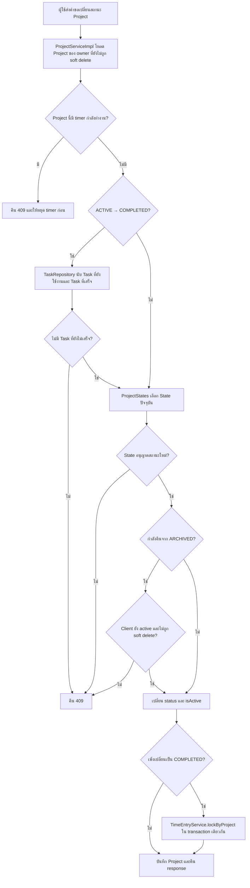

# Activity: เปลี่ยนสถานะ Project

ที่มา: [Kantavit](../V1/DESIGN/kantavit-design.md) ณ `131305f` ใช้กับ Project API; Client archive cascade เรียก Project.changeStatus โดยตรงจึงไม่ผ่าน running-timer guard นี้

