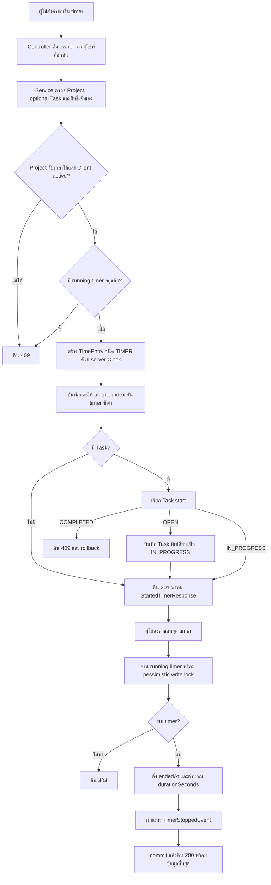

# Activity: เริ่มและหยุด Timer

ที่มา: [Kompat](../V1/DESIGN/kompat-design.md) ณ `cb8002d` นอกจากการตรวจ running timer ใน service ยังมี partial unique index ของ PostgreSQL ป้องกันคำขอ start พร้อมกัน กรณี Task COMPLETED การบันทึกใน transaction จะ rollback

