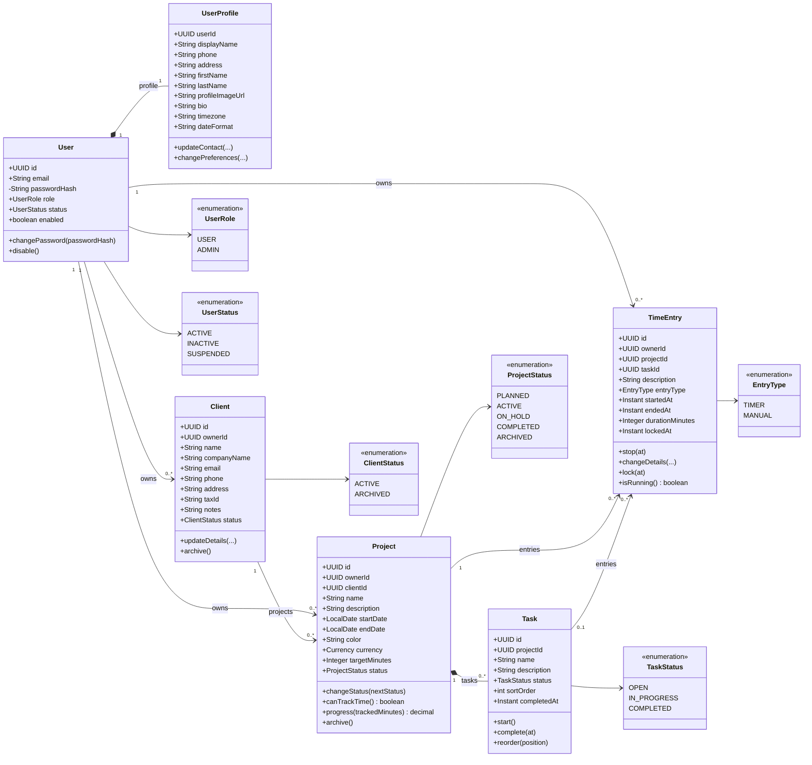

# Freelance Hub MVP — Domain Class Diagram

Class Diagram นี้เน้น JPA Entity และพฤติกรรมของ domain ไม่รวม Controller, DTO,
Service และ Repository เพื่อให้เห็นโครงสร้างข้อมูลหลักชัดเจน

## แนวทาง JPA

- Association ทุกตัวใช้ `FetchType.LAZY`; โหลด graph หรือ projection เฉพาะหน้าที่ต้องใช้
- ไม่ใช้ `CascadeType.ALL` กับข้อมูลประวัติ: อนุญาต `PERSIST/MERGE` ระหว่าง `User` กับ `UserProfile` ได้ แต่ไม่ cascade remove จาก Client/Project ไปยังประวัติ
- ใส่ `@Version` ใน mutable entities เพื่อป้องกัน lost update โดยเฉพาะ `Project` และ `TimeEntry`
- Service ต้องตรวจ ownership ทุกครั้ง แม้ฐานข้อมูลจะมี composite FK ช่วยรักษาความสอดคล้องอยู่แล้ว
- Domain method เป็นผู้ควบคุม transition และ invariant; setter ของ status/time ไม่ควรเปิดเป็น public

