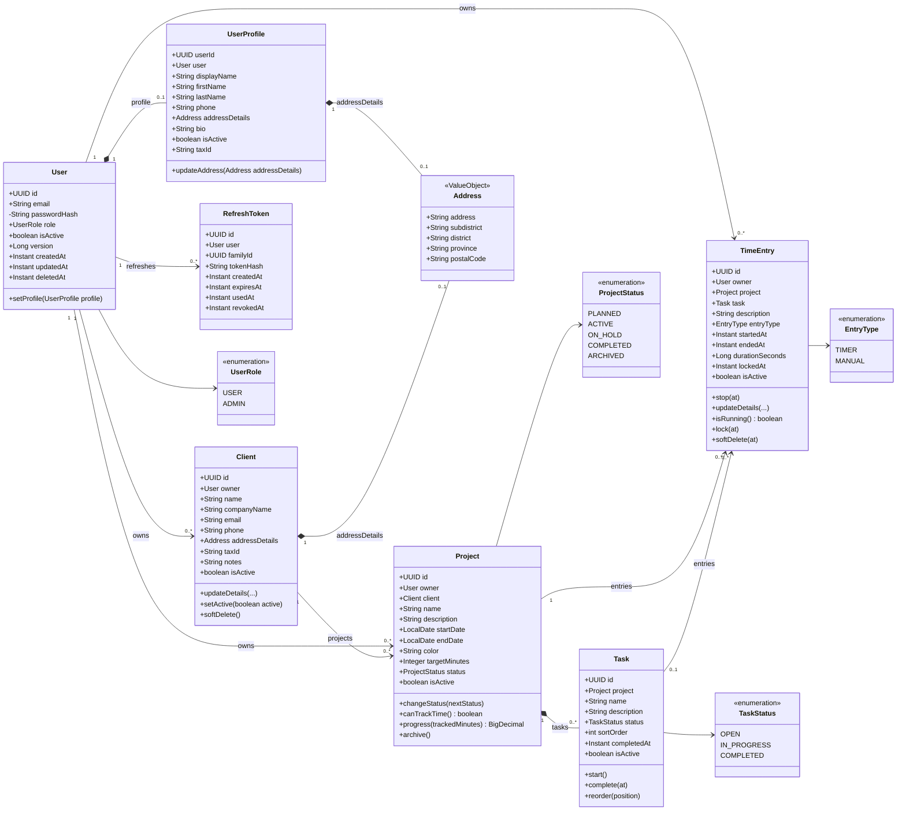
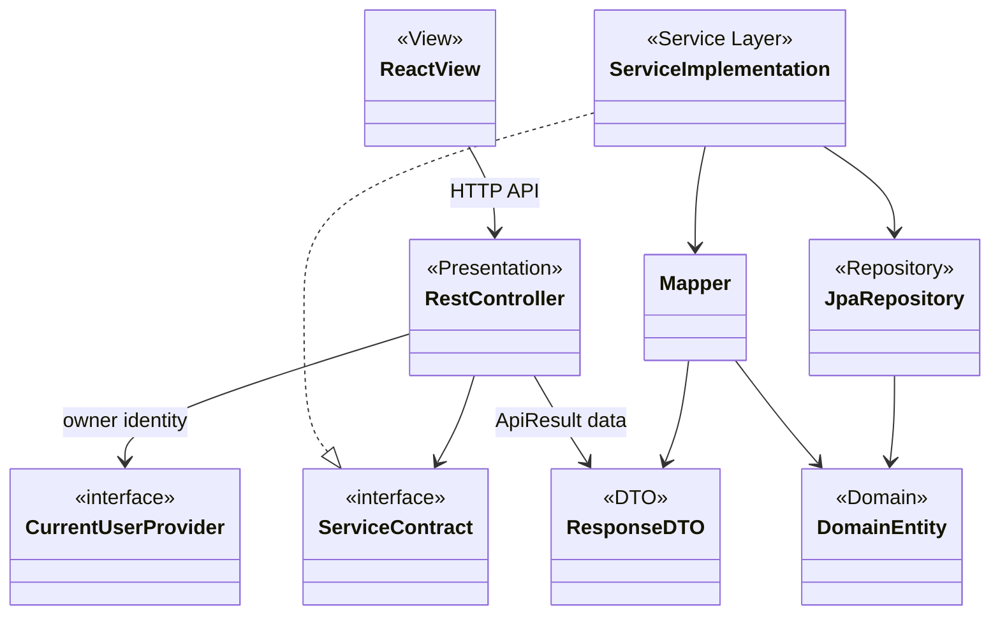
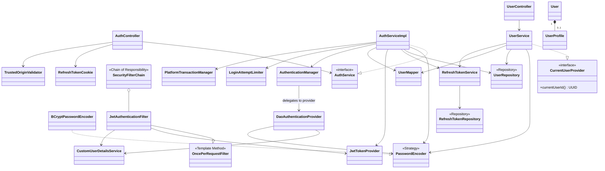
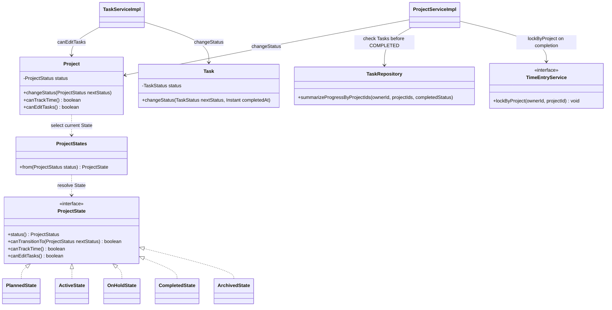

# Freelance Hub MVP - Domain Class Diagram

ฉบับตรวจจาก JPA entities และเอกสารสมาชิก ณ commit `5f55faf` วันที่ 9 ตุลาคม 2026 ส่วนแรกแสดง Domain Class Model ส่วนท้ายแสดง Application Layers และตำแหน่ง Design Patterns
ข้อมูล Address เป็น value object แบบ `@Embeddable` ใน `UserProfile` และ `Client` โดยยังเก็บคอลัมน์ในตารางเดิม
ในเอกสารนี้ใช้ชื่อ audit field มาตรฐาน `deletedAt` แทน typo `deleate_at` จาก DBML ต้นทาง

Domain view เลือกเฉพาะ fields/methods สำคัญ ไม่ใช่ภาพ reflection ทุก member; `+` แสดงข้อมูล/operation ที่อ่านใช้งานผ่าน public API/getters ไม่ได้หมายความว่า JPA fields ทั้งหมดประกาศ public Project มี tasks collection แบบ OneToMany(mappedBy="project", fetch=LAZY) แต่ไม่มี cascade remove; เส้นความสัมพันธ์ในภาพไม่ใช่การอ้างว่า soft delete Project จะลบ Task ทุกแถว

```mermaid
classDiagram
    direction LR

    class User {
        +UUID id
        +String email
        -String passwordHash
        +UserRole role
        +boolean isActive
        +Long version
        +Instant createdAt
        +Instant updatedAt
        +Instant deletedAt
        +setProfile(UserProfile profile)
    }
    class UserProfile {
        +UUID userId
        +User user
        +String displayName
        +String firstName
        +String lastName
        +String phone
        +Address addressDetails
        +String bio
        +boolean isActive
        +String taxId
        +updateAddress(Address addressDetails)
    }
    class Client {
        +UUID id
        +User owner
        +String name
        +String companyName
        +String email
        +String phone
        +Address addressDetails
        +String taxId
        +String notes
        +boolean isActive
        +updateDetails(...)
        +setActive(boolean active)
        +softDelete()
    }
    class Project {
        +UUID id
        +User owner
        +Client client
        +String name
        +String description
        +LocalDate startDate
        +LocalDate endDate
        +String color
        +Integer targetMinutes
        +ProjectStatus status
        +boolean isActive
        +changeStatus(nextStatus)
        +canTrackTime() boolean
        +progress(trackedMinutes) BigDecimal
        +archive()
    }
    class Task {
        +UUID id
        +Project project
        +String name
        +String description
        +TaskStatus status
        +int sortOrder
        +Instant completedAt
        +boolean isActive
        +start()
        +complete(at)
        +reorder(position)
    }
    class TimeEntry {
        +UUID id
        +User owner
        +Project project
        +Task task
        +String description
        +EntryType entryType
        +Instant startedAt
        +Instant endedAt
        +Long durationSeconds
        +Instant lockedAt
        +boolean isActive
        +stop(at)
        +updateDetails(...)
        +isRunning() boolean
        +lock(at)
        +softDelete(at)
    }
    class RefreshToken {
        +UUID id
        +User user
        +UUID familyId
        +String tokenHash
        +Instant createdAt
        +Instant expiresAt
        +Instant usedAt
        +Instant revokedAt
    }
    class Address {
        <<ValueObject>>
        +String address
        +String subdistrict
        +String district
        +String province
        +String postalCode
    }
    class UserRole {
        <<enumeration>>
        USER
        ADMIN
    }
    class ProjectStatus {
        <<enumeration>>
        PLANNED
        ACTIVE
        ON_HOLD
        COMPLETED
        ARCHIVED
    }
    class TaskStatus {
        <<enumeration>>
        OPEN
        IN_PROGRESS
        COMPLETED
    }
    class EntryType {
        <<enumeration>>
        TIMER
        MANUAL
    }

    User "1" *-- "0..1" UserProfile : profile
    UserProfile "1" *-- "0..1" Address : addressDetails
    User "1" --> "0..*" Client : owns
    Client "1" *-- "0..1" Address : addressDetails
    User "1" --> "0..*" Project : owns
    User "1" --> "0..*" TimeEntry : owns
    User "1" --> "0..*" RefreshToken : refreshes
    Client "1" --> "0..*" Project : projects
    Project "1" *-- "0..*" Task : tasks
    Project "1" --> "0..*" TimeEntry : entries
    Task "0..1" --> "0..*" TimeEntry : entries
    User --> UserRole
    Project --> ProjectStatus
    Task --> TaskStatus
    TimeEntry --> EntryType
```

## Domain Rules

- Address เป็น embedded value object ใน UserProfile/Client ไม่มีตาราง addresses หลัง migration V13; UserProfile เป็น optional row ในระดับ schema แต่ flow สมัครบัญชีสร้าง profile ให้ด้วย
- Client and Project ownership is enforced by composite `(client_id, owner_id)` relationship.
- Project and TimeEntry ownership is enforced by composite `(project_id, owner_id)` relationship.
- A selected Task must belong to the same Project as the TimeEntry.
- Archive กับ soft delete เป็นคนละคำสั่ง: Client.setActive(false) ไม่ตั้ง deletedAt; Client.softDelete() ตั้งเฉพาะ deletedAt; Project.changeStatus(ARCHIVED) ไม่ตั้ง deletedAt แต่ Project.archive() ตั้ง status/isActive/deletedAt.
- `durationSeconds` is used for accurate time tracking; `lockedAt` marks an entry as immutable when set.
- Service layer must verify ownership before every read or mutation.

## Application Layers

ปรับจาก Class Diagrams ของสมาชิกเพื่อแสดง pattern placement ภาพนี้เป็น architecture view ไม่ใช่รายการ class ทั้งหมด

```mermaid
classDiagram
    class ReactView {
        <<View>>
    }
    class RestController {
        <<Presentation>>
    }
    class ServiceContract {
        <<interface>>
    }
    class ServiceImplementation {
        <<Service Layer>>
    }
    class JpaRepository {
        <<Repository>>
    }
    class DomainEntity {
        <<Domain>>
    }
    class ResponseDTO {
        <<DTO>>
    }
    class Mapper
    class CurrentUserProvider {
        <<interface>>
    }
    ReactView --> RestController : HTTP API
    RestController --> ServiceContract
    RestController --> CurrentUserProvider : owner identity
    ServiceImplementation ..|> ServiceContract
    ServiceImplementation --> JpaRepository
    JpaRepository --> DomainEntity
    ServiceImplementation --> Mapper
    Mapper --> DomainEntity
    Mapper --> ResponseDTO
    RestController --> ResponseDTO : ApiResult data
```

## Authentication Patterns

ที่มา: [Petpinyo Design](../V1/DESIGN/petpinyo-design.md) ตรวจตามการแก้ PR #127 เพิ่ม cookie/origin, refresh repository และ authentication provider dependencies Strategy / Template Method / Chain of Responsibility ใช้ abstractions ของ Spring Security; profile persistence ผ่าน UserRepository ไม่ใช่ UserProfileRepository

```mermaid
classDiagram
    class AuthController
    class UserController
    class AuthService {
        <<interface>>
    }
    class AuthServiceImpl
    class CurrentUserProvider {
        <<interface>>
        +currentUserId() UUID
    }
    class UserService
    class PasswordEncoder {
        <<Strategy>>
    }
    class BCryptPasswordEncoder
    class OncePerRequestFilter {
        <<Template Method>>
    }
    class JwtAuthenticationFilter
    class SecurityFilterChain {
        <<Chain of Responsibility>>
    }
    class UserRepository {
        <<Repository>>
    }
    class RefreshTokenRepository {
        <<Repository>>
    }
    class AuthenticationManager
    class DaoAuthenticationProvider
    class CustomUserDetailsService
    class RefreshTokenCookie
    class TrustedOriginValidator
    class LoginAttemptLimiter
    class PlatformTransactionManager
    class RefreshTokenService
    class JwtTokenProvider
    class UserMapper
    class User
    class UserProfile

    AuthController --> AuthService
    AuthController --> RefreshTokenCookie
    AuthController --> TrustedOriginValidator
    AuthServiceImpl ..|> AuthService
    UserController --> UserService
    UserService ..|> CurrentUserProvider
    AuthServiceImpl --> PasswordEncoder
    UserService --> PasswordEncoder
    BCryptPasswordEncoder ..|> PasswordEncoder
    JwtAuthenticationFilter --|> OncePerRequestFilter
    SecurityFilterChain o-- JwtAuthenticationFilter
    AuthServiceImpl --> UserRepository
    AuthServiceImpl --> RefreshTokenService
    AuthServiceImpl --> JwtTokenProvider
    AuthServiceImpl --> UserMapper
    AuthServiceImpl --> AuthenticationManager
    AuthenticationManager --> DaoAuthenticationProvider : delegates to provider
    DaoAuthenticationProvider --> CustomUserDetailsService
    DaoAuthenticationProvider --> PasswordEncoder
    AuthServiceImpl --> LoginAttemptLimiter
    AuthServiceImpl --> PlatformTransactionManager
    UserService --> UserRepository
    UserService --> UserMapper
    UserService --> RefreshTokenService
    RefreshTokenService --> RefreshTokenRepository
    JwtAuthenticationFilter --> JwtTokenProvider
    JwtAuthenticationFilter --> CustomUserDetailsService
    User "1" *-- "0..1" UserProfile
```

## Project State Pattern

ที่มา: [Kantavit Design](../V1/DESIGN/kantavit-design.md) State object ตัดสิน transition/permissions; Service ตรวจ Task, running timer และประสานการล็อกเวลา

```mermaid
classDiagram
    class Project {
        -ProjectStatus status
        +changeStatus(ProjectStatus nextStatus)
        +canTrackTime() boolean
        +canEditTasks() boolean
    }
    class ProjectStates {
        +from(ProjectStatus status) ProjectState
    }
    class ProjectState {
        <<interface>>
        +status() ProjectStatus
        +canTransitionTo(ProjectStatus nextStatus) boolean
        +canTrackTime() boolean
        +canEditTasks() boolean
    }
    class PlannedState
    class ActiveState
    class OnHoldState
    class CompletedState
    class ArchivedState
    class ProjectServiceImpl
    class TaskServiceImpl
    class Task {
        -TaskStatus status
        +changeStatus(TaskStatus nextStatus, Instant completedAt)
    }
    class TimeEntryService {
        <<interface>>
        +lockByProject(ownerId, projectId) void
    }
    class TaskRepository {
        +summarizeProgressByProjectIds(ownerId, projectIds, completedStatus)
    }
    Project ..> ProjectStates : select current State
    ProjectStates ..> ProjectState : resolve State
    ProjectState <|.. PlannedState
    ProjectState <|.. ActiveState
    ProjectState <|.. OnHoldState
    ProjectState <|.. CompletedState
    ProjectState <|.. ArchivedState
    ProjectServiceImpl --> Project : changeStatus
    ProjectServiceImpl --> TaskRepository : check Tasks before COMPLETED
    ProjectServiceImpl --> TimeEntryService : lockByProject on completion
    TaskServiceImpl --> Project : canEditTasks
    TaskServiceImpl --> Task : changeStatus
```

Observer แสดงผู้เผยแพร่และผู้รับสองระดับใน [Progress Event Sequence](sequence-diagram.md#scenario-06-progress-threshold-events) และอธิบายเหตุผลพร้อมข้อจำกัดใน [Design Patterns](../design-patterns.md)
