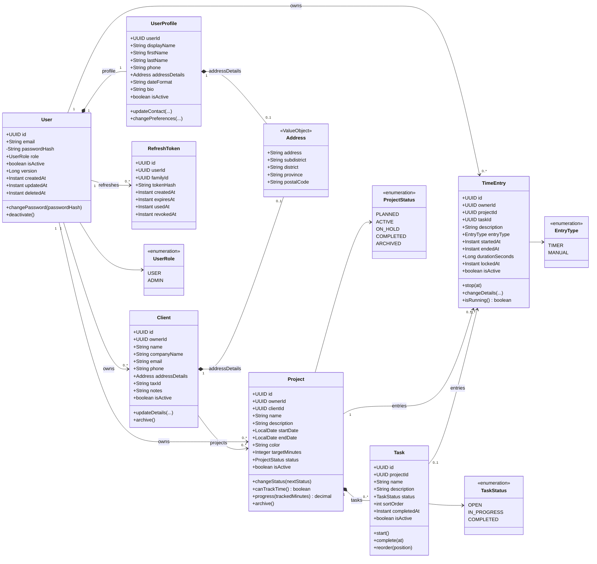

# Freelance Hub MVP - Domain Class Diagram

Class Diagram นี้อ้างอิง DBML รุ่นปรับปรุงล่าสุดของ MVP โดยไม่รวม Controller, DTO, Service และ Repository
ข้อมูล Address เป็น value object แบบ `@Embeddable` ใน `UserProfile` และ `Client` โดยยังเก็บคอลัมน์ในตารางเดิม
ในเอกสารนี้ใช้ชื่อ audit field มาตรฐาน `deletedAt` แทน typo `deleate_at` จาก DBML ต้นทาง

```mermaid
classDiagram
    direction LR

    class User {
        +UUID id
        +String email
        -String passwordHash
        +UserRole role
        +boolean isActive
        +Long version
        +Instant createdAt
        +Instant updatedAt
        +Instant deletedAt
        +changePassword(passwordHash)
        +deactivate()
    }
    class UserProfile {
        +UUID userId
        +String displayName
        +String firstName
        +String lastName
        +String phone
        +Address addressDetails
        +String dateFormat
        +String bio
        +boolean isActive
        +updateContact(...)
        +changePreferences(...)
    }
    class Client {
        +UUID id
        +UUID ownerId
        +String name
        +String companyName
        +String email
        +String phone
        +Address addressDetails
        +String taxId
        +String notes
        +boolean isActive
        +updateDetails(...)
        +archive()
    }
    class Project {
        +UUID id
        +UUID ownerId
        +UUID clientId
        +String name
        +String description
        +LocalDate startDate
        +LocalDate endDate
        +String color
        +Integer targetMinutes
        +ProjectStatus status
        +boolean isActive
        +changeStatus(nextStatus)
        +canTrackTime() boolean
        +progress(trackedMinutes) decimal
        +archive()
    }
    class Task {
        +UUID id
        +UUID projectId
        +String name
        +String description
        +TaskStatus status
        +int sortOrder
        +Instant completedAt
        +boolean isActive
        +start()
        +complete(at)
        +reorder(position)
    }
    class TimeEntry {
        +UUID id
        +UUID ownerId
        +UUID projectId
        +UUID taskId
        +String description
        +EntryType entryType
        +Instant startedAt
        +Instant endedAt
        +Long durationSeconds
        +Instant lockedAt
        +boolean isActive
        +stop(at)
        +changeDetails(...)
        +isRunning() boolean
    }
    class RefreshToken {
        +UUID id
        +UUID userId
        +UUID familyId
        +String tokenHash
        +Instant createdAt
        +Instant expiresAt
        +Instant usedAt
        +Instant revokedAt
    }
    class Address {
        <<ValueObject>>
        +String address
        +String subdistrict
        +String district
        +String province
        +String postalCode
    }
    class UserRole {
        <<enumeration>>
        USER
        ADMIN
    }
    class ProjectStatus {
        <<enumeration>>
        PLANNED
        ACTIVE
        ON_HOLD
        COMPLETED
        ARCHIVED
    }
    class TaskStatus {
        <<enumeration>>
        OPEN
        IN_PROGRESS
        COMPLETED
    }
    class EntryType {
        <<enumeration>>
        TIMER
        MANUAL
    }

    User "1" *-- "1" UserProfile : profile
    UserProfile "1" *-- "0..1" Address : addressDetails
    User "1" --> "0..*" Client : owns
    Client "1" *-- "0..1" Address : addressDetails
    User "1" --> "0..*" Project : owns
    User "1" --> "0..*" TimeEntry : owns
    User "1" --> "0..*" RefreshToken : refreshes
    Client "1" --> "0..*" Project : projects
    Project "1" *-- "0..*" Task : tasks
    Project "1" --> "0..*" TimeEntry : entries
    Task "0..1" --> "0..*" TimeEntry : entries
    User --> UserRole
    Project --> ProjectStatus
    Task --> TaskStatus
    TimeEntry --> EntryType
```

## Domain Rules

- `Address` is a value object embedded in `UserProfile` and `Client`; it has no separate database table.
- Client and Project ownership is enforced by composite `(client_id, owner_id)` relationship.
- Project and TimeEntry ownership is enforced by composite `(project_id, owner_id)` relationship.
- A selected Task must belong to the same Project as the TimeEntry.
- `isActive` and `deletedAt` implement soft delete; `status` remains only for Project and Task workflow.
- `durationSeconds` is used for accurate time tracking; `lockedAt` marks an entry as immutable when set.
- Service layer must verify ownership before every read or mutation.
