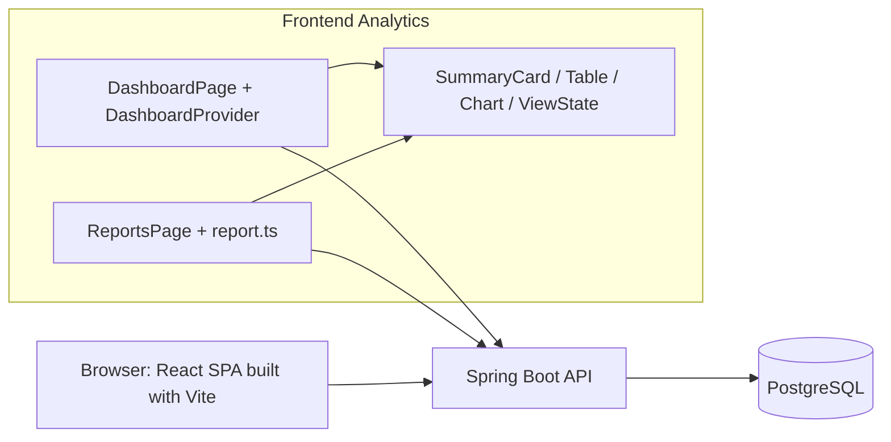

# Component View: Dashboard/Reports ในระบบ

คัดลอกจาก diagram ที่มีใน [Nattadol Design](../V1/DESIGN/nattadol-design.md) และตรวจชื่อ components ณ `131305f` แสดงขอบเขต Frontend/API/Database ไม่ใช่ Deployment Diagram ของ cloud nodes และไม่อ้างว่าทุก process อยู่ host เดียวกัน

Backend แยก controller, service, repository, domain และ DTO ตาม [Class Diagram](class-diagram.md#application-layers) Analytics ใช้ Timer/Project/Task/Client ที่ feature อื่นเปิดให้ ไม่เป็นเจ้าของ lifecycle ของข้อมูลเหล่านั้น
