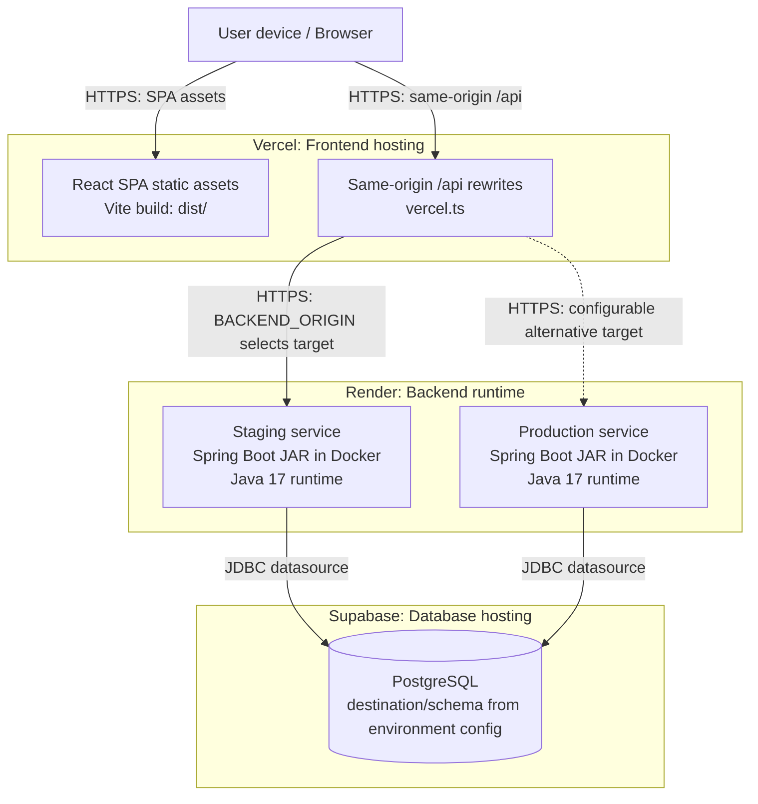
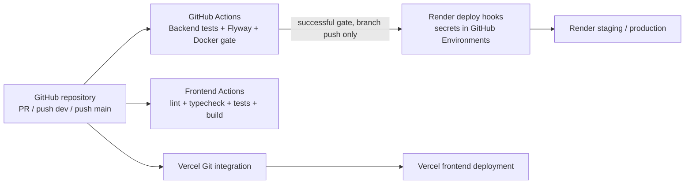
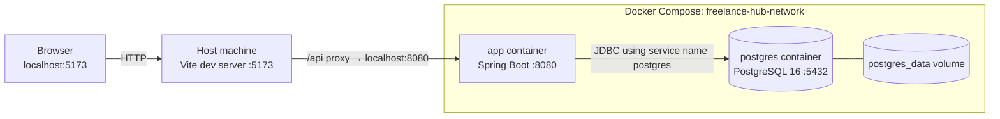

# Deployment Diagram - Freelance Hub

ตรวจจาก README, Vercel configuration, Backend Dockerfile, Docker Compose และ GitHub Actions ณ `ca77d74` วันที่ 9 ตุลาคม 2026 ภาพแสดง logical deployment nodes/artifacts ที่ repository กำหนด ไม่ใช่หลักฐานว่า cloud services หรือ URL เข้าถึงได้จริงในวันส่งงาน

## Cloud deployment

เส้นประไป Production เป็นทางเลือกของ BACKEND_ORIGIN ไม่ใช่ส่ง request ไปสอง service พร้อมกัน vercel.ts ระบุว่าปัจจุบัน Frontend Production/Preview ใช้ staging target ที่ตั้งใน environment; repository ไม่เผยค่าตั้งจริงบน cloud จึงต้องตรวจ settings อีกครั้งก่อนส่ง

Database node เป็น logical ปลายทางของแต่ละ environment ไม่ยืนยันว่าสอง Backend ใช้ database instance/schema เดียวกันหรือต่างกัน การใช้ TLS กับฐานข้อมูลขึ้นกับ SPRING_DATASOURCE_URL/cloud configuration ไม่ถือว่า application.properties บังคับ TLS ไว้แล้ว

## Artifacts, ports และ configuration

| Node | Artifact/runtime | การเชื่อมต่อและ configuration |
|---|---|---|
| Browser | React/TypeScript SPA | API base path /api; access JWT อยู่ใน memory; refresh cookie เป็น HttpOnly |
| Vercel | dist/ จาก npm run build | vercel.ts rewrite API ไป HTTPS BACKEND_ORIGIN และ SPA routes ไป index.html |
| Render Backend | code/Backend/Dockerfile → Spring Boot executable JAR | Multi-stage Java 17 build/runtime; port ใช้ PORT หรือค่าเริ่มต้น 8080; Flyway ทำงานก่อนเปิด API |
| Supabase PostgreSQL | Database schema จาก migrations V1–V20 | อ่าน datasource URL/user/password/schema จาก environment; ไม่เก็บ production credentials ใน diagram |
| GitHub Actions runner | Maven/Node/Docker/Flyway jobs | ตรวจ source และเรียก Render deploy hooks ไม่ใช่ node ที่ให้บริการ API ต่อผู้ใช้ |

Runtime Docker ใช้ non-root user และ health check ไป /actuator/health; production ควรปิด OpenAPI ตาม OPENAPI_ENABLED ค่าเริ่มต้น ดูรายละเอียด security/configuration ใน [CI/CD](../ci-cd.md)

## Build และ deployment channels

PR ไม่เรียก Render deploy hook; push dev ไป staging และ push main ไป production หลัง gate ผ่าน ส่วน Vercel Git integration ทำงานแยกจาก Frontend gate จึงอาจสร้าง PR preview ได้ ไม่มี dependency ใน workflow ว่าต้องรอ Frontend gate ก่อน deploy

## Local development

Ports เป็นค่าปริยาย: APP_PORT/POSTGRES_PORT/PORT ปรับได้ และ Vite อาจเลือก port ถัดไปเมื่อ 5173 ถูกใช้อยู่ Vite proxy ใช้ BACKEND_ORIGIN และ VITE_API_BASE_URL เมื่อกำหนด มิฉะนั้นใช้ http://localhost:8080 และ /api ตามภาพ Browser ไม่ต่อ PostgreSQL โดยตรง docker compose down ปกติไม่ลบ postgres_data volume

## ตำแหน่งหลักฐาน

- [README: Deployment URLs และ setup](../../README.md)
- [Vercel rewrites](../../code/Frontend/vercel.ts)
- [Backend Dockerfile](../../code/Backend/Dockerfile)
- [Local Docker Compose](../../code/Backend/docker-compose.yml)
- [Backend workflow](../../.github/workflows/backend.yml) และ [Frontend workflow](../../.github/workflows/frontend-ci.yml)

ไม่มีการ deploy, เรียก cloud hooks, ทดลองเขียนข้อมูล cloud หรือเปิดเผย secrets ในการจัดทำเอกสารนี้ ต้องแนบผล CI/health check จริงของ release เมื่อทีมตรวจ deployment
