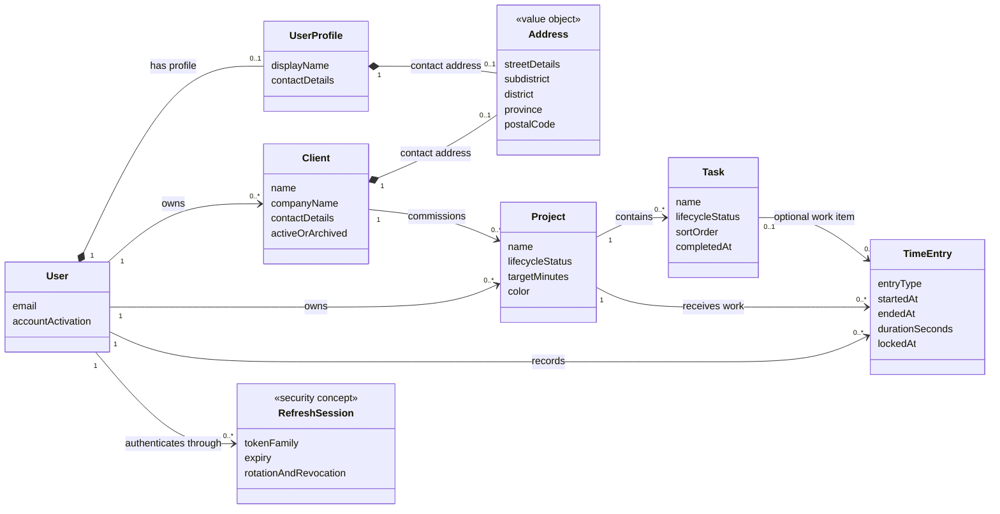

# Conceptual Domain Model - Freelance Hub

แบบจำลองแนวคิดของ MVP ตรวจจาก entities/ความสัมพันธ์ปัจจุบัน ณ `ca77d74` วันที่ 9 ตุลาคม 2026 แสดงคำศัพท์ธุรกิจ ความรับผิดชอบและ multiplicity ไม่แสดง controllers/repositories/DTOs หรือรายละเอียด FK/คอลัมน์ทั้งหมด

รายละเอียด implementation อยู่ใน [Domain Class Diagram](class-diagram.md) และ schema อยู่ใน [ER Diagram](er-diagram.md) ภาพนี้จึงไม่ใช่ ER Diagram ที่เปลี่ยนชื่อไฟล์

## คำศัพท์และกฎธุรกิจ

| Concept | ความหมายและกฎที่เกี่ยวข้อง |
|---|---|
| User | Freelancer เจ้าของข้อมูล ต้องแยกข้อมูลของแต่ละบัญชี ไม่ใช่ workspace แบบหลายสมาชิก |
| UserProfile | ข้อมูลส่วนตัวของ User; schema อนุญาต 0..1 profile แต่ registration สร้างให้ |
| Address | Value object ฝังใน Profile/Client มีข้อมูลที่อยู่แยกฟิลด์ ไม่มี identity/table addresses แยก |
| Client | ลูกค้าที่ User ติดต่อ เป็นเจ้าของงานหลาย Project; archive กับ soft delete เป็นคนละคำสั่ง |
| Project | งานหลักของ Client หนึ่งรายและ owner หนึ่งคน Client กับ Project ต้องเป็นของ owner เดียวกัน; อาจไม่ตั้งเป้าหมายเวลา |
| Task | งานย่อยอยู่ใน Project เดียว มีลำดับและสถานะของตนเอง ไม่มี due-date field ใน model ปัจจุบัน |
| TimeEntry | หนึ่งช่วงการทำงานของ owner ใน Project เดียว อาจไม่ผูก Task; ถ้าผูกต้องเป็น Task ใน Project นั้น เก็บระยะเวลาเป็นวินาที |
| RefreshSession | แนวคิด security session ที่ implementation เก็บหลาย RefreshToken records ใน family เดียวจากการ rotate ไม่ใช่ entity/table ใหม่ที่เสนอให้สร้าง |

Multiplicity 0..* หมายถึงมีลูก/รายการได้ตั้งแต่ไม่มีเลย Composition ของ Profile/Address สื่อ domain ownership ไม่ได้ประกาศว่า soft delete User/Client จะ cascade ลบข้อมูลทั้งหมด

## Lifecycle และข้อมูลที่คำนวณ

- Client ใช้ isActive แยก ACTIVE/ARCHIVED; soft delete ใช้ deletedAt โดยคง activation เดิม
- Project ใช้ PLANNED/ACTIVE/ON_HOLD/COMPLETED/ARCHIVED; Task ใช้ OPEN/IN_PROGRESS/COMPLETED เป็นคนละ lifecycle
- Timer และ Manual เป็นชนิดของ TimeEntry เดียว ไม่ใช่สองตาราง: Timer เริ่มโดยยังไม่จบ ส่วน Manual มีเวลาจบตั้งแต่สร้าง
- TimeEntry ที่ล็อกแล้วแก้หรือลบไม่ได้ผ่าน operation ปกติ; Project completion สั่งล็อกรายการที่มีอยู่
- หนึ่ง User มี running timer ได้ไม่เกินหนึ่งรายการ ไม่ใช่หนึ่ง timer ต่อ Project
- Client totalTrackedSeconds, Project progress/usage และ Dashboard/Reports เป็น read models ที่คำนวณจากข้อมูลเหล่านี้ ไม่ใช่ business entities/tables เพิ่ม
- การรวมเวลาของแต่ละหน้าใช้เงื่อนไข visibility ต่างกัน ดู [Use Case Description](../use-case-description.md) ไม่ถือว่าทุก metric มีชุดข้อมูลเดียวกัน

## สิ่งที่ไม่อยู่ใน model นี้

ไม่มี Invoice, Payment, Finance, shared Workspace หรือ Notification entity ใน MVP; threshold event ปัจจุบันลง log เท่านั้น ไม่เพิ่มสิ่งเหล่านี้ใน diagram เพื่อให้ดูครบกว่าระบบจริง
