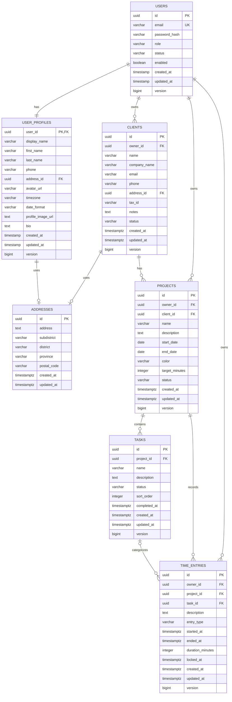

# Freelance Hub MVP — ER Diagram

แผนภาพนี้เป็น logical database schema สำหรับ MVP เท่านั้น โดยที่อยู่ถูก normalize เป็น `addresses`
และถูกอ้างอิงจาก User Profile/Client ส่วน Dashboard และ Analytics
คำนวณจาก `time_entries` จึงไม่ต้องมีตารางสรุปแยกในระยะแรก

## Cardinality และกติกาสำคัญ

- `users` 1 — 1 `user_profiles`: ใช้ `user_profiles.user_id` เป็นทั้ง PK และ FK เพื่อบังคับ One-to-One จริง
- `user_profiles` และ `clients` อ้างอิง `addresses` ผ่าน `address_id`; แต่ละ record มีที่อยู่ได้ไม่เกินหนึ่งรายการ และไม่มีการใช้ polymorphic owner key
- `users` 1 — N `clients`, `projects`, `time_entries`: `owner_id` ใช้แยกข้อมูลของผู้ใช้และช่วยให้ query ด้าน security ตรงไปตรงมา
- `clients` 1 — N `projects`: ทุกโปรเจกต์ต้องมีลูกค้าหนึ่งราย
- `projects` 1 — N `tasks` และ `time_entries`: time entry ต้องมีโปรเจกต์เสมอ
- `tasks` 0..1 — N `time_entries`: การเลือก task เป็น optional แต่ถ้าเลือก task ต้องอยู่ใน project เดียวกับ time entry
- Unique partial index ที่ `time_entries(owner_id) WHERE ended_at IS NULL` บังคับให้ผู้ใช้มี running timer ได้สูงสุดหนึ่งรายการ
- Composite FK `(client_id, owner_id)` และ `(project_id, owner_id)` ป้องกันการผูกข้อมูลข้ามเจ้าของ ส่วน `(task_id, project_id)` ป้องกันการเลือก task ข้าม project
- Archive ใช้สถานะ `ARCHIVED` ไม่ลบ `clients` หรือ `projects` ที่มีประวัติ เพื่อรักษา time entries
- API map `addresses.postal_code` เป็น `postalCode` และแสดงที่อยู่เป็น flat fields (`address`, `subdistrict`, `district`, `province`, `postalCode`)
- ตาราง auth ปัจจุบันใช้ `timestamp` ตาม migration V1/V2; entity `User` และ `UserProfile` ใช้ `LocalDateTime`
- เก็บเวลาเป้าหมายและเวลาทำงานเป็นนาทีจำนวนเต็ม ป้องกันความคลาดเคลื่อนจากเลขทศนิยม

## Enum/check values

| Column                    | Allowed values                                          |
| ------------------------- | ------------------------------------------------------- |
| `users.role`              | `USER`, `ADMIN` (สงวน `ADMIN` สำหรับการจัดการระบบ)       |
| `users.status`            | `ACTIVE`, `INACTIVE`, `SUSPENDED`                       |
| `clients.status`          | `ACTIVE`, `ARCHIVED`                                    |
| `projects.status`         | `PLANNED`, `ACTIVE`, `ON_HOLD`, `COMPLETED`, `ARCHIVED` |
| `tasks.status`            | `OPEN`, `IN_PROGRESS`, `COMPLETED`                      |
| `time_entries.entry_type` | `TIMER`, `MANUAL`                                       |
