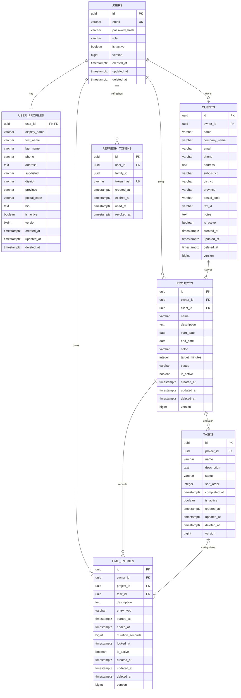

# Freelance Hub MVP - ER Diagram

ER Diagram นี้อ้างอิง DBML รุ่นปรับปรุงล่าสุดของ MVP โดยใช้ embedded address fields และ soft delete
Dashboard และ Productivity Insights คำนวณจาก `time_entries`, `projects` และ `tasks` โดยไม่สร้างตารางสรุปแยก
ชื่อคอลัมน์ใน diagram ใช้ `deleted_at` ซึ่งเป็นชื่อมาตรฐานแทน typo `deleate_at` จาก DBML ต้นทาง

```mermaid
erDiagram
    USERS {
        uuid id PK
        varchar email UK
        varchar password_hash
        varchar role
        boolean is_active
        bigint version
        timestamptz created_at
        timestamptz updated_at
        timestamptz deleted_at
    }
    USER_PROFILES {
        uuid user_id PK,FK
        varchar display_name
        varchar first_name
        varchar last_name
        varchar phone
        text address
        varchar subdistrict
        varchar district
        varchar province
        varchar postal_code
        text bio
        boolean is_active
        bigint version
        timestamptz created_at
        timestamptz updated_at
        timestamptz deleted_at
    }
    CLIENTS {
        uuid id PK
        uuid owner_id FK
        varchar name
        varchar company_name
        varchar email
        varchar phone
        text address
        varchar subdistrict
        varchar district
        varchar province
        varchar postal_code
        varchar tax_id
        text notes
        boolean is_active
        timestamptz created_at
        timestamptz updated_at
        timestamptz deleted_at
        bigint version
    }
    PROJECTS {
        uuid id PK
        uuid owner_id FK
        uuid client_id FK
        varchar name
        text description
        date start_date
        date end_date
        varchar color
        integer target_minutes
        varchar status
        boolean is_active
        timestamptz created_at
        timestamptz updated_at
        timestamptz deleted_at
        bigint version
    }
    TASKS {
        uuid id PK
        uuid project_id FK
        varchar name
        text description
        varchar status
        integer sort_order
        timestamptz completed_at
        boolean is_active
        timestamptz created_at
        timestamptz updated_at
        timestamptz deleted_at
        bigint version
    }
    TIME_ENTRIES {
        uuid id PK
        uuid owner_id FK
        uuid project_id FK
        uuid task_id FK
        text description
        varchar entry_type
        timestamptz started_at
        timestamptz ended_at
        bigint duration_seconds
        timestamptz locked_at
        boolean is_active
        timestamptz created_at
        timestamptz updated_at
        timestamptz deleted_at
        bigint version
    }
    REFRESH_TOKENS {
        uuid id PK
        uuid user_id FK
        uuid family_id
        varchar token_hash UK
        timestamptz created_at
        timestamptz expires_at
        timestamptz used_at
        timestamptz revoked_at
    }

    USERS ||--|| USER_PROFILES : has
    USERS ||--o{ CLIENTS : owns
    USERS ||--o{ PROJECTS : owns
    USERS ||--o{ TIME_ENTRIES : owns
    USERS ||--o{ REFRESH_TOKENS : refreshes
    CLIENTS ||--o{ PROJECTS : serves
    PROJECTS ||--o{ TASKS : contains
    PROJECTS ||--o{ TIME_ENTRIES : records
    TASKS o|--o{ TIME_ENTRIES : categorizes
```

## Cardinality and Constraints

- `users` 1 - 1 `user_profiles`: `user_profiles.user_id` is both PK and FK.
- `users` 1 - N `clients`, `projects`, `time_entries`, and `refresh_tokens`.
- `clients` 1 - N `projects`; the actual FK is composite `(projects.client_id, projects.owner_id)` -> `(clients.id, clients.owner_id)`.
- `projects` 1 - N `tasks` and `time_entries`; the TimeEntry relationship uses `(project_id, owner_id)` to prevent cross-user references.
- `tasks` 0..1 - N `time_entries`; when selected, `(task_id, project_id)` must match the same Project.
- `time_entries` allows at most one active running timer per owner through a partial unique index.
- `time_entries.locked_at` marks an entry as locked and prevents further edits or deletion through the service layer.
- Soft delete is represented by `is_active = false` and a non-null `deleted_at`.
- `status` is reserved for Project and Task workflow; account and record activation use `is_active`.
- There is no `addresses` table in this schema; address fields are stored directly in `user_profiles` and `clients`.

## Enum Values

| Field | Values |
|---|---|
| `users.role` | `USER`, `ADMIN` |
| `projects.status` | `PLANNED`, `ACTIVE`, `ON_HOLD`, `COMPLETED`, `ARCHIVED` |
| `tasks.status` | `OPEN`, `IN_PROGRESS`, `COMPLETED` |
| `time_entries.entry_type` | `TIMER`, `MANUAL` |
