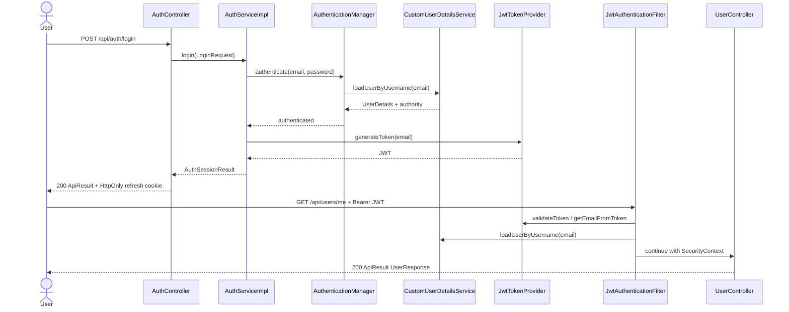

# Sequence 01: Login และ Protected Request

ที่มา: [Petpinyo](../V1/USECASE/petpinyo-usecase.md) ตรวจชื่อ method/response กับ AuthController และ JwtTokenProvider ณ `cb8002d` Diagram ย่อขั้นตรวจ credentials/JWT; รายละเอียด refresh-token rotation และ error flows ดู [Use Cases](../use-case-description.md)

