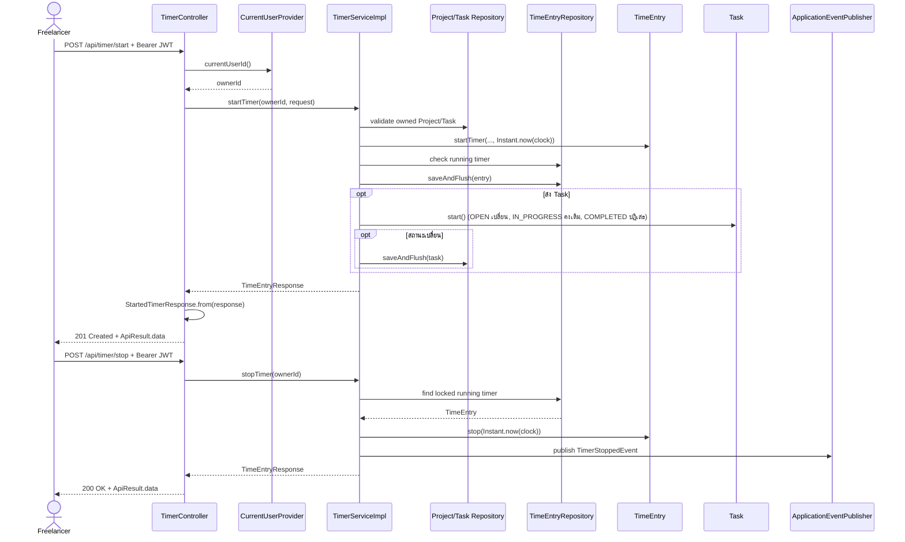

# Sequence 02: Start และ Stop Timer

ที่มา: [Kompat](../V1/USECASE/kompat-usecase.md) ปรับ current-user abstraction ให้ตรง TimerController ณ `cb8002d` ขั้น start/stop อยู่ใน transaction; progress listener รับ event หลัง commit ดังแสดงใน [Sequence 06](sequence-06-progress-events.md)

