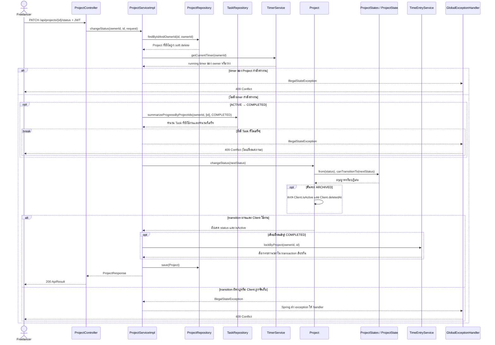

# Sequence 03: เปลี่ยนสถานะ Project

ที่มา: [Kantavit](../V1/USECASE/kantavit-usecase.md) ณ `131305f` การค้นหา owner, ตรวจ running timer, ตรวจ Task และ lockByProject อยู่ใน Service transaction เดียวกัน Spring MVC เป็นผู้ส่ง exception ไป handler ไม่ใช่ service เรียก handler โดยตรง

