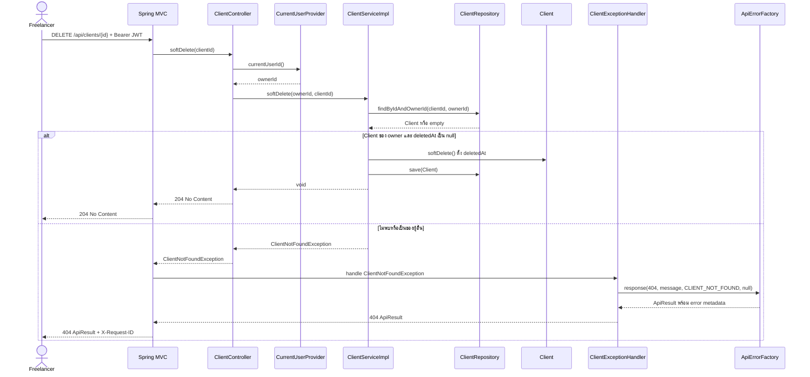

# Sequence 04: Soft-delete Client

ที่มา: [Thirawat](../V1/USECASE/thirawat-usecase.md) ณ `131305f` Diagram เริ่มหลังผ่าน JWT; RequestTraceFilter ทำงานก่อน security/MVC สำเร็จคืน 204 ไม่มี body และไม่เปลี่ยน isActive หรือสถานะ Project

