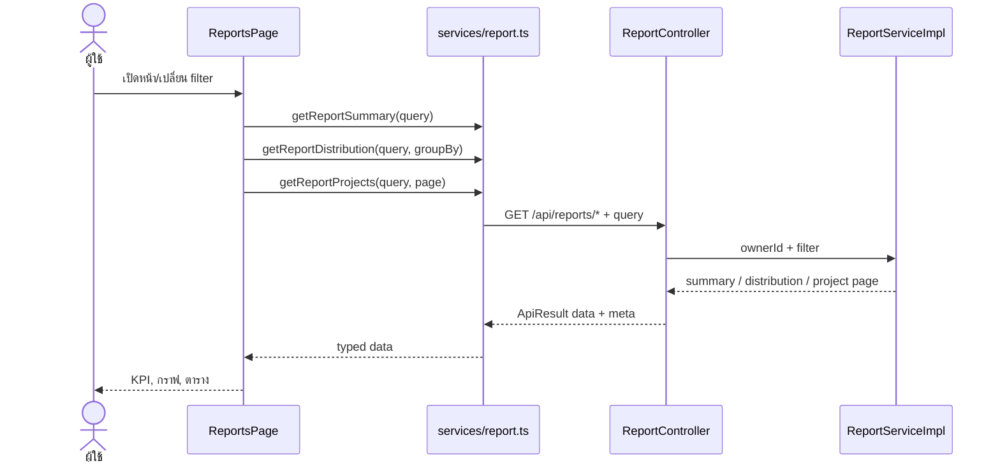

# Sequence 05: โหลด Reports และเปลี่ยน Filter

ที่มา: [Nattadol](../V1/USECASE/nattadol-usecase.md) ณ `131305f` การเรียกสาม endpoint เป็นอิสระ ไม่ได้บังคับลำดับรอทีละ request; pagination/CSV ใช้ Project ของหน้าปัจจุบัน

