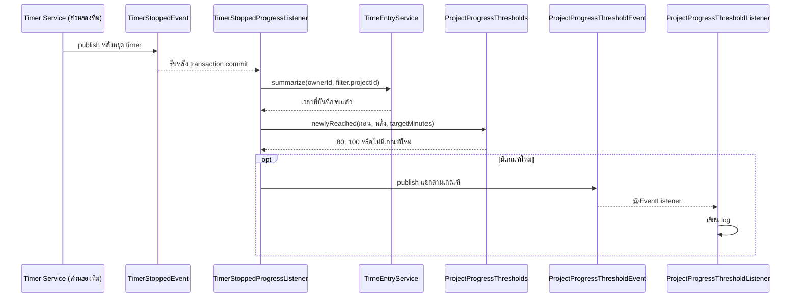

# Sequence 06: ตรวจเกณฑ์เวลาเมื่อหยุด Timer

ที่มา: [Kantavit](../V1/DESIGN/kantavit-design.md) ณ `131305f` Observer ผ่าน Spring events; ไม่มี targetMinutes จะไม่มี threshold event และปลายทางปัจจุบันบันทึก log ไม่ได้ส่ง notification ให้ผู้ใช้

