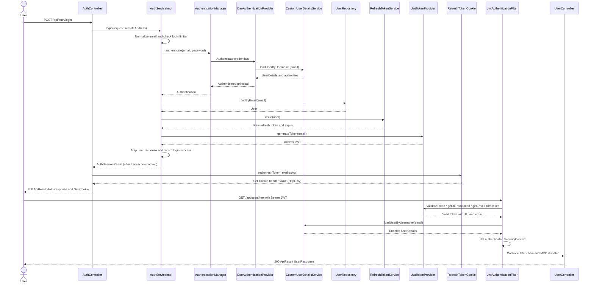
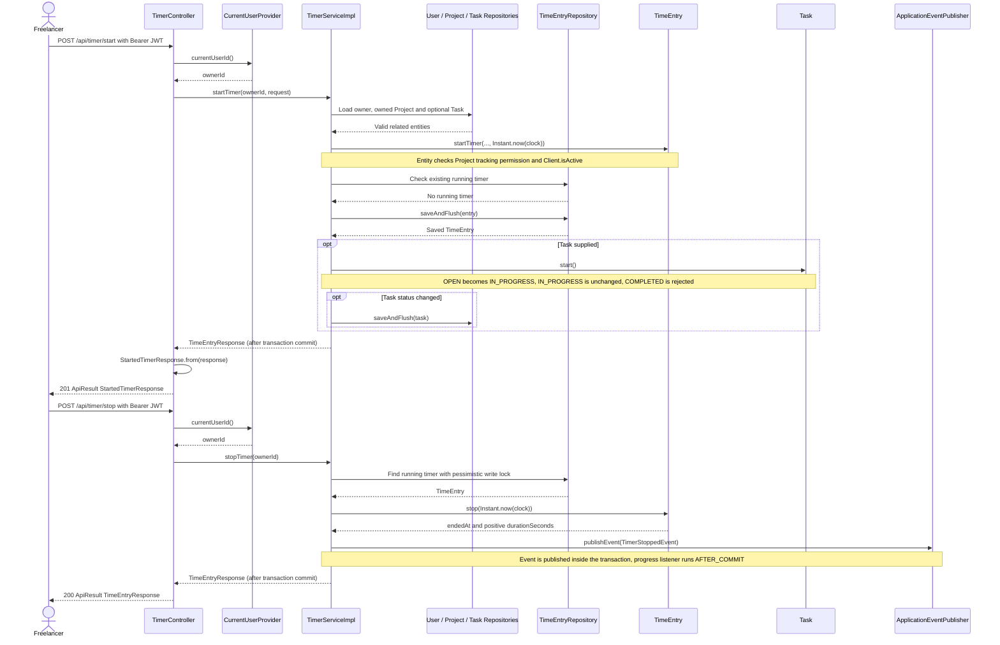
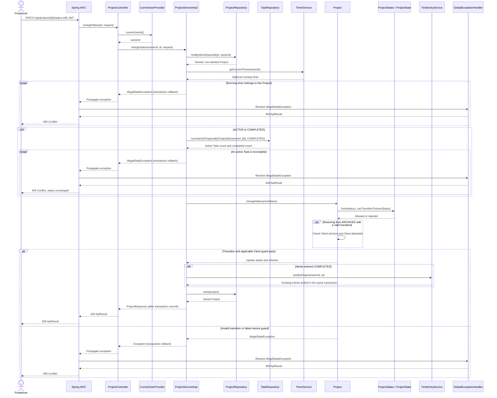
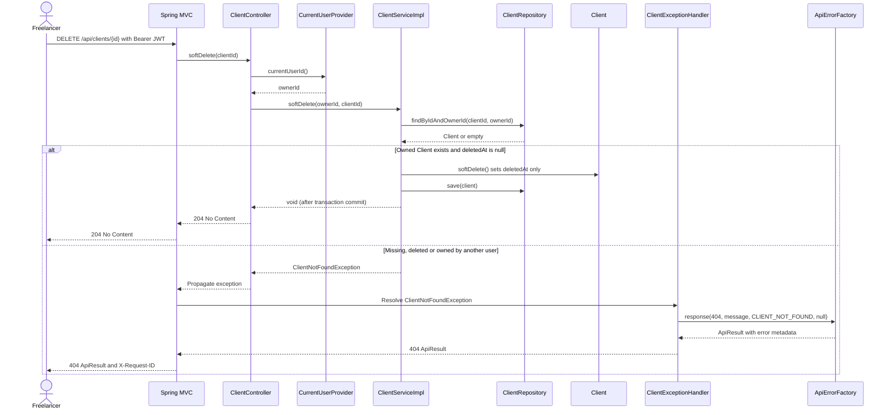
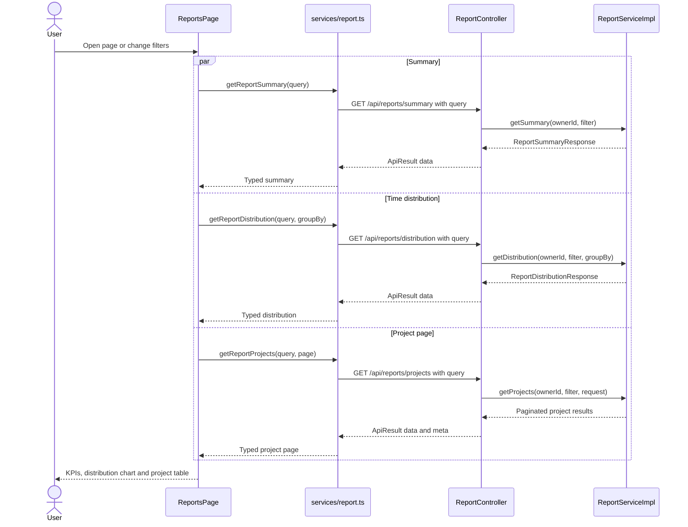
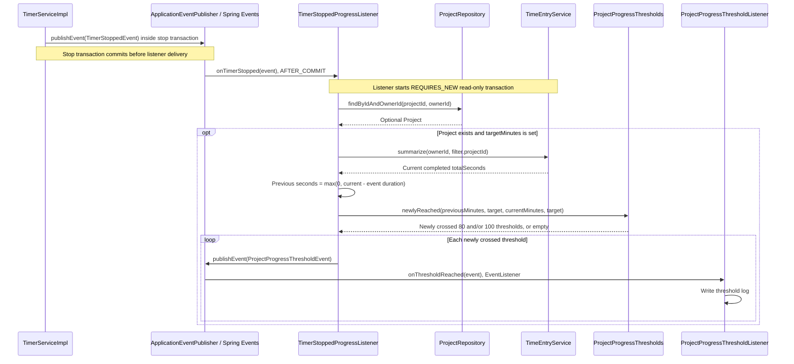

# Sequence Diagrams - Freelance Hub

รวม 6 scenarios ของระบบไว้ไฟล์เดียว ตรวจ controllers/services/events กับ source ณ `5f55faf` วันที่ 9 ตุลาคม 2026 และนำเอกสาร Auth/Profile ที่เพื่อนปรับใน PR #127 มาเทียบกับโค้ดจริง ข้อความในภาพใช้ภาษาอังกฤษ ส่วนคำอธิบายรอบภาพคงภาษาไทย

ทุกภาพเป็น flow ที่ย่อขั้นตอนเพื่ออ่านง่าย ไม่ใช่ทุก method/error path ของระบบ รายละเอียด validation, ownership, HTTP contracts และข้อจำกัดดู [Use Case Description](../use-case-description.md)

## Scenario 01: Login and Protected Request

ที่มา: Petpinyo (`doc/V1/USECASE/petpinyo-usecase.md`; ต้นฉบับ local/ประวัติ Git) เพิ่มขั้น issue refresh token และสร้าง Set-Cookie ให้ตรงกับโค้ด Login ใช้ transaction; JWT filter ของ protected request ตรวจ token/JTI และโหลด user ที่ enabled ภาพแสดง happy path ไม่รวม rate-limit/invalid-credentials branches

Refresh token เก็บเฉพาะ hash ในฐานข้อมูล ไม่ส่ง raw token ใน JSON; User/Profile โหลดและบันทึกผ่าน UserRepository ไม่ใช่เรียก UserProfileRepository ใน flow นี้ อายุ JWT/refresh ปรับผ่าน configuration ได้

## Scenario 02: Start and Stop Timer

ที่มา: Kompat (`doc/V1/USECASE/kompat-usecase.md`; ต้นฉบับ local/ประวัติ Git) current-user abstraction ตรง TimerController ขั้น start/stop อยู่ใน transaction การ start Task ทำหลัง insert timer สำเร็จและ rollback ร่วมกันหาก Task ปฏิเสธ ดูการรับ event หลัง commit ใน [Scenario 06](#scenario-06-progress-threshold-events)

Partial unique index ของ PostgreSQL กัน timer ซ้อนของ owner เดียวแม้สองคำขอแข่งกัน; service แปลง constraint violation นี้เป็น conflict ไม่ใช่ป้องกันด้วย pre-check อย่างเดียว Cancel timer ลบ running row จริงและไม่ publish TimerStoppedEvent

## Scenario 03: Change Project Status

ที่มา: Kantavit (`doc/V1/USECASE/kantavit-usecase.md`; ต้นฉบับ local/ประวัติ Git) การค้นหา owner, ตรวจ running timer, ตรวจ Task และ lockByProject อยู่ใน Service transaction เดียวกัน ภาพแสดง exception ย้อนกลับผ่าน Controller/MVC ก่อน dispatch ไป GlobalExceptionHandler ไม่ใช่ Service เรียก handler เอง

หาก lockByProject พบ running entry ก็ปฏิเสธและ rollback ทั้ง transaction ส่งสถานะเดิมไม่ล็อกซ้ำแต่ยังตรวจ running timer; archive cascade จาก Client ใช้ Project.changeStatus โดยตรง ไม่ผ่าน ProjectService guard นี้

## Scenario 04: Soft-delete Client

ที่มา: Thirawat (`doc/V1/USECASE/thirawat-usecase.md`; ต้นฉบับ local/ประวัติ Git) เริ่มหลังผ่าน JWT; RequestTraceFilter ทำงานก่อน security/MVC สำเร็จคืน 204 ไม่มี body โดยไม่เปลี่ยน Client.isActive หรือสถานะ Project

## Scenario 05: Load Reports and Change Filters

ที่มา: Nattadol (`doc/V1/USECASE/nattadol-usecase.md`; ต้นฉบับ local/ประวัติ Git) การเรียกสาม endpoint เป็นอิสระ ไม่ได้บังคับให้รอทีละ request ภาพใช้ par เพื่อสื่อการโหลดพร้อมกัน; pagination/CSV ใช้ Project ของหน้าปัจจุบัน

## Scenario 06: Progress Threshold Events

ที่มา: Kantavit (`doc/V1/DESIGN/kantavit-design.md`; ต้นฉบับ local/ประวัติ Git) Observer ผ่าน Spring events; listener เปิด read-only transaction ใหม่หลัง commit หากไม่มี Project/targetMinutes จะไม่มี threshold event ปลายทางเขียน log ไม่ได้ส่ง notification ให้ผู้ใช้

การเทียบเกณฑ์แปลง seconds เป็นจำนวน minutes แบบหารจำนวนเต็ม ไม่ใช่ publish ทุกรอบที่เกิน 80%/100% และ Manual Entry ไม่สร้าง TimerStoppedEvent อัตโนมัติ
