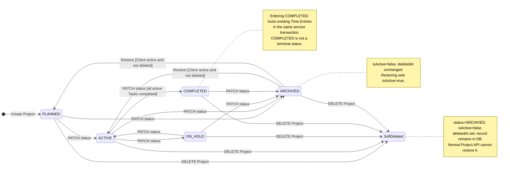
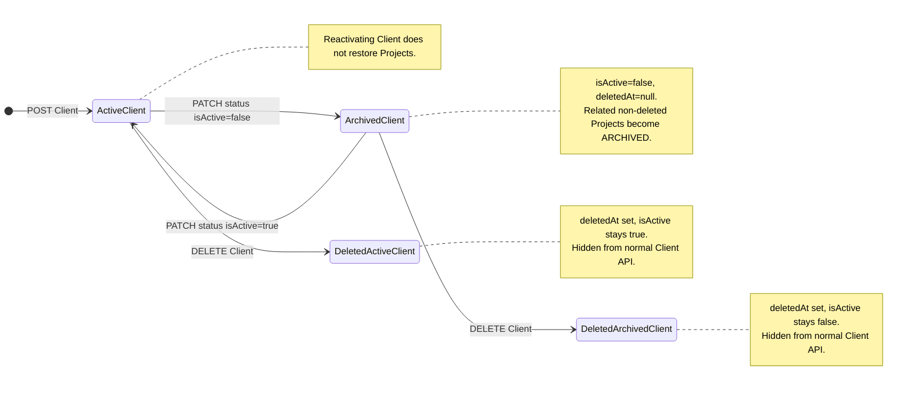
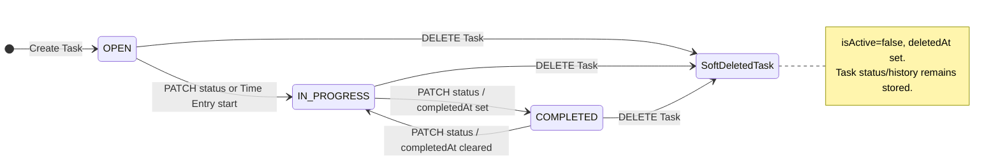
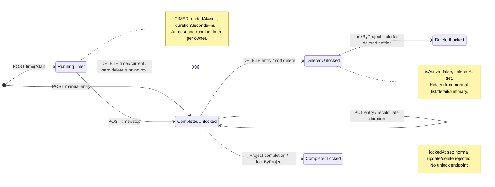

# State Diagrams - Freelance Hub

ตรวจจาก Project State classes, entities และ service guards ณ `ca77d74` วันที่ 9 ตุลาคม 2026 แยก workflow status ออกจาก activation/soft deletion โดยชื่อ SoftDeleted ในภาพเป็น lifecycle classification ไม่ใช่ enum ใหม่ในฐานข้อมูล

## Project lifecycle

กติกาเพิ่มเติมที่ไม่ใส่ซ้ำบนทุกเส้น:

- ProjectService ตรวจว่าไม่มี running timer ของ Project ก่อน PATCH status ทุกครั้ง (รวมส่งสถานะเดิม) และก่อน DELETE
- ACTIVE → COMPLETED ตรวจ Task ที่ยังใช้งานเท่านั้น; ไม่มี Task ที่ยังใช้งานก็ผ่านเงื่อนไขนี้ได้ เมื่อเข้าสู่ COMPLETED ครั้งใหม่เรียก lockByProject; ส่ง COMPLETED ซ้ำไม่ล็อกซ้ำ
- ทุก State อนุญาตส่งสถานะเดิมซ้ำ ไม่มี transition COMPLETED → ACTIVE โดยตรง; ต้อง ARCHIVED แล้วคืน ACTIVE/PLANNED ภายใต้ Client guard
- PLANNED/ACTIVE/ON_HOLD แก้ Task ได้; COMPLETED/ARCHIVED แก้ Task ไม่ได้ เริ่ม Timer ได้เฉพาะ ACTIVE และต้องผ่าน Client.isActive guard เพิ่ม
- Client archive cascade เรียก Project.changeStatus(ARCHIVED) โดยตรง ไม่ผ่าน ProjectService running-timer guard และไม่ตั้ง deletedAt; จึงต่างจาก PATCH/DELETE Project API
- deletedAt ถูกตรวจตอนค้นหา Project เพื่อแก้/คืนสถานะ ไม่ควรตีความว่าแค่ PATCH status จะกู้ Project ที่ soft delete ได้

หลักฐาน: Project.changeStatus/archive, ProjectStates และ PlannedState/ActiveState/OnHoldState/CompletedState/ArchivedState รวมถึง ProjectServiceImpl.changeStatus/archive

## Client activation และ soft deletion

สอง deleted states แสดงว่า soft delete ไม่เปลี่ยน activation เดิม ไม่ใช่เพิ่ม ClientStatus enum ค่าใหม่ การส่ง activation เดิมซ้ำทำได้; isActive=false ซ้ำยังทำ Project archive cascade

Client DELETE ไม่ archive Project/Task/TimeEntry และไม่ตรวจว่ามี Project/Time Entry ผูกอยู่ก่อนลบ แต่ method ทำงานใน transaction ส่วน Timer guard ตรวจ Client.isActive แต่ไม่ตรวจ Client.deletedAt โดยตรง ข้อจำกัดนี้ยังมีในโค้ด ไม่ถือว่า diagram implement การป้องกันให้แล้ว

## Task workflow ผ่าน API

- Task API ตรวจ project.canEditTasks ก่อน mutation และไม่ให้เปลี่ยนกลับ OPEN
- Service ปฏิเสธ OPEN → COMPLETED แม้ Entity.complete/changeStatus ยังไม่ได้ห้าม transition นี้เอง ภาพนี้แสดง contract ของ API ไม่ใช่ทุกเส้นที่ Entity method เรียกได้
- PATCH status เดิมซ้ำเป็น no-op; legacy /complete เรียก Task.complete จึงปฏิเสธ Task ที่ completed อยู่แล้ว ต่างจาก PATCH status เดิม
- การเริ่ม Timer/สร้าง Manual Entry เรียก Task.start: OPEN → IN_PROGRESS, IN_PROGRESS คงเดิม, COMPLETED ปฏิเสธ; Time Entry flow นี้ไม่ได้ผ่าน Task API project.canEditTasks guard ทุกกรณี
- การ soft delete Task ต้องอยู่ใน Project ที่แก้ Task ได้ เก็บ Time Entry เดิมไว้ และ service จัด sortOrder ของ Task ที่เหลือใหม่

## Time Entry lifecycle

- ภาพแยก business lifecycle จาก entryType: completed entry อาจเป็น TIMER หรือ MANUAL; การหยุด Timer ไม่เปลี่ยน entryType เป็น MANUAL
- stop ใช้ server Clock และต้องได้ durationSeconds > 0; cancel ลบ running row จริงและไม่ publish TimerStoppedEvent
- lockByProject ใช้ transaction ของผู้เรียก รวมรายการที่ soft delete, รักษา lockedAt เดิม และปฏิเสธ batch ที่มี running timerก่อนเปลี่ยนแถวใด
- Time Entry ที่ locked แล้วไม่มีเส้นกลับ unlocked; PostgreSQL row lock จบเมื่อ transaction จบ แต่ lockedAt ยังอยู่
- การสร้าง Manual Entry ใหม่หรือย้ายรายการเข้า Project ที่ COMPLETED ยังไม่ล็อกอัตโนมัติ; ไม่วาดเส้นอัตโนมัติที่โค้ดยังไม่มี

ดู [Use Cases](../use-case-description.md), [Project State Class Diagram](class-diagram.md#project-state-pattern), [Project Status Sequence](sequence-03-project-status.md) และ [Timer Sequence](sequence-02-timer.md) สำหรับ preconditions/HTTP responses และ transaction boundaries
