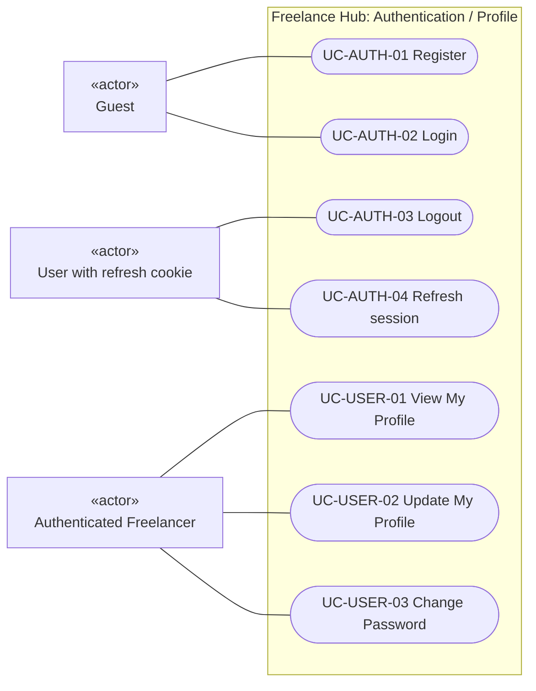
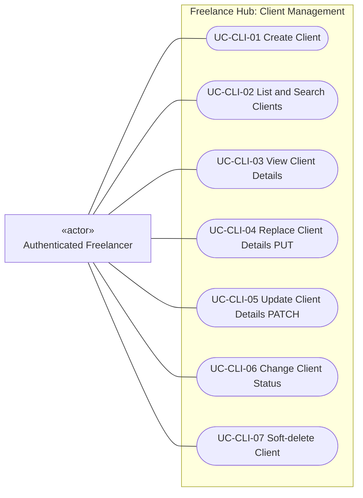
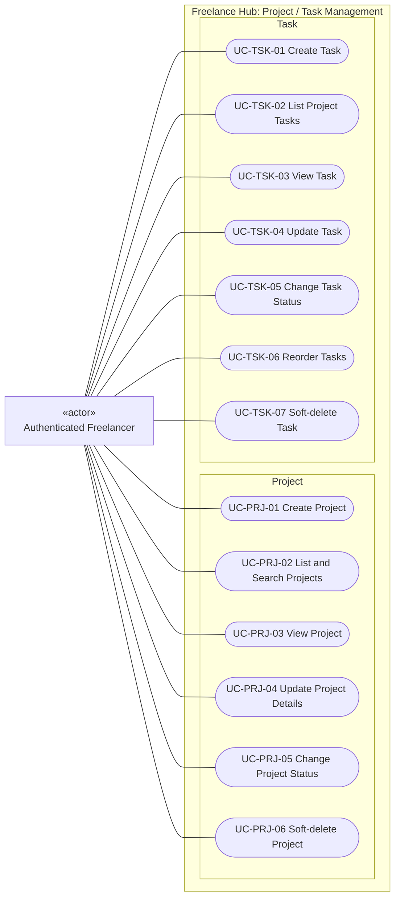
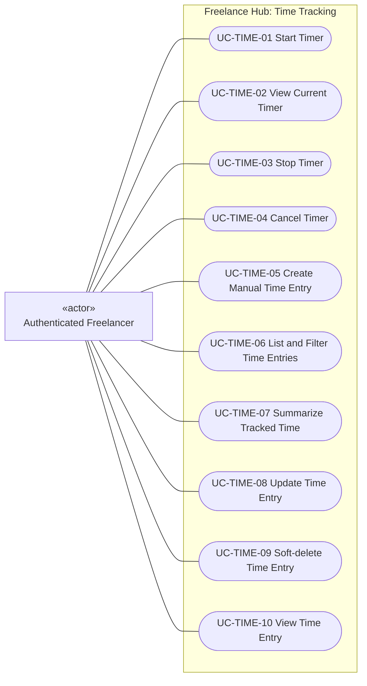
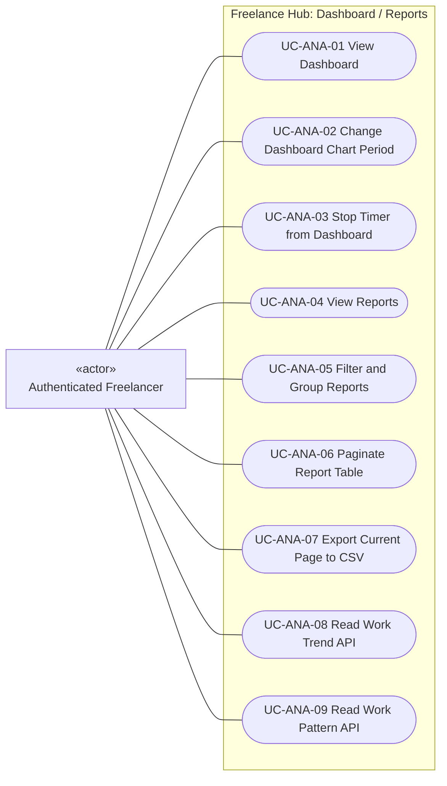

# Use Case Diagram - Freelance Hub

ตรวจจาก controllers และ [Use Case Description](../use-case-description.md) ณ `ca77d74` วันที่ 9 ตุลาคม 2026 แบ่งภาพตาม feature เพื่อให้อ่านได้ โดยทุกภาพอยู่ในขอบเขตระบบเดียวกัน

รูปแบบใช้ Mermaid flowchart แทน notation ของ Use Case: กล่อง «actor» อยู่นอก system boundary, รูปวงรีเป็น use case และเส้นทึบเป็น association ไม่ใช่ลำดับการเรียก API รายละเอียด preconditions/alternative flows อยู่ใน Use Case Description

## Actors และขอบเขต

- Guest: ผู้ใช้ที่ยังไม่เข้าสู่ระบบ สมัครบัญชีหรือ login
- Authenticated Freelancer: อ่าน/แก้ข้อมูลของบัญชีตนเองผ่าน access JWT
- User with refresh cookie: ผู้ใช้ที่มี session cookie สำหรับ refresh/logout รวมกรณี access JWT หมดอายุ เป็น role ของคนเดิม ไม่ใช่ผู้ใช้ประเภทใหม่
- JWT filters, repositories, Clock และ event listeners อยู่ภายในระบบ ไม่ใช่ actor ภายนอก
- มี UserRole.ADMIN ใน model แต่ยังไม่มี Admin management endpoint จึงไม่วาด actor/use case ที่ยังไม่ implement

## Authentication และ Profile

Logout เป็น public route ที่อ่าน refresh cookie และตรวจ Origin/Referer ไม่จำเป็นต้องมี access JWT ที่ยังไม่หมดอายุ ไม่มี forgot/reset password หรือ GET /api/users/{id} ใน implementation นี้

## Client Management

UC-CLI-03 เลือกแนบ Project/Task ด้วย include ได้ แต่ไม่ถือว่าเป็นการแก้ Project/Task; UC-CLI-06 archive Project ที่ผูกอยู่ด้วย ส่วน UC-CLI-07 ตั้ง deletedAt ของ Client อย่างเดียว ทั้งสองเป็นคนละ use case ไม่ใช่ hard delete

## Project และ Task Management

การตรวจ owner/สถานะ Project เป็น precondition ของ Task use cases ไม่ใช่ actor แยก Project เปลี่ยนเป็น COMPLETED จะตรวจ Task ที่ยังใช้งานและ lock รายการเวลาใน transaction เดียวกัน; คำสั่ง lock ไม่เปิดเป็น endpoint ให้ผู้ใช้เรียกเอง

## Timer และ Time Entry

UC-TIME-11 lockByProject เป็น operation ภายในจาก Project completion จึงไม่เชื่อม actor โดยตรง หลังหยุด Timer มี threshold event/log แต่ยังไม่มี use case รับ notification จริงหรือคัดลอก Time Entry เดิม

## Dashboard และ Reports

UC-ANA-03 ใช้ Timer API เดียวกับ UC-TIME-03 ไม่ใช่ timer lifecycle อีกชุด; CSV ทำใน browser ไม่มี endpoint export เพิ่ม UC-ANA-08/09 มี API แต่หน้า Reports ยังไม่มี UI สองส่วนนี้

## วิธีเทียบกับ requirement

Use case IDs ตรงกับ Use Case Description และภาพแสดงพฤติกรรมที่มีจริง ไม่ถือว่าทุก requirement สำเร็จจากการวาดภาพ เช่น Client detail ยังขาดเวลาราย Project, Dashboard บาง KPI ยังไม่ครบ, CSV ยังเป็นตาราง Project ของหน้าปัจจุบัน และ notification ยังเป็น log เท่านั้น

ดู [Domain Model](domain-model.md), [State Diagram](state-diagram.md) และ [Sequence Diagrams](README.md) เพื่อเทียบความสัมพันธ์ กฎสถานะ และลำดับการทำงาน
