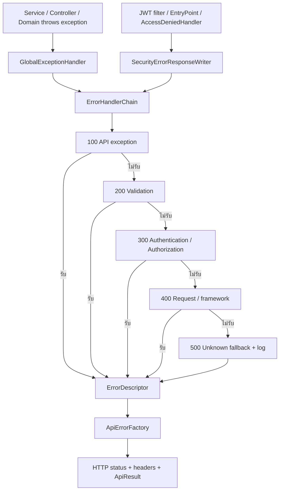

# Error Contract — Chain of Responsibility + Factory

ใช้ response envelope เดียวกันทั้ง Spring MVC และ Spring Security โดย `ApiException` ระบุความหมายของ error, Chain เลือกตัวแปลงตัวแรกที่รับได้ และ `ApiErrorFactory` สร้าง response/timestamp/traceId

## HTTP status

เลือกตามความหมายของ [MDN HTTP response status codes](https://developer.mozilla.org/en-US/docs/Web/HTTP/Reference/Status) โดยใช้ Spring `HttpStatus` สำหรับ application exceptions ไม่มี enum status หรือ ErrorCode เพิ่ม

| Status | ความหมายในระบบ |
|---|---|
| 400 | Input, validation หรือ request ไม่ถูกต้อง |
| 401 | ยังไม่เข้าสู่ระบบ หรือ credential/token ไม่ถูกต้อง |
| 403 | ไม่มีสิทธิ์ดำเนินการ รวม Origin ไม่ผ่าน |
| 404 | ไม่พบรายการ หรือรายการไม่อยู่ในขอบเขตของผู้ใช้ |
| 405 | Endpoint ไม่รองรับ method; รักษา `Allow` header |
| 409 | คำขอขัดกับสถานะปัจจุบันหรือข้อมูลที่มีอยู่ |
| 415 | Content type ไม่รองรับ |
| 429 | ถูกจำกัดจำนวนคำขอ; login มี `Retry-After` เป็นวินาที |
| 500 | Failure ภายในที่ไม่คาดหมาย รวม dependency failure ใน JWT filter |

Framework exceptions ที่ implement `ErrorResponse` รักษา status และ headers จาก framework เช่น 406, 413 และ 410 โดยไม่เปิดเผย reason ภายใน ส่วน raw `IllegalArgumentException`/`IllegalStateException` ที่หลุดจากโค้ดหรือ library เป็น unknown failure 500; input/business guards ต้องโยน exception ตาม contract

## Response

```json
{
  "success": false,
  "message": "ลองเข้าสู่ระบบบ่อยเกินไป กรุณารอสักครู่",
  "data": null,
  "meta": null,
  "error": {
    "code": "LOGIN_RATE_LIMITED",
    "details": { "retryAfterSeconds": 30 },
    "status": 429,
    "timestamp": "2026-10-09T10:00:00Z",
    "fieldErrors": null,
    "traceId": "8c67bd28-e7b7-4c44-aa10-2b9e74ecfe31"
  }
}
```

- `message`: เหตุผลภาษาไทยสำหรับแสดงผู้ใช้ ไม่ใส่ stack trace, SQL, token หรือข้อมูลของผู้ใช้อื่น
- `error.status`: ตรงกับ HTTP status; `code` เป็น `UPPER_SNAKE_CASE` ตามเหตุการณ์
- `details`: object หรือ null ใช้ข้อมูลที่มีโครงสร้าง; ไม่ใช้ string เป็นเหตุผลซ้ำกับ message
- `fieldErrors`: object ของชื่อ field → ข้อความไทยสำหรับ validation หรือ null
- `timestamp`: UTC Instant ที่ Factory สร้างขณะตอบ error
- `traceId`: UUID ที่ `RequestTraceFilter` สร้างฝั่ง server ตรงกับ header `X-Request-ID` และ MDC ใน log; ไม่ใช้ ID จาก caller

Envelope นี้เป็น contract ของโปรเจกต์ ไม่ใช่รูปแบบ RFC 9457 Problem Details

## Schema ของ details

ทุก field ในตารางเป็น optional ตามบริบท ห้ามใส่ข้อมูลลับหรือค่าที่ผู้ใช้ไม่มีสิทธิ์อ่าน การไม่พบรายการของผู้อื่นตอบเหมือนรายการที่ไม่มีอยู่ โดย ID ที่คืนเป็น ID ที่ caller ส่งมาเท่านั้น

| Code | Status | details |
|---|---:|---|
| `CLIENT_NOT_FOUND`, `PROJECT_NOT_FOUND`, `TASK_NOT_FOUND`, `TIME_ENTRY_NOT_FOUND` | 404 | `{ "id": "UUID ที่ร้องขอ" }` |
| `USER_NOT_FOUND` | 404 | `{ "id": "UUID ที่ร้องขอ" }` หรือ null เมื่อค้นด้วย email; ไม่คืน email |
| `TIME_ENTRY_LOCKED` | 409 | `{ "id": "UUID ที่ร้องขอ" }` |
| `EMAIL_ALREADY_EXISTS` | 409 | `{ "field": "email" }` |
| `LOGIN_RATE_LIMITED` | 429 | `{ "retryAfterSeconds": number }`; ตรงกับ `Retry-After` |
| `INVALID_ARGUMENT` | 400 | null หรือ object ที่มี `field: string`, `fields: string[]`, `min: number`, `max: number` ตาม guard |
| `INVALID_STATE` | 409 | null หรือ `{ "rule": "ชื่อกฎ" }` หรือ `{ "currentStatus": "สถานะ", "requestedStatus": "สถานะ" }` |
| `INVALID_REQUEST_BODY`, `INVALID_REQUEST` | 400 | null สำหรับ JSON ที่อ่านไม่ได้; type mismatch ใช้ `{ "field": "ชื่อพารามิเตอร์" }` |
| `VALIDATION_ERROR` | 400 | null; รายช่องอยู่ใน `fieldErrors` |
| `INVALID_CREDENTIALS`, `INVALID_REFRESH_TOKEN`, `AUTHENTICATION_REQUIRED` | 401 | null |
| `ORIGIN_NOT_ALLOWED`, `ACCESS_DENIED` | 403 | null |
| `RUNNING_TIMER_NOT_FOUND` | 404 | null |
| `TIMER_ALREADY_RUNNING` | 409 | null |
| `BAD_REQUEST`, `NOT_FOUND` ใน Reports | 400 / 404 | null; คง code เดิมของ Report guards |
| Framework status codes เช่น `METHOD_NOT_ALLOWED`, `UNSUPPORTED_MEDIA_TYPE`, `GONE` | ตาม framework | null |
| `INTERNAL_SERVER_ERROR` | 500 | null |

`INVALID_ARGUMENT` และ `INVALID_STATE` เป็น code เดิมที่ใช้หลาย guard จึงมี schema ร่วมแบบ optional fields ตามตาราง ไม่ใช้ code เดียวกันเป็นเหตุการณ์ใหม่ที่มีความหมายไม่สัมพันธ์กัน สำหรับ error ใหม่ให้ตั้ง code ตามเหตุการณ์และเพิ่ม schema/contract test

Time Tracking ย้ายเหตุผลเดิมใน string details ไปไว้ใน message โดย `rule` ปัจจุบันได้แก่ `STOP_TIMER_BEFORE_EDIT`, `STOP_TIMER_BEFORE_LOCK`, `CANCEL_TIMER_BEFORE_DELETE`, `ENTRY_ALREADY_LOCKED`, `ENTRY_LOCKED`, `TIMER_NOT_RUNNING`, `TIMER_ENTRY_REQUIRED`, `ACTIVE_PROJECT_REQUIRED`, `ACTIVE_CLIENT_REQUIRED`

## Flow



หมายเลข 100–500 ใน flow คือลำดับ handler ไม่ใช่ HTTP status เมื่อ handler คืน `Optional.of(descriptor)` จะจบ Chain ทันที ตอนสร้าง bean ตรวจ order ไม่ซ้ำ และมี fallback ตัวเดียวที่ท้ายสุด

`ErrorContext` ระบุ MVC/authentication/authorization/filter dependency พร้อม request path เพื่อรักษา code ของ malformed request เดิมตาม feature: Auth/User/Client ใช้ `INVALID_REQUEST_BODY`; feature อื่นใช้ `INVALID_REQUEST`; type mismatch ของ Client ใช้ `INVALID_ARGUMENT`

JWT ที่เสียหรือไม่พบผู้ใช้คง flow เดิม โดย filter ไม่ตั้ง authentication แล้วส่งต่อให้ Security ตัดสินสิทธิ์ หาก dependency สำหรับโหลดผู้ใช้ล้มเหลว จะไม่ส่งต่อ request และใช้ fallback 500 แม้ exception จะเป็น authentication/API exception ส่วน downstream errors ไม่ถูกจับแล้วรัน request ซ้ำ

Transaction ยังคง rollback เมื่อ `ApiException` ซึ่งเป็น RuntimeException หลุดจาก service การปฏิเสธ archive ขณะ timer ทำงานไม่เปลี่ยน Client, Project หรือ Timer

## เพิ่ม error ใหม่

1. เพิ่ม subclass ของ `ApiException`; constructor กำหนด `HttpStatus`, code, message ไทย, details และ optional cause
2. โยนจาก service/domain ตามกฎจริง โดยไม่เพิ่ม mapping ของ application exception ใน handler
3. เพิ่ม contract test ของ status/code/message/details และอัปเดต schema ในเอกสารนี้
4. เพิ่ม `ErrorHandler` เฉพาะเมื่อแปลง exception จาก framework/บริการภายนอกต่างจากเดิม; ใช้ order ไม่ซ้ำก่อน fallback

Base contract ตรวจ status เป็น error, code/message ไม่ว่าง, code เป็น UPPER_SNAKE_CASE และคัดลอก details เป็น immutable Map; constructor ต้องใช้ค่าที่ immutable สำหรับ nested values ด้วย เช่น `Map.of`/`List.of` ไม่มี enum หรือ registry ที่ต้องเพิ่มตามทุก exception

## Source references

- [ApiException](../code/Backend/src/main/java/th/ac/kku/freelance_hub/exception/ApiException.java), [LoginRateLimitedException](../code/Backend/src/main/java/th/ac/kku/freelance_hub/exception/LoginRateLimitedException.java)
- [ErrorHandlerChain](../code/Backend/src/main/java/th/ac/kku/freelance_hub/exception/handling/ErrorHandlerChain.java), [ErrorDescriptor](../code/Backend/src/main/java/th/ac/kku/freelance_hub/exception/handling/ErrorDescriptor.java), [ErrorContext](../code/Backend/src/main/java/th/ac/kku/freelance_hub/exception/handling/ErrorContext.java)
- [API handler](../code/Backend/src/main/java/th/ac/kku/freelance_hub/exception/handling/ApiExceptionHandler.java), [Validation handler](../code/Backend/src/main/java/th/ac/kku/freelance_hub/exception/handling/ValidationErrorHandler.java), [Authentication handler](../code/Backend/src/main/java/th/ac/kku/freelance_hub/exception/handling/AuthenticationErrorHandler.java), [Request handler](../code/Backend/src/main/java/th/ac/kku/freelance_hub/exception/handling/RequestErrorHandler.java), [Fallback](../code/Backend/src/main/java/th/ac/kku/freelance_hub/exception/handling/UnknownErrorHandler.java)
- [GlobalExceptionHandler](../code/Backend/src/main/java/th/ac/kku/freelance_hub/exception/GlobalExceptionHandler.java), [ApiErrorFactory](../code/Backend/src/main/java/th/ac/kku/freelance_hub/common/response/ApiErrorFactory.java), [RequestTraceFilter](../code/Backend/src/main/java/th/ac/kku/freelance_hub/common/response/RequestTraceFilter.java)
- [SecurityErrorResponseWriter](../code/Backend/src/main/java/th/ac/kku/freelance_hub/security/SecurityErrorResponseWriter.java), [JwtAuthenticationFilter](../code/Backend/src/main/java/th/ac/kku/freelance_hub/security/JwtAuthenticationFilter.java), [SecurityConfig](../code/Backend/src/main/java/th/ac/kku/freelance_hub/config/SecurityConfig.java)
- [Frontend ApiError](../code/Frontend/src/api/apiError.ts), [apiClient](../code/Frontend/src/api/apiClient.ts): เก็บ metadata ครบทั้ง HTTP failure และ body ที่ success=false; status ใน ApiError ใช้ HTTP status จริง คง refresh flow และ fallback เมื่อ body ไม่ใช่ JSON
- [Chain tests](../code/Backend/src/test/java/th/ac/kku/freelance_hub/exception/handling/ErrorHandlerChainTest.java), [MVC contract tests](../code/Backend/src/test/java/th/ac/kku/freelance_hub/common/response/ApiErrorContractTest.java), [Security tests](../code/Backend/src/test/java/th/ac/kku/freelance_hub/security/SecurityErrorResponseTest.java), [Rollback test](../code/Backend/src/test/java/th/ac/kku/freelance_hub/integration/ErrorRollbackIntegrationTest.java), [Frontend tests](../code/Frontend/src/api/apiClient.test.ts)
